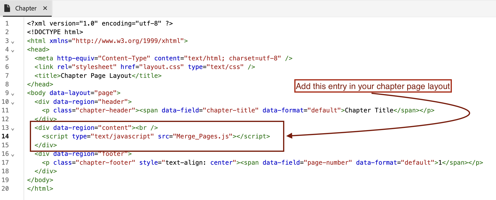

# Aggiungere il marchio Enterprise alla prima pagina di un PDF DITA

## Questo articolo riguarda:

Ottenere il marchio Enterprise unendo perfettamente la pagina FrontCover con la pagina del capitolo, assicurando che l&#39;identità dell&#39;azienda venga visualizzata in primo piano nel contenuto.

- [Configura il contenuto](#set-up-your-content)
- [Apporta le modifiche necessarie nel modello di PDF](#create-necessary-changes-in-pdf-template)

**Prima:**


<br>
<br>

**Dopo:**


## Configura il contenuto

Per pubblicare il contenuto in formato PDF, è necessario creare un Ditamap o un Bookmap.

Esempio di struttura Bookmap:

```
<bookmap>
  <title>My Bookmap Title </title>
  <frontmatter>
    <booklists>
      <toc/>
      <figurelist/>
      <tablelist/>
    </booklists>
  </frontmatter>

  <chapter href="chapter1.ditamap">
  <chapter href="chapter2.ditamap">
  </chapter>

  <backmatter>
    <booklists>
      <indexlist/>
    </booklists>
  </backmatter>
</bookmap>
```

Esempio di struttura Ditamap:

```
<map title="My map Title">

  <topicref href="topic1.dita" >
  </topicref>
  <topicref href="topic2.dita">
  </topicref>
  
</map>
```

Il FrontCover di PDF viene generato automaticamente se Bookmap contiene `<frontmatter>`.


## Apporta le modifiche necessarie nel modello di PDF

In questa sezione verrà configurato il modello. Per iniziare, puoi utilizzare o duplicare il modello Hi-tech.

### Configura il modello:

- Vai al modello di PDF nativo.
- Passare al layout di pagina di FrontCover e modificarlo.
- Aggiungere qui l&#39;immagine di branding in `data-region="content"`.
- Se necessario, aggiungi altre modifiche necessarie nel modello di capitolo.
- Ora segui i passaggi riportati di seguito in base al tuo contenuto.


#### Se utilizzi Ditamap per la generazione di PDF:

Quando si pubblica un DITAMAP, Native PDF fornisce la funzionalità per generare automaticamente una pagina FrontCover. L&#39;opzione per abilitare o disabilitare la generazione di pagine di FrontCover può essere configurata nel modello di PDF nativo.

Per unire:
- Passa alle impostazioni del modello di PDF nativo —> Ordine di layout pagina
- È ora possibile unire FrontCover alla pagina successiva, ad esempio Capitolo e argomenti.
  
- Salva il modello, seleziona questo modello per il predefinito e pubblica.


#### Se utilizzi Bookmap per la generazione di PDF

Nel caso di un Bookmap, la sequenza dell&#39;ordine di layout della pagina è controllata dalla struttura del Bookmap anziché dall&#39;ordine del modello.

Per ottenere questo risultato per Bookmap , utilizzeremo la funzione JavaScript di NativePDF.

- Aggiungi sotto JavaScript nella cartella delle risorse del modello

```
window.addEventListener('DOMContentLoaded', function () {
    window.pdfLayout.onAfterPagination(function () {
        var frontMatterWrappers = document.querySelectorAll('.rh-front-matter-wrapper');

        frontMatterWrappers.forEach(function(wrapper) {
            var contentDiv = wrapper.querySelector('div[data-region="content"]');
            var chapterBody = document.querySelector('.chapter-body');

            if (contentDiv && chapterBody) {
                chapterBody.insertBefore(contentDiv, chapterBody.firstChild);
            }

            wrapper.remove();
        });
    });
});
```

- Includi questo JavaScript nel modello del capitolo.
  

- Abilita JavaScript dall’opzione predefinita
  

- Publish!

## Allegati :

- [Scarica il pacchetto modello di PDF di esempio per visualizzare le modifiche applicate.](../assets/publishing/NativePDF_DemoTemplate.zip)
- [Scarica il pacchetto di esempio del predefinito PDF per visualizzare le modifiche applicate.](../assets/publishing/Preset_Package.zip)


## Altre risorse:

- [Come includere il sommario di DITA Bookmap in PDF](./how-to-include-bookmap-toc-in-pdf-publishing.md)
- [Video di sessione esperti su Native PDF](../../expert-sessions/native-pdf-publishing-eamples-part1-june2023.md)

