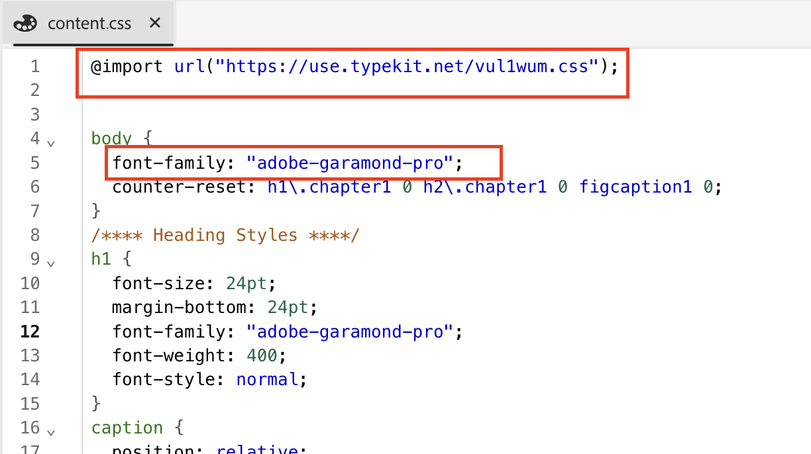

# Aggiungere caratteri personalizzati a DITA Native PDF

## Questo articolo riguarda:

L’aggiunta di font personalizzati per rafforzare l’identità del brand e la coerenza visiva in tutti i contenuti.

Questo processo prevede 3 fasi:

- [Carica il font personalizzato](#step-1--upload-the-custom-font-to-the-resource-folder-of-your-template)
- [Apportare le modifiche necessarie nel foglio di stile dei modelli di PDF](#step-2--make-necessary-changes-in-pdf-templatess-stylesheet)

- [Incorpora font usati (facoltativo)](#step-3-optional--embed-used-font-in-pdf)

## Passaggio 1: caricare il carattere personalizzato nella cartella delle risorse del modello

## Passaggio 2: apportare le modifiche necessarie nel foglio di stile dei modelli di PDF

## Passaggio 3 (facoltativo): incorporare il tipo di carattere utilizzato in PDF

## Domande frequenti

- ### Posso utilizzare Adobe Fonts?

> Sì, vai su fonts.adobe.com e fai clic su &quot;Aggiungi a progetto web&quot;.
> 
> Copia il codice di importazione come `" @import url("https://use.typekit.net/xxxx.css")`;
>
> Incolla nel CSS del contenuto ed esegui le modifiche desiderate nel file CSS.

- ### Il tipo di carattere non è visualizzato in PDF

> Controlla l&#39;ortografia del nome del carattere (errore più comune)
>
> Assicurarsi di incorporare il carattere se i caratteri non sono disponibili nel sistema in cui è aperto PDF

- ## Per eventuali altre richieste, contatta i rispettivi CSM

## Altre risorse:

- [Come includere il sommario di DITA Bookmap in PDF](./how-to-include-bookmap-toc-in-pdf-publishing.md)
- [Come includere sommario nella pubblicazione PDF](./how-to-include-bookmap-toc-in-pdf-publishing.md)
- [Video della sessione di esperti su Native PDF](../../expert-sessions/native-pdf-publishing-eamples-part1-june2023.md)