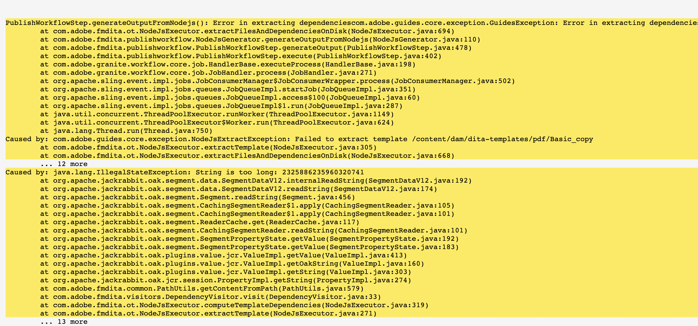

# Configurazione dell’ambiente AEM per la pubblicazione di PDF nativi

Le guide AEM includono un motore di pubblicazione PDF nativo che consente agli utenti di progettare, sviluppare e pubblicare i contenuti in formato PDF.

Consente di creare layout di pagina e modelli CSS diversi e di progettare i modelli di PDF insieme ai layout di pagina e agli stili CSS.

I passaggi per la configurazione di questo PDF nativo nelle guide AEM variano a seconda del sistema operativo. Utilizza i passaggi di configurazione seguenti in base al sistema operativo in cui è installato AEM.

## Prerequisiti

Requisiti minimi per l&#39;impostazione di Native PDF:

- Java Platform, Standard Edition 8 o 11 JDK (Java SE Development Kit) e JRE (Java SE Runtime Environment) installati
- AEM 6.5 SP13, SP12, SP11 o SP10
- Guide 4.1 e versioni successive (non-UUID o UUID)

Il motore di pubblicazione nativo di PDF richiede il JDK Oracle per generare i moduli nodo nella cartella AEM crx-quickstart. Per impostazione predefinita, supporta i seguenti sistemi operativi:

- Windows 10, server Windows 2019 e versioni successive.
- Linux - (RHEL 8 e versioni successive, CentOS 7 e versioni successive, Ubuntu 18 e versioni successive)
- Sistema operativo Mac (basato su Intel)

## Passaggi di configurazione per Windows Server (JAVA 11/8)

1. Verificare che il server AEM sia inattivo.
2. Sulla barra delle applicazioni di Windows fare clic con il pulsante destro del mouse sull&#39;icona di Windows e selezionare Sistema.
3. Nella finestra Impostazioni, in Impostazioni correlate, fare clic su Impostazioni di sistema avanzate.
4. Nella scheda Avanzate fare clic su Variabili di ambiente.
5. Nella sezione delle variabili di sistema, fai clic su &quot;_Nuovo_&quot; per creare una nuova variabile di ambiente.
6. Immettere il nome della variabile come JAVA_HOME.
7. Nel campo value, inserisci il percorso di installazione Java e fai clic su Ok.

   Ad esempio:

   JAVA 11:

   C:\Program Files\JAVA\jdk-11.0.15.1

   JAVA 8:

   C:\Program Files\JAVA\ jdk1.8.0_144

8. Aggiungi Select Path from system variables (Seleziona percorso da variabili di sistema) e fai clic su Modifica.

9. Ora, all&#39;interno delle variabili di percorso fornire il valore del percorso del server e fare clic su Ok.

   Ad esempio:

   JAVA 11:

   %JAVA_HOME%\bin\server\

   JAVA 8:

   %JAVA_HOME%\jre\bin\server\

10. Fai di nuovo clic su OK nella finestra di dialogo Variabili di ambiente.
11. Fare di nuovo clic su &#39;OK&#39; nella finestra di dialogo Proprietà - Sistema.
12. Ora, avvii il server AEM.
13. Genera PDF nativi dai predefiniti nell’editor web.

## Passaggi di configurazione per il server Linux (RHEL7/centOS 7)

1. Verificare che il server AEM sia inattivo
2. Verificare la variabile JAVA_HOME eseguendo l&#39;echo $JAVA_HOME
3. Se la variabile JAVA_HOME non è impostata, seguire il passaggio 4. In caso contrario, passare direttamente al punto 5.
4. Imposta la variabile JAVA_HOME utilizzando i comandi seguenti in base alla versione Java installata

   Ad esempio:

   JAVA 11:

   1. export JAVA\_HOME=/usr/lib/jvm/java-11.0.15.1
   2. export PATH=$PATH: $JAVA\_HOME/bin
   3. esporta LD\_LIBRARY\_PATH=/usr/lib/jvm/jdk-11.0.15.1/lib/server:/usr/java/jdk-11.0.15.1/lib/server

   JAVA 8:

   1. export JAVA\_HOME=/usr/lib/jvm/java-11.0.15.1
   2. export PATH=$PATH: $JAVA\_HOME/bin

5. Riavviare il server AEM e passare al passaggio 12, se si utilizza la versione 4.2 o successiva delle Guide.
6. Copia il &quot;_node_modules.zip_&quot; collegato in fondo a questo articolo alla directory crx-quickstart/profiles/nodejs—b1aad0a7-9079-e56c-1ed8-6fcababe8166/.
7. Apri terminale nella posizione crx-quickstart/profiles/nodejs—b1aad0a7-9079-e56c-1ed8-6fcababe8166/.
8. Elimina directory node_modules tramite il comando sottostante

   **rm -rf node_module**

9. Decomprimi node_module.zip utilizzando il comando sottostante

   **decomprimi node_modules.zip**

10. Se il comando unzip non viene installato o riconosciuto, è possibile installarlo utilizzando il comando seguente

   **decompressione installazione yum**

11. Installare il pacchetto fontconfig.
Comando: yum install fontconfig
12. Genera PDF nativi dai predefiniti nell’editor web.

**NOTA** : il pacchetto node_modules.zip può essere scaricato [qui](https://acrobat.adobe.com/link/track?uri=urn:aaid:scds:US:295d8f03-41e1-429b-8465-2761ce3c2fb3).

L&#39;importazione manuale dei moduli dei nodi scaricati per il sistema operativo Linux è una soluzione alternativa per gli utenti che utilizzano le Guide 4.1 o versioni precedenti (Passaggi 6-12)

## Passaggi di configurazione per il computer Mac (JAVA 11/8)

1. Installa Oracle JAVA 11 o Oracle JAVA 8.
2. Impostare la variabile di ambiente JAVA_HOME sulla directory JAVA installata.
3. Apri una shell Unix.
(Bash viene utilizzato qui per impostare la configurazione)

   Comando: nano ~/.bashrc

4. Imposta la variabile JAVA_HOME utilizzando i comandi seguenti in base alla versione Java installata

   Ad esempio:

   JAVA 11:

   export JAVA\_HOME= /Library/Java/JavaVirtualMachines/jdk-11.0.15.1.jdk/Contents/Home

5. Ricarica bashrc

   Comando: source ~/.bashrc.

6. Verificare che JAVA_HOME sia impostato utilizzando il comando echo $JAVA_HOME

7. Eseguire i tre comandi seguenti dal percorso di installazione AEM

   C:/{aem-installation-folder}/crx-quickstart/profiles/nodejs—b1aad0a7-9079-e56c-1ed8-6fcababe8166

   i) trovare . -type d -exec chmod 0755 {} \; ii) trovare . -tipo f -exec chmod 0755 {} \; iii) ./node-darwin/bin/node node-darwin/lib/node_modules/npm/bin/npm-cli.js —prefisso . install —unsafe-perm —scripts-prepend-node-path

8. Verifica se Java è installato con il comando seguente

   i) Esecuzione **./node-darwin/bin/node** comando dalla cartella /crx-quickstart/profiles/nodejs—b1aad0a7-9079-e56c-1ed8-6fcababe8166

   

   ii) a = require(&#39;java&#39;)

9. Installare il pacchetto fontconfig.
Comando: apt install fontconfig

10. Genera PDF nativi dai predefiniti nell’editor web.

## Risoluzione dei problemi

Di seguito sono riportati gli errori comuni che possono verificarsi durante la generazione di PDF quando le variabili di ambiente non sono impostate correttamente.

### Eccezione Null Pointer in Windows/Mac OS

Se il problema persiste anche dopo aver corretto le impostazioni dell’ambiente Java, riconvalida quanto segue:

1. Verifica se il predefinito di output è definito correttamente o crea un nuovo predefinito di output senza spazi.

2. Verifica la directory delle risorse dei nodi in /libs/fmdta/node_resources per assicurarti che tutte le librerie richieste siano installate durante l’installazione.

### Librerie mancanti nel sistema operativo RHEL 7 Linux

### Timeout del processo di pubblicazione. Il processo non è stato completato nel tempo specificato (0 ms)

Convalida il valore della proprietà timeout per il nodo nodejs in /var/dxml/profiles/b1aad0a7-9079-e56c-1ed8-6fcababe8166/nodejs nell’archivio CRX. Il valore predefinito è 300.

### Errore durante l’estrazione dell’eccezione di dipendenza (stringa troppo lunga)

Per ovviare a questa eccezione:
1. Elimina alcuni stili che non sono necessari per rimpicciolirli.
2. Creare più fogli di stile invece di un singolo css di grandi dimensioni.

In caso di problemi durante l’esecuzione di uno dei passaggi precedenti, invia una domanda alla community delle guide dell’AEM [forum](https://experienceleaguecommunities.adobe.com/t5/experience-manager-guides/ct-p/aem-xml-documentation) per assistenza.
