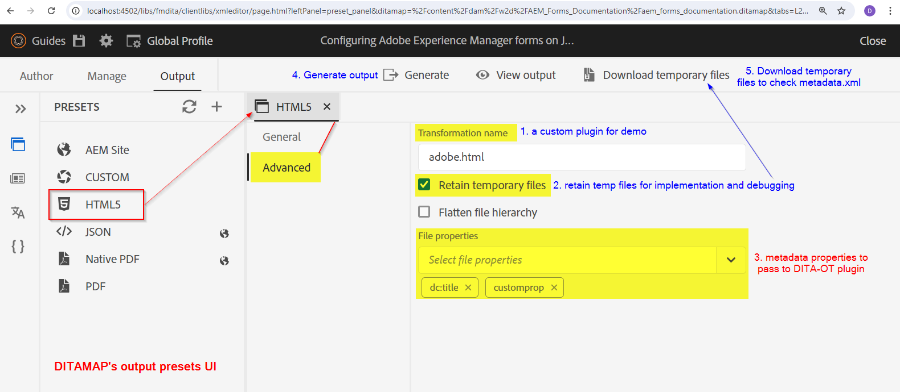

# Propagare i metadati di AEM Assets all’output generato dal plug-in DITA-OT

In questo articolo verrà illustrato come implementare le modifiche al plug-in DITA-OT per leggere il file metadata.xml _(disponibile nei file temporanei)_ e utilizzare le proprietà passate dal flusso di lavoro di pubblicazione di AEM Guides nei plug-in DITA-OT e impostarle nell&#39;output generato.

Ad alto livello, di seguito sono riportati i passaggi che imparerai in questo articolo:
- Impostare i metadati sul predefinito di output di un ditamap in AEM Guides
- Al momento della generazione dell&#39;output, accedere a metadata.xml nella directory temporanea DITA-OT
- Implementazione nel plug-in DITA-OT per leggere questo _metadata.xml_ e utilizzare le proprietà disponibili nell&#39;output generato
- Controllo dell’output generato per visualizzare i metadati propagati

## Informazioni di base

Con AEM Guides, puoi utilizzare i plug-in DITA-OT per pubblicare nei formati di output scelti utilizzando i plug-in configurati e
è inoltre possibile passare i metadati delle risorse gestite in AEM DAM al processo DITA-OT per utilizzarli nell&#39;output generato. Vedere la documentazione in [configurazione di ditamap/topic per la trasmissione dei metadati tramite il predefinito di output](https://experienceleague.adobe.com/it/docs/experience-manager-guides/using/user-guide/output-gen/pass-metadata-dita-ot)


## Presupposti

Hai una configurazione AEM con AEM Guides versione 4.4.0/2024.6 o superiore
Conoscere in precedenza il funzionamento di DITA-OT e la relativa struttura di directory


## Passaggi spiegati

### Impostazione dei metadati sulla risorsa

Con lo schema metadati di AEM Assets puoi creare campi di proprietà personalizzati per Assets nell’AEM e gli utenti possono assegnare metadati alle risorse. Prendi un esempio di una risorsa _topic_ in cui è possibile impostare un metadati denominato _customprop_ per un esempio. Fai riferimento alla schermata seguente:


### Configurazione dei metadati nel predefinito di output ditamap da passare a DITA-OT

Configurate il predefinito di output desiderato sulla mappa per esportare i metadati e passare a DITA-OT
Supponiamo di generare l&#39;output di HTML5 utilizzando un plug-in DITA-OT, ad esempio _adobe.html_.
Vedi la schermata seguente per capire come configurare il predefinito di output per una mappa per passare metadati al plug-in DITA-OT.
1. Apri una mappa e passa alla scheda _Output_ per questa mappa, apri il predefinito di HTML5 e fai clic sulla scheda _Avanzate_, in questo set il nome della trasformazione è _adobe.html_ (questo è il plug-in che configureremo e utilizzeremo, ad esempio, puoi definire anche il plug-in personalizzato)
2. Impostare _Mantieni file temporanei_ per scaricare i file temporanei e verificare il formato del file metadata.xml. È possibile utilizzarlo per lo sviluppo
3. Selezionare le proprietà dei metadati da passare a DITA-OT tramite metadata.xml. In questo esempio diciamo che vogliamo passare _dc:title_ e _customprop_
4. Salva il predefinito e genera l’output
5. Scarica il file temporaneo utilizzando il pulsante visualizzato sul predefinito

Fai riferimento alla schermata seguente per comprendere i passaggi riportati sopra:



### Implementazione del plug-in DITA-OT

#### Accesso a metadata.xml nella directory temporanea

Nel pacchetto dei file temporanei scaricati, noterai un file metadata.xml in cui puoi visualizzare la struttura delle proprietà e dei valori (vedi la schermata seguente).


##### Comprendere metadata.xml

- Questo file contiene un elenco di tutte le risorse pubblicate, ciascuna con:
   - percorso del file nella directory DITA [attributo id dell&#39;elemento Path]
   - e elenco di coppie di valori proprietà metadati [in _metadati_ elemento]

```
        <Path id="topics\about-this-document.dita">
            <sourceProps>
                ...
            </sourceProps>
            <metadata>
                <meta isArray="false" key="dc:title">About This Document</meta>
                <meta isArray="false" key="customprop">customval</meta>
            </metadata>
        </Path>
```

#### Accesso ai metadati per ogni risorsa nel plug-in DITA-OT

Affinché il plug-in DITA-OT possa leggere il file _metadata.xml_ e le proprietà disponibili in esso, è necessario effettuare le seguenti operazioni:
- Definisci le impostazioni del plug-in personalizzato in _plugins.xml_, dove definisci i parametri e l&#39;integratore per l&#39;inizializzazione del plug-in. Il file del plug-in di esempio avrà l&#39;aspetto seguente:

```
<?xml version="1.0" encoding="UTF-8"?>
<plugin id="com.adobe.html">
    <require plugin="org.dita.html5"/>
    <feature extension="dita.conductor.transtype.check" value="adobe.html"/>
    <feature extension="ant.import" file="integrator.xml"/>
    <feature extension="dita.conductor.html5.param" file="params.xml"/>
    <feature extension="package.version" value="2024.1"/>
</plugin>
```

- All’avvio del plug-in:
   - impostare una variabile per puntare al file metadata.xml, ovvero nel file _integrator.xml_ del plug-in impostare una proprietà per definire il percorso del file di metadati e
   - definire il file che esegue le regole di trasformazione xsl personalizzate, ovvero _args.xsl_, che nel nostro caso punterà al file _xsl/adobe-html5.xsl_.
Fai riferimento al codice seguente:

```
    <property name="adobe.html.xsl.dir" value="${dita.plugin.com.adobe.html.dir}${file.separator}xsl${file.separator}"/>
    <property name="args.xsl" location="${adobe.html.xsl.dir}adobe-html5.xsl" />
    <dirname property="input.dirname" file="${args.input}"/>
    <makeurl file="${input.dirname}/metadata.xml" property="metadata.url"/>
```

- Passa il valore della variabile _metadata.url_ all&#39;XSL personalizzato per utilizzarlo come necessario, ad esempio nel _param.xml_ esistente/creato passa il parametro al plug-in, vedi di seguito un esempio di file params.xml:

```
    <?xml version="1.0" encoding="UTF-8"?>
    <params xmlns:if="ant:if">
        <param name="metadata.url" expression="${metadata.url}" if:set="metadata.url"/>
    </params>
```

- Nel file di trasformazione XSL personalizzato _xsl/adobe-html5.xsl_ è possibile leggere i valori dei metadati dal file di metadati e impostarli nell&#39;output nel modo desiderato. In questo esempio aggiungeremo i valori dei metadati ai tag HTML head > meta. Fai riferimento al codice seguente:

```
<xsl:import href="plugin:org.dita.html5:xsl/dita2html5.xsl"/>
    <xsl:param name="metadata.url"/>
    <xsl:template name="copyright">
        <xsl:if test="doc-available( $metadata.url )">
            <xsl:variable name="docName" select="tokenize( base-uri(), '/' )[ last() ]"/>
            <xsl:variable name="doc" select="doc( $metadata.url )"/>
            <xsl:for-each select="$doc//Path[ ends-with( @id, concat( '\', $docName ) ) ]/metadata/meta">
                <meta name="{ @key }" content="{ . }"/>
            </xsl:for-each>
        </xsl:if>
    </xsl:template>
```

La schermata seguente evidenzia i passaggi precedenti


### Verifica dell’implementazione del plug-in

Puoi testare il plug-in eseguendo il seguente comando per testarlo con i file temporanei scaricati da AEM (che hanno il contenuto della mappa e i relativi metadati.xml)

```
./dita --input=docsrc/samples/HTML5/aem_forms_documentation.ditamap --format=adobe.html
```

Supponendo di aver copiato i file temporanei scaricati nella directory &quot;DITA-OT/docsrc/samples/HTML5&quot;.
Puoi anche scaricare l’esempio fornito nella sezione risorse di seguito.

Quando il comando precedente viene eseguito, è possibile controllare l&#39;output nella directory &quot;DITA-OT/bin/out&quot;, dove è possibile controllare i file html generati per l&#39;argomento &quot;about-this-document.dita&quot; che presenterà i metadati personalizzati nell&#39;elemento _head_

```
<head>
    <meta http-equiv="Content-Type" content="text/html; charset=UTF-8">
    <meta charset="UTF-8">
    <meta name="copyright" content="(C) Copyright 2024">
    <meta name="DC.format" content="HTML5">
    <meta name="DC.identifier" content="GUID-f193ea85-989d-4d80-99e2-2f5dea3d5310">
    <meta name="DC.language" content="en-US">
    <meta name="dc:title" content="About This Document">
    <meta name="customprop" content="customval">
    <title>About This Document</title>
</head>
```

### Distribuzione

Dopo aver sviluppato il plug-in DITA-OT, è possibile integrarlo in DITA-OT utilizzando il comando _dita —install_ nella directory DITA-OT e distribuirlo al server AEM [fare riferimento a questo articolo per ulteriori dettagli](https://experienceleaguecommunities.adobe.com/t5/experience-manager-guides/steps-to-setup-a-custom-dita-ot/td-p/407659)


## Riferimenti

1. File temporanei di esempio scaricati da ditamap di esempio - [scarica utilizzando questo collegamento](../../assets/publishing/sample-temp-html5-adobe.html-content.zip)
2. Plug-in DITA-OT con implementazione [download illustrata in precedenza tramite questo collegamento](../../assets/publishing/sample-custom-plugin-com.adobe.html.zip)