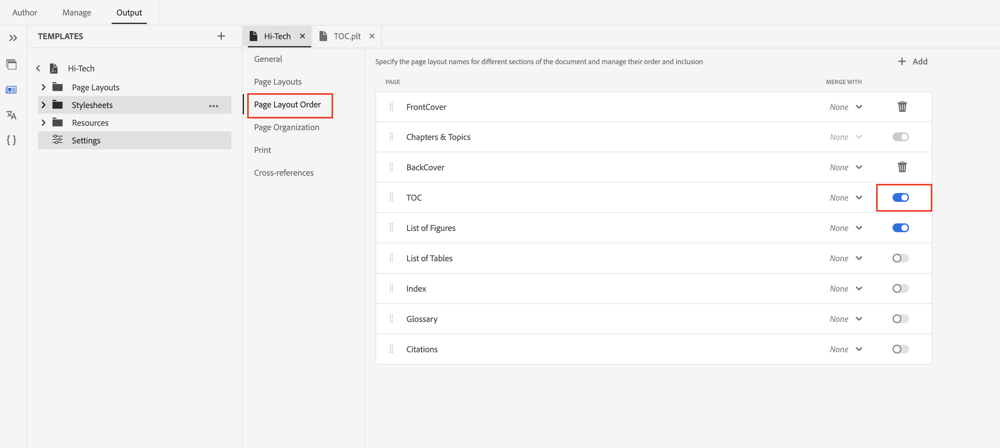

# Generare il sommario di Bookmap nella pubblicazione in PDF

## Configurare la mappa dei libri

Includi l&#39;elemento `<toc>`:
All&#39;interno dell&#39;elemento `<frontmatter>` della mappa del libro, individua l&#39;elemento `<booklists>`.  Nidificare un elemento `<toc>` all&#39;interno di `<booklists>` in questo modo:

```
<frontmatter>
  <booklists>
    <toc/>  <figurelist/>
    <tablelist/>
  </booklists>
</frontmatter>
```

La specifica DITA consente di inserire il sommario e gli elenchi di libri anche nella sezione `<backmatter>`.


```
<backmatter>
    <booklists>
      <toc/>
      <figurelist/>
      <indexlist/>
    </booklists>
  </backmatter>
```

Struttura di esempio di bookmap con sommario, elenco di figure e elenco di tabelle in primo piano e elenco di indici in secondo piano.

```
<bookmap>
  <title>My Bookmap Title </title>
  <frontmatter>
    <booklists>
      <toc/>
      <figurelist/>
      <tablelist/>
    </booklists>
  </frontmatter>

  <chapter href="chapter1.ditamap">
  <chapter href="chapter2.ditamap">
  </chapter>

  <backmatter>
    <booklists>
      <indexlist/>
    </booklists>
  </backmatter>
</bookmap>
```

Il sommario e gli elenchi dei libri vengono generati automaticamente in base alla struttura definita nella mappa dei libri.

Una volta configurata la bookmap, utilizza il PDF nativo per generare l’output PDF. Elabora la struttura e i riferimenti della mappa del libro, inclusi il sommario e gli elenchi dei libri.

## Progettazione del sommario e relativo ordine in PDF

La funzionalità PDF nativa offre un metodo pratico per personalizzare il layout e la progettazione del sommario.

È possibile controllare la progettazione tramite layout di pagina separato per sommario e stili tramite layout.css.

L&#39;ordine del sommario e di altri elenchi di libri in PDF si basa solo sulla struttura della mappa di libri.


## Domande frequenti

### Come includere il sommario di un Ditamap in un PDF

Le diagrammi non dispongono direttamente di un sommario (sommario), come accade invece per le mappe. Tuttavia, le mappe svolgono un ruolo cruciale nella definizione della struttura del contenuto e contribuiscono indirettamente al processo di generazione del sommario.

Se si pubblica Ditamap, Native PDF offre la funzionalità per generare automaticamente sommario ed elenco libri. È possibile abilitare/disabilitare la generazione di sommario in corrispondenza di ditamap dalle impostazioni di Native PDF.



## Risorse aggiuntive :

- [Documentazione del layout della pagina di progettazione nativa di PDF](https://experienceleague.adobe.com/en/docs/experience-manager-guides/using/install-guide/on-prem-ig/output-gen-config/config-native-pdf-publish/design-page-layout)
- [Sessione Expert preregistrata sulle funzionalità di base native di PDF](https://experienceleague.adobe.com/en/docs/experience-manager-guides/using/knowledge-base/expert-session/native-pdf-publishing-essentials-feb23)

<br>
<br>

Pubblica sul [forum](https://experienceleaguecommunities.adobe.com/t5/experience-manager-guides/ct-p/aem-xml-documentation) della community AEM Guides per qualsiasi domanda.


