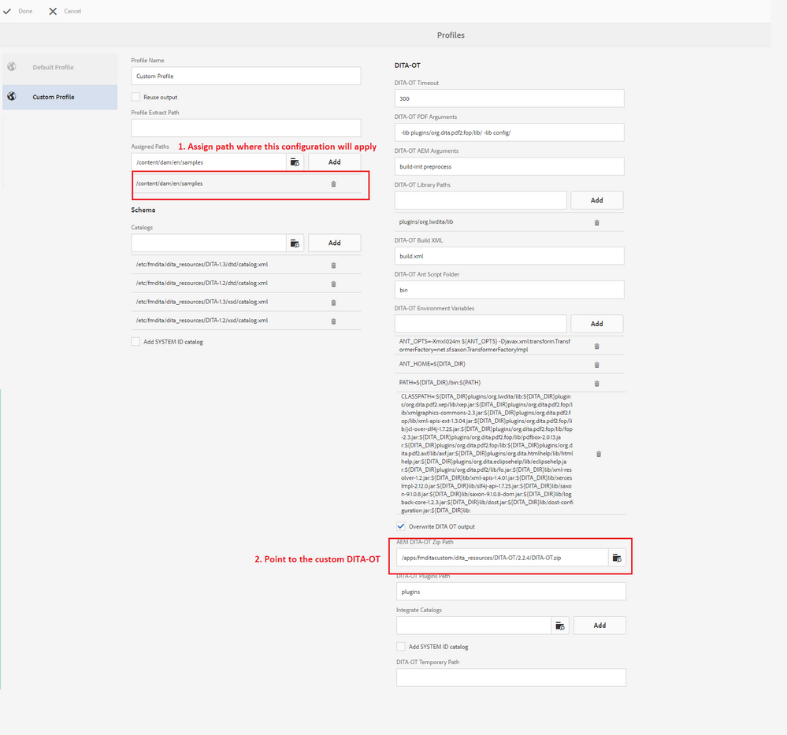

# Configura DITA-OT personalizzato in [!DNL AEM Guides] per AEM

I passaggi per aggiungere un DITA-OT personalizzato sono documentati nella sezione _Utilizzare plug-in DITA-OT personalizzati_ della _Guida all&#39;installazione e alla configurazione_.

Ad alto livello, i passaggi sono i seguenti:

+ Ottieni il DITA-OT di base
   + Se si desidera ottenere una copia di DITA-OT preconfigurato da [!DNL AEM Guides], scaricarla dal percorso `/etc/fmdita/dita_resources/DITA-OT.zip`
   + Se desideri ottenere una versione diversa, puoi scaricarla dall&#39;[archivio dita-ot](https://www.dita-ot.org/download)
+ Apportare modifiche in DITA-OT come [l&#39;aggiunta di un nuovo plug-in](https://www.dita-ot.org/dev/topics/plugins-installing.html) o la personalizzazione di plug-in esistenti (fare riferimento ad esempio nella sezione collegamenti correlati di seguito)
+ Caricamento di `DITA-OT.zip` ricevuto in `/apps/<project-folder>/dita_resources` (è consigliabile creare una cartella di progetto personalizzata)
+ Aggiungi profilo DITA tramite **[!UICONTROL Strumenti]** > **[!UICONTROL Guide]** > **[!UICONTROL Profili DITA]** (utilizza il percorso DITA-OT in cui viene caricato il DITA-OT personalizzato, fai riferimento alla schermata seguente)
  

>[!MORELIKETHIS]
>
>+ [Personalizzazione degli esempi di plug-in DITA-OT](https://www.dita-ot.org/dev/topics/pdf-customization.html)
