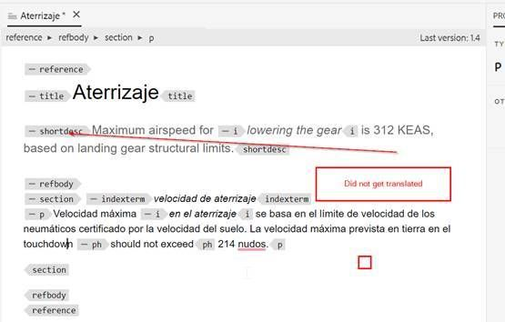

# Escludere i paragrafi di un argomento dalla traduzione

Il modo più semplice è utilizzare translation=no attribute.

+ Gli autori possono inserire l&#39;attributo aggiuntivo come **translation=no** nei paragrafi che non desiderano tradurre. Il fornitore di traduzione deve essere informato e può eseguire la configurazione alla sua fine per ignorare il testo con questo attributo.
+ La traduzione automatica OOTB (con connettore di traduzione Microsoft di prova) presenta lo stesso comportamento.
+ Test con Microsoft Translation : se definisci l&#39;attributo **translate=no** a livello di paragrafo, il paragrafo completo non viene tradotto. Questo attributo può essere definito in qualsiasi elemento e il contenuto all’interno di tale elemento non verrà tradotto.

Ecco alcune schermate che lo spiegano ulteriormente:

**Contenuto Source**

**Contenuto tradotto in spagnolo**

