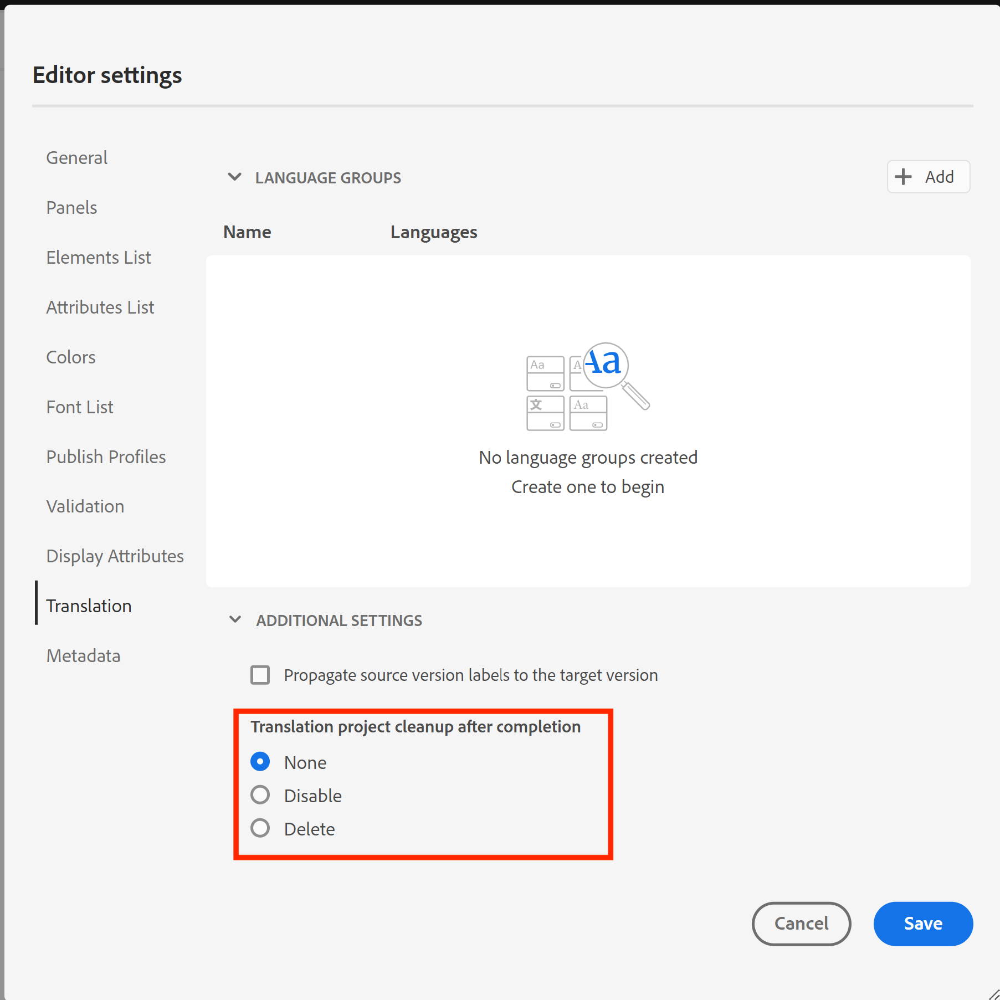

# Best practice da seguire per la traduzione in AEM Guides

Le prestazioni del progetto di traduzione possono diminuire con l’aumento dell’attività di traduzione sul sistema nel tempo.

Ogni progetto di traduzione genera più gruppi di utenti per l’accesso, con conseguente aumento del numero di gruppi di utenti all’interno del sistema. Con l’aumento del numero di gruppi di utenti, può gradualmente rallentare le operazioni CRUD relative alle autorizzazioni utente, influendo potenzialmente sulle prestazioni complessive di AEM. Inoltre, se i progetti di traduzione rimangono attivi dopo il completamento, può influire negativamente sulle prestazioni della sincronizzazione della traduzione tra AEM e il fornitore di traduzione.

**Seguendo le best practice descritte di seguito sarà possibile mantenere un ambiente efficiente.**

## Se utilizzi una build precedente alla 4.6 (on-prem) o alla 2404 (cloud):

- Contrassegna tutti i progetti come &quot;Inattivi&quot; una volta completata e approvata la traduzione.Il progetto rimane disponibile per la revisione ed è semplicemente contrassegnato come inattivo.
   - Segui questi passaggi per mantenere le prestazioni complessive di traduzione in buona salute.
     

- Per i progetti meno recenti, elimina la cartella contrassegnata come inattiva, approvata e rivista
   - Segui questi passaggi per mantenere buone le prestazioni complessive di traduzione pulendo i file di traduzione temporanei e i gruppi di utenti associati a questa cartella di progetto.
     

## Se utilizzi, build 4.6 o 2404 o successiva:

Puoi continuare a seguire gli stessi passaggi indicati sopra. A partire dalla versione 4.6/2404, AEM Guides introduce un’impostazione di editor che consente agli amministratori di disabilitare l’eliminazione automatica dei progetti di traduzione.

Riferito: [Elimina o disabilita automaticamente un progetto di traduzione completato](https://experienceleague.adobe.com/en/docs/experience-manager-guides/using/user-guide/author-content/create-preview-topics/author-content-aem-guides/work-with-web-editor/translate-documents-web-editor#automatically-delete-or-disable-a-completed-translation-project)

