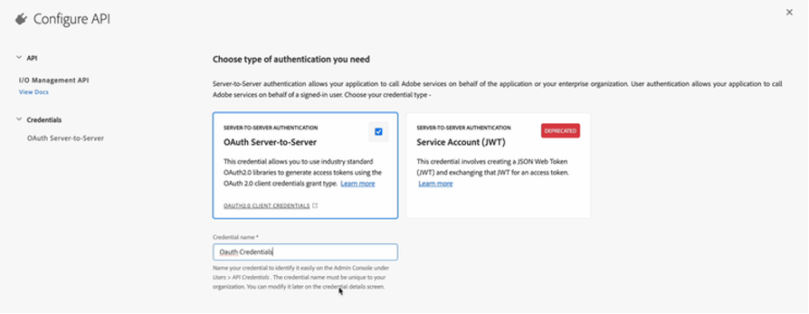

# Configurare la pubblicazione basata su microservizi con autenticazione OAuth

Il microservizio di pubblicazione consente di eseguire carichi di lavoro di pubblicazione di grandi dimensioni contemporaneamente su Experience Manager Guides as a Cloud Service e di sfruttare la piattaforma senza server Adobe I/O Runtime leader del settore.

Per ogni richiesta di pubblicazione, Experience Manager Guides as a Cloud Service esegue un contenitore separato che viene ridimensionato orizzontalmente in base alle richieste dell’utente. In questo modo è possibile eseguire più richieste di pubblicazione e ottenere prestazioni migliori rispetto ai server Adobe Experience Manager on-premise di grandi dimensioni.

>[!NOTE]
>
> La pubblicazione basata su microservizi in Experience Manager Guides supporta i tipi di predefiniti di output PDF (sia nativi che basati su DITA-OT), HTML5, JSON e CUSTOM.

Poiché il servizio di pubblicazione cloud è protetto dall’autenticazione basata su Adobe IMS OAuth, effettua le seguenti operazioni per integrare i propri ambienti con i flussi di lavoro di autenticazione basata su token sicuri di Adobe e inizia a utilizzare la soluzione di pubblicazione scalabile basata su cloud.


## Creare configurazioni IMS in Adobe Developer Console

**Ruolo richiesto per creare le configurazioni**: Amministratore di sistema

Per creare configurazioni IMS in, effettua le seguenti operazioni **Adobe Developer Console**:

>[!NOTE]
>
>Se hai già creato un progetto OAuth per configurare i suggerimenti avanzati basati sull’intelligenza artificiale per l’authoring, puoi saltare i seguenti passaggi per creare il progetto.

1. Apri **Developer Console**: `https://developer.adobe.com/console`.

1. Passa a **Progetti** dall’alto.

   

   *Seleziona la **Progetti**scheda della **Adobe Developer Console***

1. Per creare un nuovo progetto vuoto, seleziona **Progetto vuoto** dal **Crea nuovo progetto** a discesa.

   

   *Crea un nuovo progetto vuoto.*

1. Seleziona **API** dal **Aggiungi al progetto** per aggiungere l&#39;API di gestione IO al progetto.

   

   *Seleziona un progetto API dal menu a discesa.*

   

   *Aggiungi l’API di gestione I/O al progetto.*

1. Crea una nuova credenziale OAuth e salvala.

   

   *Configura le credenziali OAuth nell’API.*


1. Torna a **Progetti** e seleziona **Panoramica del progetto** a sinistra.

   

   *Introduzione al nuovo progetto.*

1. Fai clic su **Scarica** per scaricare il servizio JSON.

   

   *Scarica i dettagli del servizio JSON.*

Hai configurato i dettagli di autenticazione OAuth e scaricato i dettagli del servizio JSON. Mantieni il file a portata di mano in quanto richiesto nella sezione successiva.


## Aggiungere la configurazione IMS all’ambiente

>[!NOTE]
>
>Se hai già creato un progetto OAuth per suggerimenti avanzati, puoi riutilizzare lo stesso progetto per i microservizi e saltare i passaggi seguenti per aggiungere la configurazione IMS all’ambiente.

### Aggiorna configurazione esistente

Se utilizzi già un microservizio per la pubblicazione tramite JWT (obsoleto), effettua le seguenti operazioni per aggiornare le configurazioni:


1. Apri **Experience Manager** e seleziona il programma contenente l’ambiente da configurare.
1. Passa a **Ambienti** scheda.
1. Seleziona il nome dell’ambiente da configurare. Dovresti passare alla sezione **Informazioni sull&#39;ambiente** pagina.
1. Passa a **Configurazione** scheda.

1. Aggiorna il campo JSON SERVICE_ACCOUNT_DETAILS con il nuovo file JSON OAuth scaricato.
1. Eliminare il campo PRIVATE_KEY.


   

   *Aggiorna le configurazioni dell’ambiente JWT esistente.*

### Prima configurazione

Per utilizzare un microservizio di pubblicazione per la prima volta, aggiorna le configurazioni in base ai passaggi seguenti:
1. Apri **Experience Manager** e seleziona il programma contenente l’ambiente da configurare.
1. Passa a **Ambienti** scheda.
1. Seleziona il nome dell’ambiente da configurare. Dovresti passare alla sezione **Informazioni sull&#39;ambiente** pagina.
1. Passa a **Configurazione** scheda.

1. Aggiornare il campo JSON SERVICE_ACCOUNT_DETAILS. Assicurati di usare lo stesso nome e la stessa configurazione forniti nella schermata seguente.


*Configura l’ambiente per la prima volta.*


### Utilizzare la pubblicazione basata su microservizi per la prima volta

>[!NOTE]
>
> Se utilizzi già la pubblicazione basata su microservizi, ignora i passaggi seguenti:

Dopo aver aggiunto la configurazione IMS all’ambiente, esegui i seguenti passaggi per collegare queste proprietà a Experience Manager Guides utilizzando OSGi:

1. Nel codice del progetto Git di Cloud Manager, aggiungi i due file seguenti (per il contenuto dei file, visualizza [Appendice](#appendix)).

   * `com.adobe.aem.guides.eventing.ImsConfiguratorService.cfg.json`
   * `com.adobe.fmdita.publishworkflow.PublishWorkflowConfigurationService.xml`
1. Assicurati che i file appena aggiunti siano coperti dal tuo `filter.xml`.
1. Esegui il commit e invia le modifiche Git.
1. Esegui la pipeline per applicare le modifiche all’ambiente.

Al termine, puoi utilizzare la pubblicazione cloud basata su microservizi.

## Domande frequenti


1. Se sono abilitate le configurazioni OSGi per l’utilizzo del microservizio, il processo di pubblicazione funzionerà sul server di Experience Manager locale con la stessa base di codice?
   * No, se il flag `dxml.use.publish.microservice` è impostato su `true`, cerca sempre le configurazioni dei microservizi. Imposta `dxml.use.publish.microservice` a `false` affinché la pubblicazione funzioni sul server locale.
1. Quanta memoria viene allocata al processo DITA quando si utilizza la pubblicazione basata su microservizi? È guidata dal profilo e dai parametri DITA?
   * Con la pubblicazione basata su microservizi, l’allocazione della memoria non viene guidata tramite il profilo e i parametri DITA. La memoria totale disponibile nel contenitore del servizio è di 8 GB, di cui 6 GB allocati al processo DITA-OT.


## Appendice {#appendix}

**File**:
`com.adobe.aem.guides.eventing.ImsConfiguratorService.cfg.json`

**Contenuto**:

```
{
"service.account.details": "$[secret:SERVICE_ACCOUNT_DETAILS]",
}
```

**File**: `com.adobe.fmdita.publishworkflow.PublishWorkflowConfigurationService.xml`

**Contenuto**:
* `dxml.use.publish.microservice`: consente di abilitare la pubblicazione basata su microservizi utilizzando DITA-OT
* `dxml.use.publish.microservice.native.pdf`: consente di abilitare la pubblicazione di PDF nativi basata su microservizi

```
<?xml version="1.0" encoding="UTF-8"?>
<jcr:root xmlns:jcr="http://www.jcp.org/jcr/1.0" xmlns:sling="http://sling.apache.org/jcr/sling/1.0"
          jcr:primaryType="sling:OsgiConfig"
          dxml.publish.microservice.url="https://adobeioruntime.net/api/v1/web/543112-guidespublisher/default/publishercaller.json"
          dxml.use.publish.microservice="{Boolean}true"
          dxml.use.publish.microservice.native.pdf="{Boolean}true"
/>
```
