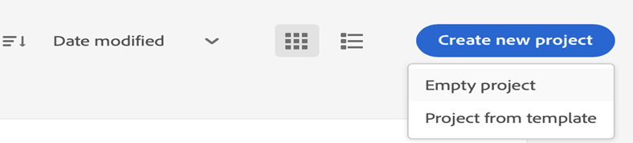

# Configurare la pubblicazione basata su microservizi con l’autenticazione JWT

[!BADGE Cloud Service]{type=Informative}

>[!NOTE]
>
> Le credenziali dell’account di servizio (JWT) sono state dichiarate obsolete e sostituite dalle credenziali server-to-server OAuth. Le applicazioni che utilizzano le credenziali dell’account di servizio (JWT) cesseranno di funzionare dopo il 1° gennaio 2025. È necessario eseguire la migrazione alla nuova credenziale entro il 1° gennaio 2025, per garantire che l’applicazione continui a funzionare. Ulteriori informazioni sulla [migrazione delle credenziali dell&#39;account di servizio (JWT) alle credenziali server-to-server OAuth](https://developer.adobe.com/developer-console/docs/guides/authentication/ServerToServerAuthentication/migration/).


La pubblicazione basata su microservizi in per Adobe Experience Manager Guides as a Cloud Service supporta i predefiniti di output PDF (sia nativi che basati su DITA-OT), HTML5, JSON e CUSTOM.

Poiché le credenziali dell’account di servizio (JWT) sono state dichiarate obsolete, si consiglia di utilizzare l’autenticazione basata su Adobe IMS OAuth. Scopri come [configurare la pubblicazione basata su microservizi con l&#39;autenticazione OAuth](configure-microservices-imt-config.md).

Per il servizio di pubblicazione cloud protetto dall’autenticazione basata su JWT di Adobe IMS, i clienti devono seguire i passaggi indicati di seguito per integrare i propri ambienti con i flussi di lavoro di autenticazione sicuri basati su token di Adobe e iniziare a utilizzare la nuova soluzione di pubblicazione scalabile basata su cloud.


## Creare configurazioni IMS in Adobe Developer Console

**Ruolo richiesto per creare le configurazioni**: Amministratore di sistema

Per creare configurazioni IMS in Adobe Developer Console, effettua le seguenti operazioni:

1. Apri Developer Console: `https://developer.adobe.com/console`.

1. Passa alla scheda **Progetti** dall&#39;alto.

   

1. Per creare un nuovo progetto vuoto, seleziona **Progetto vuoto** dal menu a discesa **Crea nuovo progetto**.

   

1. Seleziona **API** dal menu a discesa **Aggiungi al progetto** per aggiungere l&#39;API di gestione IO al progetto.

   

   

1. Crea una nuova coppia di chiavi pubblica/privata durante l’aggiunta dell’API. La chiave privata verrà scaricata automaticamente sul sistema.

   

1. Salva l’API configurata.

   

1. Torna alla scheda **Progetti** e fai clic su **Panoramica progetto** a sinistra.

   

1. Fai clic sul pulsante **Scarica** nella parte superiore per scaricare il JSON del servizio.

   

Ora hai configurato i dettagli di autenticazione JWT e hai scaricato anche la chiave privata e i dettagli del servizio JSON. Tenere a portata di mano questi due file in quanto sono necessari nella sezione successiva.

### Aggiungere la configurazione IMS all’ambiente

Per aggiungere la configurazione IMS all’ambiente, effettua le seguenti operazioni:

1. Apri Experience Manager, quindi seleziona il programma contenente l’ambiente da configurare.
1. Passa alla scheda **Ambienti**.
1. Fai clic sul nome dell’ambiente da configurare. Dovresti passare alla pagina Informazioni ambiente.
1. Passa alla scheda **Configurazione**.
1. Carica la chiave privata e il progetto JSON come mostrato nella schermata seguente. Assicurati di utilizzare gli stessi nomi e la stessa configurazione evidenziati di seguito.

   

>[!NOTE]
>
> Apri, copia e incolla il contenuto del file JSON della chiave privata e dei dettagli del servizio nella colonna del valore del pannello Configurazione, come illustrato nella schermata precedente.

Dopo aver aggiunto la configurazione IMS all’ambiente, esegui i seguenti passaggi per collegare queste proprietà a Experience Manager Guides utilizzando OSGi:

1. Nel codice del progetto Git di Cloud Manager, aggiungi i due file seguenti (per il contenuto dei file, vedi [Appendice](#appendix)).

   * `com.adobe.aem.guides.eventing.ImsConfiguratorService.cfg.json`
   * `com.adobe.fmdita.publishworkflow.PublishWorkflowConfigurationService.xml`
1. Assicurati che i file appena aggiunti siano coperti dal tuo `filter.xml`.
1. Esegui il commit e invia le modifiche Git.
1. Esegui la pipeline per applicare le modifiche all’ambiente.

Al termine dell’operazione, dovresti essere in grado di utilizzare la nuova pubblicazione cloud basata su microservizi.

## Domande frequenti

1. È possibile utilizzare una singola chiave in più ambienti cloud?
   * Sì, puoi generare una chiave privata e utilizzarla per tutti gli ambienti, ma devi configurare le variabili di ambiente per tutti gli ambienti e utilizzare la stessa chiave.
1. Se le configurazioni OSGi per l’utilizzo del microservizio sono abilitate, il processo di pubblicazione funzionerà sul server AEM locale con la stessa base di codice?
   * No, se il flag `dxml.use.publish.microservice` è impostato su `true`, cerca sempre le configurazioni dei microservizi. Imposta `dxml.use.publish.microservice` su `false` per far funzionare la pubblicazione sul tuo locale.
1. Quanta memoria viene allocata al processo DITA quando si utilizza la pubblicazione basata su microservizi? È guidato tramite i parametri ant del profilo DITA?
   * Con la pubblicazione basata su microservizi, l’allocazione della memoria non viene guidata tramite i parametri di ant del profilo DITA. La memoria totale disponibile nel contenitore del servizio è di 8 GB, di cui 6 GB allocati al processo DITA-OT.


## Appendice {#appendix}

**File**:
`com.adobe.aem.guides.eventing.ImsConfiguratorService.cfg.json`

**Contenuto**:

```
{
  "service.account.details": "$[secret:SERVICE_ACCOUNT_DETAILS]",
  "private.key": "$[secret:PRIVATE_KEY]"
}
```

**File**: `com.adobe.fmdita.publishworkflow.PublishWorkflowConfigurationService.xml`

**Contenuto**:
* `dxml.use.publish.microservice`: passaggio per abilitare la pubblicazione basata su microservizi tramite DITA-OT
* `dxml.use.publish.microservice.native.pdf`: consente di abilitare la pubblicazione di PDF nativi basata su microservizi

```
<?xml version="1.0" encoding="UTF-8"?>
<jcr:root xmlns:jcr="http://www.jcp.org/jcr/1.0" xmlns:sling="http://sling.apache.org/jcr/sling/1.0"
          jcr:primaryType="sling:OsgiConfig"
          dxml.publish.microservice.url="https://adobeioruntime.net/api/v1/web/543112-guidespublisher/default/publishercaller.json"
          dxml.use.publish.microservice="{Boolean}true"
          dxml.use.publish.microservice.native.pdf="{Boolean}true"
/>
```
