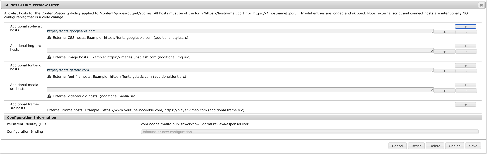

# Configurare l’anteprima SCORM

Questo articolo spiega come configurare l’anteprima SCORM di Experience Manager Guides per gestire quali domini esterni possono distribuire fogli di stile, immagini, font, file multimediali e contenuti incorporati nell’output di anteprima SCORM. I passaggi seguenti spiegano come configurare vari filtri per l’anteprima SCORM in base alla configurazione in uso:

>[!BEGINTABS]

>[!TAB Cloud Service]

1. Utilizza le istruzioni fornite in [Sostituzioni configurazione](../install-conf-guide/download-install-config-override.md) per creare il file di configurazione.

1. Nel file di configurazione, fornisci i seguenti dettagli sulle proprietà:

   | PID | Chiave proprietà | Valore predefinito |
   |---|---|---|
   | `com.adobe.fmdita.publishworkflow.ScormPreviewResponseFilter` | `additional.style.src` | `https://fonts.googleapis.com` |
   | `com.adobe.fmdita.publishworkflow.ScormPreviewResponseFilter` | `additional.img.src` | - |
   | `com.adobe.fmdita.publishworkflow.ScormPreviewResponseFilter` | `additional.font.src` | `https://fonts.gstatic.com` |
   | `com.adobe.fmdita.publishworkflow.ScormPreviewResponseFilter` | `additional.media.src` | - |
   | `com.adobe.fmdita.publishworkflow.ScormPreviewResponseFilter` | `additional.frame.src` | `https://www.youtube-nocookie.com`, `https://www.youtube.com` |


1. Salva il file di configurazione e implementalo nell’ambiente Cloud Service.

Una volta salvata, l’anteprima SCORM inizia ad applicare il inserisco nell&#39;elenco Consentiti di del dominio aggiornato. Le risorse esterne dei domini che non sono state aggiunte a questa configurazione non saranno disponibili nell’anteprima.

>[!NOTE]
>
> Questo vale solo per l’ambiente di anteprima; il pacchetto SCORM scaricabile continua a fornire tutti i contenuti creati come previsto.


>[!TAB On-Premise]

1. Aprire la pagina Configurazione della console Web Adobe Experience Manager.

   L&#39;URL predefinito per accedere alla pagina di configurazione è:

   ```http
   http://<server name>:<port>/system/console/configMgr
   ```

1. Cerca e seleziona il bundle **Guides SCORM Preview Filter (com.adobe.fmdita.publishworkflow.ScormPreviewResponseFilter)**.

   {width="600"}


1. Nella configurazione del bundle, aggiungi gli URL di dominio consentiti per ciascun tipo di risorsa, in base alle esigenze:

   | Campo | Descrizione |
   |---|---|
   | **Host style-src aggiuntivo** | Domini da cui i fogli di stile CSS esterni sono autorizzati al caricamento (per impostazione predefinita, `https://fonts.googleapis.com`). |
   | **Host src immagine aggiuntivo** | Domini da cui è autorizzato il caricamento di immagini esterne. |
   | **Host src font aggiuntivo** | Domini da cui è autorizzato il caricamento di file di font esterni (OTF, WOFF e così via) (per impostazione predefinita, `https://fonts.gstatic.com`). |
   | **Host src multimediale aggiuntivo** | Domini da cui i file multimediali esterni sono autorizzati al caricamento. |
   | **Host frame-src aggiuntivo** | Domini da cui il contenuto iframe è autorizzato all&#39;incorporamento (per impostazione predefinita, `https://www.youtube.com` per consentire l&#39;incorporamento di video YouTube). |

1. Seleziona **Salva**.

Una volta salvata, l’anteprima SCORM inizia ad applicare il inserisco nell&#39;elenco Consentiti di del dominio aggiornato. Le risorse esterne dei domini che non sono state aggiunte a questa configurazione non saranno disponibili nell’anteprima.

>[!NOTE]
>
> Questo vale solo per l’ambiente di anteprima; il pacchetto SCORM scaricabile continua a fornire tutti i contenuti creati come previsto.

>[!ENDTABS]