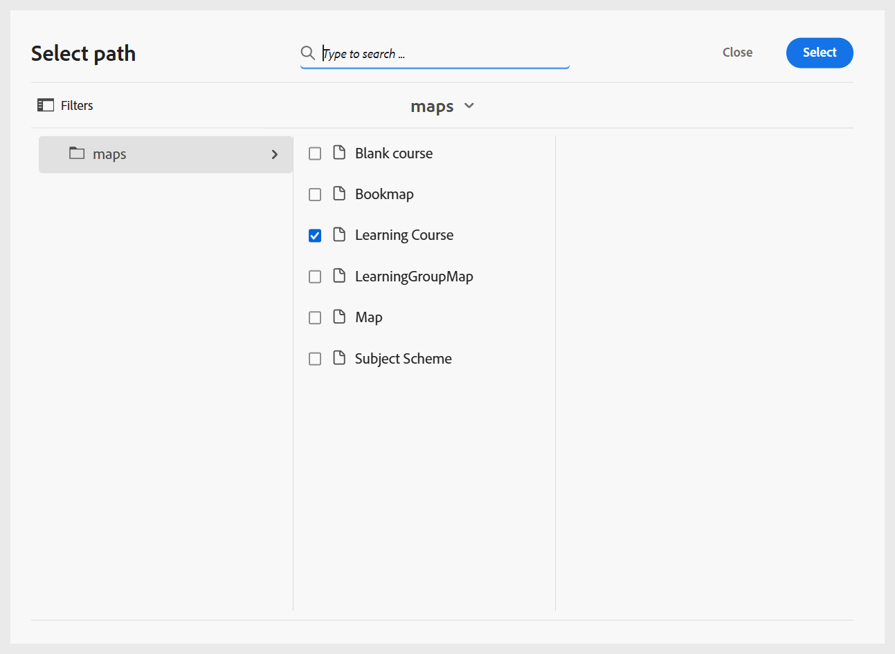

# Configurare i profili delle cartelle

È necessario un profilo di cartella per separare le configurazioni dei diversi reparti o prodotti dell&#39;azienda. Per i contenuti di apprendimento e formazione, puoi creare e configurare un profilo a livello di cartella per gestire modelli di authoring, modelli di output, predefiniti di output e altre impostazioni a livello di cartella.

Per iniziare a configurare il profilo della cartella per i contenuti di apprendimento e formazione, è necessario:

1. **Creare cartelle diverse per gestire i modelli di creazione e di output**: è possibile creare cartelle per autori e autori che lavorano in reparti o prodotti diversi della propria azienda. Queste cartelle possono essere mappate su profili di cartelle specifici, ciascuno configurato con diversi modelli di authoring e output per supportare la creazione di corsi di apprendimento specifici per il reparto e l’amministrazione decentrata.

   Puoi creare una nuova cartella dal pannello Archivio.

   {width="350" align="left"}
2. **Crea cartelle per lingua per gestire la traduzione**: se traduci il contenuto in lingue diverse, devi creare cartelle corrispondenti a ciascuna lingua. Ognuna di queste cartelle della lingua conterrà il contenuto corrispondente a tale lingua.

   Per ulteriori dettagli, visualizzare [Best practice per la traduzione dei contenuti](../user-guide/translation-first-time.md).
3. **Crea una cartella per gestire Assets**: analogamente alle cartelle, puoi anche creare diverse cartelle di Assets per soddisfare le esigenze dei diversi reparti. In questo modo, assicurati anche che gli autori e gli editori abbiano accesso al CSS corretto configurato nei loro modelli, immagini e altre risorse.

   {width="350" align="left"}
4. [Crea un profilo di cartella](../cs-install-guide/conf-folder-level.md#create-and-configure-a-folder-level-profile) per mappare diverse cartelle.
5. **Selezionare il profilo di cartella da configurare**: una volta creato il profilo di cartella, è necessario selezionare il profilo di cartella nella pagina [Preferenze utente](../user-guide/intro-home-page.md#user-preferences) per assicurarsi che autori e autori abbiano accesso ai modelli corretti.

   {width="650" align="left"}

6. **Configura impostazioni profilo cartella**: per i contenuti di apprendimento e formazione, è possibile configurare le seguenti impostazioni a livello di cartella:
   - [Pannelli](#configure-panels)
   - [Modelli](#configure-templates)
   - [Predefiniti di output](#configure-output-presets)
   - [Editor HTML](#html-editor-settings)
   - [Profili di pubblicazione](#manage-publish-profiles)

Per accedere a queste impostazioni, passa alla vista Editor e seleziona **Impostazioni** dal menu **Opzioni** come illustrato di seguito:

## Configurare i pannelli

Questa impostazione controlla i pannelli visualizzati nei pannelli sinistro e destro dell&#39;**Editor** e della **Console mappe** in Experience Manager Guides. Puoi attivare o disattivare il pulsante per mostrare o nascondere il pannello desiderato.

Per i contenuti di apprendimento e formazione, assicurati che solo le seguenti funzioni siano abilitate per la console Editor e Mappa.

{width="350" align="left"}

### Editor

**Pannello sinistro**

- **Raccolte**: consente di organizzare e salvare i file utilizzati di frequente o di accedere rapidamente ai file condivisi.
- **Archivio**: consente di visualizzare e accedere a tutte le mappe, gli argomenti, le immagini e le altre risorse archiviate nel repository dei contenuti.
- **Gestione corsi**: fornisce un&#39;area di lavoro dedicata per la creazione e la gestione dei corsi.
- **Snippet**: consente di creare e riutilizzare frammenti di contenuto di piccole dimensioni in vari argomenti dei corsi di apprendimento.
- **Condizioni**: consente di configurare gli attributi condizionali a livello globale e di cartella.
- **Variabili**: ti consente di creare e gestire le variabili da utilizzare nel contenuto di apprendimento.
- **Variabili di lingua**: consente di definire stringhe localizzate per l&#39;output pubblicato o per il testo statico nei modelli.
- **Modelli**: consente di creare e gestire modelli da utilizzare per gli autori.
- **Modelli di output**: consente di creare e gestire modelli di output per generare output in vari formati.
- **Trova e sostituisci**: fornisce le opzioni per cercare e sostituire il testo nei file in una mappa o in una cartella all&#39;interno del repository. 

**Pannello destro**

- **Proprietà contenuto**: contiene informazioni sul tipo e sugli attributi dell&#39;elemento attualmente selezionato nell&#39;editor.
- **Proprietà file**: consente di visualizzare e gestire le proprietà del file selezionato.
- **Stili**: visualizza le opzioni di stile globali basate su classi da utilizzare nel contenuto di apprendimento.
- **Filtri**: consente di filtrare il contenuto in base alle condizioni applicate nella modalità Anteprima di un argomento.

### Console mappe

**Pannello sinistro**

- **Predefiniti**: consente di configurare i predefiniti di output per la pubblicazione del corso di apprendimento.
- **Traduzione**: fornisce opzioni per tradurre il contenuto in più lingue.
- **Rapporti**: ti consente di generare e gestire i rapporti per ottenere un insight utile sullo stato complessivo del contenuto del corso.
- **Predefiniti condizione**: fornisce opzioni per configurare predefiniti di output basati su condizioni per diversi tipi di pubblico, reparti e altro ancora.

**Pannello destro**

- **Filtri**: ti consente di utilizzare i filtri quando lavori con rapporti e traduzione.

## Configurare i modelli

Questa impostazione consente di gestire i modelli di authoring e pubblicazione presenti nel [pannello sinistro dell&#39;editor](../user-guide/web-editor-left-panel.md). Puoi aggiungere, rimuovere o riordinare i modelli di authoring e output, che saranno quindi accessibili agli autori e agli editori.

{width="350" align="left"}

I modelli di authoring sono disponibili in quattro categorie: corso di apprendimento, contenuto di apprendimento, quiz e banca delle domande. Eventuali modelli predefiniti configurati nell’istanza verranno visualizzati per impostazione predefinita.

{width="350" align="left"}

### Aggiungi modelli

Per aggiungere un nuovo modello, effettua le seguenti operazioni:

1. Passa alla categoria del modello in cui desideri aggiungere un modello e seleziona **Aggiungi**.
2. Nella finestra di dialogo Seleziona percorso, seleziona il modello desiderato.
3. Scegli **Seleziona**.

   {width="350" align="left"}

Il modello viene aggiunto nella rispettiva categoria nel pannello Impostazioni.

Allo stesso modo, potete aggiungere gli altri modelli di creazione e di output. Una volta aggiunti, questi modelli vengono resi disponibili agli autori e agli editori nelle rispettive finestre di dialogo del corso. Ad esempio, il modello di corso di apprendimento aggiunto dall’Amministratore sarà disponibile per gli autori quando creano un nuovo corso.

{width="350" align="left"}

### Utilizzare nuovi modelli di authoring e output

Per utilizzare un modello diverso da quelli visualizzati nella finestra di dialogo **Seleziona percorso**, creare un modello di creazione o di output personalizzato.

**Crea nuovi modelli di authoring**

Per utilizzare una mappa o un modello di argomento diverso, create un nuovo modello di authoring dal pannello Modelli nell&#39;Editor. Utilizza i modelli di mappa per creare corsi di apprendimento e modelli di argomenti per contenuti di apprendimento, quiz o riepilogo di apprendimento.

Per ulteriori dettagli, visualizzare [Creare modelli personalizzati dall&#39;editor](../user-guide/create-maps-customized-templates.md).

{width="350" align="left"}

**Crea nuovi modelli di output**

Per creare un nuovo modello di output per il contenuto di apprendimento e formazione, effettua le seguenti operazioni:

1. Dal pannello a sinistra nell&#39;editor, seleziona **Altro** > **Modelli di output**.

   Viene visualizzato il pannello Modelli di output.

   {width="350" height="" align="left"}
2. Nel pannello Modelli di output, selezionate (+) per creare un nuovo modello di output.

   {width="350" align="left"}
3. Seleziona un modello di output dal menu a discesa.

   {width="650" align="left"}
4. In base al tipo di modello di output selezionato, viene visualizzata una finestra di dialogo in cui è possibile creare un nuovo modello basato sui modelli disponibili.

   {width="350" align="left"}

5. Seleziona **Crea**.

   Viene creato un nuovo modello di output.

6. Per accedere e aggiungere il modello di output per gli editori, passa a **Impostazioni** > **Modelli** > **Modelli di output** e seleziona **Aggiungi**.

   {width="350" align="left"}

   Il modello di output viene visualizzato nella finestra di dialogo Seleziona percorso.
7. Selezionare il modello e scegliere **Conferma**.

   {width="350" align="left"}

   Il modello di output selezionato viene ora aggiunto al pannello Impostazioni.

   {width="350" align="left"}

### Rimuovere o riordinare i modelli

Una volta aggiunti, è possibile rimuovere o riordinare i modelli dal pannello Impostazioni.

Per rimuovere un modello, seleziona l&#39;icona **Rimuovi** accanto al modello.

{width="350" align="left"}

È inoltre possibile definire l&#39;ordine di visualizzazione dei modelli presenti in una categoria. Per modificare l&#39;ordine di visualizzazione dei modelli, selezionare le barre punteggiate e trascinare un modello nella posizione desiderata.

{width="350" align="left"}

## Configurare i predefiniti di output

La scheda Predefiniti di output consente di definire i formati di output disponibili per la pubblicazione di un corso. Contiene due sezioni: **Tipi di predefiniti di output consentiti** e **Predefiniti di output comuni**.

{width="350" align="left"}

- **Tipi di predefiniti di output consentiti**: in questa sezione sono elencati tutti i predefiniti di output supportati nell&#39;istanza di Experience Manager Guides. Per la pubblicazione del corso sono applicabili solo i formati **SCORM** e **PDF**. Puoi selezionare una o entrambe le opzioni. I predefiniti selezionati saranno disponibili per gli editori durante la generazione dell’output del corso.

  {width="350" align="left"}

- **Predefiniti di output comuni**: in questa sezione vengono visualizzati i predefiniti di output comunemente creati e aggiunti dagli editori a un profilo di cartella specifico. È inoltre possibile rimuovere qualsiasi predefinito non più necessario.

  {width="350" align="left"}

## Impostazioni dell’editor HTML

Questa impostazione consente di configurare l’editor per l’authoring basato su HTML. Le opzioni di configurazione principali presenti in questa impostazione sono le seguenti:

{width="350" align="left"}

- **Nascondi stile in linea**: abilita questa opzione per impedire agli autori di applicare formattazione in linea al contenuto del corso. Quando questa opzione è attivata, tutte le opzioni di stile in linea come Font, Bordo, Layout, Sfondo e Colonne presenti nel pannello di destra dell’Editor rimangono nascoste per gli autori. Tuttavia, gli autori possono comunque utilizzare le opzioni di stile globali basate su classi disponibili nel pannello **Stili**. Questo consente di mantenere la coerenza con le linee guida di stile della tua organizzazione.
- **Nascondi visualizzazione Source per autori**: abilitare questa opzione per limitare l&#39;accesso al codice sorgente HTML. Questa funzione ti consente di semplificare l’esperienza di modifica o di evitare modifiche accidentali al codice sottostante.

## Gestisci profili di pubblicazione

Questa sezione ti consente di visualizzare, creare e gestire i profili di pubblicazione utilizzati per pubblicare i corsi su SCORM Cloud. Ogni profilo definisce le impostazioni di connessione e i dettagli di configurazione necessari per pubblicare un corso di apprendimento in un ambiente SCORM Cloud specifico.

Puoi creare più profili se devi pubblicare su diversi account SCORM Cloud, garantendo flessibilità e controllo sul processo di pubblicazione.

Fornisci i dettagli del server insieme all’ID client e al segreto client dell’applicazione cloud SCORM associata per configurare il profilo di pubblicazione per il cloud SCORM.

{width="350" align="left"}
