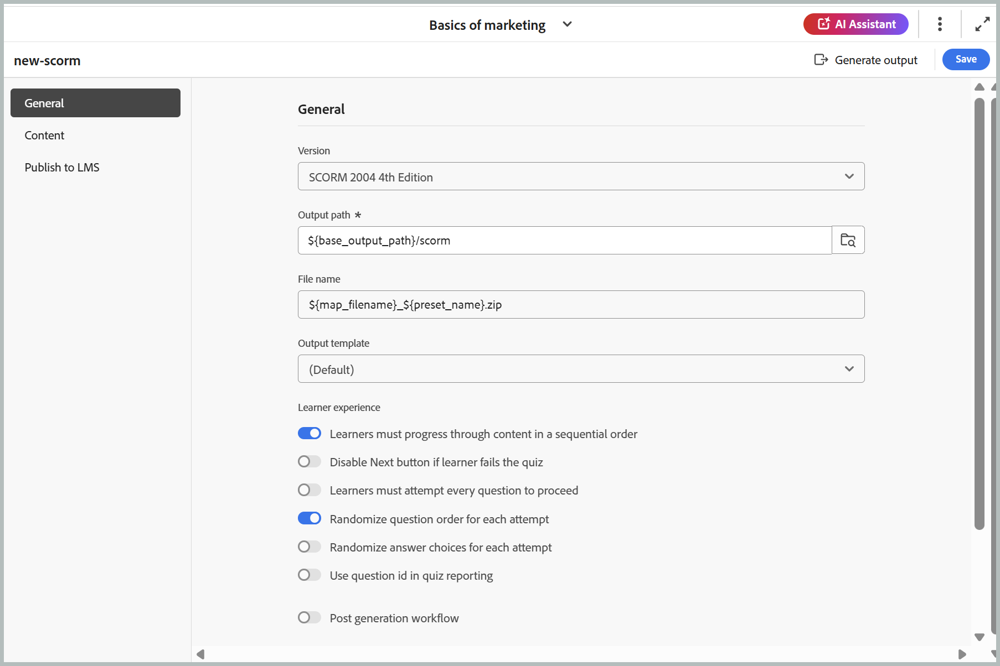

# Configura predefinito di output SCORM

Dopo aver creato il predefinito, configura le impostazioni del predefinito SCORM. Le opzioni di configurazione predefinite sono organizzate nelle schede Generali, Contenuto e Pubblica.

- **Generale:** Consente di specificare le impostazioni di output di base, ad esempio la versione supportata, il percorso di output, il nome del file ZIP, il modello di output e altre opzioni relative all&#39;esperienza dell&#39;Allievo.

  {width="650"}

  **Esperienza dell&#39;Allievo**

   - **Gli Allievi devono avanzare nel contenuto in ordine sequenziale**: assicura agli Allievi di spostarsi nel quiz in una sequenza fissa e non possono saltare avanti o passare da una domanda all&#39;altra.
   - **Per procedere, gli Allievi devono tentare tutte le domande**: richiede agli Allievi di tentare tutte le domande prima di poter inviare il quiz, impedendo gli invii incompleti.
   - **Ordine delle domande casuale per ogni tentativo**: visualizza le domande del quiz in un ordine diverso per ogni tentativo, riducendo la prevedibilità.
   - **Scelte casuali delle risposte per ogni tentativo**: riproduce in modo casuale le opzioni di risposta per ogni domanda a ogni tentativo, riducendo la possibilità di indovinare in base alla posizione.
   - **Utilizza l&#39;ID domanda nel reporting dei quiz**: include l&#39;ID domanda univoco nei report dei quiz, semplificando il tracciamento, l&#39;analisi e la mappatura dei risultati in base a domande specifiche.
   - **Flusso di lavoro post-generazione**: quando si sceglie questa opzione, viene visualizzato un nuovo elenco a discesa Flusso di lavoro post-generazione contenente tutti i flussi di lavoro configurati.

- **Contenuto:** utilizzare per specificare il filtro condizionale disponibile (utilizzando DITAVAL o un predefinito di condizione) e il set di variabili.

  {width="650"}

- **Pubblicazione:** Utilizzare questa impostazione solo se si desidera pubblicare l&#39;output in SCORM Cloud per l&#39;accesso diretto.

  {width="650"}

Una volta configurate tutte le modifiche, salva le modifiche per il predefinito SCORM utilizzando **Salva** nell&#39;angolo destro della barra degli strumenti della pagina del predefinito SCORM.
