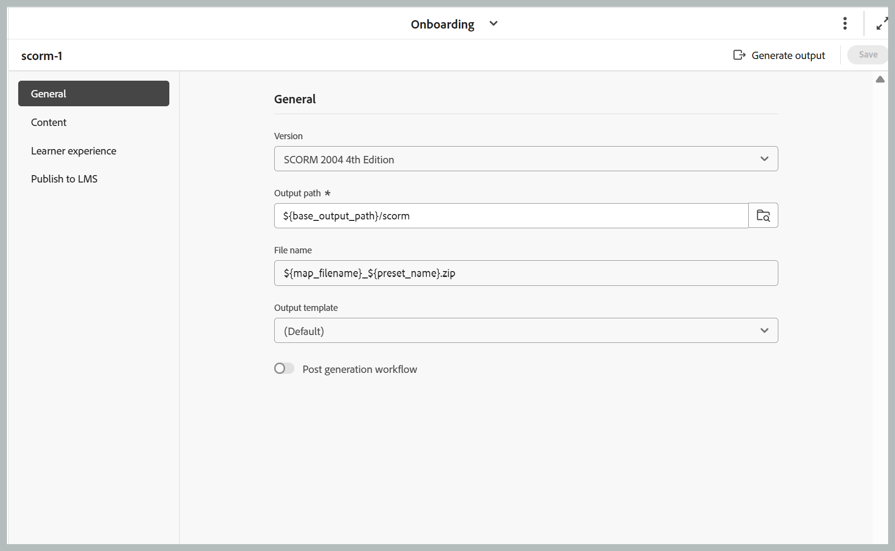

# Configura predefinito di output SCORM

Dopo aver creato il predefinito, configura le impostazioni del predefinito SCORM. Le opzioni di configurazione predefinite sono organizzate nelle schede Generale, Contenuto, Esperienza Allievo e Pubblica.

- **Generale:** utilizzato per specificare le impostazioni di output di base, ad esempio la versione supportata, il percorso di output, il nome file SCORM (zip), il modello di output e il flusso di lavoro di post-generazione per un nuovo elenco a discesa del flusso di lavoro di post-generazione contenente tutti i flussi di lavoro configurati.

  {width="650"}

- **Contenuto:** utilizzare per specificare il filtro condizionale disponibile (utilizzando DITAVAL o un predefinito di condizione) e il set di variabili.

  {width="650"}

- **Esperienza Allievo:** La scheda **Esperienza Allievo** consente di configurare il modo in cui gli Allievi interagiscono con l&#39;output SCORM e navigano all&#39;interno di esso. Le impostazioni sono organizzate in **Generale**, **Navigazione** e **Quiz** e consentono di controllare l&#39;accessibilità dei contenuti, il flusso di navigazione e il comportamento dei quiz per un&#39;esperienza di apprendimento personalizzata.

  {width="650"}

  - **Generale:** configura le opzioni a livello di output, ad esempio l&#39;abilitazione dei download di PDF per gli Allievi.

    - **Consenti agli Allievi di scaricare il corso PDF**: se abilitata, questa opzione aggiunge un&#39;icona PDF all&#39;output SCORM. Facendo clic su questa icona, l’Allievo può scaricare una versione PDF del contenuto del corso direttamente dall’output pubblicato.

      **Prerequisiti:** Prima di abilitare questa opzione, verifica quanto segue:

      - Il **modello di output** deve essere configurato con l&#39;icona **Incorpora PDF** nella posizione desiderata e lo stesso modello deve essere selezionato nell&#39;opzione **Modello di output** nella scheda **Generale** durante la configurazione di un predefinito SCORM.

        {width="650"}

      - Il predefinito per PDF **nativo** associato deve essere stato generato almeno una volta. Se si seleziona un predefinito di PDF non generato, viene visualizzato un messaggio di errore in cui si chiede all’utente di pubblicare il predefinito.

    Una volta generato l’output SCORM con le impostazioni precedenti, l’output risultante include un’icona PDF, come mostrato di seguito, che consente agli Allievi di scaricare il PDF del corso.

    {width="650"}

  - **Navigazione:** Definisci il modo in cui gli Allievi si spostano nel corso, inclusa la progressione sequenziale, le condizioni di completamento obbligatorie e le regole per sbloccare il pulsante **Successivo**.

    - **Gli Allievi devono avanzare nel contenuto in ordine sequenziale**: assicura agli Allievi di spostarsi nel corso in una sequenza fissa e non possono saltare avanti o passare da un componente all&#39;altro del corso.
    - **Disattiva il pulsante Avanti se l&#39;Allievo non supera il quiz**: impedisce all&#39;Allievo di passare alla sezione/pagina successiva fino a quando non supera il quiz.
    - **Per procedere, gli Allievi devono tentare tutte le domande**: richiede agli Allievi di tentare tutte le domande prima di poter inviare il quiz, impedendo gli invii incompleti.
    - **Blocca avanzamento fino a completamento**: impedisce la navigazione attraverso il corso finché tutte le condizioni secondarie configurate di seguito non sono soddisfatte disabilitando il pulsante **Avanti** nel corso.
      - **Tutti gli elementi interattivi aperti**: richiede all&#39;Allievo di aprire ogni elemento interattivo della pagina.
      - **Tutti i file multimediali guardati**: richiede all&#39;Allievo di guardare tutti i file multimediali video/audio sulla pagina.
      - **Tutti i controlli della conoscenza sono stati tentati**: richiede all&#39;Allievo di tentare ogni domanda di controllo della conoscenza sulla pagina.
      - **Tempo minimo trascorso sulla pagina**: richiede che l&#39;Allievo rimanga sulla pagina per almeno la durata specificata prima che il pulsante Avanti sia abilitato. Una volta attivato, è necessario immettere il tempo richiesto come indicato di seguito.
        - **Tempo richiesto (secondi)**: il numero minimo di secondi (ad esempio `30`) in cui un Allievo deve rimanere nella pagina per soddisfare questa condizione.

  - **Quiz:** Configura il comportamento correlato al quiz, ad esempio la randomizzazione delle scelte relative all&#39;ordine delle domande e alle risposte, per ridurre la prevedibilità tra i tentativi.

    - **Ordine delle domande casuale per ogni tentativo**: visualizza le domande del quiz in un ordine diverso per ogni tentativo, riducendo la prevedibilità.
    - **Scelte casuali delle risposte per ogni tentativo**: riproduce in modo casuale le opzioni di risposta per ogni domanda a ogni tentativo, riducendo la possibilità di indovinare.

- **Pubblica in LMS:** Utilizza questa impostazione per pubblicare i contenuti direttamente in Adobe Learning Manager (ALM). Dal menu a discesa **Server di pubblicazione**, selezionare **Adobe Learning Manager**, quindi scegliere il **Profilo di pubblicazione** richiesto precedentemente configurato nelle impostazioni di Workspace. Il profilo selezionato viene utilizzato per stabilire la connessione e caricare il contenuto generato in ALM.

  >[!NOTE]
  >
  > Prima di pubblicare i contenuti in ALM, è necessario configurare un profilo di pubblicazione Adobe Learning Manager. Per ulteriori dettagli, visualizzare [Profili di pubblicazione](../lc-config-guide/lc-folder-profile.md).

  {width="650"}

Una volta configurate tutte le modifiche, salva le modifiche per il predefinito SCORM utilizzando **Salva** nell&#39;angolo destro della barra degli strumenti della pagina del predefinito SCORM.
