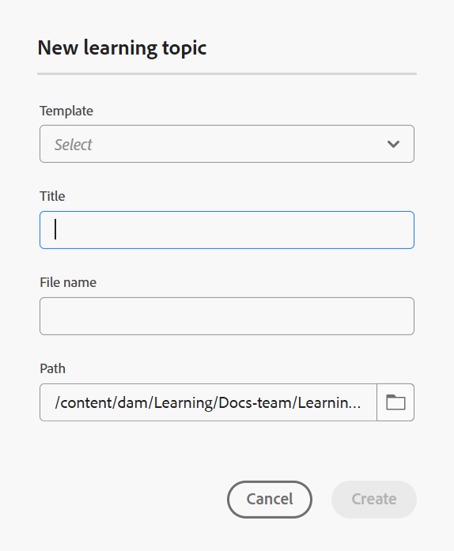

# Crea un argomento

Prima di approfondire il processo passo passo, ecco una breve panoramica video per aiutarti a visualizzare come creare un argomento di apprendimento.

>[!VIDEO](https://video.tv.adobe.com/v/3475211/learning-content-aem-guides)

**Passaggi per aggiungere un argomento a un corso**

Per aggiungere un argomento a un corso, effettua le seguenti operazioni:

1. Apri un corso in **Gestione corsi** e seleziona **Aggiungi nuovo** dal menu **Opzioni**.

   {width="650"}

1. Seleziona **Argomento**.

   Viene visualizzata la finestra di dialogo **Nuovo argomento di apprendimento**.

   {width="350"}

1. Seleziona il modello desiderato dal menu a discesa.

   {width="350"}

1. Inserite un titolo appropriato per l&#39;argomento.
1. Seleziona **Crea**.

Un nuovo argomento di apprendimento viene creato all’interno del corso e visualizzato nel pannello Gestione corsi.

>[!NOTE]
>
> Una volta creato, il nuovo argomento di apprendimento viene assegnato automaticamente alla versione 1.0.
