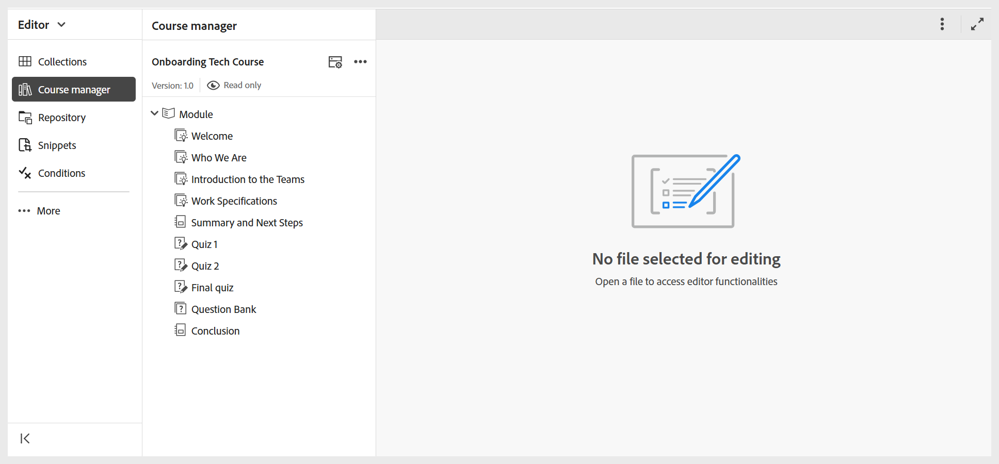

# Crea il primo corso

Per creare il primo corso, effettua le seguenti operazioni:

1. Passa alla cartella in cui desideri creare un corso e seleziona **Nuovo > Corso** dal menu **Opzioni**.

   

   Viene visualizzata la **finestra di dialogo Nuovo corso**.
2. Nella **finestra di dialogo Nuovo corso**, fornisci i seguenti dettagli:
   - Un Modello su cui sarà basato il corso.

     >[!NOTE]
     >
     > Potrai visualizzare solo i modelli di corso configurati dall’Amministratore.

   - Un Titolo per il corso.
   - Il nome file del corso. Il nome del file viene suggerito automaticamente in base al Titolo del corso. Se l’amministratore ha abilitato i nomi di file automatici in base all’impostazione UUID, il campo Nome file non verrà visualizzato.
   - Percorso in cui desideri salvare il corso. Per impostazione predefinita, il percorso della cartella attualmente selezionata nell’archivio viene visualizzato nel campo Percorso.
3. Seleziona **Crea**.
Il corso viene creato nel percorso specificato in base al modello selezionato. Inoltre, il corso viene aperto in Gestione corsi per la modifica.

   

