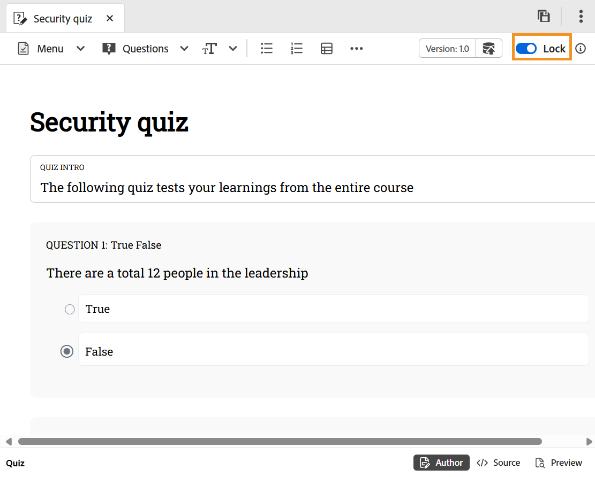

# Modifica quiz

Per modificare il quiz, effettua le seguenti operazioni:

1. Fai doppio clic sul quiz per aprirlo dal pannello Gestione corsi.
1. **Bloccare** il quiz utilizzando l&#39;interruttore. Questo consente di modificare il quiz e nessun altro può apportare modifiche al quiz.

   {width="650" align="left"}

1. Puoi [aggiungere domande al quiz](./quiz-insert-questions.md) e [inserire domande dalla banca domande](./insert-questions.md).
1. Per salvare i dati, utilizzare **Salva come nuova versione** per creare una nuova versione oppure premere CTRL+S per sovrascrivere il file esistente.
1. Dopo aver salvato il quiz, puoi **Sbloccare** l&#39;argomento affinché altri possano modificarlo.

