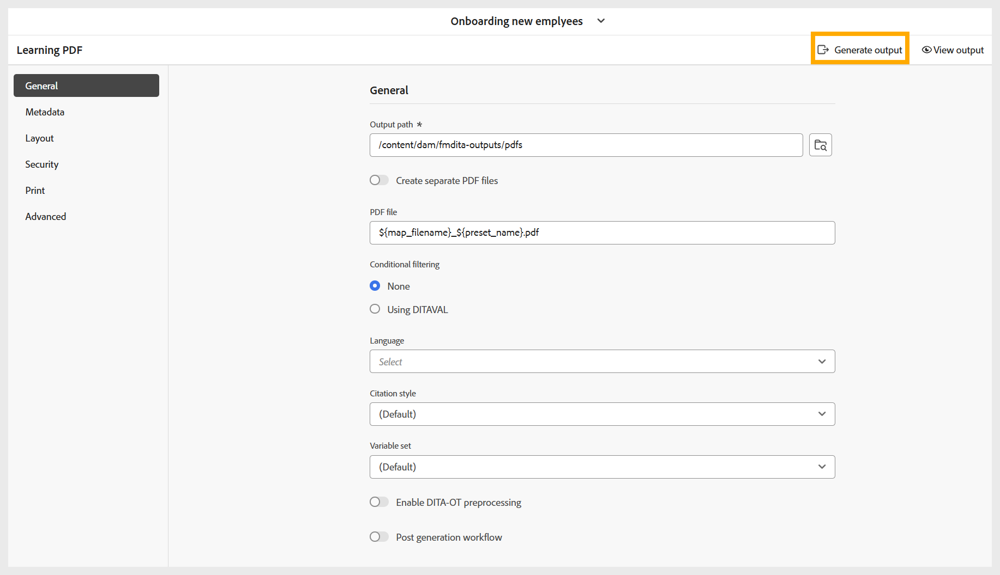
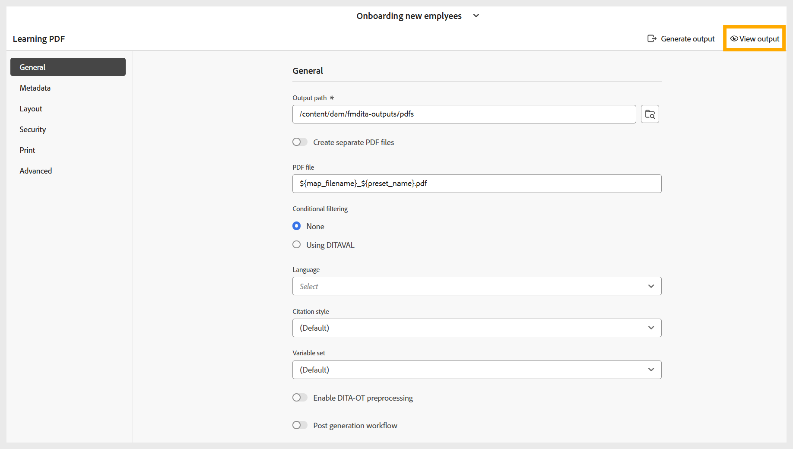

# Generare un PDF

Per generare un PDF, effettua le seguenti operazioni:

1. Dopo aver configurato tutte le impostazioni richieste per l’output di PDF in base alle preferenze, passa alla barra degli strumenti nella pagina delle impostazioni predefinite di PDF.
1. Selezionare **Genera output**.

   {width="650" align="left"}

1. Una volta completato il processo di generazione, viene visualizzato un messaggio di successo che conferma la creazione del PDF.

   {width="350" align="left"}

1. Puoi scaricare il PDF selezionando **Visualizza output** nel messaggio di successo e nella barra degli strumenti.

   {width="650" align="left"}

