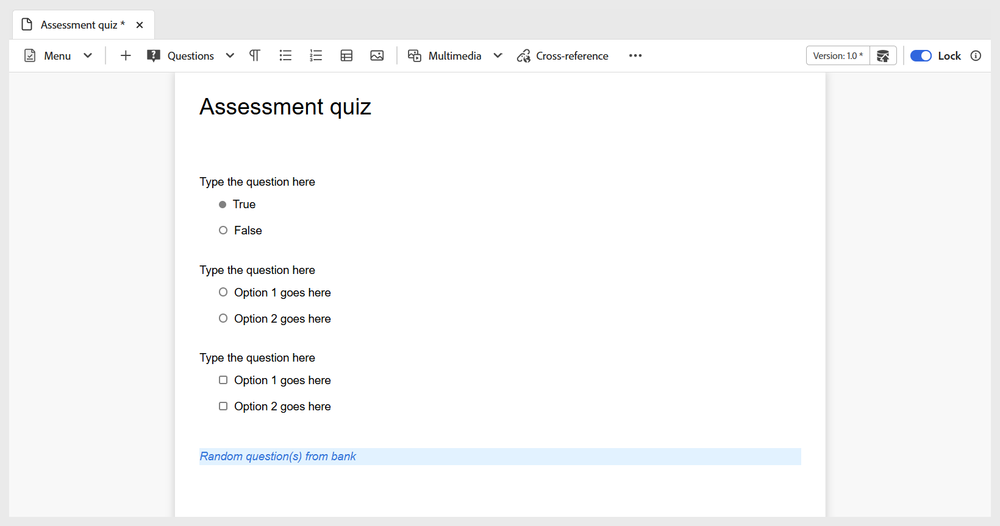

# Inserisci domande da banca domande

Effettua le seguenti operazioni, per inserire domande dalla banca domande nel quiz:

1. Seleziona l&#39;opzione **Inserisci da banca domande** dal menu a discesa **Domande** nella barra degli strumenti, come illustrato di seguito. Viene visualizzata la finestra di dialogo **Inserisci da banca domande**.

   {width="350" align="left"}

1. Specificare il percorso della banca domande memorizzata nel repository e selezionare le domande da inserire nel quiz, come illustrato di seguito. È inoltre possibile selezionare tutte le domande della banca delle domande utilizzando **Seleziona tutto**.

   {width="650" align="left"}

1. Le domande selezionate vengono inserite nel quiz con un&#39;evidenziazione blu, a indicare che non sono modificabili. Tuttavia, appariranno normalmente nell’output pubblicato.

   {width="650" align="left"}

1. Inoltre, puoi abilitare l&#39;opzione **Scegli domanda casuale** utilizzando l&#39;interruttore. Una volta abilitate, puoi definire il numero di domande da selezionare in modo casuale. Il quiz mostrerà quindi un segnaposto che indica che è stata inserita una domanda casuale, come mostrato nella seconda schermata. Durante la pubblicazione, il sistema seleziona e inserisce automaticamente il numero specificato di domande casuali dalla banca di domande.

   {width="650" align="left"}

   Le domande casuali vengono aggiunte al quiz come mostrato di seguito.

   {width="650" align="left"}