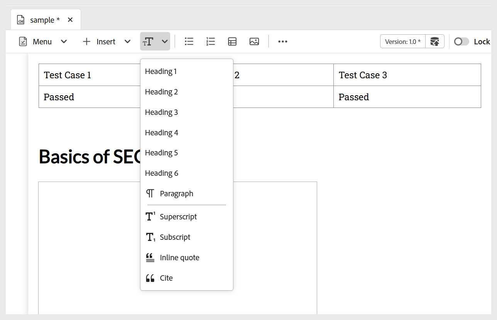

# Aggiungere blocchi predefiniti di base all&#39;argomento

Per comprendere meglio come creare un argomento di apprendimento e aggiungervi elementi di base, il video seguente offre una breve panoramica delle funzioni disponibili.

>[!VIDEO](https://video.tv.adobe.com/v/3469535/learning-content-aem-guides)

È possibile utilizzare le funzioni di modifica di base disponibili nella barra degli strumenti dell&#39;editor, come descritto di seguito:

- **Opzioni di inserimento**: fornisce opzioni per aggiungere [widget interattivi](./lc-widgets.md) quali Pannello a soffietto, Carosello, HotSpot, Schede, Inverti schede e Clic per visualizzare, nonché [elementi strutturali](./lc-other-insert-options.md) quali Iframe, Citazioni, Blocco di codice e altro ancora. Utilizza questo menu per aggiungere funzionalità e varietà ai contenuti di apprendimento, rendendoli coinvolgenti e ben strutturati.

  {width="650" align="left"}

- **Componenti testo**: aggiunge al contenuto intestazione, paragrafo, virgolette in linea, apice, pedice e citazione.

  >[!NOTE]
  >
  > Puoi anche includere un Titolo e un sottotitolo nei contenuti di apprendimento. Per informazioni dettagliate su come aggiungerlo al contenuto, visualizzare [Aggiungi titolo e sottotitolo al contenuto di apprendimento](#add-title-and-subtitle-to-learning-content).

  {width="650" align="left"}

- **Elenco non ordinato**: aggiunge un elenco non ordinato nel contenuto.

  {width="650" align="left"}

- **Elenco ordinato**: inserisce un elenco numerato nel contenuto.

  {width="650" align="left"}

- **Tabella**: inserisce una tabella delle dimensioni richieste nel contenuto. Puoi gestire ulteriormente varie proprietà della tabella utilizzando il pannello **Proprietà contenuto**, come illustrato di seguito.

  {width="650" align="left"}

- **Immagine**: inserire immagini nel contenuto insieme a testo alternativo e descrizione. Le immagini possono essere aggiunte dal repository o tramite un URL esterno. Inoltre, le proprietà dell&#39;immagine possono essere modificate utilizzando il pannello **Proprietà contenuto**.

  {width="650" align="left"}

- **Multimedia**: aggiunge video e audio al contenuto. Puoi personalizzarne le proprietà utilizzando il pannello **Proprietà contenuto**.

  {width="650" align="left"}

- **Contenuto riutilizzabile**: consente di incorporare il contenuto esistente dalle risorse o dall&#39;archivio per facilitarne la riutilizzo. Per inserire un contenuto riutilizzabile, effettua le seguenti operazioni:

   1. Selezionare **Contenuto riutilizzabile** dalla barra degli strumenti.
Viene visualizzata la finestra di dialogo **Riutilizza contenuto**.
   2. Individua e seleziona l’argomento desiderato per includerne il contenuto nel corso corrente.
   3. Seleziona l’ID del contenuto da aggiungere; accanto a per riferimento viene visualizzata un’anteprima.

      {width="650" align="left"}

   4. Scegli **Seleziona**.

  Il contenuto viene inserito. Ad esempio, la sezione sulla struttura del veicolo è un contenuto che viene riutilizzato e aggiunto all’argomento del corso. Il tipo viene visualizzato come **Riferimento** e il relativo **ID** si riflette nel pannello **Proprietà contenuto**.

  {width="650" align="left"}

- **Simboli**: aggiunge i simboli desiderati al contenuto di un elenco, come illustrato di seguito.

  {width="350" align="left"}

- **Collegamenti ipertestuali**: aggiunge collegamenti ipertestuali alla posizione desiderata nel contenuto. Può essere un riferimento di file, un URL Web o un collegamento di posta elettronica come mostrato di seguito.

  {width="650" align="left"}

Inoltre, il menu a discesa **Menu** consente di accedere alle azioni di modifica (Taglia, Copia, Elimina), Trova e sostituisci ed Etichetta versione.

## Aggiungi titolo e sottotitolo al contenuto di apprendimento

Per includere titolo e sottotitolo nel contenuto di apprendimento, effettua le seguenti operazioni:

1. Apri il corso di apprendimento nella console Mappa.
1. Apri l’argomento, il quiz o qualsiasi altro componente del corso a cui desideri aggiungere un titolo o un sottotitolo.
1. Passare al pannello Proprietà file e selezionare **Aggiungi titolo**.

   
1. Quando richiesto, scegli se utilizzare l’intestazione esistente come titolo.

   >[!NOTE]
   >
   > Se non si desidera utilizzare come titolo il titolo esistente, inserire innanzitutto un titolo utilizzando il componente Testo nella barra degli strumenti dell&#39;editor, quindi selezionare **Aggiungi titolo**. In questo modo viene aggiunto al contenuto un **titolo** di esempio, che potrai modificare in base alle tue esigenze.
1. In Proprietà file selezionare **Aggiungi sottotitolo**.
Un esempio di **Sottotitolo** è stato aggiunto al contenuto.

   

Per rimuovere un titolo, deselezionare l&#39;opzione **Aggiungi titolo** nelle proprietà del file. Se si rimuove il titolo, viene automaticamente rimosso il sottotitolo associato.

