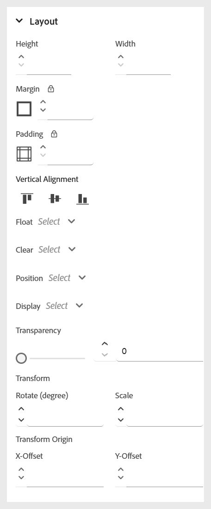

# Usa stili in linea

Applica stili in linea per personalizzare l’aspetto di un testo specifico direttamente all’interno del contenuto del corso. Ciò consente di eseguire regolazioni rapide della formattazione, ad esempio la dimensione del carattere, il colore, l&#39;allineamento e altro ancora. Puoi modificare gli stili in linea per il testo selezionato utilizzando il pannello **Proprietà contenuto**.

Ecco un breve video che illustra i vari stili in linea disponibili.

>[!NOTE]
>
> Queste opzioni di stile saranno visibili solo se abilitate dall&#39;amministratore.

>[!VIDEO](https://video.tv.adobe.com/v/3469533/aem-guides-learning-content)

La descrizione delle opzioni di stile in linea disponibili è la seguente:

- **Tipo di carattere:** Consente di personalizzare l&#39;aspetto del testo utilizzando varie opzioni, ad esempio famiglia di caratteri, spessore del carattere, decorazione del testo, dimensione del carattere e altro ancora. Queste impostazioni consentono di applicare uno stile al contenuto, come illustrato nell’esempio seguente.

  {width="350" align="left"}

- **Bordo**: consente di definire e personalizzare il bordo di un elemento utilizzando opzioni quali il lato del bordo, la larghezza, lo stile (tinta unita, tratteggiato, punteggiato e altro), il colore. Queste impostazioni consentono di separare visivamente o evidenziare sezioni specifiche del contenuto.

  {width="350" align="left"}

- **Layout**: consente di controllare il posizionamento e la spaziatura degli elementi all&#39;interno del contenuto. Puoi regolare proprietà come margine, spaziatura interna, allineamento, tipo di visualizzazione e altro ancora. per organizzare efficacemente la struttura dei contenuti.

  {width="350" align="left"}

- **Sfondo**: consente di personalizzare lo sfondo di un elemento impostando opzioni quali il colore di sfondo, l&#39;immagine, la posizione e lo stile di ripetizione. Queste impostazioni migliorano l&#39;impatto visivo e la chiarezza del contenuto.

  {width="350" align="left"}

- **Colonna**: consente di organizzare il contenuto in più colonne. Puoi regolare il numero di colonne, la spaziatura tra di esse, la larghezza delle colonne e altro ancora. per migliorare la leggibilità e la struttura del layout all’interno del contenuto.

  {width="350" align="left"}
