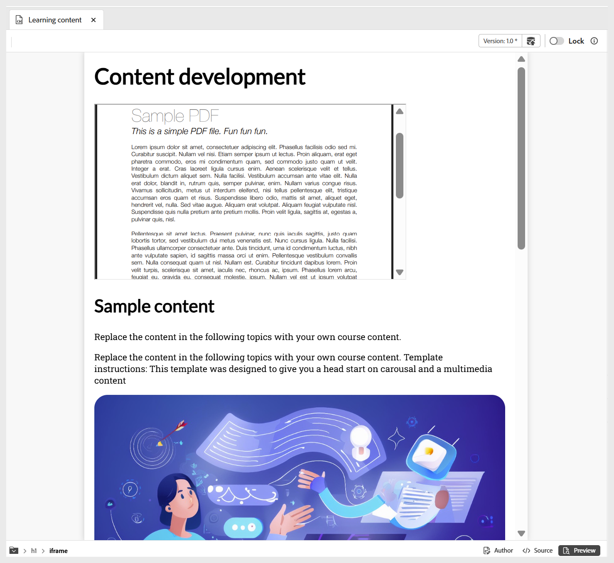

# Altre opzioni del menu Inserisci

Le altre opzioni disponibili nel menu Inserisci della barra degli strumenti dell&#39;editor includono:

- **Virgolette:** aggiunge al contenuto virgolette e citazioni.

  {width="650"}

- **Blocchi di codice:** aggiunge un blocco di codice al contenuto.

  {width="650"}

- **Iframe:** inserisce un iframe nel contenuto per incorporare pagine Web esterne o risorse interattive. Puoi configurare le proprietà dell&#39;iframe utilizzando il pannello **Proprietà contenuto**, inclusi l&#39;URL di origine, la larghezza, l&#39;altezza, l&#39;allineamento e il titolo. Puoi visualizzare il contenuto aggiunto nell&#39;iframe passando alla modalità **Anteprima** come mostrato di seguito.

  **Visualizzazione autore**:

  {width="650"}

  **Modalità anteprima**:

  {width="650"}

- **H5P:** aggiunge il pacchetto interattivo H5P al contenuto di apprendimento. Per aggiungere contenuto H5P, posizionare il cursore nella posizione desiderata e selezionare **H5P** dal menu Inserisci. Nella finestra di dialogo Inserisci H5P, fornire un riferimento al file H5P che si desidera aggiungere al contenuto di apprendimento.

  

  Se preferisci utilizzare il contenuto H5P dal tuo sistema, prima [carica il file in DAM](../user-guide/authoring-upload-existing-files.md) utilizzando l&#39;opzione **Carica risorse**, quindi inseriscilo nella vista Archivio/Assets.

  

  Al termine, rivedi il contenuto H5P in modalità Anteprima e l’output pubblicato.

  >[!NOTE]
  >
  > La modifica o la creazione di contenuti H5P non è supportata in Adobe Experience Manager Guides. Preparare il pacchetto H5P esternamente prima di caricarlo.

- **Equazione MathML:** inserisce equazioni MathML nel contenuto. Puoi creare un&#39;equazione di MathML e selezionare **Inserisci** per aggiungerla al documento.

  {width="350"}

  L&#39;equazione viene inserita con uno sfondo grigio chiaro. In qualsiasi momento è possibile aggiornare un&#39;equazione facendo clic con il pulsante destro del mouse su un&#39;equazione esistente e selezionando **Modifica equazione matematica** dal menu di scelta rapida. Per informazioni dettagliate sulla convalida delle equazioni di MathML in Experience Manager Guides, visualizzare [Convalida delle equazioni nell&#39;editor di MathML](../user-guide/web-editor-other-features.md#validation-of-equations-in-the-mathml-editor).

- **Verifica conoscenza:** consente di aggiungere domande nei formati disponibili (Correzione singola, Correzione multipla, Vero/Falso, Corrispondenza con quanto segue o inserimento dalla banca domande) all&#39;argomento per la revisione e per confermare la comprensione senza classificazione. Queste domande rispecchiano i formati standard ed escludono il punteggio, rendendoli ideali per l’autovalutazione e adatti come parte del contenuto del corso o di un argomento prima di un quiz o di una valutazione successiva, se disponibile.

  {width="650"}

  Puoi configurare le risposte corrette e altri campi obbligatori tramite il pannello **Proprietà contenuto**. Per ulteriori dettagli, visualizzare [Tipi di domande](./quiz-insert-questions.md). Puoi aggiungere vari tipi di domande utilizzando le opzioni di controllo della conoscenza come mostrato di seguito.

  Inoltre, puoi abilitare l&#39;opzione **Richiedi verifica conoscenza per procedere** per garantire che gli Allievi tentino di eseguire un controllo specifico prima di passare al contenuto del corso successivo. Questa funzionalità aiuta a rafforzare gli obiettivi chiave di apprendimento impedendo agli Allievi di saltare i punti critici di controllo per la valutazione. La funzione è supportata quando **Gli Allievi devono avanzare nel contenuto in ordine sequenziale** l&#39;impostazione è abilitata durante la configurazione dell&#39;output del predefinito SCORM, assicurandosi che la progressione del corso segua il percorso di apprendimento previsto.

  {width="650"}

- **Campo di input:** Aggiunge al contenuto un campo di input di testo con un pulsante. È possibile utilizzare questa combinazione per acquisire l’input dell’utente e attivare azioni specifiche. Ora puoi anche aggiungere un’area di testo su più righe per risposte più lunghe, ad esempio spiegazioni o feedback aperto. L&#39;area di testo su più righe supporta le interruzioni di riga e la disposizione del testo.

  {width="650"}

- **Altre opzioni:** Sono disponibili opzioni aggiuntive per migliorare il contenuto di apprendimento, tra cui l&#39;inserimento di una linea orizzontale, un&#39;interruzione di riga, una casella di testo, una casella di testo posizionata e un HTML incorporato.

  {width="650"}
