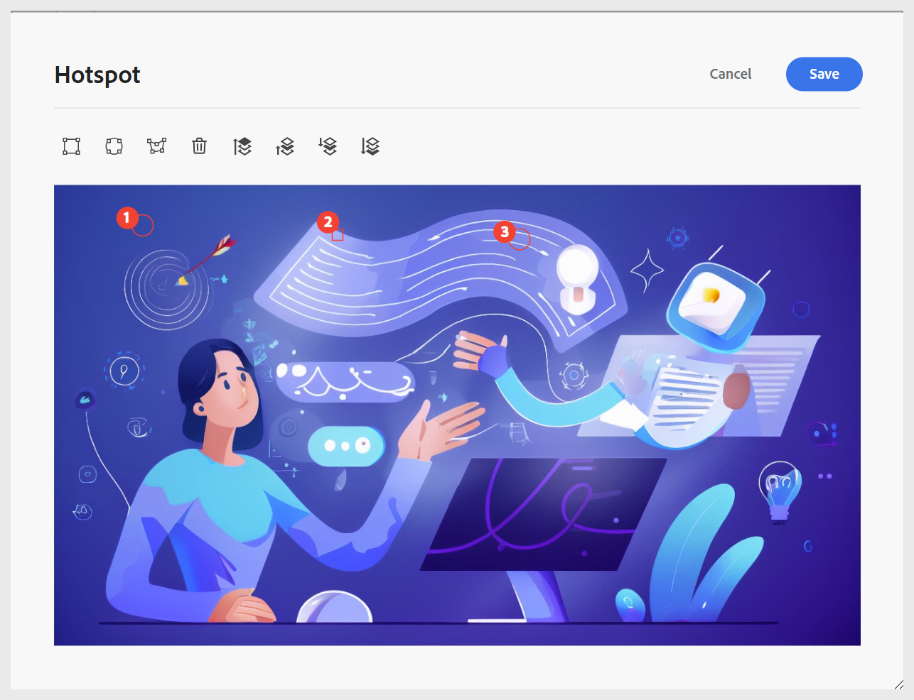

# Utilizzare i widget interattivi

Puoi migliorare il contenuto di apprendimento aggiungendo più widget per rendere il corso più interattivo. Ecco un breve video con informazioni dettagliate sui vari widget disponibili.

>[!VIDEO](https://video.tv.adobe.com/v/3469531/learning-content-aem-guides)

I widget disponibili progettati per migliorare l’esperienza utente e semplificare la distribuzione dei contenuti includono:

- **Pannello a soffietto:** aggiunge un pannello a soffietto al contenuto. Puoi inserire testo adatto sia nell’intestazione del Pannello a soffietto che nel relativo corpo. Le relative proprietà possono essere gestite utilizzando il pannello **Proprietà contenuto**, incluse le opzioni per consentire l&#39;apertura simultanea di una o più fisarmoniche, nonché per aggiungere o rimuovere elementi. Per eliminare un elemento o un elemento del widget, puoi anche utilizzare **Clic con il pulsante destro del mouse > Elimina elemento**.

  {width="650"}

- **Carosello:** aggiunge il carosello al contenuto. È possibile inserire testo adatto sia nel titolo della scheda che nel corpo della stessa. Le relative proprietà possono essere gestite utilizzando il pannello **Proprietà contenuto**, incluse le opzioni per aggiungere o rimuovere elementi. Per eliminare un elemento o un elemento del widget, puoi anche utilizzare **Clic con il pulsante destro del mouse > Elimina elemento**.

  {width="650"}

- **Punto attivo:** aggiunge un punto attivo a un&#39;immagine selezionata. Iniziare scegliendo un&#39;immagine, quindi passare a **Inserisci > Punto attivo**. Viene visualizzata la finestra di dialogo Punto attivo, in cui è possibile configurare varie opzioni, ad esempio l&#39;impostazione di diverse dimensioni di punto attivo, l&#39;aggiunta di collegamenti corrispondenti e la regolazione del layout portando le aree avanti o indietro. Per eliminare un elemento o un elemento del widget, puoi anche utilizzare **Clic con il pulsante destro del mouse > Elimina elemento**.

  {width="650"}

- **Scheda:** consente di organizzare il contenuto in sezioni interattive.  Ogni scheda può rappresentare un argomento o una categoria distinta; gli Allievi possono fare clic o toccare le schede per visualizzare il contenuto corrispondente. Posizionare il cursore nel punto in cui si desidera visualizzare il widget Scheda nel contenuto, quindi passare a **Inserisci > Widget > Scheda**. Questo aggiunge un contenitore di schede al contenuto. A questo punto, inizia ad aggiungere contenuto alla scheda che include il titolo della scheda e il contenuto corrispondente.  Per eliminare un elemento o un elemento del widget, puoi anche utilizzare **Clic con il pulsante destro del mouse > Elimina elemento**.

  

  Per aggiungere, eliminare e cambiare il layout delle schede (schede verticali o orizzontali), utilizzare la sezione **Proprietà contenuto** nel pannello di destra.
- **Inverti scheda:** Aggiunge una scheda interattiva al contenuto che consente di invertire la visualizzazione di ulteriori informazioni. Ogni scheda ha due lati: anteriore e posteriore, consentendo agli Allievi di esplorare le informazioni in modo coinvolgente.  Per inserire una scheda Flip, posizionare il cursore nella posizione desiderata e passare a **Inserisci > Widget > Flip card**, che aggiunge un contenitore Flip card al contenuto. È quindi possibile aggiungere un titolo e un&#39;immagine facoltativa sul lato anteriore e immettere il contenuto corrispondente sul retro. Per eliminare un elemento o un elemento del widget, puoi anche utilizzare **Clic con il pulsante destro del mouse > Elimina elemento**.

  

  Per aggiungere o eliminare schede o modificarne il layout, utilizzare la sezione **Proprietà contenuto** nel pannello di destra.
- **Fare clic per visualizzare:** Inserisce un widget interattivo nel contenuto che nasconde il contenuto finché gli Allievi non fanno clic per visualizzarlo. Questo aiuta a ridurre il disordine e incoraggia l&#39;esplorazione. Inserire il widget posizionando il cursore nella posizione desiderata e selezionando **Inserisci > Widget > Fai clic per visualizzare**. Una volta inserito, fornisci il titolo per l’intestazione del widget e definisci il contenuto nascosto che appare quando gli Allievi interagiscono.

  

  Per aggiungere o eliminare il widget o gestirne l&#39;orientamento, utilizzare la sezione **Proprietà contenuto** nel pannello di destra. Per eliminare un elemento o un elemento del widget, puoi anche utilizzare **Clic con il pulsante destro del mouse > Elimina elemento**.