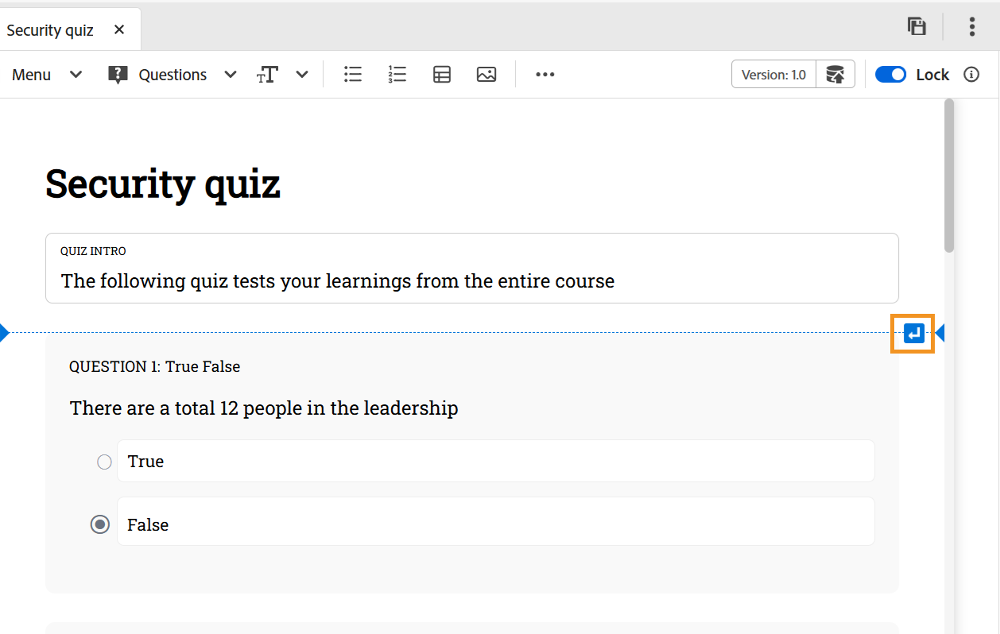

# Inserire domande in un quiz

Per inserire domande in un quiz, effettua le seguenti operazioni:

1. Scegli il tipo di domanda desiderato dal menu a discesa **Domande** nella barra degli strumenti. In base alle tue esigenze, puoi aggiungere domande utilizzando uno dei quattro formati disponibili: Vero o Falso, Corretto singolo, Corretto multiplo, Corrispondenza con le risposte seguenti e Breve come mostrato di seguito. Per ulteriori dettagli, visualizzare [Tipi di domande](#question-types).

   {width="650" align="left"}

   Quando si inserisce una domanda, se il cursore si trova su un blocco di domanda, la nuova domanda viene aggiunta subito dopo per impostazione predefinita.

   Per inserire una domanda tra le due domande esistenti, [inserire un paragrafo](#insert-paragraph-within-the-quiz), quindi inserire le domande.

1. Nel formato selezionato viene inserita una domanda. È quindi possibile modificare la domanda in base alle proprie esigenze.

1. Puoi selezionare qualsiasi domanda e configurarne le proprietà utilizzando il pannello **Proprietà contenuto**.

   {width="650" align="left"}

1. Salvate tutte le modifiche apportate al quiz.

## Proprietà domanda

Puoi configurare le domande utilizzando le seguenti proprietà di domanda dal pannello **Proprietà contenuto**:

{width="350" align="left"}

- **Opzioni**: specifica la risposta corretta alla domanda
- **ID domanda**: specifica l&#39;ID domanda per ogni domanda. Se non è presente un ID domanda, si consiglia di aggiungerlo sempre.
- **Punti per la risposta corretta**: specificare i punti da assegnare per la risposta corretta.
- **Penale per risposta errata**: specificare i punti da detrarre per una risposta errata.
- **Etichetta domanda**: consente di aggiungere un&#39;etichetta domanda.
- **Feedback**: consente di fornire il feedback per una risposta corretta o non corretta.
- **Fissa opzione alla posizione**: quando un&#39;opzione specifica per una domanda è bloccata, rimane fissa nella posizione specificata nell&#39;elenco delle opzioni, anche se **Nella configurazione del predefinito SCORM sono abilitate scelte di risposta casuali per ogni tentativo**, che altrimenti ridistribuirebbe le opzioni disponibili. Potete passare il cursore sull&#39;opzione desiderata di una domanda nel pannello Proprietà contenuto e fissarla.

  {width="350" align="left"}

## Inserire un paragrafo nel quiz

Quando si posiziona il cursore su una domanda specifica o su uno spazio vuoto tra le due domande, viene visualizzata una linea orizzontale blu con una freccia blu nell&#39;angolo più a destra dello schermo. Selezionando la freccia blu, potete inserire un paragrafo all&#39;interno dell&#39;interfaccia di creazione dei quiz.

{width="650" align="left"}

- Quando utilizzato all’interno di una domanda, consente di aggiungere più elementi come immagini, tabella, elementi di testo e altro all’interno della domanda.
- Se utilizzata tra le domande, consente di inserire un’altra domanda o di aggiungere altri elementi di authoring come indicato sopra.

## Elimina domanda o opzione

Per eliminare una domanda o un’opzione specifica da un quiz, effettua le seguenti operazioni:

1. Fare clic con il pulsante destro del mouse sulla domanda o sull&#39;opzione che si desidera rimuovere.
1. Nel menu di scelta rapida, selezionare **Elimina domanda** (per rimuovere l&#39;intera domanda) o **Elimina opzione** (per rimuovere solo l&#39;opzione selezionata).

{width="650" align="left"}

## Tipi di domande

In un quiz sono supportati i seguenti tipi di domande:

- **Corretto singolo**: una domanda con più opzioni in cui è corretta una sola risposta.

  {width="650" align="left"}

- **Vero/Falso**: una domanda basata su istruzioni in cui gli Allievi scelgono se è Vero o Falso.

  {width="650" align="left"}

- **Più corretti**: una domanda con più opzioni in cui è possibile correggere più risposte.

  {width="650" align="left"}

- **Corrispondenza con**: consente agli Allievi di abbinare gli elementi di due elenchi per formare coppie corrette. Puoi aggiungere nuovi set di opzioni dal pannello **Proprietà contenuto**. Per aumentare la complessità, puoi rimuovere un’opzione dal primo elenco e includere una corrispondenza aggiuntiva nella colonna Corrispondenza. Questo crea un elemento di difficoltà richiedendo agli Allievi di pensare criticamente a quale opzione non ha una coppia diretta.

  {width="650" align="left"}

  Nell&#39;output pubblicato, viene visualizzata la domanda **Corrispondenza con la seguente** con menu a discesa per ogni elemento, che consente di selezionare la corrispondenza corretta tra le opzioni disponibili.

  {width="650" align="left"}

- **Risposta breve**: consente agli Allievi di rispondere utilizzando un breve input di testo. Accetta risposte alfanumeriche, confronta le risposte senza distinzione tra maiuscole e minuscole e per le risposte molto lunghe fornisce una barra di scorrimento orizzontale.

  {width="650" align="left"}
