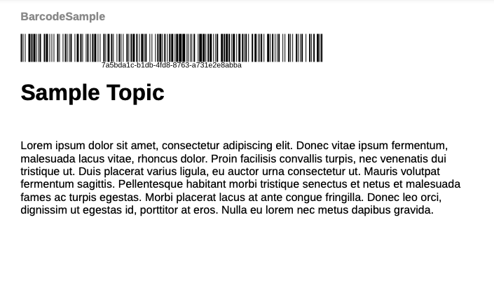

# Aggiungere un codice a barre all&#39;output di PDF

Un codice a barre è un pattern di dati che le macchine possono leggere. I clienti possono scansionare i codici a barre con uno scanner o una fotocamera per smartphone. Può essere utile codificare informazioni quali dettagli di prodotto, numeri di inventario o URL di siti web. L’aggiunta di codici a barre consente di acquisire facilmente i dati, migliora l’esperienza del cliente e facilita una migliore gestione e sicurezza dei dati.

È possibile creare uno stile per il codice a barre. e utilizzarlo per inserire un codice a barre in un layout di pagina. Puoi applicare lo stile a un codice a barre di esempio nel layout di pagina desiderato.


Questa esercitazione ti aiuta ad aggiungere codici a barre nell&#39;output di PDF.

## Passaggi per generare un codice a barre

Per generare un codice a barre, effettuare le seguenti operazioni:

### Aggiornare il CSS del modello per eseguire il rendering di un valore di codice a barre

Modificare il file `layout.css` per eseguire il rendering di un codice a barre durante la generazione di PDF. Sono supportati vari tipi di codice a barre come &quot;qrcode&quot; e &quot;pdf417&quot;.  Per ulteriori dettagli, visualizzare [Tipi di codice a barre](#barcode-types).


```css
...
.barcode { 
-ro-replacedelement: barcode;   
-ro-barcode-type: code128;   
-ro-barcode-size: 100%;   
-ro-barcode-content: content();   
object-fit: contain;   
margin-top: 2mm;
 
}
...
```

### Usa lo stile CSS per generare il codice a barre

Puoi generare il codice a barre in diversi modi. Alcuni esempi sono i seguenti:

**Esempio 1**

Aggiungi un segnaposto per codice a barre nell’intestazione del modello e applica lo stile:

1. Modifica **Modelli** > **Layout di pagina**
1. Seleziona un layout di pagina. Ad esempio, è possibile selezionare il layout di pagina BackCover contenente l&#39;intestazione o il piè di pagina.
1. Aggiungere l&#39;estensione seguente alla posizione in cui si desidera inserire il codice a barre.

   `<span class="barcode">Sample barcode</span></p>`.

   >[!NOTE]
   >
   > Utilizzare lo stesso nome di classe definito in `layout.css`.

1. Sostituire `<Sample barcode>` con il valore che si desidera venga letto dallo scanner del codice a barre.

Puoi visualizzare il codice a barre durante la generazione del PDF di output utilizzando il modello, che include il layout della pagina. Dopo aver eseguito i passaggi precedenti, puoi generare l’output PDF con un codice a barre.

La schermata seguente mostra un codice a barre di esempio in un output PDF.



**Esempio 2**

Modificare il file `Common.plt` nel modello **Basic** per aggiungere un codice a barre dopo il titolo del progetto.

Per creare un codice a barre per un numero ISBN, aggiungi un numero ISBN. Quindi utilizza il numero ISBN per generare il codice a barre.

```html
...

  <div data-region="header">
    <p class="chapter-header"><span data-field="project-title" data-format="default">Project Title</span> </p>
    <p><span class="barcode">978-1-56619-909-4</span></p>
  </div>
} 
...
```

**Esempio 3**

Per creare un codice a barre utilizzando i metadati della mappa:

Utilizzare i metadati presenti nell&#39;elemento `<topicmeta>` di una mappa DITA per visualizzarli come codice a barre. Assicurarsi di utilizzare l&#39;XPath corretto. Ad esempio, è possibile aggiungere `<resourceid>` in `<topicmeta>` di una mappa DITA.

Nell’esempio seguente, l’ID risorsa funge da input principale per generare il codice a barre.

```xml
<?xml version="1.0" encoding="UTF-8"?>
<!DOCTYPE map PUBLIC "-//OASIS//DTD DITA Map//EN" "technicalContent/dtd/map.dtd">
<map id="GUID-3c330691-4dac-4020-904a-d2d6246aeeb1-en">
  <title>Barcode Sample</title>
  <topicmeta>
    <resourceid id="7a5bda1c-b1db-4fd8-8763-a731e2e8abba">
    </resourceid>
  </topicmeta>
  <topicref href="GUID-139f6c64-bea3-4f17-8b22-ee131557e249-en.dita" type="topic">
  </topicref>
</map>  
```


Puoi utilizzare l’ID risorsa in un layout di pagina come segue:


```html
  <div data-region="header">
    <p class="chapter-header"><span data-field="project-title" data-format="default">Project Title</span> </p>
    <p><span class="barcode" data-field="metadata" data-format="default" data-subtype="//resourceid/@id">Resource ID (barcode)</span></p>
  </div>
} 
```

## Tipi di codice a barre {#barcode-types}

Alcuni dei codici a barre comunemente utilizzati sono i seguenti:

| Tipo | -ro-tipo-codice a barre | Dettagli aggiuntivi |
| ---| --- | --- |
| Codice QR | qrcode | La simbologia del codice a barre QR in base allo standard ISO/IEC 18004:2015. |
| Codice 128 | code128 | La simbologia del codice a barre del codice 128 come definita nella norma ISO/IEC 15417:2007. |
| Codice 32 | code32 | Codice 32, noto anche come codice harmacode italiano. |
| Codice 49 | code49 | Codice 49 in conformità con ANSI/AIM-BC6-2000. |
| Codice 11 | code11 |                            |
| Codice 93 | code93 |                            |
| Codice16k | code16k |                            |
| PDF417 | pdf417 | Il codice a barre PDF417/MicroPDF417 è simbolico in base alle norme ISO/IEC 15438:2006 e ISO/IEC 24728:2006. |
| Codice 3 di 9 | code39 | Il codice 3 di 9 simboli di codici a barre secondo ISO/IEC 16388:2007. |
| MSI Plessey | sciocco |                            |
| Codice canale | channelcode | Codice di canale secondo ANSI/AIM BC12-1998. |
| Codabar | codabar | Simbologia del codice a barre di Codabar secondo BS EN 798:1996. |
| EAN-8 | ean-8 | Simbologia del codice a barre EAN secondo BS EN 797:1996. |
| EAN-13 | ean-13 | Simbologia del codice a barre EAN secondo BS EN 797:1996. |
| UPC-A | upc-a | Simbologia codice a barre UPC secondo BS EN 797:1996. |
| UPC-E | upc-e | Simbologia codice a barre UPC secondo BS EN 797:1996. |
| Componente aggiuntivo Ean/UPC | addon | Simbologia del codice a barre del componente aggiuntivo EAN/UPC in base a BS EN 797:1996. |
| Telepen | telepene | Noto anche come Telepen Alpha. |
| Databar GS1/Databar 14 | databar | Barra dati GS1 in base allo standard ISO/IEC 24724:2011. |
| GS1 Databar Expanded/Databar 14 Expanded | database espanso | Barra dati GS1 espansa in base allo standard ISO/IEC 24724:2011. |
| GS1 Databar Limited | databar-limited | GS1 DataBar Limited secondo ISO/IEC 24724:2011. |
| POSTNET (tecnica di codifica numerica postale) | postnet | La simbologia del codice a barre POSTNET (Postal Numeric Encoding Technique) utilizzata dal servizio postale degli Stati Uniti. |
| Farmazentralnummer (PZN-8) | pzn8 | Simbologia basata sul Codice 39 utilizzata dall&#39;industria farmaceutica in Germania. |
| Codice Farmacologico | codice farmacologico |                            |
| Blocco codice F | codablockf | Simbologia secondo AIM Europe &quot;Uniform Symbology Specification Codablock F&quot;, 1995. |
| Logmars | logmars | Lo standard LOGMARS (Logistics Applications of Automated Marking and Reading Symbols) utilizzato dal Dipartimento della Difesa degli Stati Uniti. |
| Aztec Runes | rune azteche | Simbologia del codice a barre Aztec Runes in base alla norma ISO/IEC 24778:2008 allegato A. |
| Codice Aztec | codice azteco | Simbologia codice a barre Aztec in base alla norma ISO/IEC 24778:2008. |
| DataMatrix | data-matrix | Simbologia del codice a barre ECC 200 Data Matrix secondo ISO/IEC 16022:2006. |
| Codice uno | code-one |                            |
