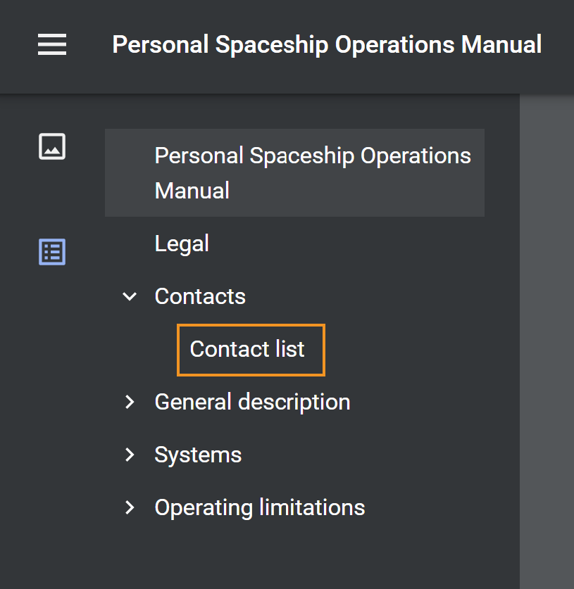

# Aggiungere un segnalibro personalizzato nell’output di PDF

In genere, il sommario di una mappa DITA viene replicato come segnalibro nell&#39;output finale di PDF, incluso il titolo **Contents** che apre la pagina del sommario se selezionata. Questo sommario viene creato dai titoli di argomento o di sezione nella mappa DITA.

A volte può essere utile aggiungere un segnalibro personalizzato a un particolare contenuto nell’output di PDF per facilitarne la navigazione. Per ottenere questo risultato, aggiungere un attributo `outputclass` all&#39;elemento e applicare l&#39;attributo seguente:

`bookmark-level: 3`

In questo caso `bookmark-level` è un attributo e il numero `3` è il valore che indica il livello nella gerarchia dei segnalibri in cui viene aggiunto il segnalibro. Nell&#39;esempio seguente, l&#39;argomento di primo livello &quot;Contatti&quot; contiene una tabella, &quot;Elenco contatti&quot;, in cui è stato aggiunto un attributo `outputclass` con il valore di `custom-bookmark`.


Nel file CSS viene aggiunta la seguente definizione della classe `custom-bookmark`:

```css
…
/*Adding a custom bookmark*/
.custom-bookmark{
    bookmark-level: 2
}
…
```

Nell&#39;output di PDF, la tabella *Elenco contatti* viene aggiunta al secondo livello nell&#39;elenco dei segnalibri di PDF, come illustrato di seguito:

 {width="300"}

>[!NOTE]
>
>È necessario scegliere il livello corretto in cui aggiungere il segnalibro personalizzato. Se si specifica un numero inferiore al segnalibro dell&#39;argomento padre, il segnalibro personalizzato assume la posizione del segnalibro padre e tutti gli altri segnalibri vengono visualizzati come figli. Questo può causare una struttura imprevista dei segnalibri.

**Rimozione del titolo del contenuto dai segnalibri di output di PDF**

Se non si desidera includere il titolo **Contents** nell&#39;output di PDF, è possibile rimuoverlo inserendo **Contents** nell&#39;elemento `<p>` anziché nell&#39;elemento `<h1>`.

La procedura dettagliata per rimuovere il titolo Contens dai segnalibri è la seguente:

1. Aprire il modello PDF utilizzato per l&#39;output PDF.
2. Apri la **pagina sommario** in **Layout di pagina**.
La pagina del sommario viene visualizzata a destra.
3. Passare alla modalità **Source** e modificare l&#39;elemento in cui si trova il contenuto da `<h1>` a `<p>`.

Prima della modifica:

```
<h1 class="toc-title">Contents</h1>
```

Dopo la modifica:

```
<p class="toc-title">Contents</p>
```

Salva le modifiche e rigenera l’output.


