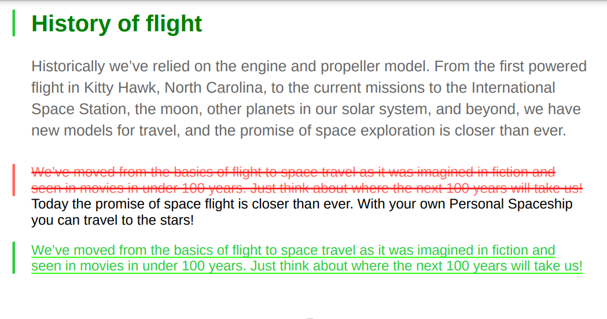

# Utilizzare gli stili delle barre di modifica personalizzati

Una barra delle modifiche è una linea verticale che identifica visivamente il contenuto nuovo o rivisto. Le guide AEM consentono di visualizzare una barra delle modifiche a sinistra del contenuto modificato all&#39;interno di argomenti e anche gli argomenti modificati nel sommario dell&#39;output PDF.

Per ulteriori dettagli sulla visualizzazione della barra delle modifiche, vedere *Crea PDF con barra di modifica tra le versioni pubblicate* impostazione in [Pubblica output PDF](../web-editor/native-pdf-web-editor.md).

## Contenuto modificato negli argomenti

La barra delle modifiche viene visualizzata a sinistra del contenuto negli argomenti inseriti, modificati o eliminati.

È possibile modificare i seguenti stili per visualizzare il contenuto modificato e tra con le barre di modifica.


>[!NOTE]
>
>Questi stili fanno parte di `layout.css` e modificarli in base alle esigenze.

Ad esempio, puoi utilizzare l’attributo color nel `.inserted-block` stile per definire la modalità di visualizzazione del contenuto inserito nell’output PDF pubblicato.


```css
...
.inserted-block { 
  color: #2ECC40; 
  display: inline; 
  -ro-comment-content: " "; 
  -ro-comment-style: underline; 
  -ro-comment-title: "Inserted"; 
  -ro-comment-date: attr(data-time); 
  -ro-comment-dateformat: "yyyy/dd/MM HH:mm:ss"; 
} 
...
```

Allo stesso modo, è possibile utilizzare `.deleted-block` stile per definire la modalità di visualizzazione del contenuto eliminato nell’output PDF pubblicato.

```css
...
.deleted-block { 
  display: inline; 
  color: #FF6961; 
  text-decoration: line-through; 
  -ro-comment-content: " "; 
  -ro-comment-style: strikeout; 
  -ro-comment-title: "Deleted"; 
  -ro-comment-date: attr(data-time); 
  -ro-comment-dateformat: "yyyy/dd/MM HH:mm:ss"; 
} 
...
```

È possibile utilizzare `.inserted-change-bar` e `.deleted-change-bar` stile per modificare l&#39;aspetto delle barre di modifica visualizzate a sinistra del contenuto aggiornato.

Ad esempio, puoi utilizzare `-ro-change-bar-color` attributo in `.inserted-change-bar` stile per visualizzare la barra delle modifiche inserita in verde. Puoi anche utilizzare `-ro-change-bar-color` attributo in `.deleted-change-bar` stile per visualizzare la barra delle modifiche eliminata in rosso.

```css
...
.inserted-change-bar { 
  -ro-change-bar-color: #2ECC40; 
} 

.deleted-change-bar { 
  -ro-change-bar-color: #FF6961; 
  } 
...
```



## Argomento modificato nel sommario

È inoltre possibile aggiungere una barra di modifica a sinistra degli argomenti modificati nel sommario dell&#39;output di PDF. È possibile utilizzare `-ro-change-bar-color` attributo in `.changed-topic` stile per aggiungere una barra di modifica con il colore desiderato per gli argomenti aggiornati nell&#39;elenco sommario.

Ad esempio, è possibile aggiungere una barra di modifica di colore verde.

```css
...
.changed-topic { 
 -ro-change-bar-color: #2ECC40; 
}  
...
```


Questa mostra una barra di modifica verde rispetto a tutti gli argomenti nel sommario in cui sono stati eseguiti alcuni aggiornamenti. Puoi fare clic sull’argomento modificato nel sommario e visualizzare le modifiche dettagliate.


