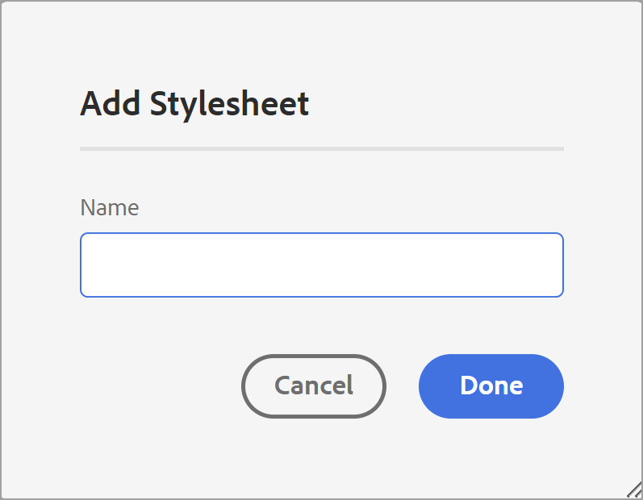
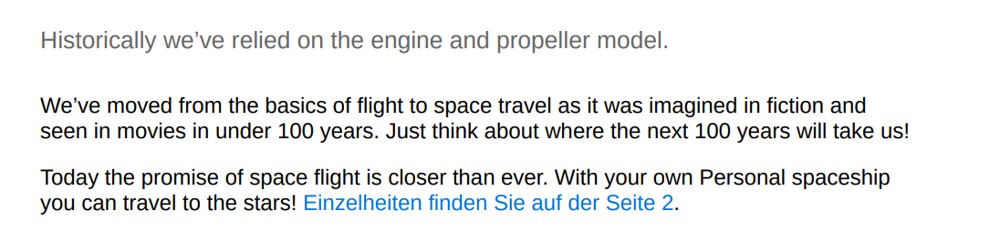

# Componenti di un modello di PDF {#components-pdf-template}

Un modello di PDF include quattro componenti: Layout di pagina, Fogli di stile, Risorse e Impostazioni. Potete creare un modello personalizzando questi singoli componenti e associando il modello a un predefinito di output durante la generazione di un output PDF. Le sezioni seguenti descrivono in dettaglio questi componenti e il loro processo di personalizzazione.

## Creare e personalizzare layout di pagina {#create-customize-page-layout}

Le impostazioni del componente Layout di pagina consentono di progettare la struttura di una pagina definendo l’intestazione, il piè di pagina e l’area del contenuto di una pagina. Utilizzando l&#39;editor di layout di pagina WYSIWYG, è possibile creare un layout di pagina per diverse sezioni di un PDF, ad esempio frontespizio e retro, capitolo, tabella
Sommario (sommario), indice, pagina vuota, pagine di primo piano, pagine di secondo piano, elenco di figure (LOF), elenco di tabelle (LOT), glossario o creazione di un layout per una pagina personalizzata. In Impostazioni modello PDF, puoi assegnare un layout di pagina con diverse sezioni all’interno di un PDF, che vengono quindi utilizzate per generare l’output del PDF.

### Crea un nuovo layout di pagina {#create-page-layout}

>[!NOTE]
>
>Sono disponibili layout di pagina di esempio preconfigurati. Puoi personalizzarli o creare nuovi layout di pagina.

1. Nell&#39;editor Web passare alla scheda **Output**.
1. Espandere la barra laterale a sinistra e fare clic su **Modelli**.
1. Aprire il modello che si desidera utilizzare.

   >[!NOTE]
   >
   >Per aprire un modello, fai doppio clic sul nome o sull’icona > accanto al nome.

1. Per creare un nuovo layout di pagina, effettuare una delle seguenti operazioni:

   * Passa il puntatore del mouse su **Layout di pagina** e fai clic sull&#39;icona (*Opzioni*) **...** e scegli **Nuovo layout di pagina**.

   * Nel pannello **Modelli**, fai clic sull&#39;icona **+** accanto a **Modelli** e scegli **Layout di pagina** dal menu di scelta rapida.

     Verrà aperta la finestra di dialogo **Aggiungi layout**.

     

1. Specificare un nome per il nuovo layout di pagina.
   >[!NOTE]
   >
   >Evita di usare caratteri speciali per la denominazione del layout di una pagina. Uno spazio nel nome è sostituito da un carattere di sottolineatura &quot;_&quot;.

1. Fai clic su **Fine**.

   Il nuovo layout viene creato e aggiunto in Layout di pagina.

### Duplicare un layout di pagina {#duplicate-page-layout}

1. Nella sezione **Modelli** del modello che si desidera duplicare, fare doppio clic su **Layout di pagina** oppure fare clic sull&#39;icona **>** prima di **Layout di pagina**.

   Viene visualizzato l&#39;elenco dei layout di pagina all&#39;interno del modello.

1. Passa il puntatore del mouse sul layout di pagina da duplicare e fai clic sull&#39;icona (*Opzioni*) **...** e seleziona **Duplica** dal menu di scelta rapida.

1. Nella finestra di dialogo _Layout duplicato_, immetti un nome per il layout della pagina.

1. Fai clic su **Fine**.
Una copia del layout di pagina selezionato viene creata e aggiunta in Layout di pagina.

### Personalizzare il layout di una pagina {#customize-page-layout}

1. Nella sezione **Modelli** del modello che si desidera modificare fare doppio clic su **Layout di pagina** oppure fare clic sull&#39;icona **>** prima di **Layout di pagina**.

   Viene visualizzato l&#39;elenco dei layout di pagina all&#39;interno del modello.
1. Per personalizzare un layout di pagina, effettuare una delle seguenti operazioni:
   * Fare doppio clic su un layout di pagina.
   * Passa il puntatore del mouse su un layout di pagina qualsiasi e fai clic sull&#39;icona (*Opzioni*) **...** e seleziona **Modifica** dal menu di scelta rapida.

   Verrà aperto l’editor layout pagina per la personalizzazione.
1. Dopo aver apportato le modifiche desiderate, fare clic su *Salva tutto* (o `Crl+S`).

   Per ulteriori informazioni sulla definizione dei singoli elementi di layout, quali intestazione, piè di pagina, numero di pagina, titolo e altro ancora, vedere [Progettazione di un layout di pagina](design-page-layout.md).

## Utilizzare i fogli di stile per personalizzare PDF {#stylesheet-customization}

Le impostazioni nel componente Stylesheets consentono di applicare uno stile ai componenti di layout di pagina e al contenuto DITA utilizzando l’editor WYSIWYG o di lavorare direttamente con il file CSS. È possibile creare stili personalizzati o personalizzare le proprietà di stile predefinite. L&#39;editor WYSIWYG consente di accedere alla maggior parte delle proprietà necessarie per applicare lo stile al layout di pagina o al contenuto DITA. Per le personalizzazioni avanzate, puoi lavorare direttamente nella vista Source.

### Crea un nuovo foglio di stile {#create-stylesheet}

Anche se i file CSS sono forniti per contenuto e layout, è possibile creare un nuovo foglio di stile per applicare più personalizzazioni a un tipo di stile specifico che possono quindi essere applicate a un componente di destinazione. Per impostazione predefinita, i file CSS di esempio sono raggruppati all’interno del prodotto. Questi file CSS hanno lo scopo di aiutare a organizzare le informazioni sullo stile tra il contenuto e i layout. Puoi scegliere di unire questi stili in un singolo file CSS o in più file.

Per impostazione predefinita, ogni volta che si crea un nuovo layout di pagina, il file `layout.css` viene incluso nel nuovo layout di pagina. Se desideri che il layout di pagina contenga stili di un file CSS diverso, puoi semplicemente trascinare il file CSS desiderato nell’area di modifica del contenuto del nuovo layout di pagina. Per verificare se il file CSS è stato incorporato nel layout di pagina, passare alla visualizzazione Source e si troverà un collegamento al file CSS nell&#39;elemento `<head>`.

Per creare un foglio di stile, effettuare le seguenti operazioni:
1. Nel pannello **Modelli** eseguire una delle operazioni seguenti:
   * Passa il puntatore del mouse sulla scheda **Fogli di stile** e fai clic sull&#39;icona (*Opzioni*) **...** e scegli **Nuovo foglio di stile**.
   * Fai clic sull&#39;icona **+** accanto a **Modelli** e scegli **Foglio di stile** dal menu di scelta rapida.

   Verrà visualizzata la finestra di dialogo Aggiungi foglio di stile.

   
1. Specificare un nome per il nuovo foglio di stile.
1. Fai clic su **Fine**.

   Nella sezione Fogli di stile viene creato e aggiunto un nuovo foglio di stile.

### Crea un nuovo stile {#create-style}

Per impostazione predefinita, i file CSS forniti con il modello contengono stili per intestazione, paragrafo, carattere, collegamento ipertestuale, immagine, tabella, div, pagina e altri stili. Potete sovrascrivere il formato di stile predefinito o creare un nuovo stile.

È possibile creare un nuovo stile da utilizzare nel layout di pagina del modello o applicare uno stile personalizzato per qualsiasi elemento DITA. Per applicare questi stili personalizzati all&#39;elemento DITA, è necessario assicurarsi che il nome della classe dello stile sia uguale al nome dell&#39;elemento DITA o all&#39;attributo `outputclass`.  Ad esempio, `
` in DITA è gestito da `.div {}` in CSS o dal relativo attributo `outputclass`. Se applichi `
` in DITA, sarà governato da `.div {}` o `.my-div {}` nel CSS.

Per creare un nuovo stile, effettuare le seguenti operazioni:
1. Espandere la barra laterale sinistra e fare doppio clic sul modello in cui si desidera creare lo stile.
1. Espandere la sezione **Fogli di stile**. Apre il pannello **Stili** che contiene tutte le opzioni di stile.
1. Seleziona l’icona + per aggiungere un nuovo stile.

   Viene visualizzata la finestra di dialogo **Aggiungi stile**.

   

1. Specificare un nome **Classe**. Per applicare uno stile all&#39;elemento DITA, verificare che il nome della classe dello stile corrisponda al nome dell&#39;elemento DITA o all&#39;attributo `outputclass`.
1. Nel campo **Tag** (facoltativo), scegli un tag per il quale vuoi creare un nuovo stile.

1. Selezionare una **pseudo classe** per assegnare uno stile a un elemento. Una pseudoclasse consente di definire uno stato speciale dell’elemento. Ad esempio, utilizza la pseudoclasse per assegnare uno stile a un elemento quando passi il cursore del mouse su di esso o quando lo sposti su di esso. È inoltre possibile selezionare più pseudo-classi. È ad esempio possibile utilizzare la pseudo classe `a::visited {color: blue;}` per assegnare uno stile ai collegamenti visitati.

1. Aggiungi il selettore per il nuovo stile. Il campo **Selettore** consente di aggiungere selettori personalizzati oltre alla combinazione di classi, tag e pseudo classi. Ad esempio, è possibile creare lo stile `table a.link` per tutti i collegamenti ipertestuali all&#39;interno di una tabella.

   Per ulteriori informazioni sui tag CSS, visualizzare [Fare riferimento alla grammatica dello stile CSS](https://www.w3.org/TR/CSS21/syndata.html#characters).

1. Fai clic su **Fine**.

   Viene creato un nuovo stile che viene aggiunto all&#39;elenco degli stili.

### Personalizzare uno stile predefinito o nuovo {#customize-style}

Dopo aver creato un nuovo file CSS con stili predefiniti o desideri personalizzare gli stili in un file CSS esistente, puoi utilizzare l’editor stili.

Per personalizzare uno stile, effettuare le seguenti operazioni:
1. Fare doppio clic su **Fogli di stile** o fare clic sull&#39;icona **>** prima di **Fogli di stile**.

   In questo modo vengono visualizzati i file CSS predefiniti (Contenuto e layout) e personalizzati.
1. Aprire un foglio di stile per la modifica.

   Per aprire il foglio di stile per la modifica, eseguire una delle operazioni seguenti:
   * Fare doppio clic sul nome del foglio di stile.
   * Passa il puntatore del mouse sul nome del foglio di stile, fai clic su (icona Opzioni) e scegli Modifica.

   Verrà aperto il foglio di stile per la modifica e verrà visualizzato l&#39;elenco degli stili nel pannello Stili.

   

1. Per personalizzare uno stile, selezionatelo per visualizzarlo e personalizzarlo utilizzando l&#39;editor stili.

### Proprietà degli stili

Nel pannello centrale puoi modificare le proprietà, ma potrebbe essere difficile ottenere un’istantanea di tutti i valori presenti.  Il riquadro **Proprietà** fornisce una visualizzazione rapida di tutti gli attributi e i valori dello stile.

Nel pannello centrale puoi modificare le proprietà comunemente utilizzate, ma non tutte le proprietà supportate dal CSS. Nel riquadro **Proprietà** è possibile modificare tutte le proprietà supportate dal CSS e visualizzarle in anteprima. Per modificare le proprietà non è necessario passare alla vista origine.

Ulteriori informazioni sull&#39;utilizzo dell&#39;editor di stili per [utilizzare gli stili di contenuto comuni](stylesheet.md).

## Utilizzare le risorse {#work-with-resources}

Questo è un contenitore per tutte le risorse utilizzate per progettare un modello. Può essere considerata come una cartella, che contiene risorse quali immagini di sfondo, font personalizzati, loghi e altro ancora. Ogni volta che aggiungi una risorsa nel modello, questa viene caricata o archiviata nella cartella delle risorse. Puoi quindi utilizzare queste risorse per personalizzare o progettare i modelli di PDF.

Per aggiungere un file di risorse alla cartella Risorse, effettua le seguenti operazioni:

1. Passa il puntatore del mouse sulla scheda della cartella Risorse e fai clic su (icona Opzioni) ... e scegli Importa.

   Viene visualizzata la finestra di dialogo Carica Assets.

   

   Il percorso in cui verrà caricato il file di risorse è indicato nel campo **Seleziona cartella risorse**.
   >[!NOTE]
   >
   >Non puoi modificare il percorso per caricare le risorse. Per impostazione predefinita, tutte le risorse sono archiviate nella cartella `/content/dam/dita-templates/pdf/<PDF-template-name>`.

1. Fai clic su **Scegli file** per sfogliare il file di risorse dal computer locale

1. Fai clic su **Carica**.
Il file selezionato viene importato ed elencato nella cartella Risorse.

## Impostazioni avanzate di PDF {#advanced-pdf-settings}

Utilizza la sezione Impostazioni per configurare le impostazioni avanzate per il layout di pagina del PDF, avviando PDF da una pagina pari o dispari, i formati per i riferimenti incrociati e abilitando gli indicatori di stampa nel PDF finale generato
utilizzando il modello.

Per configurare, fai clic su **Impostazioni** nel pannello **Modelli** per visualizzare le seguenti opzioni:

### Generale

Impostate le impostazioni di configurazione di base per l&#39;avvio di un capitolo da una pagina pari o dispari, la struttura del sommario e definite il formato della linea guida per le voci del sommario. Puoi definire la seguente impostazione:

* **Inizia un nuovo capitolo da**: ti consente di definire la modalità di pubblicazione di ciascun capitolo nel PDF finale. Puoi scegliere tra **Nuova pagina**, **Pagina dispari**, **Pagina pari** o **Pagina corrente**. Se si sceglie di iniziare un nuovo capitolo da una pagina dispari, dopo un capitolo che termina in una pagina dispari viene inserita una pagina vuota. Ad esempio, se il capitolo termina alla pagina 15, il processo di pubblicazione inserirà una pagina vuota 16th in modo che il nuovo capitolo possa iniziare dalla pagina 17th.  Se si sceglie l&#39;opzione **Pagina corrente**, tutti i capitoli verranno pubblicati in continuazione senza interruzioni di pagina. Ad esempio, se un capitolo termina a metà della pagina 15, anche il capitolo successivo inizia dalla quindicesima pagina.

* **Inizia ogni argomento da una nuova pagina**: se desideri che ogni argomento del capitolo inizi da una nuova pagina, seleziona **Avvia ogni argomento da una nuova pagina**. Se vuoi mantenere i tuoi argomenti in continuazione senza spazi vuoti di pagina, deseleziona questa opzione.

* **Struttura sommario**: consente di personalizzare la gerarchia del sommario. Vengono utilizzate le seguenti impostazioni aggiuntive:

   * **Utilizza intestazioni fino al livello**: ti consente di regolare il numero di livelli di intestazione da visualizzare nella struttura sommario del PDF.
   * **Non mostrare il numero di pagina per il primo livello nel sommario**: selezionare questa opzione per nascondere i numeri di pagina corrispondenti per tutti i capitoli che contengono argomenti nidificati o secondari. Considera l’esempio seguente in cui viene creato un output senza selezionare questa opzione.

  

  Nell&#39;esempio precedente, Impostazioni PDF avanzate, Appendice e Legale sono i titoli degli argomenti o dei capitoli di primo livello. A tutti questi titoli viene assegnato un numero di pagina.

  Ora, se selezioni questa opzione e generi l’output, otterrai il seguente sommario:

  

  In questa sezione è possibile notare che al primo capitolo Impostazioni avanzate di PDF non viene assegnato alcun numero di pagina, in quanto contiene argomenti nidificati o secondari. mentre un numero di pagina viene assegnato ad Appendice e Legale perché si tratta di argomenti autonomi senza argomenti secondari.

* **Non mostrare il numero del capitolo nel sommario**: selezionare questa opzione per visualizzare i nomi dei capitoli senza i numeri dei capitoli nel sommario.   Per impostazione predefinita, i numeri dei capitoli vengono visualizzati nel sommario dell’output PDF.
* **Formato linea guida**: utilizzare il menu a discesa per selezionare linee guida con punti, solide o spaziate per collegare i livelli di intestazione ai numeri di pagina corrispondenti.
Per applicare la struttura del sommario e i livelli di intestazione degli stili, vedere [Aggiungere un sommario capitolo](design-page-layout.md#add-chapter-toc).

  >[!NOTE]
  >
  >Se sei uno sviluppatore CSS, puoi definire il formato guida direttamente anche nel file CSS.

* **Usa marcatore di continuazione tabella**: selezionare questa opzione per definire marcatori per tabelle lunghe distribuite su più pagine.
Potete definire il testo da visualizzare prima e dopo l&#39;interruzione. Ad esempio, una tabella si interrompe a pagina 5 e si definisce `<Continued on page %page-num%>` per **Testo prima dell&#39;interruzione**.  Nella parte inferiore della pagina 5 viene visualizzato &quot;Continua a pagina 6&quot;.

  Utilizza le variabili di lingua per definire il testo del marcatore di continuazione prima e dopo l’interruzione. A seconda della lingua scelta, il valore localizzato viene selezionato automaticamente nell’output di PDF. È ad esempio possibile pubblicare `Continued on page %page-num%` come testo in inglese e `Fortsetzung auf Seite %page-num%` in tedesco.

  Passa il cursore sopra  vicino all&#39;opzione per visualizzare ulteriori dettagli su di essa.
* **Collegare i termini del glossario alla pagina del glossario**: selezionare questa opzione per visualizzare i termini del glossario come collegamenti ipertestuali nel contenuto e collegarli ai termini nella pagina del glossario. Ciò consente ai lettori di visualizzare rapidamente la definizione di un termine definito nel glossario.

  Per convertire i termini del glossario in collegamenti ipertestuali, è necessario:
   * Abilitare **Glossario** nella scheda **Ordine di layout pagina** per una mappa DITA.
   * Aggiungere il glossario nelle pagine del retro di una mappa del libro.

  Se non si abilita la pagina Glossario, i termini Glossario nel contenuto non vengono convertiti in collegamenti ipertestuali nell’output PDF.
  <!--For more information on using table continuation markers, see Use table continuation markers.-->

### Layout di pagina {#page-layouts}

Le impostazioni Layout di pagina consentono di specificare il layout di pagina da utilizzare per una sezione specifica del documento. Ad esempio, per selezionare un layout per il sommario, fai clic sul menu a discesa sotto il campo TOC e seleziona il layout progettato per generare il sommario.

È importante notare che le impostazioni della mappa segnalibro hanno la precedenza sulle impostazioni del layout di pagina.

Le seguenti impostazioni sono disponibili nella sezione Layout di pagina:

**Layout di pagina predefinito**: seleziona un layout di pagina che funga da layout predefinito per tutte le pagine del tuo PDF. Questo è il layout di pagina di base applicato alle sezioni o agli argomenti in cui non è stato creato un layout di pagina dedicato.

**Layout di pagina per diverse sezioni**: è possibile mappare un layout di pagina con le seguenti sezioni dell&#39;output di PDF. Se è stato progettato un layout di pagina per la sezione correlata, selezionarlo dall&#39;elenco a discesa. Se non è stato creato alcun layout di pagina per una sezione specifica, viene applicato il layout di pagina predefinito.

* **Capitoli e argomenti**: è possibile specificare il layout di pagina per il capitolo e gli argomenti. Il layout selezionato verrà applicato a tutti i capitoli e gli argomenti.

* **SOMMARIO**: se hai progettato il layout di pagina del sommario, seleziona **SOMMARIO** nell&#39;elenco a discesa e tutte le pagine del sommario nel documento avranno il layout di pagina del sommario.

* **Elenco di figure ed Elenco di tabelle**: è inoltre possibile specificare il layout di pagina per figure e tabelle. Il layout selezionato verrà applicato a tutte le figure e tabelle.

* **Indice**: se hai progettato un layout di pagina Indice, eseguine il mapping all&#39;opzione Indice. Utilizzando i fogli di stile, è possibile applicare uno stile a diversi elementi di indice nell’output di PDF. Utilizzare gli stili dell&#39;indice `.idx-header`, `.idx-footer`, `.idx-body`, `.idx-title`, `.idx-keyword-group`, `.idx-unit`, `.idx-keyword`, `.idx-name`, `.idx-link` e `.idx-child` per personalizzare gli stili per gli elementi dell&#39;indice.

* **Glossario**: se si dispone di un layout di pagina Glossario, mapparlo all&#39;opzione Glossario.

  I termini nel glossario dell’output di PDF sono sempre ordinati in ordine alfabetico.

  È inoltre possibile aggiungere il tag `sort-as` per definire una chiave di ordinamento per i termini del glossario. Experience Manager Guides utilizza quindi il tasto di ordinamento per ordinare i termini del glossario al posto dei termini del glossario. Se la chiave di ordinamento non è stata definita, verranno utilizzati i termini del glossario per l&#39;ordinamento. Ad esempio, è possibile aggiungere il tag `sort-as` a `glossterm` e impostarne il valore su `A` per il termine &quot;USB&quot; (ad esempio, `<glossterm>USB<sort-as>A</sort-as></glossterm>`). Analogamente, è possibile aggiungere il tag `sort-as` e impostarne il valore su `B` per il termine &quot;Pen Drive&quot;. Quando si ordinano questi termini del glossario, la chiave di ordinamento `A` per il termine del glossario &quot;USB&quot; viene visualizzata prima della chiave di ordinamento `B` per il termine del glossario &quot;Pen Drive&quot;. Quindi, nell&#39;output PDF, &quot;USB&quot; viene prima di &quot;Pen Drive&quot; nella pagina del glossario.

  Utilizzando i fogli di stile, è possibile applicare uno stile a diversi elementi del glossario nell&#39;output di PDF. Utilizzare gli stili del glossario `.glo-header`, `.glo-footer`, `.glo-body`, `.glo-title`, `.glo-unit`, `.glo-link` e `.glo-term` per personalizzare gli stili degli elementi del glossario.

  Ulteriori informazioni sull&#39;utilizzo dell&#39;editor di stili per [utilizzare gli stili di contenuto comuni](stylesheet.md).

* **Pagine in primo piano e pagine in secondo piano**: questi layout di pagina definiscono lo stile delle pagine in primo piano o in secondo piano del libro. Se hai progettato il layout dell&#39;argomento principale, eseguine il mapping all&#39;opzione **Pagine argomento principale**. Quando si seleziona il layout dell&#39;argomento anteriore dal menu a discesa, il layout dell&#39;argomento anteriore viene applicato a tutti gli argomenti presenti nell&#39;argomento anteriore.

  Se hai progettato il layout dell&#39;argomento posteriore, mappalo all&#39;opzione **Pagine argomento posteriore**. Quando si seleziona il layout dell&#39;argomento posteriore dal menu a discesa, il layout dell&#39;argomento posteriore viene applicato a tutti gli argomenti presenti nell&#39;argomento posteriore.

  **Pagine in primo piano** viene utilizzato anche come layout di fallback per **TOC**, **Elenco di figure** ed Elenco di tabelle.  Analogamente, **Pagine argomento secondario** viene utilizzato anche come layout di fallback per i layout **Indice** e **Glossario**. Se non è stato selezionato il layout per queste pagine, viene applicato il layout Pagine prima o dietro.  Se non è stato selezionato il layout Pagine di primo livello o Pagine di secondo livello, verrà applicato il layout di pagina predefinito.

* **Layout di pagina per pagine vuote**:    È inoltre possibile specificare il layout di pagina per le pagine vuote. Il layout selezionato verrà applicato a tutte le pagine vuote. Ad esempio, se hai progettato un layout di pagina vuoto per tutte le pagine vuote, seleziona **Vuoto** nell&#39;elenco a discesa e tutte le pagine vuote nel documento avranno il layout di pagina vuoto.

* **Pagina di copertina e pagina posteriore**: se hai progettato un layout di copertina, mappalo all&#39;opzione **Pagina di copertina**. Allo stesso modo, se hai un layout di pagina posteriore, mappalo sull&#39;opzione **Pagina posteriore**. Se non è stato creato alcun layout di copertina o di pagina posteriore, viene applicato il layout di pagina predefinito.

Per ulteriori informazioni sui layout di pagina, vedere [Progettare un layout di pagina](design-page-layout.md).

### Ordine di layout pagina {#page-order}

Puoi mostrare o nascondere le seguenti sezioni nel PDF e anche disporre l’ordine in cui devono essere visualizzate nell’output PDF finale:

* Sommario
* Capitoli e argomenti
* Elenco delle figure
* Elenco delle tabelle
* Indice
* Glossario
* Citazione

  

  Se non desideri visualizzare una particolare sezione nell’output PDF, puoi nasconderla disattivando l’interruttore.

  Puoi anche definire l’ordine in cui queste diverse sezioni vengono generate nel PDF. Per modificare l&#39;ordine predefinito di queste sezioni, selezionare le barre punteggiate per trascinare le sezioni nella posizione desiderata.

  >[!NOTE]
  >
  > Le impostazioni relative all&#39;ordine e all&#39;inclusione si applicano solo a una mappa DITA. Per una mappa segnalibro, queste impostazioni non sono applicabili. Le pagine di una mappa di un libro vengono visualizzate in base all&#39;ordine delle sezioni nella mappa di un libro.

.
Il layout **Capitolo e argomenti** è sempre abilitato per impostazione predefinita. Non è possibile attivare/disattivare.

**Unisci pagine**

Per impostazione predefinita, tutte le sezioni iniziano su una nuova pagina. Seleziona l&#39;opzione **Pagina precedente** o **Pagina successiva** dal menu a discesa **Unisci con** per unire una sezione a una pagina precedente o successiva. La sezione viene pubblicata con la pagina selezionata nell’output di PDF. In questo modo, non ci sarà alcuna interruzione di pagina tra le due.

>[!NOTE]
>
> Questa impostazione si applica solo alla sezione e non ai relativi componenti.  Ad esempio, se selezioni l&#39;opzione **Pagina precedente** per **Capitoli e argomenti**, la sezione **Capitoli e argomenti** si unisce alla pagina precedente. I vari capitoli e argomenti vengono pubblicati in base alle impostazioni **Generali**.Ad esempio, se in **Inizia un nuovo capitolo dall&#39;impostazione**, si seleziona **Pagina dispari**, viene inserita una pagina vuota dopo un capitolo che termina in una pagina dispari.

Quando si unisce una sezione alla pagina precedente o successiva, il contenuto viene unito e viene applicato lo stile della sezione di destinazione in cui viene unito il contenuto.

Ad esempio, se abiliti **TOC** e **Chapter &amp; Topics** e selezioni **Next Page** per **TOC**, **TOC** si unisce alla sezione successiva, ovvero **Chapter &amp; Topics**. Lo stile della sezione **Capitolo e argomenti** viene applicato al contenuto unito di entrambe le sezioni.

L&#39;opzione di unione funziona in successione, quindi se hai selezionato **Pagina successiva** per più sezioni continue, vengono tutte unite alla prima sezione (nella direzione successiva), per la quale non è impostata questa proprietà. Ad esempio, puoi abilitare **TOC**, **Chapter &amp; Topics**, **List of Figures** e **Index**. Quindi, se imposti **Pagina successiva** per **TOC**, **Capitolo e argomenti**, **Elenco di figure** e **Nessuno** per **Indice**, verranno uniti tutti con **Indice**.

**Pagine statiche**

I vari layout di pagina consentono di progettare l’output delle varie sezioni. Queste sezioni vengono generate dalla mappa DITA durante la pubblicazione dell&#39;output.
Puoi anche creare layout di pagina personalizzati e pubblicarli come pagine statiche nell’output di PDF. Questo consente di aggiungere qualsiasi contenuto statico come note o pagine vuote.

Per aggiungere un layout di pagina personalizzato, effettua le seguenti operazioni:

1. Seleziona **Aggiungi**  per aggiungere un nuovo layout di pagina. Viene visualizzato il pannello Aggiungi layout di pagina.
2. Selezionare il layout di pagina dall&#39;elenco e fare clic su Aggiungi. Il nuovo layout di pagina viene aggiunto all&#39;elenco dei layout di pagina.

È inoltre possibile eseguire le azioni seguenti:

* Selezionare le barre punteggiate per trascinare e rilasciare il layout di pagina nella posizione desiderata.

* Selezionare **Rimuovi layout**  per rimuovere un layout.

* È inoltre possibile unire una pagina statica alla pagina precedente o a quella successiva.

* Puoi anche aggiungere più volte un layout personalizzato e ordinarlo. Questo consente di pubblicare il contenuto statico di conseguenza.

  È ad esempio possibile utilizzare un layout personalizzato per pubblicare più volte un avviso statico all&#39;interno dell&#39;output di PDF.

### Organizzazione pagina

Le pagine di un documento di PDF vengono in genere pubblicate in base al contenuto organizzato nel file mappa o mappa segnalibro DITA. Tuttavia, è anche possibile modificare l’ordine delle pagine nel documento di PDF. È ad esempio possibile stampare un documento multipagina come opuscolo. Quando si fascicolano, piegano e graffiano i fogli, il risultato è un singolo libro con l&#39;ordine di pagina corretto.  Potete quindi leggere il libretto pubblicato come un libro.

Nella sezione **Organizzazione pagina** sono disponibili le impostazioni seguenti:

#### Ordine delle pagine

Selezionare un ordine di pagina che determini la sequenza delle pagine nel documento PDF. Puoi scegliere le seguenti opzioni dal menu a discesa:

* **Predefinito**: l&#39;ordine predefinito delle pagine in base al file di origine.
* **Prima le pagine dispari**: tutte le pagine dispari vengono spostate prima di tutte le pagine pari.
* **Prima le pagine pari**: tutte le pagine pari vengono spostate prima di tutte le pagine dispari.
* **Inverso**: l&#39;ordine delle pagine è invertito.
* **Opuscolo**: tutte le pagine sono ordinate come in un opuscolo.
* **Opuscolo da destra a sinistra**: tutte le pagine sono in ordine da destra a sinistra.
* **Personalizzato**: definisci un ordine di pagine personalizzato anziché predefinito.
   * &quot;a..b&quot; — tutte le pagine consecutive da a a b.
   * &quot;a,b,c&quot; — Ordine delle nuove pagine a, b, c.
   * &quot;a*b&quot; — La pagina a viene ripetuta b volte.
   * &quot;-a&quot; — I numeri di pagina negativi vengono conteggiati a ritroso a partire dall’ultima pagina e possono essere combinati con altri ordini personalizzati.
   * &quot;X&quot; — Tutte le pagine del documento. Come &quot;1..-1&quot;.

Ad esempio, puoi assegnare un ordine personalizzato come &quot;2,3,5*2,7..10,-1,-2.
L&#39;ordine di pagina specificato determina un PDF con i seguenti numeri di pagina del documento originale, supponendo che contenga un totale di 25 pagine: 2, 3, 5, 5, 7, 8, 9, 10, 25, 24.

#### Configura più di una pagina per foglio

Scegliere questa opzione per pubblicare più pagine su un singolo foglio.  Quindi, seleziona il numero di righe e colonne e pubblica le pagine come una griglia su un singolo foglio. Ad esempio, puoi pubblicare le pagine come una griglia di 2 righe e 4 colonne.

Definite le dimensioni del foglio di destinazione e l&#39;orientamento con cui desiderate pubblicare il foglio. È inoltre possibile specificare le proprietà del margine e della spaziatura interna del foglio.

### Stampa

Configurare le impostazioni di stampa per assegnare gli indicatori di stampa, selezionare i modelli di colore e specificare le proprietà relative alla stampa dell&#39;output PDF.

* **Indicatori di stampa**: quando si prepara un documento per la produzione di stampa, gli indicatori di stampa vengono aggiunti ai bordi della pagina per facilitare l&#39;allineamento, il ritaglio e la selezione dei colori durante la stampa. Selezionando un contrassegno della stampante, il limite della pagina viene esteso per contenere il contrassegno, che viene tagliato durante la stampa. È possibile scegliere di visualizzare i seguenti indicatori di stampa nell&#39;output di PDF:
   * **Indicatori di ritaglio**: selezionare l&#39;opzione per inserire un segno in ogni angolo dell&#39;area di ritaglio per indicare dove è necessario ritagliare la carta dopo la stampa.
   * **Indicatori di pagina al vivo**: selezionare questa opzione per inserire un segno in ogni angolo del riquadro di pagina al vivo per indicare l&#39;area di ritaglio per l&#39;immagine estesa.
   * **Indicatori di registrazione**: selezionare questa opzione per posizionare un segno all&#39;esterno dell&#39;area di ritaglio per allineare le diverse selezioni in un documento a colori.
   * **Barre colore**: selezionare questa opzione per aggiungere una striscia di colori al di fuori dell&#39;area di ritaglio per mantenere la coerenza dei colori e regolare la densità dell&#39;inchiostro durante la stampa.

  Impostare le dimensioni per gli indicatori di stampa selezionati utilizzando le opzioni **Larghezza linea**, **Colore linea** e **Larghezza scatola al vivo**.

* **Dimensioni Media Box**: dimensioni di pagina complessive, inclusa l&#39;area estesa occupata dagli indicatori di stampa. Utilizza l’opzione a discesa per selezionare le dimensioni della pagina per l’output PDF o per creare dimensioni personalizzate.

* **Spazio colore**: è possibile scegliere uno spazio colore RGB o CMYK per stampare il documento PDF. Scegliete RGB per visualizzare le PDF generate in digitale e CMYK per la stampa fisica. I colori definiti nel documento vengono convertiti nello spazio colore scelto.
  >[!NOTE]
  >
  >Se si utilizza lo spazio colore CMYK, è necessario un profilo colore ICC per la creazione di PDF/A.

  <!--For more information on applying these print settings, see *Printing preferences*.-->

### Rimandi {#cross-references}

Utilizza la scheda **Riferimenti incrociati** per definire la modalità di pubblicazione dei riferimenti incrociati nel PDF. È possibile formattare i riferimenti incrociati per il titolo dell&#39;argomento, tabelle, figure e altro ancora.

>[!NOTE]
>
> Se avete definito il testo di collegamento durante l&#39;inserimento del riferimento incrociato, questo avrà la precedenza sul formato del riferimento incrociato definito nel modello di PDF nativo.

È inoltre possibile utilizzare le variabili per definire un riferimento incrociato.  Quando utilizzi una variabile, il relativo valore viene selezionato dalle proprietà. È possibile utilizzare una singola variabile o una combinazione di variabili per definire un riferimento incrociato. Puoi anche utilizzare una combinazione di una stringa e una variabile.

Ad esempio, puoi utilizzare `View details on {chapter}`. Se il nome del capitolo è &quot;General settings&quot; (Impostazioni generali), il riferimento incrociato nell’output è &quot;See details on General settings&quot; (Vedi dettagli sulle impostazioni generali).

AEM Guides fornisce le seguenti variabili predefinite:

* {title}: crea un riferimento incrociato al titolo dell&#39;argomento. Ad esempio, consulta Collegamenti utili a pagina 2.
* {page} Aggiunge un riferimento incrociato ai numeri di pagina. Ad esempio, vedere a pagina 1.
* {description}: aggiunge un riferimento incrociato al testo della descrizione. Vedi ad esempio i dettagli di AEM Guides.
* {chapter}: aggiunge un riferimento incrociato ai numeri dei capitoli. Ad esempio, vedere il Capitolo 1.
* {bookmarkText}: crea un riferimento incrociato al testo contrassegnato con segnalibro. Ad esempio, vedere stop_words a pagina 5.
* {captionText}: crea un riferimento incrociato alla didascalia della figura o della tabella nell&#39;argomento. Ad esempio, consultate Flusso d&#39;aria a pagina 2.
* {figure}: aggiunge un riferimento incrociato al numero di figura. Seleziona il numero della figura dagli stili di numerazione automatica definiti per la didascalia della figura.  Ad esempio, è possibile utilizzare &quot;Vedere {figure} a pagina {page}&quot;. Il riferimento incrociato nell&#39;output contiene il numero di figura generato automaticamente e il relativo numero di pagina, &quot;Vedere la Figura 1 a pagina 5&quot;.
* {table}: aggiunge un riferimento incrociato al numero di tabella. Seleziona il numero di tabella dagli stili di numerazione automatica definiti per la didascalia. Ad esempio, è possibile utilizzare &quot;Vedere {table} a pagina {page}&quot;. Il riferimento incrociato nell&#39;output contiene il numero di tabella generato automaticamente e il relativo numero di pagina, &quot;Vedere Tabella 1 a pagina 5&quot;.

  >[!NOTE]
  >
  >È possibile creare stili di numerazione automatica per i tag didascalia e sottotitolo.

#### Formato riferimento incrociato predefinito

Se si lascia vuoto il campo di testo e non è stato definito il testo di collegamento durante l&#39;inserimento di un riferimento incrociato, Experience Manager Guides aggiunge le seguenti variabili per i rispettivi riferimenti incrociati:

* **Titolo**: `{title}`
* **Descrizione**: `{description}`
* **Paragrafo**: `{bookmarkText}`
* **Segnalibro**: `{bookmarkText}`
* **Figura**: `{captionText}`
* **Tabella**: `{captionText}`

L&#39;ordine di precedenza per i riferimenti incrociati è il seguente:
* Testo di collegamento aggiunto nei rimandi
* Formato del riferimento incrociato definito nel modello di PDF nativo
* Formato riferimento incrociato predefinito

#### Variabili di lingua nei riferimenti incrociati

È inoltre possibile utilizzare le variabili di lingua per definire i riferimenti incrociati localizzati. A seconda della lingua scelta, il valore localizzato viene selezionato automaticamente nell’output di PDF.

Ad esempio, puoi aggiungere una variabile di lingua &quot;reference-label&quot; e definire i valori in inglese e tedesco.

* Inglese - &quot;Visualizza a pagina {page}&quot;
* Tedesco - &quot;Einzelheiten finden Sie auf der Seite {page}&quot;

Quando si aggiunge `${lng:<variable name>}` alla sezione Paragrafo, i rimandi nei paragrafi dell&#39;output contengono il testo localizzato e il numero di pagina.\
Ad esempio, le schermate seguenti mostrano i riferimenti incrociati &quot;Visualizza a pagina 1&quot; in inglese e &quot;Einzelheiten finden Sie auf der Seite 1&quot; in tedesco.

*Riferimento incrociato all&#39;interno di un paragrafo quando pubblicato in lingua inglese.*

*Riferimento incrociato all&#39;interno di un paragrafo quando pubblicato in lingua tedesca.*

<!--For more information, see *Format cross-references*.-->
