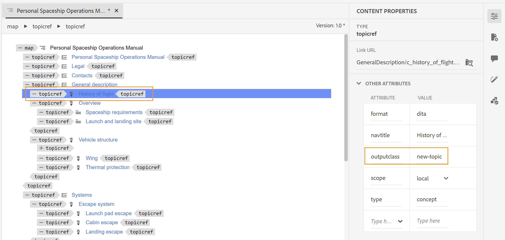

# Applicare uno stile personalizzato alle voci del sommario e al contenuto dell’argomento

Talvolta, potrebbe essere utile applicare uno stile personalizzato alle voci del sommario o a un particolare argomento. Ciò può essere ottenuto associando un `outputclass` attributo con `<topicref>` nella mappa DITA. Inoltre, nel caso in cui desideri applicare un formato personalizzato a un intero argomento, ciò può essere ottenuto anche estendendo la definizione di stile dell’attributo nel CSS.

Prendiamo ad esempio un nuovo argomento che si desidera inviare per la revisione. Per identificare facilmente l&#39;argomento aggiornato, è necessario aggiungere una `outputclass` attribuire a `<topicref>` nella mappa DITA e quindi definire uno stile personalizzato per lo stesso elemento nel CSS.

Nell&#39;esempio seguente, il *Cronologia dei voli* all&#39;argomento è stato assegnato un `outputclass` attributo con il valore di `new-topic`.



La definizione di classe del `new-topic` in un CSS può consentire di definire lo stile per i seguenti elementi:
* Voce principale nel sommario o mini-sommario
* Titolo dell’argomento nel contenuto principale
* L&#39;intero contenuto dell&#39;argomento, incluso il titolo

Vediamo come ciascuno di questi scenari può essere definito nel CSS. Nella seguente definizione CSS di `new-topic` è stato modificato il colore del testo.

```css
…
.new-topic {
  color: #CC5309
}
…
```

Questa definizione controlla il colore del testo nel sommario e il titolo dell&#39;argomento. Nell&#39;output PDF riportato di seguito viene illustrato il diverso colore applicato alla voce del sommario:


Anche il titolo dell&#39;argomento viene formattato con lo stesso colore.


Se si desidera che la voce del sommario e il titolo dell&#39;argomento abbiano stili diversi, è possibile definirli separatamente come illustrato di seguito:

```css
...
/*for styling TOC entry */
.new-topic {
  color: #CC3509
}

/* for styling topic's title */
.new-topic.title {
  color: #092ACC
}
...
```

Infine, puoi anche applicare stili all’intero contenuto all’interno dell’argomento. Per questo, devi aggiungere un suffisso &quot;`-content`&quot; al nome della classe. Nell&#39;esempio seguente è stata aggiunta una barra di modifica all&#39;intero contenuto dell&#39;argomento:

```css
...
/* for styling the topic's content */
.new-topic-content {
  -ro-change-bar-color: #A609CC;
}
...
```

Utilizzando gli attributi di stile di cui sopra, viene aggiunta una barra di modifica a sinistra del *Cronologia del volo* come mostrato di seguito:


