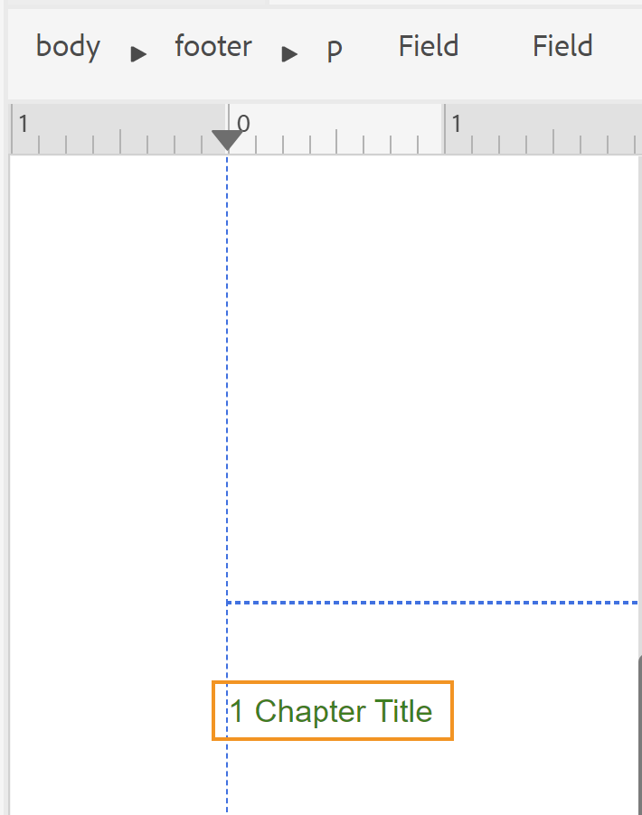

# Progettare un layout di pagina {#design-page-layout}

Durante la creazione di un documento PDF, sono disponibili sezioni diverse per la presentazione di diversi tipi di informazioni. Un documento PDF, ad esempio, inizia da una pagina iniziale o di copertina contenente il logo, il titolo o le informazioni sulla versione dell&#39;azienda. Ci sarebbero poi capitoli, appendici o pagine del glossario. Ogni sezione di un documento PDF ha un aspetto diverso e ciò si ottiene creando e personalizzando il layout di pagina.

Quando si progetta il layout di pagina, è possibile definire i vari elementi che compongono la pagina. Ad esempio, è possibile definire le dimensioni della pagina, i margini, l&#39;intestazione e il piè di pagina, l&#39;orientamento e altre specifiche di pagina in una pagina. La funzione di pubblicazione PDF nativa consente di progettare la pagina in base al [Standard per contenuti multimediali pagina](https://www.w3.org/TR/css-page-3/). La maggior parte delle impostazioni coperte dagli standard per file multimediali di paging possono essere facilmente personalizzate utilizzando l’interfaccia utente della funzione di pubblicazione di PDF nativi. Per altre formattazioni avanzate, puoi utilizzare la vista Origine per scrivere il codice CSS desiderato.

Dopo aver progettato i layout di pagina, è necessario associarli alle rispettive sezioni nelle impostazioni Layout pagina PDF. Consulta la [Creare e personalizzare layout di pagina](components-pdf-template.md#create-customize-page-layout) per informazioni dettagliate su come creare e aprire un layout di pagina per la personalizzazione.

## Tipi di layout di pagina {#types-of-page-layout}

Un documento PDF contiene in genere le sezioni seguenti:

* Copertina
* Sommario
* Incremento delle cifre
* Alzata delle tabelle
* Pagine di capitoli o argomenti
* Glossario
* Indice
* Retro

Per queste sezioni è necessario un layout di pagina corrispondente per presentare le informazioni in un formato specifico. Inoltre, è anche possibile avere una pagina vuota utilizzata come riempitivo per iniziare un nuovo capitolo da una pagina pari o dispari. In tal caso, è possibile utilizzare il layout di pagina predefinito o creare un layout di pagina per una pagina vuota. Consulta [Crea un nuovo layout di pagina](components-pdf-template.md#create-page-layout) per ulteriori dettagli.

Le impostazioni Layout di pagina nella sezione **Modello>Impostazioni** consente di definire il layout di pagina da utilizzare per le diverse sezioni del PDF. Ogni layout di pagina può avere ulteriori varianti di pagina a destra, a sinistra o a prima pagina.

### Creare le varianti di layout della prima pagina, destra o sinistra {#page-layout-variants}

Diversi layout di pagina nel modello PDF possono essere ulteriormente personalizzati con diverse varianti di layout di pagina per la prima, la destra o la sinistra. È possibile progettare queste pagine in modo diverso utilizzando Progettazione layout di pagina.

>[!NOTE]
>
>Se si desidera disporre di un layout a pagina singola per una sezione del libro, non è necessario creare i layout di pagina Primo, Destro o Sinistro.

Quando create i layout di pagina, tenete presenti i seguenti punti:

>[!NOTE]
>
>Di seguito sono riportati alcuni esempi di layout della pagina Capitolo. Tuttavia, questi punti sono validi anche per altri layout di pagina.

* Se desideri utilizzare un layout di pagina singolo per tutte le pagine di un capitolo, puoi creare un solo layout di pagina del capitolo senza alcuna variante.

* Se si desidera avere un aspetto diverso per la prima pagina dei capitoli del libro, è necessario creare una variante di layout Prima pagina per i capitoli.

* Se desideri avere un aspetto diverso per ogni pagina sinistra e destra del libro, devi creare le varianti sinistra e destra per il layout della pagina del capitolo.

* Se si desidera che i capitoli inizino da una pagina pari o dispari, è possibile scegliere di creare un layout di pagina per la pagina vuota. Questo layout di pagina viene utilizzato per colmare il vuoto tra due capitoli in modo che il capitolo inizi dalla pagina pari o dispari desiderata.

  >[!NOTE]
  >
  >Se non si crea un layout di pagina vuoto separato, viene utilizzato il layout di pagina predefinito. Per creare un layout di pagina, consulta [Crea un nuovo layout di pagina](components-pdf-template.md#create-page-layout).

L’esempio seguente illustra il processo di creazione delle varianti di un layout di pagina:

1. Crea un layout di pagina &quot;Capitolo&quot; seguendo la procedura descritta in &quot;Crea un nuovo layout di pagina&quot;.

   Un layout di pagina Capitolo vuoto viene creato e aggiunto sotto Layout di pagina.

   Per impostazione predefinita, quando si crea un layout di pagina, questo viene aperto anche per la modifica. La schermata seguente mostra un layout di pagina vuoto (predefinito):

   

   L&#39;intestazione, il piè di pagina e l&#39;area del contenuto di un modello vengono creati per impostazione predefinita. Puoi personalizzare facilmente queste aree utilizzando le proprietà della pagina, del contenuto e vari strumenti (come l’inserimento di immagini, campi e altro) forniti nell’interfaccia utente.

   >[!NOTE]
   >
   >Per la configurazione avanzata, puoi utilizzare la vista Origine e aggiungere il codice HTML e CSS personalizzato.

1. Passa il puntatore del mouse sopra **Capitolo** e fare clic su **Opzioni** per visualizzare il menu di scelta rapida.

1. Fare clic o passare il mouse sopra **Aggiungi variante layout** e scegliere il layout di pagina desiderato (Primo, Sinistra o Destra).

Il layout di pagina selezionato viene creato utilizzando una copia del layout Capitolo di base. Ciò significa che se hai apportato modifiche al layout di pagina del capitolo predefinito, le stesse modifiche vengono replicate nel layout di pagina della variante al momento della creazione del layout di pagina.

## Utilizzare le proprietà di pagina di un layout di pagina {#page-props-page-layout}

Durante la progettazione di un layout di pagina, è essenziale avere il controllo su varie proprietà di pagina. La funzione Pubblicazione nativa di PDF racchiude tutte le proprietà principali della pagina nel pannello Proprietà pagina. Il pannello Proprietà pagina consente di accedere a varie proprietà nelle sezioni seguenti:

>[!NOTE]
>
>Il pannello Proprietà pagina racchiude le proprietà e segue le regole definite in [Standard per contenuti multimediali pagina](https://www.w3.org/TR/css-page-3/).

* **Dimensioni pagina** : specifica le dimensioni di pagina da utilizzare per il layout di pagina. L’elenco a discesa Dimensioni pagina consente di scegliere tra più di 15 dimensioni di pagina. Puoi anche creare un layout di pagina utilizzando dimensioni di pagina personalizzate, vedi [Impostare le dimensioni della pagina](#set-page-size) per ulteriori dettagli.

* **Orientamento** : specifica l’orientamento della pagina da utilizzare per il layout di pagina. È possibile scegliere tra gli orientamenti della pagina Verticale o Orizzontale. È possibile scegliere di applicare orientamenti diversi a diverse varianti di pagina in un layout di pagina. Ad esempio, se il contenuto contiene una tabella di grandi dimensioni o un&#39;immagine di grandi dimensioni, è possibile creare un layout di pagina orizzontale e applicarlo alla tabella o all&#39;immagine più ampia.

* **Rotazione vista** : specifica il lato o la direzione in cui viene rappresentato il lato superiore originale dopo la rotazione. È possibile scegliere tra 90, 90 o 180 gradi in senso antiorario. Questa funzione è molto utile quando si desidera utilizzare una combinazione di layout Verticale e Orizzontale nell&#39;output. È ad esempio possibile utilizzare il formato verticale come layout di pagina generico e impostare un layout di pagina orizzontale per il rendering di tabelle di grandi dimensioni. In tal caso, è possibile impostare la visualizzazione del contenuto della tabella in senso orario di 90 gradi. In questo modo la pagina verrà orientata in orizzontale e il contenuto verrà ruotato di 90 gradi per mantenere la continuità nella visualizzazione. Vedremo come questo viene ottenuto come esempio più avanti in questa sezione.

* **Numerazione pagine** : la numerazione delle pagine, per impostazione predefinita, è continua in un PDF. Ad esempio, un PDF di 100 pagine può avere numeri di pagina continui da 1 a 100. È inoltre possibile riavviare la numerazione da un numero specifico in tutte le diverse sezioni o nella prima occorrenza di una sezione.
   * **Riavvia da** : specifica il numero di pagina da cui inizierà la numerazione per questo layout di pagina. Ad esempio, è possibile impostare il numero di pagina da riavviare per ogni capitolo. In tal caso, è necessario impostare la proprietà restart from su 1 nella variante di layout Prima pagina del layout della pagina del capitolo. Per impostazione predefinita, la numerazione delle pagine continua dalla pagina precedente.

   * **Applica solo alla prima occorrenza**: puoi anche iniziare da un numero specifico solo per la prima occorrenza di una sezione. Ad esempio, è possibile iniziare solo il primo capitolo da 1 e continuare i numeri di pagina per gli altri capitoli.

* **Layout** : specifica i margini della pagina e la spaziatura per i lati superiore, inferiore, sinistro e destro. Nella figura seguente viene illustrato il rendering di margini, spaziatura interna e bordi attorno al contenuto. I margini nella parte superiore e inferiore di una pagina contengono l&#39;intestazione e il piè di pagina.

  

* **Sfondo** : include un’immagine o un colore come sfondo del layout di pagina. Per un&#39;immagine, potete specificare l&#39;altezza e la larghezza dell&#39;immagine insieme alle proprietà di ripetizione e posizione.

* **Nota a piè di pagina** : specifica le proprietà per visualizzare le note a piè di pagina nell’output. È possibile scegliere di specificare i margini e le proprietà di spaziatura insieme a uno stile di bordo.

### Impostare le dimensioni della pagina {#set-page-size}

La prima cosa da definire in un layout di pagina è la dimensione della pagina. In Proprietà pagina è possibile scegliere un layout di pagina con più di 15 dimensioni di pagina. Puoi anche creare una dimensione di pagina personalizzata eseguendo i seguenti passaggi:

1. Apri il layout di pagina richiesto per la modifica.

   >[!NOTE]
   >
   >Consulta [Personalizzare il layout di una pagina](components-pdf-template.md#customize-page-layout) sezione per aprire un layout di pagina per la personalizzazione o la modifica.

1. Nel pannello di destra, fai clic su **Proprietà pagina**.
1. In **Dimensioni pagina** elenco a discesa, seleziona **Personalizzato**.

   Vengono visualizzati i campi Larghezza pagina e Altezza pagina.

1. Immetti le dimensioni di pagina desiderate in **Larghezza pagina** e **Altezza pagina** campi.

   >[!NOTE]
   >
   >Alcune delle unità più comunemente utilizzate sono px (pixel), pt (punti), rem, em, % (percentuale) e in (pollici).

### Utilizza l’orientamento della pagina e la rotazione della vista {#page-orientation-rotation}

Vediamo un esempio in cui viene utilizzata una combinazione di orientamento della pagina verticale e orizzontale e proprietà di rotazione della visualizzazione. In questo esempio verrà creato un PDF con orientamento verticale predefinito, ma verrà eseguito il rendering di una tabella con orientamento orizzontale con contenuto nella visualizzazione in senso orario a 90 gradi. L’output finale sarà simile al seguente:


Nell’output precedente, le informazioni dell’elenco contatti vengono presentate in modalità orizzontale con un contenuto ruotato di 90 gradi. Il contenuto rimanente viene visualizzato nella normale modalità di ritratto.

Per ottenere questo tipo di output, è necessario eseguire le seguenti attività principali:

1. Crea un layout di pagina con orientamento orizzontale.

1. Modificare il **Rotazione vista** per il rendering del contenuto a 90°.

1. Crea uno stile personalizzato per utilizzare il nuovo layout di pagina.

1. Aggiungi lo stile nella definizione della classe di output della tabella di cui desideri eseguire il rendering nel layout di pagina orizzontale.

Per eseguire le attività sopra indicate, effettua le seguenti operazioni:

1. Crea un layout di pagina con orientamento orizzontale.
   1. Crea un layout di pagina &quot;Orizzontale&quot; seguendo la procedura descritta in &quot;Crea un nuovo layout di pagina&quot;.

   1. Nel pannello di destra, fai clic su **Proprietà pagina**.

      
   1. Modificare il **Orientamento** a **Orizzontale**.

1. Modificate la proprietà Visualizza rotazione (View Rotation) per eseguire il rendering del contenuto in senso orario di 90°.

   1. Seleziona **Senso orario 90°** dall&#39;elenco a discesa Rotazione vista.
   

   1. Clic **Salva tutto** per salvare le proprietà di layout di pagina aggiornate.

1. Crea uno stile personalizzato per utilizzare il nuovo layout di pagina.
   1. Espandere la barra laterale sinistra e fare doppio clic sul modello in cui si desidera creare lo stile.

   1. Espandere la sezione Fogli di stile.

   1. Passare il puntatore del mouse sul foglio di stile Layout e fare clic sul pulsante (_Opzioni_ ) e scegliere Modifica.

      Il foglio di stile Layout è aperto per la modifica.

   1. Fai clic con il pulsante destro del mouse su **Altri stili** e scegli **Nuovo stile**.
      

   1. Nella finestra a comparsa Aggiungi stile, immetti **stile orizzontale** nel **classname**.
      

   1. Clic **Fine**.

      Un nuovo stile denominato `.landscape-style` viene creato e aggiunto alla fine dell&#39;elenco Altri stili.

   1. Fai doppio clic sul pulsante `.landscape-style` per aprirlo per la modifica.

   1. Espandi **Paginazione** proprietà.

   1. Invio `Landscape` nel **Layout di pagina** proprietà.

      

   1. Clic **Salva tutto** per salvare le proprietà di stile aggiornate.

1. Aggiungi lo stile in `outputclass` definizione della tabella di cui si desidera eseguire il rendering nel layout di pagina orizzontale.
   1. In un editor di file DITA, aprire il file in cui si desidera applicare il nuovo layout di pagina.

   1. Trova il `<table>` che deve essere renderizzato in modalità Orizzontale.

   1. Nella breadcrumb, fai clic sull’elemento della tabella per selezionare la tabella.

      

   1. Nel pannello di destra, fai clic su e apri il pannello Proprietà contenuto.

   1. Nel pannello Proprietà contenuto, aggiungi un nuovo **outputclass** proprietà con **stile orizzontale** come valore di proprietà.

      

1. Clic **Salva tutto** per salvare il file aggiornato.
1. Genera l’output di PDF.

Il PDF finale eseguirà il rendering del contenuto della tabella in modalità orizzontale, come illustrato all’inizio dell’esempio.

### Aggiungi un&#39;immagine di sfondo {#add-bg-image}

In base alle tue esigenze, potresti voler aggiungere un’immagine di sfondo che viene visualizzata su ogni prima pagina di un output Chapter (PDF). Le proprietà Sfondo in Proprietà pagina consentono di aggiungere facilmente un’immagine di sfondo. È possibile scegliere di replicare l&#39;immagine in una pagina e posizionarla in un punto qualsiasi dell&#39;area superiore, inferiore o centrale della pagina.

Ad esempio, per inserire un’immagine di sfondo nella parte centrale dell’area del contenuto, effettua le seguenti operazioni:

1. Apri il layout di pagina richiesto per la modifica.

   >[!NOTE]
   >
   >Consulta [Personalizzare il layout di una pagina](components-pdf-template.md#customize-page-layout) sezione per aprire un layout di pagina per la personalizzazione o la modifica.

1. Fare clic in un punto qualsiasi dell&#39;area dei contenuti.

1. Nel pannello di destra, fai clic su **Proprietà pagina**.

1. Espandi **Sfondo** sezione.

1. Fai clic sul pulsante Sfoglia in **Percorso immagine** campo posizione.

1. Individuate e selezionate l&#39;immagine da utilizzare come immagine di sfondo.

   L&#39;immagine viene inserita e replicata per coprire l&#39;intera pagina.

1. Modificare le dimensioni dell&#39;immagine regolando le proprietà di altezza e larghezza.

   >[!NOTE]
   >
   >Potete immettere le proprietà height o width, poiché l&#39;immagine viene ridimensionata automaticamente in modo da mantenere le proporzioni.

1. Impostare le altre proprietà per regolare la modalità di visualizzazione dell&#39;immagine di sfondo.

   * **Ripetizione sfondo** : specifica se desideri che lo sfondo venga ripetuto o meno.

   * **Posizione sfondo** : specifica una posizione per l’immagine di sfondo sulla pagina.

Nella schermata seguente viene visualizzata l&#39;immagine di sfondo con la proprietà Ripetizione sfondo impostata su _no-repeat_ e la proprietà Posizione di sfondo impostata su _centro_.


## Operazioni con intestazione e piè di pagina {#work-header-footer}

Quando si includono informazioni in un&#39;intestazione o in un piè di pagina in un layout di pagina, tali informazioni vengono ripetute in tutte le pagine che utilizzano tale layout. In genere, l&#39;area dell&#39;intestazione viene utilizzata per il titolo del capitolo o dell&#39;argomento e l&#39;area del piè di pagina per la visualizzazione dei numeri di pagina.

Quando si crea un nuovo layout di pagina, l&#39;area dell&#39;intestazione e del piè di pagina viene creata per impostazione predefinita. È possibile eseguire molte personalizzazioni nell&#39;area intestazione e piè di pagina di un layout di pagina. Ad esempio, puoi inserire un’immagine (come un logo), variabili (contenenti informazioni dinamiche) o contenuto statico.

### Modificare i margini e le righe di intestazione e piè di pagina {#header-footer-margins}

Per impostazione predefinita, i margini di intestazione e piè di pagina sono impostati su 1 pollice. Potete modificare questo valore predefinito modificando l&#39;impostazione Margine nel pannello Proprietà pagina. Per modificare le dimensioni di intestazione e piè di pagina, effettuare le seguenti operazioni:

1. Apri il layout di pagina richiesto per la modifica.

   >[!NOTE]
   >
   >Consulta [Personalizzare il layout di una pagina](components-pdf-template.md#customize-page-layout) sezione per aprire un layout di pagina per la personalizzazione o la modifica.

1. Nel pannello di destra, fai clic su **Proprietà pagina**.
1. Espandi **Layout** sezione.
1. Fai clic sull’icona del lucchetto accanto a **Margine** proprietà.
1. Per modificare le dimensioni dell&#39;intestazione, immettere il valore desiderato nel campo Margine superiore.

   >[!NOTE]
   >
   >Alcune delle unità più comunemente utilizzate sono px (pixel), pt (punti), rem, em, % (percentuale) e in (pollici).

1. Per modificare le dimensioni del piè di pagina, immettere il valore desiderato nel campo Margine inferiore.

È possibile progettare l&#39;area dell&#39;intestazione e del piè di pagina in modo che contenga più righe. Per farlo, aggiungi un \&lt;p> utilizzando Inserisci elementi HTML () nell&#39;area di intestazione o piè di pagina.

| _Angolo sviluppatore_:  |
|---|

Se desideri lavorare direttamente con il codice CSS e HTML, puoi modificare i valori dei margini come mostrato nel seguente snippet di codice:

```css
…

<meta name="page-style" content="size:A4 portrait;margin-top:3cm;margin-right:30pt;margin-bottom:1in;margin-left:90px;" />

…
```

>[!NOTE]
>
>Nell&#39;esempio precedente vengono utilizzate unità diverse per specificare i valori dei margini.

### Rimuovere intestazione e piè di pagina {#remove-header-footer}

L&#39;intestazione e il piè di pagina si sovrappongono nei margini superiore e inferiore. Tecnicamente, questo significa che se desideri avere un’intestazione e un piè di pagina nel layout di pagina, devi riservare lo spazio richiesto nei margini superiore e inferiore.

Se non desideri che un layout di pagina abbia un’intestazione e un piè di pagina, esistono due modi per farlo:

* Se si desidera mantenere i margini superiore e inferiore, lasciare vuota l&#39;area dell&#39;intestazione e del piè di pagina.
* Se non si desidera mantenere i margini superiore e inferiore (come la progettazione del coperchio anteriore e posteriore di un caricatore), è possibile rimuovere i margini impostando le proprietà dei margini superiore e inferiore su 0. Non lascia spazio per l&#39;intestazione e il piè di pagina.

### Aggiungi un’immagine o un logo nell’intestazione {#add-image-header}

In base alle tue esigenze, potresti voler aggiungere un’immagine che appare nell’area dell’intestazione (o in qualsiasi altra parte) del layout di pagina. Esistono due modi per aggiungere un’immagine nel layout di pagina:

* Utilizza un’immagine dalle risorse del modello.
* Utilizza il \&lt;add image=&quot;&quot;> nell&#39;editor di layout di pagina.

>[!NOTE]
>
>Si consiglia di utilizzare la cartella Risorse per gestire tutte le risorse modello, come immagini o font.

Per inserire un&#39;immagine simile al logo aziendale nell&#39;area di intestazione, effettuare le seguenti operazioni:

1. Apri il layout di pagina richiesto per la modifica.

>[!NOTE]
>
>Consulta [Personalizzare il layout di una pagina](components-pdf-template.md#customize-page-layout) sezione per aprire un layout di pagina per la personalizzazione o la modifica.

1. Fai clic sull’intestazione Modifica () per portare il cursore nell&#39;area dell&#39;intestazione.

   In alternativa, fai clic su all’interno dell’area dell’intestazione.

1. Per aggiungere un&#39;immagine, scegliere uno dei metodi seguenti:
1. Fai clic su **Inserisci immagine** () nella barra degli strumenti; nella **Seleziona percorso** pop-up, individua la posizione dell&#39;immagine e fai clic su **Seleziona** per inserirlo nell&#39;area intestazione.
1. Trascina e rilascia un’immagine dalla cartella Risorse nell’area dell’intestazione.

La schermata seguente mostra un’immagine di esempio aggiunta nell’area dell’intestazione.


Una volta inserita un’immagine, puoi modificarne gli attributi per conferirle l’aspetto desiderato. Il modo più semplice per modificare l’aspetto di un’immagine o di qualsiasi altro elemento nel layout di pagina è quello di utilizzare il pannello Proprietà contenuto. Consulta [Utilizzare il pannello Proprietà contenuto](#work-with-content-props) per le varie proprietà disponibili nell’interfaccia utente da personalizzare.

### Aggiungere campi e metadati {#add-fields-metadata}

I campi sono molto utili quando si desidera inserire informazioni predefinite. Ad esempio, puoi includere un campo Titolo capitolo nell’area dell’intestazione del capitolo che viene sostituito con il titolo del capitolo effettivo al momento della pubblicazione.

Sono disponibili le seguenti categorie di campi che è possibile inserire nel layout di pagina:

* Metadati
* Titolo argomento
* Titolo capitolo
* Titolo mappa
* Numero di pagina
* Numero del capitolo
* Pagine totali
* Data
* stimato


Ciascuna di queste categorie di campi contiene diverse varianti in cui è possibile inserire le informazioni sui campi. Ad esempio, un campo Data può avere diverse varianti, come `YYYY-MM-DD`, `MM/DD/YY`, `MM/DD/YYYY` e così via. Allo stesso modo, il numero di pagina può avere varianti sotto forma di formati romani, decimali o anche specifici delle impostazioni internazionali, ad esempio _Arabo_, _Devanagari_, _Ebraico_, e altro ancora.


Oltre ai campi predefiniti, è possibile aggiungere informazioni sui metadati come variabili o campi nel layout di pagina. Questi metadati vengono memorizzati nel DITA di origine **Mappa contenuto** oppure può essere prelevato da DITA **Proprietà file mappa** o **Proprietà file argomento** e facilmente inseribili nel layout di pagina.

Puoi selezionare i metadati dalle seguenti opzioni:

* **Mappa contenuto** include i metadati definiti nell&#39; `<topicmeta>` elemento della mappa DITA.
* **Proprietà file mappa** include i metadati, a cui è possibile accedere da **Proprietà** pagina di una mappa DITA.
* **Proprietà file argomento** include i metadati, a cui è possibile accedere da **Proprietà** di un argomento.


È possibile combinare i metadati da **Proprietà file mappa** e **Proprietà file argomento** in un unico documento. Ad esempio, puoi pubblicare un PDF con il titolo della mappa sulla copertina e il titolo dell’argomento nell’intestazione di altre pagine. A questo scopo, puoi aggiungere i metadati del titolo della mappa dalla sezione **Proprietà file mappa** al layout della pagina di copertina. Quindi, aggiungi i metadati del titolo dell’argomento dalla sezione **Proprietà file argomento**  nell&#39;intestazione del layout di pagina Capitoli e argomenti.

Se un argomento termina su una pagina mentre l&#39;altro inizia sulla stessa pagina, vengono selezionati i metadati del primo argomento. Puoi anche aggiungere proprietà personalizzate e inserirle come campi nel layout di pagina.


>[!NOTE]
>
> I campi di metadati vengono visualizzati in base alla selezione della risorsa o della mappa nella **Da** a discesa.


<!--For more information, see [Add fields and metadata](design-page-layout.md#add-fields-and-metadata).-->

Nell’esempio seguente, nell’area del piè di pagina di un layout di pagina vengono inseriti un numero di pagina e un titolo del capitolo.

1. Apri il layout di pagina richiesto per la modifica.

   >[!NOTE]
   >
   >Consulta [Personalizzare il layout di una pagina](components-pdf-template.md#customize-page-layout) sezione per aprire un layout di pagina per la personalizzazione o la modifica.

1. Fai clic su **Modifica piè di pagina** () per portare il cursore nell&#39;area del piè di pagina.

   In alternativa, fare clic all&#39;interno dell&#39;area del piè di pagina.

1. Inserire un elemento paragrafo facendo clic sul pulsante **Inserisci elementi HTML** () e selezionando Paragrafo dall&#39;elenco di elementi.

1. Fai clic su **Inserisci campi** ().

   Viene visualizzata la finestra a comparsa Campi.

1. Seleziona la **Numero di pagina** categoria dall&#39;elenco Campo, la **default(1)** formato numero di pagina dall&#39;elenco Formato e fare clic su **Inserisci**.

   

   >[!NOTE]
   >
   >È inoltre possibile modificare il formato di tutti i campi, ad eccezione del formato predefinito. A tale scopo, fare clic sull&#39;icona Modifica accanto al formato che si desidera modificare, apportare le modifiche e fare clic su OK. Per ulteriori informazioni, consulta [Aggiungere campi e metadati](#add-fields-metadata).

   Il campo del numero di pagina predefinito viene inserito nell&#39;area piè di pagina del layout di pagina.

   

   Nella breadcrumb superiore sono elencati gli elementi in cui sono memorizzate le informazioni.

1. Immettere uno spazio vuoto dopo il campo del numero di pagina e fare clic su **Inserisci campi** icona.

1. Seleziona la **Titolo capitolo** categoria dall&#39;elenco Campo, la **Titolo capitolo** formato dall&#39;elenco Formato e fare clic su **Inserisci**.

   Il _Titolo capitolo_ , che viene compilato con il titolo del capitolo al momento della pubblicazione, viene inserito nell&#39;area piè di pagina. In questo momento, i campi relativi al numero di pagina e al titolo del capitolo sono separati da uno spazio.

   

1. Per allineare a destra il titolo del capitolo, effettua le seguenti operazioni:

   1. Fai clic sull’elemento Campo nella breadcrumb per selezionare il campo Titolo capitolo.

   1. Nel pannello di destra, fai clic su **Proprietà contenuto** ().

   1. Espandi **Layout** proprietà e impostare **Mobile** valore proprietà a **destra**.
      

      Il campo Titolo capitolo è allineato sul lato destro del piè di pagina della pagina.
      


| _Angolo sviluppatore_:  |
|---|

Se desideri lavorare direttamente con il codice CSS e HTML, puoi ottenere questo risultato anche andando nella visualizzazione Origine del layout della pagina e apportando modifiche al codice. Il seguente frammento di codice mostra la stessa impostazione del piè di pagina eseguita attraverso il codice:

```css
…
<p>

<span data-field="page-number" data-format="default">1</span>

<span data-field="chapter-title" data-format="default" style="float: right">Chapter Title</span>

</p>
…
```

## Utilizzare l’area dei contenuti {#content-area}

L&#39;area dei contenuti è l&#39;area più ampia in termini di spazio dei contenuti. L&#39;area del contenuto viene compilata con il contenuto dell&#39;argomento. In alcuni casi speciali, è possibile aggiungere contenuto boilerplate nell’area del contenuto. Il contenuto viene pubblicato nella posizione specificata nel layout di pagina. Ad esempio, l’intestazione nel sommario, nel glossario e nell’indice può essere aggiunta come contenuto standard, che viene pubblicato &quot;così com’è&quot; nell’output finale. Un altro esempio è il sommario del capitolo, che in genere viene aggiunto alla prima pagina di ogni capitolo.

Una delle personalizzazioni più comunemente utilizzate nell’area del contenuto è il layout a più colonne. Il potente designer layout di pagina consente di personalizzare pagine specifiche per il rendering in più colonne, mantenendo il contenuto di altre pagine in una singola colonna.

Nelle sezioni seguenti verranno descritti vari scenari per personalizzare l’area del contenuto.

### Aggiungi un sommario capitolo {#add-chapter-toc}

Il sommario di un capitolo funge da riferimento rapido per i lettori per sapere cosa c&#39;è nel capitolo. In genere, il sommario di un capitolo viene aggiunto all’inizio di un capitolo. Pertanto, se desideri utilizzare un sommario di capitolo, puoi aggiungerlo nell’area del contenuto del layout della pagina del capitolo principale o nella variante del layout della prima pagina di un capitolo.

Nell’esempio seguente, inseriremo un sommario di capitolo nel layout della prima pagina di un capitolo:

>[!NOTE]
>
>Per questa procedura, si presume che sia stata creata la variante Prima pagina per un layout di pagina capitolo. Per istruzioni su come creare una variante di pagina, consulta [Creare le varianti di layout della prima pagina, destra o sinistra](#page-layout-variants).

1. Apri il layout di pagina richiesto per la modifica.

   >[!NOTE]
   >
   >Consulta [Personalizzare il layout di una pagina](components-pdf-template.md#customize-a-page-layout) sezione per aprire un layout di pagina per la personalizzazione o la modifica.

1. Posizionare il cursore nell&#39;area del contenuto del layout di pagina.

1. Fare clic sul sommario del capitolo ().

   Il sommario del capitolo predefinito viene inserito nell’area del contenuto.

   

   >[!NOTE]
   >
   >Il sommario del capitolo predefinito contiene le intestazioni da 1 a 4. In questo caso, Titolo 1 è il Titolo del capitolo. È pertanto possibile che non si desideri inserire nuovamente il titolo del capitolo nel sommario o che si desideri aumentare il livello di intestazioni desiderato nel sommario. È possibile personalizzare il sommario modificando le proprietà.

1. Apri il pannello Proprietà contenuto per personalizzare i livelli di intestazione del sommario.

   Ad esempio, se desideri iniziare da Titolo 2, modifica il primo elenco a discesa in modo che inizi da 2.

   

   Allo stesso modo, se desideri avere titoli fino al livello 5, modifica il secondo elenco a discesa in 5. Il sommario aggiornato verrà visualizzato come illustrato di seguito:

   

   >[!NOTE]
   >
   >Il PDF finale pubblicato mostrerà solo le voci del sommario in base al contenuto dei capitoli. Se in un capitolo non sono presenti intestazioni di livello 5, queste non verranno visualizzate nell&#39;output finale.

L’aspetto del sommario predefinito può essere personalizzato utilizzando i fogli di stile. Stile che inizia con `chaptoc-level-#` (like `chaptoc-level-1`, `chaptoc-level-2`e così via) vengono utilizzati per personalizzare gli stili del sommario del capitolo. <!--For more details on the stylesheet elements used in the TOC and how to customize them, see _Customize default chapter TOC_-->.

>[!IMPORTANT]
>
>Attualmente, se si apportano aggiornamenti di stile in un foglio di stile, è possibile che questi non vengano visualizzati nell&#39;anteprima del contenuto. Tuttavia, l’output viene riprodotto con gli stili aggiornati.

### Utilizzare il layout di pagina a più colonne {#multi-column-layout}

I layout di pagina a più colonne sono molto comuni nella pubblicazione di riviste o indici in un libro. La funzione di pubblicazione di PDF nativi consente di suddividere facilmente il documento in più colonne. Utilizzando layout di pagina diversi, è possibile scegliere di mantenere solo una sezione specifica divisa in più colonne mantenendo le altre sezioni in un layout a colonna singola (o normale).

Per creare un layout di pagina con più colonne, effettuare le seguenti operazioni:

1. Apri il layout di pagina richiesto per la modifica.

   >[!NOTE]
   >
   >Consulta [Personalizzare il layout di una pagina](components-pdf-template.md#customize-a-page-layout) sezione per aprire un layout di pagina per la personalizzazione o la modifica.

1. Poiché il layout a più colonne viene applicato al contenuto, escludendo l’area dell’intestazione e del piè di pagina, è necessario selezionare l’elemento di contenuto nella breadcrumb.

   Dopo aver selezionato la breadcrumb del contenuto, il pannello Proprietà contenuto visualizza le proprietà per Più colonne.

   

1. Utilizza le proprietà a più colonne per personalizzare il layout di pagina a più colonne:

   * **Numero colonne:** Specifica il numero di colonne da dividere nella pagina. Utilizzare le icone freccia su e freccia giù o immettere un numero per impostare il numero di colonne.

   * **Larghezza colonna:** Specificare la larghezza di una colonna in un layout a più colonne. Per impostazione predefinita, le dimensioni sono impostate in pixel (px). È inoltre possibile specificarle in pt, rem, em, % o in unità.

     >[!NOTE]
     >
     >Se non specifichi una dimensione, le colonne vengono divise in modo uniforme per adattarsi alla pagina specificata. Nella maggior parte dei casi non è necessario specificare questo valore.

   * **Spazio tra colonne** : specifica lo spazio tra le singole colonne.

   * **Estensione colonna** : se desideri che qualsiasi elemento nel layout di pagina si estenda su più colonne, devi utilizzare questa proprietà. Ciò si ottiene modificando lo stile dell’elemento desiderato utilizzando i fogli di stile. <!--for more information see _Section explaining style customization_-->.

   Nel layout di pagina, se si desidera che un determinato testo venga visualizzato nella prima pagina di tutti i layout di pagina del capitolo, è possibile aggiungerlo alla variante Prima pagina del layout di pagina del capitolo.

   Come mostrato nell&#39;esempio seguente, la proprietà Span Column per il testo dell&#39;intestazione è impostata su all. In questo modo, anche se il documento ha più colonne, l&#39;intestazione si estende su più colonne.

   

   >[!IMPORTANT]
   >
   >È possibile applicare la proprietà Span Column a qualsiasi elemento DITA utilizzando l&#39;attributo outputclass.

   * **Riempimento colonna** : specifica come il contenuto riempie le colonne. Per impostazione predefinita, è impostato su Saldo, che riempie ciascuna colonna con lo stesso contenuto.

   * **Regola colonna** : se desideri inserire una riga tra le colonne, utilizza questa proprietà per definire lo stile della riga o della regola. Specificate i valori per Stile rigatura (Righting Style), Colore (Color) e Larghezza (Width) per aggiungere una linea tra le colonne.

## Utilizzare il pannello Proprietà contenuto {#work-with-content-props}

Il pannello Proprietà contenuto consente di aggiornare facilmente l’aspetto degli elementi nel layout di pagina. Le proprietà nel pannello Proprietà contenuto sono suddivise nelle sezioni seguenti:

* **Font** : contiene proprietà relative al testo. È possibile impostare la famiglia di caratteri, il peso, le dimensioni, la decorazione del testo (come sottolineato, sovrapposto, linea passante), lo stile del testo (come grassetto, corsivo e altro), l&#39;allineamento del testo (come sinistro, destro, centrale o giustificato), la gestione degli spazi bianchi (come formato predefinito, senza a capo, spazio di interruzione e altro), l&#39;altezza delle linee, la spaziatura delle lettere e il rientro del testo.

* **Bordo** : contiene le proprietà per aggiungere e formattare un bordo a un elemento nel layout di pagina. È possibile impostare Lato bordo (come tutti, superiore, inferiore, destro o sinistro), Stile bordo (come linee solide, tratteggiate, punteggiate o altro), Colore bordo, Larghezza e Raggio per avere un bordo curvo. Nell&#39;esempio seguente, è stato aggiunto un bordo curvo nell&#39;area dell&#39;intestazione della pagina.

  

* **Layout** : contiene le proprietà per configurare il layout di un elemento nel layout di pagina. È possibile impostare Altezza, Larghezza, Margini e spaziatura interna (per alto, basso, sinistra o destra), Allineamento orizzontale o verticale, Mobile (come Sinistra, Destra o Nessuno), Cancella (come Sinistra, Destra, entrambe o Nessuna), Posizione dell&#39;elemento (come assoluta, fissa, relativa o più), Visualizzazione (come blocco, contenuto, correzione o altro), Indice Z, Trasparenza, Trasforma (mediante rotazione o scala) e Origine trasformazione (per offset X e Y).

* **Sfondo** : contiene le proprietà per includere un’immagine di sfondo o un’ombreggiatura colore. È possibile impostare la dimensione dell&#39;immagine (impostando Altezza o Larghezza), la ripetizione di sfondo (ripetizione, nessuna ripetizione, arrotondamento o altro) e la posizione di sfondo (sinistra superiore, destra centrale, centro inferiore o altro).
* **Più colonne** : contiene le proprietà per configurare le proprietà a più colonne per la pagina o per qualsiasi elemento specifico, ad esempio il sommario del capitolo. Per ulteriori dettagli sulle proprietà e su come utilizzarle, consulta [Utilizzare il layout di pagina a più colonne](#multi-column-layout).
