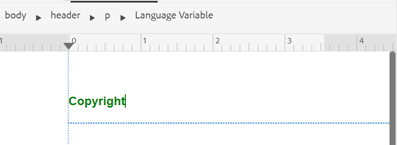

# Supporto per le variabili di lingua

AEM Guides fornisce la funzione per utilizzare le variabili di lingua. È possibile utilizzare le variabili di lingua per definire stringhe localizzate nell&#39;output di PDF o per localizzare qualsiasi testo statico nei modelli di output. È possibile utilizzare gli stili CSS per localizzare le stringhe provenienti da un CSS.

## Utilizzare le variabili di lingua nell’output di PDF

È possibile utilizzare le variabili di lingua per definire una versione localizzata delle etichette predefinite, ad esempio Nota, Avvertenza e Avvertenza, o del testo statico nell’output di PDF. Il nome della variabile è lo stesso per tutte le lingue, ma può avere valori diversi per le varie lingue. Puoi aggiornare il valore di queste variabili in una o più lingue, quindi il valore localizzato viene selezionato automaticamente nell’output di PDF.

Per presentare l&#39;etichetta `Note` nell&#39;output di PDF, ad esempio, è possibile procedere come segue:

- Inglese: Note

- Francese: Remarque

- Tedesco: Hinweis


*Nota di esempio in inglese, francese e tedesco.*

>[!NOTE]
>
> Se il valore di una variabile non è definito in una lingua particolare, AEM Guides seleziona la stringa dalla lingua dell’interfaccia utente (Interfaccia utente dell’applicazione) come meccanismo di fallback.
>
> Se non è stato definito il valore nella lingua dell&#39;interfaccia utente, verrà cercata l&#39;inglese (`en_us`), altrimenti verrà scelto il valore inglese (`en`) e verrà visualizzato lo stesso nell&#39;output PDF.

## Tipi di variabili di linguaggio

AEM Guides supporta due tipi di variabili: variabili applicazione e variabili utente.

### Variabili dell’applicazione

AEM Guides fornisce un set di variabili di applicazione predefinite o pronte all’uso. Puoi utilizzare queste variabili predefinite per aggiungere informazioni su un documento specifico di AEM Guides. Ad esempio, la variabile `chapter-number`, se inclusa in una pagina, visualizza il numero del capitolo a cui appartiene la pagina. La variabile `author-label` visualizza il nome dell&#39;autore del documento.

>[!NOTE]
>
> È possibile sovrascrivere il valore di una variabile di applicazione.


### Variabili utente

Puoi anche creare nuove variabili di lingua. È ad esempio possibile creare una variabile utente Publisher per l&#39;etichetta dell&#39;autore del documento.

>[!NOTE]
>
>  È necessario disporre di privilegi di amministratore per creare variabili utente e modificare le variabili dell&#39;applicazione.


*Aggiungere e visualizzare le variabili di lingua per una lingua selezionata.*

## Aggiungi una nuova variabile di lingua

1. Nell’editor web, passa alla scheda Output.
1. Seleziona **Variabili di lingua**  nel pannello a sinistra.
1. Seleziona **Modifica** per aprire la finestra **Variabili di lingua**. L&#39;applicazione e le variabili utente presenti nella lingua selezionata sono elencate in ordine alfabetico. I valori vengono visualizzati in base alla lingua selezionata. Ad esempio, se si seleziona la lingua francese, &quot;Tip&quot; viene visualizzato come &quot;Conseil&quot;.
1. Dal menu a discesa **Lingua**, seleziona la lingua desiderata in cui desideri modificare una variabile.

   >[!NOTE]
   >
   > Se non si visualizzano le lingue desiderate, abilitare la lingua desiderata dalle **Impostazioni variabile di lingua**. Seleziona impostazioni  per aprire la finestra di dialogo **Impostazioni variabili di lingua**.

1. Immettere il nome della variabile nella colonna **Nome** e il relativo valore nella colonna **Valore**.

   >[!NOTE]
   >
   >Puoi utilizzare qualsiasi contenuto HTML come valore variabile per visualizzare il valore della variabile in una formattazione specifica. È ad esempio possibile aggiungere il tag `<b>` al valore della variabile per visualizzare il server di pubblicazione in grassetto.

1. Seleziona **Aggiungi variabile di lingua**  per aggiungere una nuova variabile di lingua alla lingua selezionata. L’aggiunta di una variabile a una lingua la aggiunge automaticamente a tutte le lingue. Non è possibile creare una variabile con lo stesso nome di una variabile esistente. Viene visualizzato un errore.

>[!NOTE]
>
> Se non selezioni **Aggiungi variabile di lingua**, la variabile non viene creata e aggiunta all&#39;elenco

## Esportare e importare variabili di lingua

Experience Manager Guides fornisce il supporto per esportare e importare le variabili di lingua presenti nella lingua selezionata. Puoi esportare facilmente tutte le variabili di lingua insieme ai valori definiti. Sono incluse sia le variabili dell’applicazione che quelle dell’utente. Utilizza il file esportato per apportare le modifiche desiderate nei valori o per localizzarli in altre lingue.

È inoltre possibile importare il file XML, che contiene le variabili di lingua. Experience Manager Guides importa solo le variabili di lingua già definite, incluse sia le variabili applicazione che quelle utente. Non importa variabili non ancora definite.

### Esporta variabili di lingua

Per esportare le variabili di lingua per una lingua, selezionare la lingua dal menu a discesa e selezionare **Esporta** .
Crea un file XML con formato `language_variable_<ln>` dove `<ln>` è il codice della lingua selezionata. `language_variable_en.xml` per l&#39;inglese e `language_variable_fr.xml` per il francese.

>[!NOTE]
> 
>Se nelle variabili di lingua sono presenti modifiche non salvate, non è possibile esportarle. Salva le modifiche per visualizzare l&#39;**Esportazione** abilitata Icona .

### Importa variabili di lingua

Per importare le variabili di lingua:

1. Seleziona una lingua dal menu a discesa e seleziona **Importa** .
2. Sfoglia e seleziona l’XML, che contiene le variabili di lingua. Ad esempio, language_variable_en.xml.
È possibile importare file XML nel seguente formato:

```
<?xml version="1.0" encoding="UTF-8"?>
<variables>    
<variable id="note-important">Important: </variable>    
<variable id="note-caution">Avertir: </variable>    
<variable id="image-with-text">Text and image &lt;img src=&quot;/content/dam/assets/images/image_with_text.png&quot; /&gt; </variable> 
</variables> 
```

Le variabili con lo stesso ID vengono importate una volta importato il file. I valori delle variabili nella lingua selezionata vengono aggiornati con quelli del file XML.  Viene visualizzato un messaggio sul numero di variabili aggiornate.

>[!NOTE]
> 
><ul><li>Se il file non è un file XML o se il file contiene un formato non corretto che non è mappato con le variabili di lingua, viene visualizzato un errore che indica la presenza di un problema con il file XML. 
&gt;<li>Se il file non contiene variabili con lo stesso ID, viene visualizzato un avviso che informa che nel file importato non è stata trovata alcuna variabile di lingua corrispondente.

### Opzioni per una variabile di lingua

Passa il puntatore del mouse sulla variabile per visualizzare il relativo menu **Opzioni**.


*Utilizza il menu **Opzioni**per eliminare, visualizzare in anteprima o duplicare una variabile di lingua.*

Puoi visualizzare in anteprima sia le variabili dell’applicazione che quelle dell’utente. Per visualizzare la modalità di visualizzazione del valore della variabile nell&#39;output, selezionare **Anteprima** dal menu **Opzioni** della variabile selezionata.
Puoi anche scegliere di **eliminare** o **duplicare** le variabili utente. Se si elimina una variabile da una lingua, questa viene eliminata automaticamente da tutte le lingue.

### Modificare o ripristinare le variabili dell’applicazione

È inoltre possibile modificare i valori di una variabile di applicazione. In seguito, sarà possibile ripristinare il valore originale di una variabile di applicazione. **Ripristina variabile**  viene visualizzato per una variabile di applicazione con un valore modificato.

## Utilizzare le variabili di lingua nei modelli di output

È necessario aggiungere variabili di lingua nei documenti localizzati. È possibile inserire queste variabili di lingua all&#39;interno del layout di pagina visualizzato in pagine diverse nei documenti localizzati. È ad esempio possibile aggiungere la variabile di lingua per `author-name` visualizzata nell&#39;area di intestazione del layout di pagina o in qualsiasi altra parte, ad esempio il piè di pagina o il corpo.


*L&#39;autore e il nome del marchio localizzati nell&#39;output PDF generato per la lingua francese.*

Per inserire una variabile di lingua come `copyright-label` nell&#39;area dell&#39;intestazione, effettuare le seguenti operazioni:

1. Apri il layout di pagina richiesto per la modifica.

   >[!NOTE]
   >
   > Visualizza la sezione [Personalizza layout di pagina](../native-pdf/components-pdf-template.md#customize-a-page-layout-customize-page-layout) per aprire un layout di pagina per personalizzarlo o modificarlo.

1. Seleziona l’intestazione per rendere attiva l’inserimento di una variabile.
1. Seleziona **Inserisci variabile**   nella barra degli strumenti.
1. Nel pop-up **Inserisci variabile**, selezionare il nome della variabile di lingua da inserire e fare clic su **Inserisci** per inserirla nell&#39;area dell&#39;intestazione.

   >[!NOTE]
   >
   > È inoltre possibile immettere la stringa di ricerca nella casella di testo. I nomi delle variabili contenenti la stringa specificata vengono filtrati e visualizzati nell’elenco.
   > La variabile di lingua selezionata viene inserita nell’area dell’intestazione.




*Elemento `copyright-label` aggiunto nell&#39;area dell&#39;intestazione.*

### Applicare lo stile del contenuto alle variabili di lingua

Oltre al valore assegnato a una variabile di lingua, puoi anche utilizzare i tag HTML per visualizzare il valore della variabile in una formattazione specifica. È ad esempio possibile visualizzare il valore di `publisher-label` in grassetto.

- È inoltre possibile formattare gli stili dei valori utilizzando il tag <span>. Ad esempio, utilizzando la variabile di lingua del numero di pagina, è possibile visualizzare il numero di pagina in formato numero romano in inglese e specificare il formato per altre lingue.

  Valore per inglese:
  `<span data-field="page-number" data-format="upper-roman">1</span>`

  Valore per Tamil:
  `<span data-field="page-number" data-format="tamil">1</span>`

Analogamente, è possibile aggiungere variabili di lingua e formattare altri campi elencati nella funzione Inserisci campi dei layout di pagina. Per ulteriori dettagli sull&#39;aggiunta di campi, visualizzare [Aggiungi campi e metadati](../native-pdf/design-page-layout.md#add-fields-metadata).

- È inoltre possibile aggiungere immagini localizzate nei valori. Ad esempio, puoi aggiungere un’icona immagine nel linguaggio del numero di capitolo e ottenere immagini localizzate dell’icona nell’output di PDF.

  Per l&#39;inglese, il valore della variabile per un&#39;immagine può essere come `` e per la stessa variabile in tedesco può essere ``. Quindi, seleziona le immagini a seconda del linguaggio.

## Localizzare le stringhe utilizzando gli stili CSS

Utilizzando gli stili CSS, puoi anche localizzare le stringhe utilizzate in Numerazione automatica come Capitolo, Sezione, Figura e Tabella. Poiché queste stringhe provengono da file CSS, non è possibile localizzarle utilizzando variabili di linguaggio. Per localizzare queste stringhe, puoi creare stili CSS per ogni lingua in cui desideri localizzarle.
Ad esempio, puoi utilizzare il seguente CSS per visualizzare il prefisso del capitolo e il formato numerico corrispondente in varie lingue.
Ad esempio, puoi utilizzare il seguente CSS per visualizzare il capitolo come Hoofdstuk in tedesco e il numero del capitolo in formato decimale. Mentre per il giapponese, è possibile utilizzare il formato numerico giapponese per visualizzare i numeri dei capitoli nel sommario.

```
// for English
h1:before {
  counter-increment: h11;
  content: "Chapter " counter(h11, decimal)".";
}

// for German
:root:lang(de) h1:before {
  content: "Hoofdstuk " counter(h11, decimal)".";
}

// for Japanese
:root:lang(ja) h1:before {
  content: "章 " counter(h11, japanese-formal)".";
}
```

Le schermate seguenti mostrano le stringhe localizzate nell’output PDF in tedesco e giapponese.


### Formattare i prefissi

Utilizzando gli stili CSS, puoi anche formattare i prefissi. È possibile, ad esempio, formattare l&#39;etichetta `Note` in modo che venga visualizzata in rosso nell&#39;output PDF di varie lingue.

```
.note .prefix-content 
{
color: red;
} 
```
