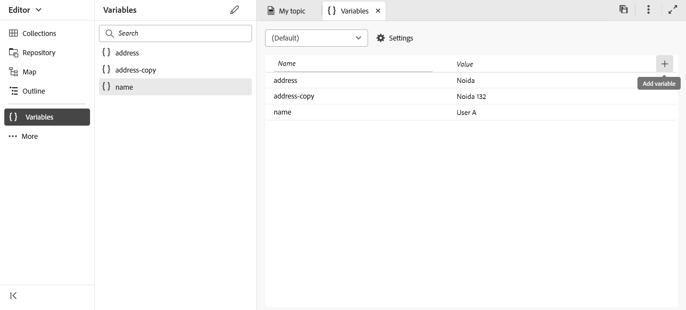

# Variabili nell&#39;output PDF

Una variabile è una coppia nome-valore di dati che funge da informazione riutilizzabile. Questo rende il tuo contenuto portatile e facile da aggiornare. Quando si modifica una variabile o il relativo valore, viene aggiornato ogni occorrenza di tale variabile o valore.

## Crea una nuova variabile

Per creare una variabile, effettua le seguenti operazioni:

{width="800" align="left"}

*Crea variabili e definisci i relativi valori.*

1. Nell’editor web, vai al **Output** scheda.
1. Seleziona **Variabili**  nel pannello a sinistra.
1. Seleziona **Modifica**  per aprire **Variabili** editor.
Le variabili sono elencate in ordine alfabetico.
1. Immettete il nome della variabile nella colonna Nome e il relativo valore nella **** colonna Valore **.**
   >[!TIP]
   >
   >Puoi utilizzare qualsiasi contenuto HTML come valore variabile per visualizzare il valore della variabile in una formattazione specifica. Ad esempio, puoi aggiungere una `<b>` per visualizzare il valore della variabile **Guide Experience Manager** in grassetto. È inoltre possibile aggiungere immagini dall’archivio come valori.

1. Seleziona **Aggiungi variabile**  per aggiungere una nuova variabile. Non è possibile creare una variabile con lo stesso nome di una variabile esistente. Viene visualizzato un errore.

   >[!NOTE]
   >
   >Se non selezioni **Aggiungi variabile** , la variabile non viene creata e aggiunta all’elenco.

In questo modo, puoi creare variabili con valori predefiniti. Ad esempio:
* ProductName: guide Experience Manager
* Numero versione: 2300
* Data di rilascio: 01/01/2023

### Modificare una variabile

È possibile modificare una variabile in due modi:

**Dal pannello Variabili a sinistra**

1. Seleziona una variabile in **Variabili** pannello.
1. Passa il puntatore del mouse sulla variabile per visualizzare **Opzioni** e quindi selezionare il **Modifica** opzione.
1. In **Modifica variabile** , è possibile modificare il valore predefinito della variabile selezionata.
1. Clic **Fine**.

**Dall’editor variabili**

1. Seleziona **Variabili**  nel pannello a sinistra.
1. Seleziona **Modifica**  per aprire l&#39;editor **Variabili** .

1. **Nella editor Variabili** è possibile modificare il valore della variabile selezionata.

È necessario salvare le modifiche apportate dall&#39;editor **** Variabili per visualizzarle nel **pannello Variabili** sul lato sinistro.

>[!NOTE]
>
> Se si modifica un valore di variabile, Adobe Experience Manager Guide aggiorna simultaneamente tutti i riferimenti laddove applicabile.

### Search e visualizzare in anteprima una variabile

Puoi cercare e visualizzare in anteprima il valore di una variabile. Immettere una stringa nella casella di ricerca del **Variabili** pannello. La ricerca viene eseguita in base al nome della variabile e al relativo valore.
Puoi visualizzare in anteprima una variabile in due modi:

Nell’anteprima della variabile viene visualizzato il valore predefinito. Ad esempio, se hai definito il valore predefinito della variabile ProductName come &quot;Adobe Experience Manager Guides&quot;, questo valore viene visualizzato nell’anteprima.

**Dal pannello Variabili a sinistra**

1. Seleziona una variabile in **Variabili** pannello.
1. Passa il puntatore del mouse sulla variabile per visualizzare **Opzioni** e quindi selezionare il **Anteprima** opzione.

{width="550" align="left"}

*Visualizzate in anteprima il valore predefinito per una variabile.*

**Dall’editor variabili**

1. Passa il puntatore del mouse sulla variabile nell’elenco per visualizzare **Opzioni** menu.
1. Seleziona **Anteprima**.

### Duplicare una variabile

È possibile duplicare una variabile e modificarla in base alle proprie esigenze.

1. Passare il puntatore del mouse sulla variabile nell&#39;elenco per visualizzare il **menu Opzioni** .
1. Seleziona **Duplicazione**.

Il nome predefinito della variabile è `<selected variable name>` (come &quot;sample&quot;). Puoi modificare il nome in base alle tue esigenze.

### Eliminare una variabile

È possibile eliminare una variabile in due modi:

**Dal pannello Variabili a sinistra**

1. Seleziona una variabile in **Variabili** pannello.
1. Passa il puntatore del mouse sulla variabile per visualizzare **Opzioni** e quindi selezionare il **Elimina** opzione.

**Dall’editor variabili**

1. Passa il puntatore del mouse sulla variabile nell’elenco per visualizzare **Opzioni** menu.
1. Seleziona **Elimina** opzione.

La variabile viene eliminata da tutti i set di variabili.

## Set di variabili per i predefiniti di output

Adobe Experience Manager Guide supporta anche i set di variabili, che consentono di assegnare alle variabili valori alternativi. Ad esempio, un’azienda può vendere due prodotti, A e B. Ha specifiche diverse per ciascuno di essi. Queste specifiche potrebbero includere il nome del prodotto, il numero di versione e la data di rilascio. Ci possono essere altre differenze nel branding. Utilizzando i set di variabili, puoi definire un set di valori diverso per le variabili. Quando generate l&#39;output, scegliete l&#39;insieme di variabili appropriato e create l&#39;output richiesto.

### Configurare i set di variabili

È necessario configurare i set di variabili prima di aggiungervi variabili.

1. Seleziona **Impostazioni**  per aprire **Configurare i set di variabili** .
   {width="550" align="left"}
1. Inserisci il nome del set di variabili in **Nome** colonna.
1. Seleziona **Aggiungi variabile**  per aggiungere un nuovo set di variabili. I set di variabili sono elencati in ordine alfabetico.
1. Puoi selezionare **Elimina** per rimuovere un set di variabili.

### Operazioni per set di variabili

Tutti i set di variabili hanno le stesse variabili, ma possono avere valori diversi.

Puoi visualizzare, modificare e visualizzare in anteprima i valori per un set di variabili specifico. Seleziona un set di variabili da **Set di variabili** a discesa. I valori vengono visualizzati in base al set di variabili selezionato.
Quando si modificano i valori delle variabili in set di variabili specifici, vengono ignorati i valori predefiniti e vengono modificati i valori del set di variabili selezionato.
Ad esempio, puoi impostare i seguenti valori per i set di variabili: *Adobe-set1* e *Adobe-set2* .

**Set di variabili 1**: *Adobe-set1*

* ProductName: ProductA
* Numero di versione: 2311
* Data di rilascio: 11/02/2023

**Set di variabili 2**: *Adobe-set2*

* Nome prodotto: ProductB
* Numero di versione: 2310
* Data di rilascio: 09/07/2023

Ogni nuova variabile viene aggiunta a tutti i set di variabili. Quando elimini o duplichi una variabile, questa viene aggiornata per tutti i set di variabili.

Puoi anche visualizzare in anteprima i valori per un set di variabili.
Ad esempio, per il set di variabili *Adobe-Set1*, dopo aver definito il valore della variabile ProductName come &quot;ProductA&quot;, questo valore viene visualizzato nell’anteprima nell’editor delle variabili .

{width="550" align="left"}

*Visualizzate in anteprima il valore definito nell&#39;insieme di variabili selezionato.*

### Reimpostare il valore di una variabile

Se hai modificato il valore, puoi anche reimpostare una variabile sul valore predefinito.
Ripristina  viene visualizzato per una variabile con un valore modificato.
Ad esempio, è possibile reimpostare il valore della variabile ProductName sul valore predefinito Experience Manager Guides.

## Utilizzare le variabili nei modelli di PDF nativi

È possibile aggiungere variabili durante la generazione dell’output dei documenti di prodotto per renderli portatili e facili da aggiornare. È possibile inserire queste variabili all&#39;interno del layout di pagina visualizzato nelle diverse pagine dei documenti. Ad esempio, è possibile aggiungere la variabile ProductName che viene visualizzata nell&#39;area dell&#39;intestazione del layout di pagina (o in qualsiasi altra parte come il piè di pagina o il corpo).

Per inserire una variabile come ProductName nell&#39;area dell&#39;intestazione, effettuare le seguenti operazioni:
1. Apri il layout di pagina richiesto per la modifica.

   >[!NOTE]
   >
   > Visualizza [Personalizzare il layout di una pagina](../native-pdf/components-pdf-template.md#customize-a-page-layout-customize-page-layout) sezione per aprire un layout di pagina per la personalizzazione o la modifica.

1. Seleziona l’intestazione per rendere attiva l’inserimento di una variabile.

1. È possibile inserire la variabile in due modi:

   **Dal pannello Variabili sul lato sinistro**

   * Trascinate una variabile dal **pannello Variabili** e rilasciatela nell&#39;area dell&#39;intestazione.

   **Dalla barra degli strumenti**

   1. Seleziona **Inserisci variabile/campi** .
   1. In **Variabile** , selezionare il nome della variabile da inserire nell&#39;area dell&#39;intestazione.
   1. È inoltre possibile immettere la stringa di ricerca nella casella di testo. I nomi delle variabili contenenti la stringa specificata vengono filtrati e visualizzati nell’elenco. La variabile selezionata viene inserita nell’area dell’intestazione. Puoi visualizzare il valore predefinito della variabile.
   1. Per sostituire una variabile, fai doppio clic sul valore della variabile e seleziona un’altra variabile dalla **Variabile** . La variabile viene sostituita.

## Genera output PDF con variabili

Puoi generare l’output PDF con i valori di variabili diverse. Prima di generare il layout, scegliete un set di variabili da un predefinito di output **Set di variabili** per selezionarne i valori.

{width="550" align="left"}

*Seleziona un set di variabili dal menu a discesa nel predefinito di output che desideri utilizzare per generare l&#39;output PDF.*

>[!NOTE]
>
> È inoltre possibile selezionare (Predefinito) dal menu a discesa per pubblicare i valori predefiniti per tutte le variabili.

A seconda del set di variabili scelto, otterrai un output corrispondente ai valori delle variabili definiti nel set di variabili. Ad esempio, se selezioni il set di variabili *Adobe-set1*, nell’output vengono visualizzati i valori delle variabili definiti in questo set.

*Genera l’output PDF utilizzando le variabili nel layout di pagina.*

Potete anche aggiornare rapidamente i valori di qualsiasi insieme di variabili ogni volta che è necessario e rigenerare l&#39;output. Ad esempio, se è necessario aggiornare i dettagli di una versione, è possibile aggiornare il valore della versione nella variabile VersionNumber e rigenerare l&#39;output.

