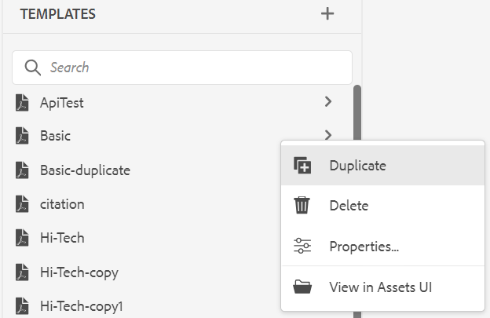

# Modello PDF {#PDF-template}

L’utilizzo di un modello garantisce coerenza nel layout e nella struttura del contenuto. Poiché i modelli sono predefiniti, è possibile evitare la rielaborazione dei problemi di formattazione che si verificano per ogni nuovo progetto o aggiornamento. I modelli consentono di progettare layout di pagina, applicare stili al contenuto e applicare varie impostazioni per personalizzare il PDF.

## Modelli PDF predefiniti e personalizzati

Sono disponibili alcuni modelli di fabbrica di esempio forniti come predefiniti, che gli sviluppatori possono utilizzare come modelli di base per creare modelli personalizzati in base ai propri requisiti organizzativi.

## Crea un nuovo modello di PDF {#create-pdf-template}

È possibile creare modelli di PDF personalizzati con layout di pagina specifici e definire la formattazione per i componenti layout di pagina (come sommario, indice, glossario) o per i componenti DITA (come intestazione, paragrafo, elenco) utilizzando i fogli di stile.

Per creare un nuovo modello di PDF, effettuare le seguenti operazioni:
1. Nell’editor web, vai al **Output** scheda.
1. Seleziona **Modelli**  nel pannello a sinistra.

1. Nella finestra **Modelli**, seleziona l’icona **+** accanto a **Modelli** quindi scegli **Modello PDF**.
1. Nella finestra di dialogo **Nuovo modello PDF **, selezionare un modello di fabbrica da utilizzare come base per la creazione del modello personalizzato. È inoltre possibile utilizzare la casella di ricerca per cercare un modello.
1. Specifica un titolo per il modello.

>[!NOTE]
>
>  È inoltre possibile visualizzare in anteprima una miniatura per il modello durante la creazione e la duplicazione di un modello. Modifica o elimina la miniatura tramite [**Proprietà**](#properties-option) nel **Opzioni** dopo aver creato il modello.

1. Fai clic su **Crea**.

   Il nuovo modello viene creato e aggiunto nel **Modelli** pannello.

## Duplicare un modello PDF {#duplicate-pdf-template}

Se si desidera creare un nuovo modello con gli stessi layout di pagina e la stessa formattazione di un modello esistente, è possibile crearne una copia. Una volta duplicato un modello, puoi personalizzarne ulteriormente i componenti in base alle esigenze.

Per duplicare un modello di PDF esistente, effettua le seguenti operazioni:
1. Nell’editor web, vai al **Output** scheda.
1. Seleziona **Modelli**  nel pannello a sinistra. Verrà aperto il **Modelli** finestra.
1. Passa il puntatore del mouse sul modello da duplicare e seleziona la **...** *Opzioni* e scegli **Duplica** dal menu di scelta rapida.

   Verrà aperto il **Duplica modello PDF** .

   

   *Seleziona un modello da duplicare, visualizza l’anteprima della miniatura e aggiorna il titolo nella **Duplica modello PDF**.*

1. Specifica un titolo per il modello.

   Il **Titolo** viene precompilato come copia dello stesso titolo del modello di origine. Se esiste un modello con lo stesso titolo, verrà visualizzato un messaggio di errore.

1. Per specificare un titolo preferito, rimuovi il titolo precompilato e specifica un titolo.
1. Clic **Duplica**.

   Un modello duplicato viene creato e aggiunto nella sezione **Modelli**.

## Altre operazioni sui modelli

È inoltre possibile eseguire le operazioni seguenti sui modelli da **Opzioni** menu:

### Eliminare

Selezionare l&#39;opzione Elimina per eliminare il modello selezionato. Quindi, seleziona Sì al prompt di conferma.
Il predefinito viene rimosso dal **Modelli**.

### Proprietà{#properties-option}

Selezionare questa opzione per visualizzare e modificare le proprietà del modello. Puoi visualizzare in anteprima la miniatura esistente per il modello. È inoltre possibile modificare o eliminare la miniatura. Puoi anche modificare il titolo e la descrizione del modello.

### Visualizza nell’interfaccia utente Assets

Seleziona questa opzione per visualizzare il modello nell’interfaccia utente Assets. Quando si apre la posizione principale del modello, è possibile visualizzare tutte le risorse del modello.

Dopo aver creato il modello personalizzato, puoi sceglierlo tra Layout di pagina nel predefinito di output di PDF.
Scopri come [pubblicare un output di PDF](/help/product-guide/web-editor/native-pdf-web-editor.md).

>[!NOTE]
>
>Se nella cartella è configurato un profilo di cartella, verranno visualizzati solo i modelli di PDF configurati nel profilo di cartella.

In base alla configurazione, l’amministratore può configurare i modelli:

 Servizi cloud 

Per informazioni dettagliate sulla configurazione dei profili globali e a livello di cartella, vedi [Configurare i modelli](../cs-install-guide/conf-folder-level.md#id1889D0IL0Y4) nella guida all&#39;installazione e alla configurazione per i Cloud Service.

    

  Software on-premise 

Per informazioni dettagliate sulla configurazione dei profili globali e a livello di cartella, vedi [Configurare i modelli di authoring](../install-guide/conf-folder-level.md#create-custom-authoring-template-id1917d0eg0hj) nella guida all’installazione e alla configurazione on-premise.

## Personalizzare un modello di PDF {#customize-pdf-template}

È possibile personalizzare i modelli modificando i componenti del modello e applicando formati di stile utilizzando i fogli di stile.

Per personalizzare un modello di PDF, effettuare le seguenti operazioni:

1. Nell’editor web, vai al **Output** scheda.
1. Espandi la barra laterale a sinistra e seleziona **Modelli**.

   Verrà aperto il **Modelli** pannello.
1. Per visualizzare i componenti di un modello, effettuate una delle seguenti operazioni:

   * Seleziona l’icona > accanto a un modello o fai doppio clic sul nome del modello.
   * Passa il puntatore del mouse su un modello e seleziona ... (**Opzioni** ) e scegliere **Modifica** dal menu di scelta rapida.

     Per impostazione predefinita, viene aperto il **Impostazioni** nell’editor modelli.
   

   >[!NOTE]
   >
   >  L’amministratore può scaricare i modelli più recenti dal percorso seguente e sostituire quelli esistenti:
   >
   > `/libs/fmdita/pdf`

   I vari componenti modello che è possibile personalizzare sono suddivisi in categorie nelle sezioni seguenti:
   * Layout di pagina: un tipico PDF contiene pagine diverse, ad esempio una copertina o una pagina del titolo, un sommario, un capitolo, un indice, delle citazioni e altro ancora. La sezione Layout di pagina consente di progettare l’aspetto di pagine diverse che costituirebbero il PDF. Per ulteriori dettagli, vedi [Layout di pagina](../native-pdf/components-pdf-template.md#page-layouts).

     Oltre all&#39;aspetto, è possibile definire la disposizione degli elementi della pagina, ad esempio l&#39;intestazione, il piè di pagina e le aree contenuto di una pagina. Per ulteriori informazioni sulla personalizzazione del layout di una pagina, consulta [Creare e personalizzare layout di pagina](components-pdf-template.md#create-customize-page-layout).

   * Fogli di stile: le impostazioni nella sezione Fogli di stile consentono di personalizzare l’aspetto dei componenti di layout di pagina come il sommario, l’indice, il glossario, le citazioni e altro ancora. È inoltre possibile personalizzare gli stili per il contenuto DITA, ad esempio intestazioni, paragrafi, elenchi e altro ancora. Per ulteriori informazioni sull&#39;utilizzo dei fogli di stile, vedere [Utilizzare i fogli di stile per personalizzare PDF](components-pdf-template.md#stylesheet-customization).
   * Risorse: archivia i file di risorse necessari per personalizzare o progettare modelli di PDF. Le risorse come loghi, font personalizzati, immagini di sfondo e altro ancora sono memorizzate nelle Risorse.
Puoi inoltre utilizzare le risorse presenti in qualsiasi altra posizione nell’archivio. Non è necessario creare risorse duplicate per ciascun modello, ma è possibile mantenerle in una cartella condivisa e utilizzarle in tutti i modelli di PDF nativi.

     Per ulteriori informazioni sull’utilizzo delle risorse, consulta [Utilizzare le risorse](components-pdf-template.md#work-with-resources).
   * Impostazioni: configura le impostazioni di output per la generazione di un PDF utilizzando il modello. Questa sezione ti consente di definire la mappatura dei modelli per varie pagine di un PDF, pagina iniziale del capitolo, marcatori di stampa, citazioni e altro ancora.
Puoi anche impostare l’ordine in cui devono essere visualizzate nell’output PDF finale.
Per ulteriori informazioni sull&#39;applicazione delle impostazioni, vedere [Impostazioni avanzate di PDF](components-pdf-template.md#advanced-pdf-settings).

1. Per personalizzare un componente modello, fai doppio clic su un componente modello o seleziona l’icona > prima di esso.

   Ad esempio, fare doppio clic su *Layout di pagina* o seleziona la *>* icona prima di *Layout di pagina* per visualizzare i layout di pagina disponibili.

   >[!NOTE]
   >
   >È inoltre possibile aggiornare una miniatura e la descrizione del modello utilizzando [**Proprietà**](#properties-option) nel **Opzioni** menu.

1. Dopo aver apportato le modifiche desiderate, seleziona *Salva tutto* (o `Ctrl+S`).
