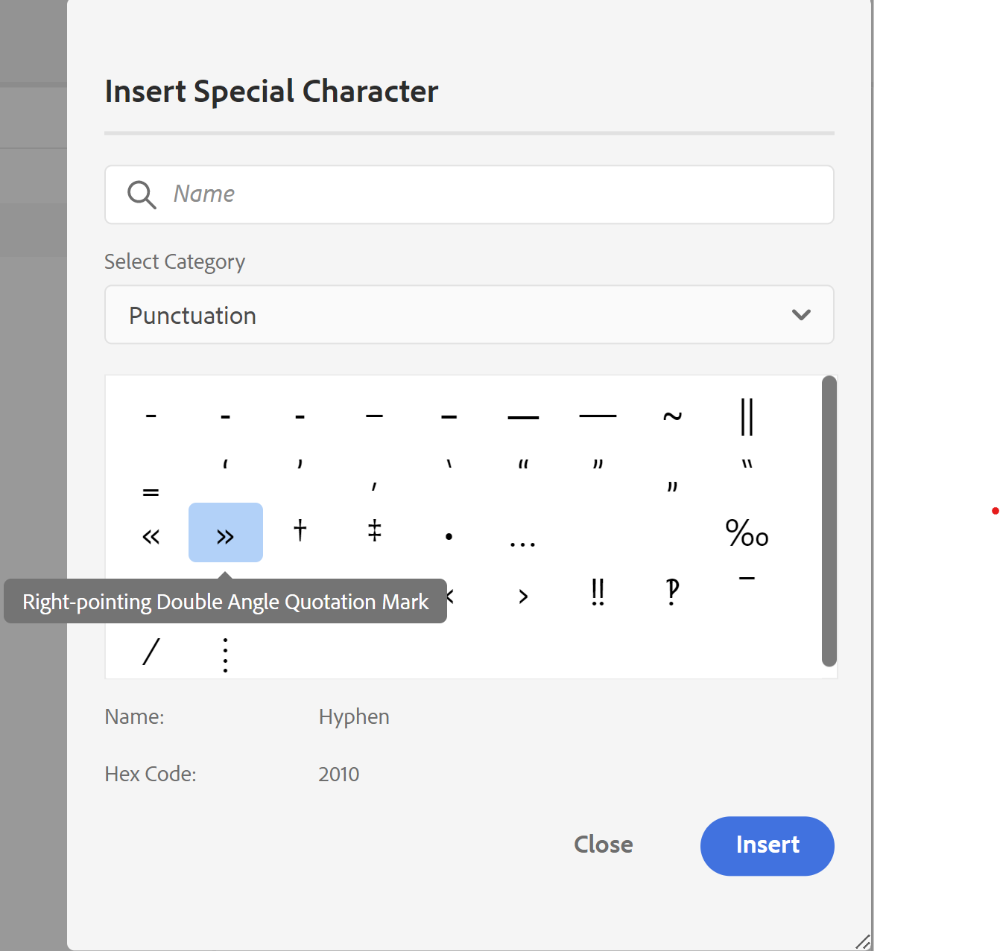
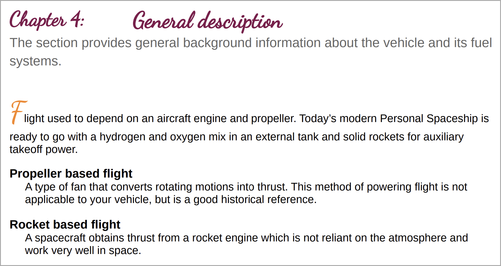
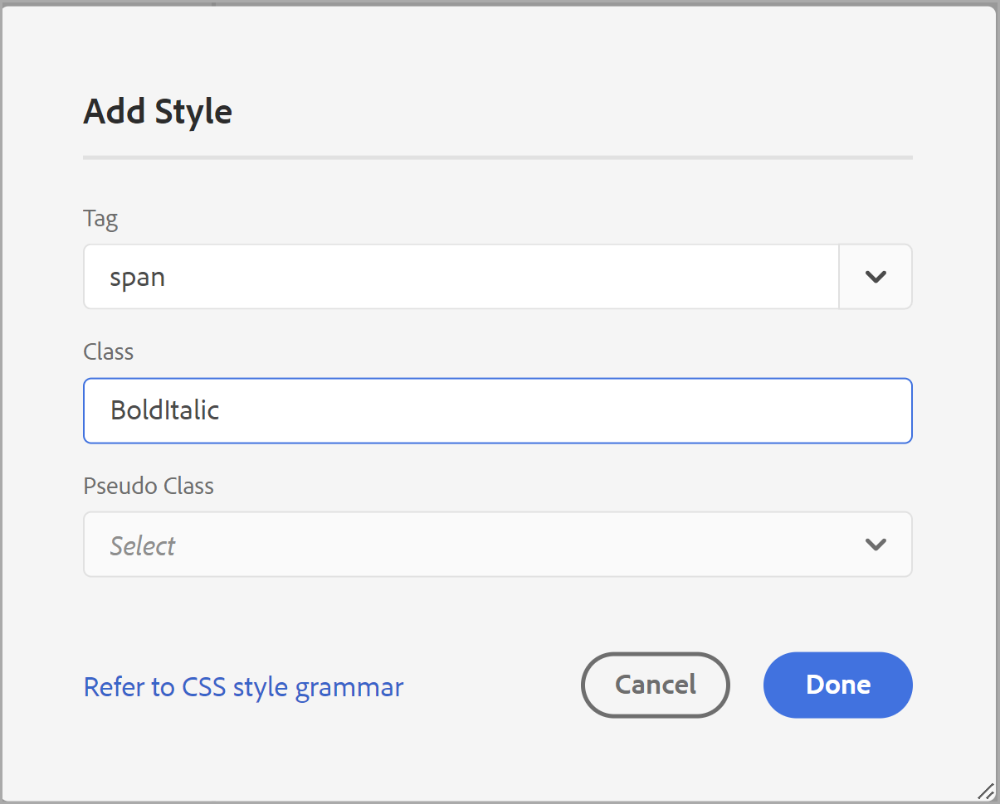
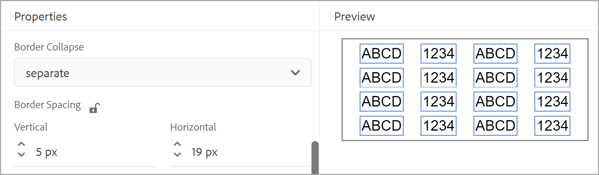

# Utilizzare gli stili di contenuto comuni {#work-with-common-styles}

Un foglio di stile contiene le definizioni degli stili per gli elementi utilizzati nell’output di PDF. È possibile scegliere di utilizzare i fogli di stile di esempio o crearne di nuovi. Nella maggior parte dei casi, la creazione di una copia del foglio di stile di esempio OOTB consente di iniziare rapidamente.

L’editor di stili è un editor WYSIWYG che nasconde tutte le complessità di un codice CSS dietro l’interfaccia utente. Utilizzando l’editor di stili, puoi personalizzare facilmente e molto rapidamente gli stili per gli elementi desiderati. Gli stili sono suddivisi nelle seguenti categorie:

* Stili intestazione
* Stili paragrafo
* Stili di carattere
* Stili collegamento ipertestuale
* Stili immagine
* Stili elenco
* Stili tabella
* Stili Div
* Stili pagina
* Altri stili

Quando si lavora con contenuto DITA strutturato, la mappatura di stile per la maggior parte degli elementi DITA è attiva nel foglio di stile predefinito. Se si utilizzano elementi DITA standard, è possibile modificarne l&#39;aspetto apportando direttamente modifiche alla definizione dello stile. Queste definizioni di stile sono disponibili nella categoria Altri stili. Per ulteriori dettagli, vedere [Utilizzare altri stili](#other-styles) più avanti in questo argomento.

Nelle sezioni seguenti vengono illustrate le impostazioni di stile più comunemente utilizzate, sotto forma di esempi.

>[!NOTE]
>
>Negli esempi seguenti si presume che si stia utilizzando il foglio di stile di esempio fornito con il prodotto.

## Utilizzare gli stili di titolo {#heading-styles}

Gli stili di titolo racchiudono tutti gli stili di base dei titoli utilizzati nel contenuto. Otterrai 6 stili di titolo di base e uno stile di titolo per l’argomento/capitolo e l’intestazione del titolo dell’appendice. In un documento strutturato, H1 rappresenta il titolo dell&#39;argomento o del capitolo e da H2 a H6 vengono utilizzati per i sottoargomenti o le sezioni di un argomento o di un capitolo. Questa gerarchia di intestazioni viene applicata automaticamente al contenuto ogni volta che viene trovata l’intestazione corrispondente.

>[!NOTE]
>
>È possibile creare stili di titolo personalizzati e utilizzarli nel contenuto utilizzando la classe di output. Per ulteriori dettagli, vedere il passaggio 4 nell&#39;esempio [Utilizzare l&#39;orientamento della pagina e la rotazione della visualizzazione](design-page-layout.md#page-orientation-rotation).

### Creare intestazioni personalizzate a livello di capitolo {#create-chapter-level-heading}

In un libro (o in una mappa di un libro), si lavora con i capitoli. Gli stili di titolo di base sono progettati in modo tale da essere applicati ai titoli a livello di capitolo senza alcuna personalizzazione. Tuttavia, se desideri creare intestazioni specifiche per il contenuto, dovrai crearle. Ad esempio, l&#39;intestazione predefinita `h1.chapter` viene applicata al titolo del capitolo. Se si desidera che il titolo del capitolo venga visualizzato in uno stile diverso, è necessario personalizzare lo stile `h1.chapter`. Allo stesso modo, è possibile creare stili personalizzati per i sottotitoli del capitolo. Ad esempio, se desideri creare uno stile personalizzato per tutte le intestazioni di livello 2<sup>nd</sup> e 3<sup>rd</sup> nel capitolo, devi creare un nuovo stile come `h2.chatper` e `h3.chatper`.

Poiché la funzione di pubblicazione di PDF nativi contiene le definizioni degli stili di base per gli stili più comuni, anche se uno stile viene eliminato accidentalmente, al contenuto viene applicato lo stile predefinito. Se ad esempio nel foglio di stile non è presente alcuna definizione di stile per lo stile h2, la caratteristica Pubblicazione di PDF nativi applicherà uno stile di base al contenuto h2.

In questo esempio verrà creato uno stile di intestazione del capitolo di secondo livello:

1. Aprire il foglio di stile richiesto per la modifica.
   >[!NOTE]
   >
   >Consulta la sezione [Personalizzare uno stile predefinito o nuovo](components-pdf-template.md#customize-style) per aprire un foglio di stile per personalizzarlo o modificarlo.

1. Nell&#39;elenco **Stili** espandere **Stili titolo**.
1. Fare clic con il pulsante destro del mouse sullo stile **Stili titolo** e scegliere **Nuovo stile**.
1. Nella finestra di dialogo *Aggiungi stile*, mantieni il nome **Tag** come `h2` e immetti `chapter` nel campo del nome **Classe**.
1. Fai clic su **Fine**.

Nell&#39;elenco Stili titolo viene creato e aggiunto il nuovo stile titolo `h2.chapter`.

Dopo aver creato uno stile, potete personalizzarne le proprietà richieste utilizzando l&#39;editor di stili.

### Creare intestazioni di numerazione automatica {#auto-number-heading}

Uno degli stili di output più comunemente utilizzati sono i titoli con numerazione automatica. Questi titoli rappresentano il numero del capitolo, l&#39;argomento e i numeri dei sottoargomenti. Le intestazioni di numerazione automatica sono diverse dagli stili di elenco in cui a un elenco di elementi di un argomento vengono assegnati numeri automatici.

In questo esempio personalizzeremo i titoli dal livello 1 al livello 3 per utilizzare numeri automatici in formati diversi.

1. Aprire il foglio di stile richiesto per la modifica.

   >[!NOTE]
   >
   >Consulta la sezione [Personalizzare uno stile predefinito o nuovo](components-pdf-template.md#customize-style) per aprire un foglio di stile per personalizzarlo o modificarlo.

1. Nell&#39;elenco **Stili** espandere **Stili titolo**.

1. Selezionare lo stile **h1** dall&#39;elenco.
Le proprietà dello stile h1 vengono visualizzate nel pannello Proprietà insieme alla relativa anteprima.

   >[!NOTE]
   >
   >Il pannello Anteprima offre una visualizzazione in tempo reale di tutti gli aggiornamenti di stile applicati a qualsiasi elemento.

1. Selezionare la proprietà **Contatore**.

   Gli stili che è possibile applicare all&#39;elenco numerazione automatica sono visualizzati sotto la proprietà Numerazione automatica.

1. Imposta le seguenti proprietà:
   * **Stile**: consente di scegliere tra un&#39;ampia gamma di stili di numerazione generici o specifici delle impostazioni internazionali. Puoi scegliere stili come Arabo-Indaco, Devanagari, Georgiano, Decimale, Alpha inferiore e altro ancora. Per l&#39;esempio corrente, selezionare `upper-alpha`.

   * **Formato**: il formato predefinito è impostato su `<x>`, in cui il valore `x` viene sostituito con lo stile di numerazione selezionato nella proprietà Style. Ad esempio, se è stato selezionato lo stile `decimal` (1), il valore di `x` incrementi automatici per ogni istanza dello stile `h1` andrà come 2, 3 e così via. Puoi anche aggiungere testo personalizzato nel campo per formattare lo stile dell’intestazione. Ad esempio, se desideri che tutte le intestazioni h1 abbiano il prefisso `Chapter`, imposta questo campo come `Chapter <x>`.

   * **Inserisci carattere**: per aggiungere caratteri speciali nel formato, fare clic su Inserisci carattere (). Selezionare il carattere desiderato che si desidera aggiungere nel formato di stile e fare clic su Inserisci. Nell&#39;elenco a discesa Seleziona categoria sono disponibili diversi tipi di caratteri speciali. Nel nostro esempio, selezionare il segno di virgoletta con doppio angolo rivolto a destra dalla categoria Punteggiatura.

     


   * **Inizia numerazione da**: se si desidera che la numerazione inizi da un numero specifico, specificare tale valore. Nel nostro esempio, mantieni il valore predefinito 1.

   * **Rientro**: per applicare un rientro all&#39;intestazione, è necessario impostare il valore di Rientro. Nel nostro esempio, impostalo su 0 px.

     >[!NOTE]
     >
     >Potete immettere il valore in pixel (pixel), pt (punti), rem, em, % (percentuale) o in unità (pollici).

   * **Larghezza prefisso**: area occupata dal formato di numerazione automatica. Viene impostato automaticamente su una dimensione che può facilmente adattarsi al formato di stile selezionato. Se desideri aumentare le dimensioni, puoi sostituire il valore predefinito.

     Quando imposti questo valore manualmente, prova a modificare le altre proprietà che avranno un impatto sulla larghezza. Ad esempio, modificare la dimensione del carattere, il formato con prefisso (Capitolo) o un suffisso (:), impostare il valore massimo nella proprietà *Inizia numerazione da* e le varie proprietà del carattere per ottenere la dimensione ottimale.

     Nel nostro esempio, mantieni il valore predefinito.

   * **Spaziatura**: specificare la spaziatura orizzontale e verticale. Nel nostro esempio, mantieni i valori predefiniti.

     Con le personalizzazioni di cui sopra, lo stile viene personalizzato come mostrato di seguito:

     

   * **Applica formattazione a**: le proprietà della categoria Numerazione automatica consentono di definire lo stile di numerazione. Per applicare ulteriori personalizzazioni allo stile di numerazione o al contenuto del formato titolo, è possibile scegliere Numerazione o Paragrafo in questo campo. Se si sceglie Numerazione, le modifiche apportate a Tipo di carattere, Bordo, Layout e ad altre categorie verranno applicate solo allo stile di numerazione nell&#39;intestazione. Tuttavia, se selezioni Paragrafo, le modifiche verranno applicate al contenuto dell’intestazione e non allo stile di numerazione.

   Utilizza le seguenti impostazioni per generare un output mostrato nella schermata seguente:

   | **Stile intestazione** | **Proprietà** | **Valore** | **Commenti aggiuntivi** |
   | :- | :- | :- | :- |
   | h1 | Stile | Decimale | Queste proprietà si trovano nella categoria Numerazione automatica |
   |  | Formato | `Capter <x>:` |  |
   |  | Larghezza prefisso | 160 px |  |
   |  | Font > Allineamento testo | Sinistra | Assicurarsi che Applica formattazione a sia impostato su Numerazione |
   | h2 | Stile | Decimale | Queste proprietà si trovano nella categoria Numerazione automatica |
   |  | Formato | `Section <x>:` |  |
   |  | Larghezza prefisso | 125 px |  |
   |  | Font > Allineamento testo | Sinistra | Assicurarsi che Applica formattazione a sia impostato su Numerazione |
   | h3 | Stile | Decimale | Queste proprietà si trovano nella categoria Numerazione automatica |
   |  | Inserisci livello | 2 |  |
   |  | Formato | `Section <2>.<x>:` |  |
   |  | Larghezza prefisso | 125 px |  |
   |  | Font > Allineamento testo | Sinistra | Assicurarsi che Applica formattazione a sia impostato su Numerazione |
   |  |

   

## Utilizzare gli stili di paragrafo {#paragraph-style}

È possibile creare uno stile di paragrafo per applicare una formattazione speciale a un intero paragrafo. Tuttavia, utilizzando la pseudoclasse, è possibile applicare uno stile solo a una parte specifica del testo. Nell&#39;esempio seguente verrà creato uno stile di paragrafo per utilizzare lo stile capolettera.

### Creare lo stile capolettera {#drop-cap-style}

Lo stile capolettera viene utilizzato nelle riviste e nei documenti letterari in cui al primo carattere di un paragrafo o di una sezione viene assegnato uno stile speciale. È possibile ottenere lo stesso effetto utilizzando la funzione Pubblicazione nativa di PDF.

Nell’esempio seguente verrà creato uno stile capolettera:

1. Aprire il foglio di stile richiesto per la modifica.

   >[!NOTE]
   >
   Consulta la sezione [Personalizzare uno stile predefinito o nuovo](components-pdf-template.md#customize-style) per aprire un foglio di stile per personalizzarlo o modificarlo.

1. Nell&#39;elenco **Stili** espandere **Stili paragrafo**.

1. Fare clic con il pulsante destro del mouse su **Stile paragrafo** e scegliere **Nuovo stile**.

1. Nella finestra di dialogo *Aggiungi stile*, mantieni il nome **Tag** come p e nel campo **Pseudo** **Classe**, seleziona `::first-letter`.

1. Fai clic su **Fine**.

   Un nuovo stile di paragrafo denominato `::first-letter` è stato creato e aggiunto all&#39;elenco **Stili di paragrafo**.

1. Selezionare `::first-letter` nello stile p e impostare le proprietà seguenti:

   * **Carattere**: imposta il tipo di carattere desiderato per la prima lettera del paragrafo. Ad esempio, impostate la famiglia di caratteri su corsivo, lo spessore del carattere su 500, la dimensione del carattere su 30 pt e scegliete un colore del carattere.

   * **Layout**: imposta l&#39;allineamento verticale del testo attorno allo stile capolettera. Nel nostro esempio, l’allineamento verticale verrà impostato su Inferiore.

Poiché il tag `p` è mappato con l&#39;elemento `<p>` in DITA, non è necessario aggiungere esplicitamente questo stile utilizzando l&#39;attributo outputclass. Ovunque nel contenuto venga utilizzato un elemento `<p>`, lo stile capolettera viene applicato automaticamente. Nella schermata seguente, il titolo del capitolo, la descrizione breve e gli elementi dell’elenco di definizioni non sono stati formattati con lo stile capolettera. Solo lo stile paragrafo viene formattato con lo stile capolettera:



## Utilizzare gli stili di carattere {#char-style}

Utilizzando gli stili di carattere, puoi creare stili per formattare caratteri o parole all’interno del contenuto. Ad esempio, puoi creare uno stile di carattere per il codice in linea o il nome del file, oppure puoi creare uno stile che utilizza più formati di stile sul contenuto selezionato.

### Creare uno stile di carattere in linea {#inline-char-style}

La formattazione di caratteri in linea o di parole in un paragrafo è uno stile molto comune. Il processo di creazione di uno stile in linea prevede due attività: la prima consiste nel creare un nuovo stile nel foglio di stile e la seconda nell&#39;applicare lo stile nel contenuto utilizzando l&#39;attributo `outputclass`.

Nell’esempio seguente verrà creato uno stile di carattere in linea:

1. Aprire il foglio di stile richiesto per la modifica.

   >[!NOTE]
   >
   Consulta la sezione [Personalizzare uno stile predefinito o nuovo](components-pdf-template.md#customize-style) per aprire un foglio di stile per personalizzarlo o modificarlo.

1. Nell&#39;elenco **Stili** espandere **Stili di carattere**.

1. Fare clic con il pulsante destro del mouse su **Stile carattere** e scegliere **Nuovo stile**.

1. Nella finestra di dialogo Aggiungi stile, mantieni il nome **Tag** come estensione e immetti `BoldItalic` nel campo del nome **Classe**.

   

1. Fai clic su **Fine**.

   Nell&#39;elenco Stili di carattere viene creato e aggiunto un nuovo stile di carattere denominato codice.

1. Selezionare `span.BoldItalic` dall&#39;elenco **Stile carattere** e impostare le proprietà seguenti:

   * **Carattere**: da questa sezione è possibile personalizzare tutte le proprietà relative ai caratteri. Per impostazione predefinita, alcuni tipi di carattere sono forniti in bundle con il prodotto. È possibile scegliere il tipo di carattere desiderato per lo stile di carattere. Ad esempio, imposta la famiglia di caratteri su *Serif,* e seleziona *Bold* e *Italic* nella proprietà Stile carattere. È inoltre possibile personalizzare altre proprietà del tipo di carattere, ad esempio lo spessore del carattere (grassetto, più chiaro), la decorazione del testo (come sottolineato, sovrapposto), la dimensione del carattere, il colore del carattere, l&#39;allineamento del testo e altro ancora.

     >[!NOTE]
     >
     Puoi anche aggiungere font al modello, che sono memorizzati nella sezione Risorse del modello. Per ulteriori dettagli sull&#39;aggiunta di tipi di carattere e sull&#39;utilizzo delle risorse, vedere [Operazioni con le risorse](components-pdf-template.md#work-with-resources).

   * **Layout**: è possibile impostare le proprietà relative al layout, ad esempio Altezza e Larghezza, Margine, Spaziatura interna, Allineamento e altro ancora.

   * **Sfondo**: le proprietà Sfondo consentono di formattare il colore di sfondo di un particolare stile. È possibile definire il colore o l&#39;immagine di sfondo per qualsiasi stile.

Dopo aver creato lo stile di carattere in linea, devi applicarlo nel contenuto. Per applicare lo stile di codice in linea, passa alla vista origine e aggiungi l&#39;attributo `outputclass` nel contenuto desiderato:

`outputclass="BoldItalic"`

L&#39;esempio seguente mostra il formato grassetto corsivo applicato in posizioni diverse nel testo in esecuzione:


## Personalizza stile elenco {#custom-list-style}

Gli stili di elenco contengono le impostazioni di stile predefinite per gli elenchi ordinati e non ordinati. Puoi personalizzare facilmente questi stili di elenco per soddisfare i requisiti della documentazione.

Nell’esempio seguente, personalizzeremo lo stile dell’elenco numerato o ordinato:

1. Aprire il foglio di stile richiesto per la modifica.

   >[!NOTE]
   >
   Consulta la sezione [Personalizzare uno stile predefinito o nuovo](components-pdf-template.md#customize-style) per aprire un foglio di stile per personalizzarlo o modificarlo.

1. Nell&#39;elenco **Stili** espandere **Stili elenco**.

1. Selezionare lo stile **ol** dall&#39;elenco.

   Le proprietà dello stile precedente vengono visualizzate nel pannello Proprietà insieme alla relativa anteprima.

   

1. Selezionare l&#39;opzione **Formattazione avanzata**.

   Viene visualizzato un messaggio di conferma.

1. Fai clic su **Sì** nel messaggio *Conferma* per aprire le proprietà **Formattazione avanzata**.

   Per impostazione predefinita, sono disponibili le seguenti proprietà:

   * **Livello**: per impostazione predefinita, sono disponibili 6 livelli di elenchi numerati. Il livello selezionato in questo elenco a discesa controlla le modifiche di stile sul livello selezionato e su tutti i livelli successivi. Ad esempio, se si seleziona il livello 4, tutte le modifiche di stile applicate vengono impostate sui livelli 4, 5 e 6.

   * **Tipo di stile elenco**: è possibile scegliere tra diversi stili di numerazione degli elenchi. L&#39;elenco contiene gli stili di numerazione generici e specifici delle impostazioni internazionali utilizzati per creare un elenco numerato. Alcuni dei tipi di stile dell’elenco sono arabo, cambogiano, devanagari, etiope, hangul, ebraico, giapponese, coreano, cinese semplice, urdu e altro ancora.

   È inoltre possibile utilizzare le seguenti proprietà di formattazione avanzata:

   * **Formato numero**: il formato predefinito è impostato su `<x>`, in cui il valore `x` viene sostituito con lo stile di numerazione selezionato nella proprietà Tipo di stile elenco. Ad esempio, se hai selezionato lo stile `decimal` (1), il valore di `x` incrementi automatici per ogni istanza dell&#39;elemento elenco e va come 2, 3 e così via. Puoi anche aggiungere testo personalizzato nel campo per formattare lo stile dell’elenco. Ad esempio, se si desidera che tutti gli stili di elenco di primo livello abbiano un suffisso &quot;`)`&quot;, è necessario impostare questo campo per lo stile di elenco di primo livello come &quot;`<x>)`&quot;.

   * **Inserisci carattere**: per aggiungere caratteri speciali nel formato numero, fare clic su Inserisci carattere (). Selezionare il carattere desiderato che si desidera aggiungere nel formato di stile e fare clic su Inserisci. Nell&#39;elenco a discesa Seleziona categoria sono disponibili diversi tipi di caratteri speciali.

   * **Inserisci livello**: è possibile includere il numero di uno qualsiasi dei livelli precedenti nel formato numerico. Ad esempio, se si desidera includere il formato numero del quinto livello nel formato numero del sesto livello, scegliere 5 nell&#39;elenco a discesa Inserisci livello. Si noti che il menu a discesa Inserisci livello mostra i numeri dei soli livelli precedenti e non del livello seguente. Ad esempio, mentre si è al livello 3, l&#39;elenco Inserisci livello mostrerà solo i livelli 1 e 2.

     

     È inoltre possibile modificare il Formato numero per presentare i valori dell&#39;elenco in base alle esigenze. Ad esempio, quando si utilizza uno stile di numerazione nidificata per il livello 3, è possibile formattarlo come &quot;`<2>.<x>))`&quot;. Verrà visualizzato l&#39;elenco numero 2, seguito da un punto, seguito dall&#39;elenco numero 3 e quindi da due parentesi, come `2.3))`.

   * **Rientro**: per applicare un rientro all&#39;elenco, è necessario impostare il valore di Rientro. Qualsiasi modifica al rientro può essere rivista nel pannello Anteprima e regolata.

     >[!NOTE]
     >
     Potete immettere il valore in pixel (pixel), pt (punti), rem, em, % (percentuale) o in unità (pollici).

   * **Larghezza prefisso**: area occupata dal formato numero. Viene automaticamente impostato su una dimensione che può adattarsi facilmente al formato selezionato. Se desideri aumentare le dimensioni, puoi sostituire il valore predefinito.

     Quando imposti questo valore manualmente, prova a modificare le altre proprietà che avranno un impatto sulla larghezza. Ad esempio, modificare la dimensione del carattere, il formato con prefisso o suffisso e le varie proprietà del carattere per ottenere la dimensione ottimale.

   * **Spaziatura**: specificare la spaziatura orizzontale tra il formato del numero di elenco e il contenuto. La spaziatura verticale controlla lo spazio tra le due voci di elenco.

     La schermata seguente mostra l’elenco ordinato personalizzato per ogni livello:

     

## Utilizzare lo stile di tabella {#table-styles}

Utilizzando i fogli di stile, è possibile progettare *n* stili di tabella. Utilizzando gli stili di tabella, è possibile progettare l&#39;intera tabella, una riga o colonna specifica. Con il controllo a livello di cella, è possibile creare stili di tabella molto presentabili.

Nell’esempio seguente viene illustrato come creare uno stile di tabella e le varie opzioni di stile che è possibile personalizzare:

1. Aprire il foglio di stile richiesto per la modifica.

   >[!NOTE]
   >
   Consulta la sezione [Personalizzare uno stile predefinito o nuovo](components-pdf-template.md#customize-style) per aprire un foglio di stile per personalizzarlo o modificarlo.

1. Nell&#39;elenco **Stili** fare clic con il pulsante destro del mouse su **Stile tabella** e scegliere **Nuovo stile**.

1. Nella finestra di dialogo *Aggiungi stile*, mantieni il nome **Tag** come `table` e immetti `double-border` nel campo del nome **Classe**.

1. Fai clic su **Fine**.

   Nell&#39;elenco Stili tabella viene creato e aggiunto il nuovo stile di tabella `table.double-border`.

1. Selezionare `table.double-border` dall&#39;elenco **Stili tabella** e impostare le proprietà seguenti:

   * **Applica formattazione a**: è possibile scegliere di applicare la formattazione dello stile all&#39;intera tabella, alle righe o alle colonne pari/dispari o alla prima/ultima riga o colonna.

     >[!NOTE]
     >
     Le impostazioni seguenti sono disponibili nella sezione **Generale** quando **Applica formattazione a** è impostato su **Intera tabella**.

   * **Testo a capo**: selezionare la modalità di disposizione del testo attorno alla tabella. Questa funzione è utile quando la tabella si trova all’interno di un altro elemento a livello di blocco e deve essere sottoposta a rendering insieme ad altro contenuto nell’elemento del blocco. Le opzioni di wrapping sono *left* o *right* allineate o *none*.

   * **Compressione bordo**: selezionare l&#39;aspetto del bordo della tabella. Se si seleziona Comprimi, tra le celle della tabella viene disegnata una sola linea di bordo. Tuttavia, per uno stile separato, il bordo è visibile attorno a ogni cella con una spaziatura aggiuntiva.

     

   * **Spaziatura bordo**: questa impostazione è disponibile solo quando Comprimi bordo è impostato su Separa. Questa impostazione consente di specificare la spaziatura verticale e orizzontale tra i bordi delle celle.

     

     >[!NOTE]
     >
     Le impostazioni seguenti sono disponibili nella sezione **Cella** quando **Applica formattazione a** è impostato su **Tabella intera**.

   * **Spaziatura interna**: specificare la spaziatura tra le celle di una tabella. Potete specificare valori di spaziatura diversi per i lati superiore, inferiore, sinistro e destro.

   * **Allineamento verticale**: specificare l&#39;allineamento verticale per il contenuto della cella. Le opzioni disponibili sono: Superiore, Medio e Inferiore.

   * **Lato bordo, Stile, Colore, Larghezza, Raggio:** Specificare le proprietà relative al bordo. È possibile scegliere di avere bordi solo su lati specifici, ad esempio Sinistra o Destra. In Stile bordo sono elencati gli stili di bordo disponibili, quali Solido, Tratteggiato, Linea doppia e altro ancora. Specificare il colore del bordo utilizzando la tavolozza dei colori. È possibile specificare lo spessore del bordo in pixel, pt, rem, em, % e in unità. Il raggio definisce la curva per creare angoli circolari.

   Le altre proprietà in Font, Border, Layout, Pagination e Background sono illustrate in altri esempi di questo argomento. A seconda della selezione effettuata nella proprietà **Applica formattazione a**, è possibile applicare questi valori all&#39;intera tabella o alle righe o colonne selezionate.

   Di seguito è riportata un&#39;anteprima di una tabella di esempio con righe diverse formattate in modo diverso:

   

## Utilizzare altri stili {#other-styles}

Se si utilizza contenuto strutturato (DITA), si noterà che quasi tutti gli elementi DITA hanno una mappatura di stile nel foglio di stile predefinito. Ad esempio, lo stile di un elemento `<shortdesc>` è definito nella definizione di stile **Altro stile** > **.shortdesc**. Puoi personalizzare facilmente uno di questi stili, che vengono applicati automaticamente nell’output PDF generato dal contenuto strutturato. A differenza di altri stili personalizzati, non è quindi necessario aggiungere un attributo `outputclass` al contenuto di questi stili.

Se si desidera creare una definizione di stile per un elemento non disponibile per impostazione predefinita o se si dispone di un elemento personalizzato, è possibile crearlo facilmente nel foglio di stile. L’unico punto da considerare è creare lo stile con lo stesso nome del nome dell’elemento strutturato.

Nell&#39;esempio seguente verrà creato un nuovo stile per il titolo della finestra (`wintitle`):

1. Aprire il foglio di stile richiesto per la modifica.

   >[!NOTE]
   >
   Consulta la sezione [Personalizzare uno stile predefinito o nuovo](components-pdf-template.md#customize-style) per aprire un foglio di stile per personalizzarlo o modificarlo.

1. Nell&#39;elenco **Stili** espandere **Altri stili**.

1. Fai clic con il pulsante destro del mouse su **Altro stile** e scegli **Nuovo stile**.

1. Nella finestra di dialogo *Aggiungi stile*, mantieni il nome **Tag** come *blank* e immetti `wintitle` nel campo del nome **Classe**.

   Poiché `wintitle` è un nome di elemento DITA riconosciuto, la relativa definizione di stile viene mappata automaticamente all&#39;elemento `<wintitle>` nell&#39;origine.

1. Fai clic su **Fine**.

   Un nuovo stile denominato `.wintitle` è stato creato e aggiunto all&#39;elenco **Altri stili**.

1. Selezionare .wintitle dall&#39;elenco **Altri stili** e impostare le proprietà in base alle esigenze.

La schermata seguente mostra lo stile wintitle applicato al testo &quot;Controllo primario&quot;.


## Definire uno stile univoco per il layout di una singola pagina

Durante la pubblicazione dell’output di PDF nativo, tutti gli stili vengono uniti nel PDF finale ed è fondamentale assegnare uno stile univoco a ciascun modello all’interno del CSS.
Utilizza nomi di stile CSS distinti per applicare font e stili specifici a sezioni diverse di un PDF. Ad esempio, puoi definire il font desiderato per il frontespizio utilizzando il seguente CSS.

```css
...
[data-page-layout="Front"] * { 
    font-size: 18pt; 
}  
...
```


Il resto del documento utilizzerà il tipo di carattere predefinito specificato per il tag body in `content.css` o `layout.css`. In questo modo gli stili non verranno uniti e ogni sezione manterrà il design previsto. Se si desidera utilizzare tipi di carattere di dimensioni diverse, creare stili specifici per tali caratteri.

Ad esempio, è possibile definire i seguenti stili per definire la dimensione del carattere 18 nei paragrafi del frontespizio e la dimensione del carattere 11 pt per il frontespizio posteriore:

```css
[data-page-layout="Front"] p { //For all paragraphs inside Front page
  font-size: 18pt; 
} 
  
[data-page-layout="Back"] p { //For all paragraphs inside Back page
  font-size: 11pt; 
}
```

>[!NOTE]
>
Nell&#39;esempio precedente, &quot;Front&quot; e &quot;Back&quot; sono i nomi di esempio dei file di layout che è possibile utilizzare nei modelli.


## Definire uno stile CSS personalizzato per il contenuto di prefissi e suffissi

Se definisci gli stili CSS personalizzati, viene data loro la prima precedenza durante la generazione dell’output di PDF nativo.
Il seguente stile CSS predefinito nasconde sia il contenuto del prefisso che quello del suffisso.

```css
...
.prefix-content, .suffix-content{
    display: none;
} 
...
```

Per consentire questi prefissi nell&#39;elemento `<note>`, includere i seguenti CSS in `content.css`:

```css
...
.prefix-content{
    display: inline !important;
}
...
```

L&#39;elemento `<note>` genera un elemento `<span>` aggiuntivo con il prefisso-contenuto della classe corrispondente al relativo attributo type. Questa regola CSS esegue il targeting della classe `.prefix-content` all&#39;interno di elementi `<note>` con un attributo di tipo, che consente di formattare o modificare il contenuto del prefisso in base alle esigenze.

