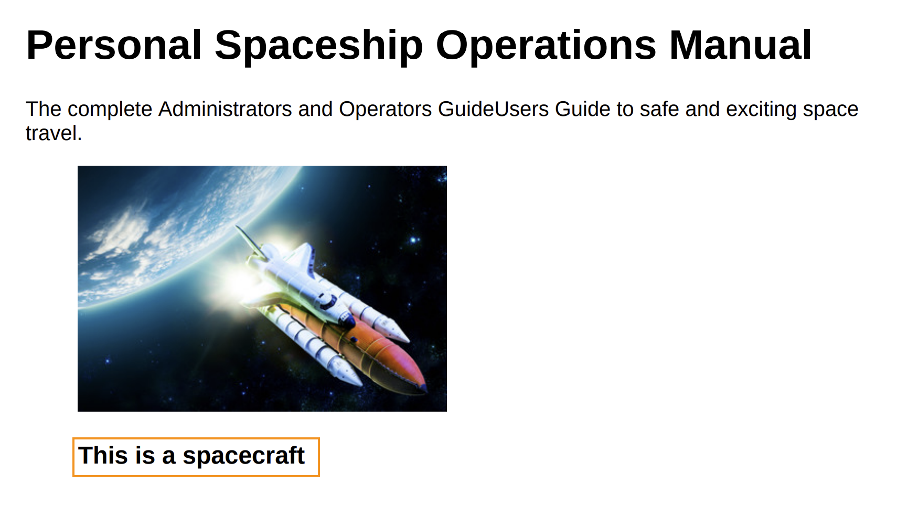

# Utilizzare JavaScript per lavorare con contenuto o stile

La funzione di pubblicazione di PDF nativi consente di eseguire JavaScript per manipolare il contenuto o lo stile applicato al contenuto prima che venga generato il PDF finale. Questa funzione consente di controllare completamente la modalità di generazione dell’output finale. È possibile, ad esempio, aggiungere informazioni relative alle note legali all&#39;output di PDF, che risiede in un altro PDF. Utilizzando JavaScript, puoi aggiungere le informazioni sull’avviso legale una volta creato il PDF per il contenuto di base, ma prima che venga generato il PDF finale.\
Per supportare l’esecuzione di JavaScript, la funzione di pubblicazione nativa di PDF offre le seguenti funzioni di callback:

* `window.pdfLayout.onBeforeCreateTOC(callback)`: questa funzione di callback viene eseguita prima della generazione del sommario.
* `window.pdfLayout.onBeforePagination(callback)`: questa funzione di callback viene eseguita dopo la generazione del sommario, ma prima dell&#39;aggiunta delle interruzioni di pagina nel PDF.
* `window.pdfLayout.onAfterPagination(callback)`: questa funzione di callback viene eseguita dopo l&#39;aggiunta del sommario e delle interruzioni di pagina nel PDF.

>[!NOTE]
>
>Internamente, viene mantenuta una sequenza di esecuzione per queste funzioni di callout. Viene eseguito innanzitutto onBeforeCreateTOC, quindi onBeforePagination e infine onAfterPagination.

In base al tipo di contenuto o alla modifica dello stile che si desidera eseguire, è possibile scegliere la funzione di callback da utilizzare. Ad esempio, se desideri aggiungere contenuti, è consigliabile eseguirli prima di generare il sommario. Allo stesso modo, se desideri apportare alcuni aggiornamenti allo stile, questi possono essere effettuati prima o dopo l’impaginazione.

Nell&#39;esempio seguente, la posizione dei titoli delle figure viene modificata da al di sopra delle immagini a al di sotto delle immagini. A questo scopo, devi abilitare l’opzione di esecuzione JavaScript nel predefinito. A questo scopo, effettua le seguenti operazioni:

1. Apri il predefinito per la modifica.
1. Passa alla scheda **Avanzate**.
1. Selezionare l&#39;opzione **Abilita JavaScript**.
1. Salva il predefinito e chiudi.

Quindi, crea un file JavaScript con il seguente codice e salvalo nella cartella Risorse del modello:

```css
...
/*
* DITA only allows the figure title to be placed above images 
* This JavaScript code is used to move the figure title below the image
* */
window.addEventListener('DOMContentLoaded', function () {
    window.pdfLayout.onBeforeCreateTOC(function() {
        var titleNodes = document.querySelectorAll('.fig > .title')
        for (var i = 0; i < titleNodes.length; i++) {
            var titleNode = titleNodes[i]
            var figNode = titleNode.parentNode
            var imageNode = figNode.querySelector('.image')
            if(imageNode && imageNode.parentNode !== figNode) {
              imageNode = imageNode.parentNode
            }
            if (figNode && imageNode && imageNode.parentNode === figNode) {
                figNode.insertBefore(imageNode, titleNode)
            }
        }
    })
});
...
```

>[!NOTE]
>
>È necessario chiamare la funzione `window.addEventListener('DOMContentLoaded', function ()` prima di utilizzare le funzioni di callback.

Successivamente, è necessario chiamare questo script da un file modello utilizzato per generare l’output di PDF. Nel nostro esempio, lo aggiungeremo nel modello del sommario. Assicurarsi che il tag `<script>` sia aggiunto a un tag `<div>` predefinito all&#39;interno del tag `<body>`. Se lo si aggiunge nel tag `<head>` o all&#39;esterno del tag `<body>`, lo script non verrà eseguito.


L’output generato utilizzando questo codice e il modello visualizza il titolo della figura sotto l’immagine:



## Aggiungere una filigrana all&#39;output PDF per le bozze di documenti {#watermark-draft-document}

È inoltre possibile utilizzare JavaScript per aggiungere filigrane condizionali. Queste filigrane vengono aggiunte al documento quando la condizione definita viene soddisfatta.\
È ad esempio possibile creare un file JavaScript con il codice seguente per creare una filigrana per l&#39;output PDF del documento non ancora approvato. Questa filigrana non viene visualizzata se si genera il PDF per il documento nello stato &quot;Approvato&quot;.

```css
...
/*
* This file can be used to add a watermark to the PDF output
* */

window.addEventListener('DOMContentLoaded', function () {
    var watermark = 'Draft'
    var metaTag = document.getElementsByTagName('meta')
    css = "@page {\n  @left-middle {\n    content: \"".concat(watermark, "\";\n    z-index: 100;\n    font-family: sans-serif;\n    font-size: 80pt;\n    font-weight: bold;\n    color: gray(0, 0.3);\n    text-align: center;\n    transform: rotate(-54.7deg);\n    position: absolute;\n    left: 0;\n    top: 0;\n    width: 100%;\n    height: 100%;\n  }\n}")
    head = document.head || document.getElementsByTagName('head')[0], style = document.createElement('style');
    style.appendChild(document.createTextNode(css));
    window.pdfLayout.onBeforePagination(function () {
        for (let i = 0; i < metaTag.length; i++) {
            if (metaTag[i].getAttribute('name') === 'docstate' && metaTag[i].getAttribute('value') !== 'Approved') {
                head.appendChild(style);
            }
        }
    })
});
...
```

L&#39;output PDF generato utilizzando questo codice visualizza una filigrana *Bozza* nella pagina di copertina del documento:


