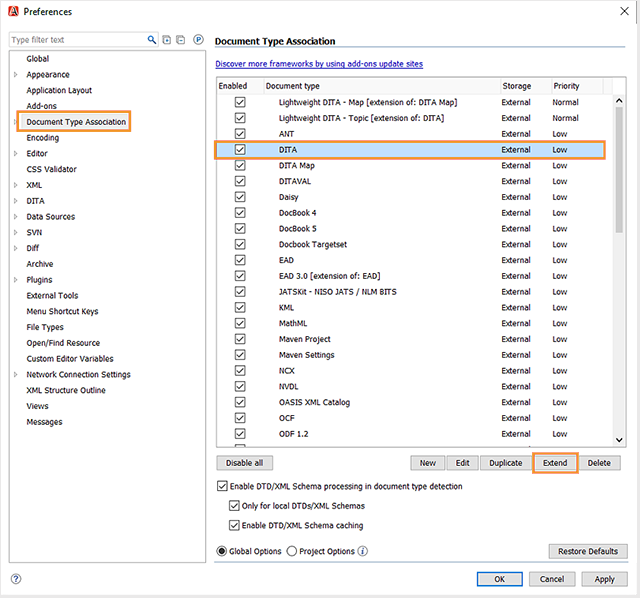
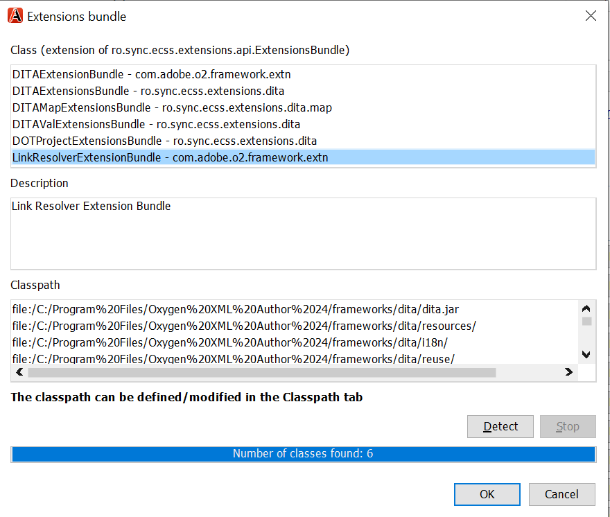
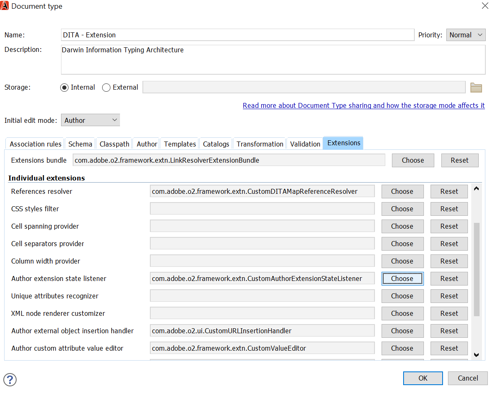
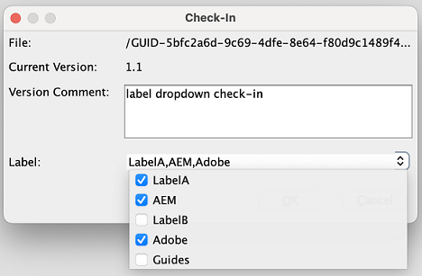
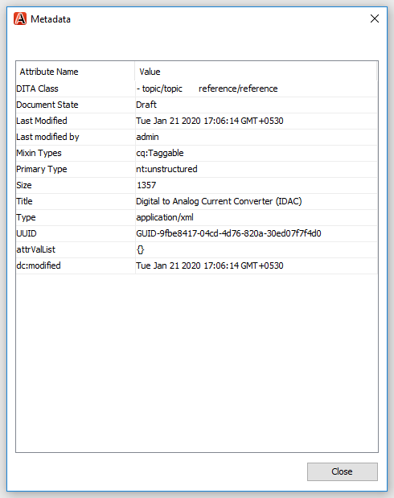

# Plug-in di ossigeno per Adobe Experience Manager Guides {#id1645H6010Q5}

Il plug-in di ossigeno per Adobe Experience Manager Guides \(in seguito denominato plug-in di ossigeno per AEM Guides nella guida\) consente di collegare l’istanza di authoring XML di ossigeno all’archivio Adobe Experience Manager \(AEM\) per la creazione e la gestione dei contenuti. È possibile utilizzare il plug-in per sfogliare, cercare e aprire file, estrarre e archiviare file, caricare cartelle e file nel repository AEM. Il pannello AEM Guides nell’applicazione desktop consente di contrassegnare le cartelle desiderate \(dall’archivio AEM\) nell’elenco delle cartelle preferite per un accesso rapido. Inoltre, puoi installare un pacchetto nell’interfaccia web AEM e aprire i file DITA in Oxygen XML Author direttamente dall’interfaccia web AEM.

## Scarica e installa {#id1826M0L0PUI}

Il plug-in ossigeno per AEM Guides è disponibile tramite il portale di distribuzione software Adobe. Cerca &quot;ossigeno&quot; nella scheda Experience Manager, quindi scarica il programma di installazione del plug-in dal [portale di distribuzione software Adobe](https://experience.adobe.com/#/downloads/content/software-distribution/en/general.html).

>[!NOTE]
>
>Verifica la compatibilità della versione del connettore di ossigeno dalle note sulla versione per l’Adobe Experience Manager Guides specifico.

Una volta installato il programma di installazione, installarlo nel computer locale in cui è installato Oxygen XML Author. Prima di iniziare il processo di installazione, è necessario assicurarsi che il sistema soddisfi i requisiti tecnici per installare il plug-in di ossigeno per AEM Guides.

### Requisiti tecnici

- Autore Oxygen XML versione 25.1

- Adobe Experience Manager Guides versione 4.3 o successiva

- Adobe Experience Manager versione 6.5 con Service Pack 14, 15, 16 e 17

- Sistema operativo supportato da Oxygen XML Author versione 25.1

- Java Development Kit
   - Oracle SE 8 JRE 1.8

### Installare il plug-in su Windows

>[!IMPORTANT]
>
>Se nel sistema è installata una versione precedente del plug-in, accertarsi di disinstallarla prima di avviare il processo di installazione. Per istruzioni sulla disinstallazione, consulta la sezione **Disinstallazione dei pacchetti** nell&#39;articolo [Come utilizzare i pacchetti](https://helpx.adobe.com/experience-manager/6-4/sites/administering/using/package-manager.html).

Effettuare le seguenti operazioni sul sistema in cui è installato Oxygen XML Author:

1. Avvia il file `.exe` del programma di installazione.

   Viene visualizzata la schermata iniziale dell&#39;installazione guidata.

1. Fai clic su **Avanti** e individua il percorso in cui è disponibile il file .exe di Oxygen XML Author.

1. Selezionare il file e fare clic su **Apri**.

   Il percorso del file selezionato viene aggiunto nella procedura guidata di installazione.

1. Fai clic su **Avanti**.

1. Fare clic su **Installa**.

1. Fare clic su **Fine** per chiudere l&#39;installazione guidata.
1. Avvia Oxygen XML Author.

   Il pannello AEM Guides viene visualizzato in Oxygen XML Author.

   {width="800" align="left"}

   >[!NOTE]
   >
   >Se il pannello AEM Guides non è visualizzato, consulta le soluzioni nella sezione relativa alla risoluzione dei problemi:[Pannello AEM Guides mancante](#id192BH200ZAX).


### Installare il plug-in su Mac

>[!IMPORTANT]
>
>Se nel sistema è installata una versione precedente del plug-in, accertarsi di disinstallarla prima di avviare il processo di installazione. Consulta la sezione **Disinstallazione dei pacchetti** nelle istruzioni di disinstallazione dell&#39;articolo [Come utilizzare i pacchetti](https://helpx.adobe.com/experience-manager/6-4/sites/administering/using/package-manager.html).

Effettuare le seguenti operazioni sul sistema in cui è installato Oxygen XML Author:

1. Individua il file .dmg del plug-in sul tuo sistema.

1. Fare doppio clic sul file .dmg per aprire il contenuto del file.

   Il file .dmg contiene una cartella aem-connector-x.x e un file di installazione aem-connector-x.x.

   >[!NOTE]
   >
   >x.x nei nomi file è il numero di versione del plug-in.

1. Copia la cartella aem-connector-x.x nella cartella dei plug-in di Oxygen XML Author.
1. Fai doppio clic sul file di configurazione aem-connector-x.x per avviare il programma di installazione.

1. Avvia Oxygen XML Author.

   Il pannello AEM Guides viene visualizzato in Oxygen XML Author.

    {width="800" align="left"}

   >[!NOTE]
   >
   >Se il pannello AEM Guides non è visualizzato, consulta le soluzioni nella sezione relativa alla risoluzione dei problemi:[Pannello AEM Guides mancante](#id192BH200ZAX).


### Installa il pacchetto per abilitare la funzione di modifica dei documenti dall’interfaccia web AEM {#id182CE0Q0TY4}

In qualità di autore, è possibile aprire e modificare le mappe DITA o gli argomenti in Oxygen XML Author direttamente dall&#39;interfaccia Web AEM. Per abilitare questa funzione nell’interfaccia web dell’AEM, l’amministratore AEM deve installare un pacchetto nell’istanza di authoring dell’AEM.

In qualità di amministratore AEM, effettua le seguenti operazioni per installare il pacchetto:

1. Ottieni il file .zip del pacchetto dal tuo team IT.
1. Accedi all&#39;istanza dell&#39;AEM *\(come amministratore\)* e passa a Gestione pacchetti CRX. L’URL predefinito per accedere al gestore di pacchetti è

   `http://<server name>:<port>/crx/packmgr/index.jsp`

   Gestione pacchetti gestisce i pacchetti nell’installazione AEM locale. Per ulteriori informazioni sull&#39;utilizzo di Gestione pacchetti, vedere [Come utilizzare i pacchetti](https://experienceleague.adobe.com/docs/experience-manager-cloud-service/content/implementing/developer-tools/package-manager.html?lang=en) nella documentazione AEM.

    {width="650" align="left"}

1. Per caricare il pacchetto ossigeno, fare clic su **Carica pacchetto**.
1. Nella finestra di dialogo Carica pacchetto, individua il file del pacchetto di ossigeno scaricato al punto 1 e fai clic su OK.

   Il pacchetto viene caricato nell’istanza AEM.

1. Per avviare il processo di installazione, fare clic su **Installa**.

   {width="650" align="left"}

1. Nella finestra di dialogo Installa pacchetto, fai clic su **Installa**.
1. Al termine dell’installazione, fai clic sul pulsante Home nell’angolo superiore sinistro di Gestione pacchetti CRX.
1. Seleziona un file DITA nella cartella delle risorse.

   L&#39;opzione **Modifica in ossigeno** è disponibile nella barra degli strumenti. Per ulteriori informazioni sull&#39;utilizzo di questa opzione, vedere l&#39;argomento [Open DITA in Oxygen XML Author dall&#39;interfaccia Web AEM](#id182CE0I905Z).

   >[!NOTE]
   >
   >L&#39;opzione **Modifica in ossigeno** è visibile quando si seleziona un argomento DITA. Se si selezionano più argomenti, l&#39;opzione non sarà visibile.


## Configurare il plug-in ossigeno per AEM Guides {#id1826KF00AHS}

Dopo aver scaricato e installato il plug-in, devi configurare i seguenti elementi affinché funzionino con il plug-in:

- **Impostazioni di autenticazione Web**: Impostazioni per l&#39;autenticazione SSO nel plug-in per AEM Guides.
- **Impostazioni generali**: impostazioni di connessione per il plug-in, ad esempio URL del server AEM, dettagli di accesso e così via.
- **Preferenza per la personalizzazione degli attributi di profiling e nomi di file e nei riferimenti incrociati**: questa configurazione è necessaria per gli schemi di attributi di profiling per i set di documentazione.

### Impostazioni di autenticazione Web

JxBrowser viene utilizzato per l’autenticazione SSO dal plug-in del connettore ossigeno. È un browser basato sul cromo. Per Java 9+ è necessario accedere alle API non pubbliche e devi concedere esplicitamente questo accesso a JxBrowser. Per ulteriori dettagli, vedere [Risoluzione dei problemi JxBrowser](https://jxbrowser-support.teamdev.com/docs/guides/troubleshooting/issues.html).

Aggiorna i file forniti per configurare le impostazioni di autenticazione web nel plug-in di ossigeno per AEM Guides:

>[!NOTE]
>
>Crea una copia di backup del file prima di aggiornarlo.

**Per Mac e ossigeno 25.1**

Aggiungi le seguenti righe in env.sh

```java
--illegal-access=permit\
--add-opens=java.desktop/javax.swing.plaf.basic=ALL-UNNAMED\
--add-exports=javafx.controls/com.sun.javafx.scene.control=ALL-UNNAMED\
--add-exports=javafx.graphics/com.sun.javafx.stage=ALL-UNNAMED\
--add-exports=javafx.graphics/com.sun.javafx.scene=ALL-UNNAMED\
--add-exports=javafx.graphics/com.sun.javafx.scene.traversal=ALL-UNNAMED\
--add-exports=javafx.graphics/com.sun.javafx.tk=ALL-UNNAMED\
--add-exports=javafx.graphics/com.sun.glass.ui=ALL-UNNAMED\
--add-opens=javafx.graphics/com.sun.glass.ui=ALL-UNNAMED\
--add-opens=javafx.graphics/javafx.stage=ALL-UNNAMED\
--add-opens=javafx.graphics/com.sun.javafx.tk.quantum=ALL-UNNAMED\
--add-exports=java.desktop/sun.awt=ALL-UNNAMED\
--add-opens javafx.swing/javafx.embed.swing=ALL-UNNAMED
```

Aggiungi le seguenti righe in ossigenoAuthor.sh

```java
-Djdk.module.illegalAccess=permit\-Djava.ipc.external=true\
```

**Per Windows e ossigeno 25.1**

Aggiungi le seguenti righe in env.bat

```java
--illegal-access=permit --add-opens=java.desktop/javax.swing.plaf.basic=ALL-UNNAMED --add-exports=javafx.controls/com.sun.javafx.scene.control=ALL-UNNAMED --add-exports=javafx.graphics/com.sun.javafx.stage=ALL-UNNAMED --add-exports=javafx.graphics/com.sun.javafx.scene=ALL-UNNAMED --add-exports=javafx.graphics/com.sun.javafx.scene.traversal=ALL-UNNAMED --add-exports=javafx.graphics/com.sun.javafx.tk=ALL-UNNAMED --add-exports=javafx.graphics/com.sun.glass.ui=ALL-UNNAMED --add-opens=javafx.graphics/com.sun.glass.ui=ALL-UNNAMED --add-opens=javafx.graphics/javafx.stage=ALL-UNNAMED --add-opens=javafx.graphics/com.sun.javafx.tk.quantum=ALL-UNNAMED --add-exports=java.desktop/sun.awt=ALL-UNNAMED --add-opens javafx.swing/javafx.embed.swing=ALL-UNNAMED
```

Aggiungi le seguenti righe in ossigenoAuthor.bat

```java
-Djdk.module.illegalAccess=permit -Djava.ipc.external=true
```

>[!NOTE]
>
>È necessario eseguire ossigeno da ossigenoAuthor.sh per Mac e ossigenoAuthor.bat per Windows come amministratore.

### Impostazioni generali

Per configurare le impostazioni di connessione nel plug-in ossigeno per Adobe Experience Manager Guides, effettua le seguenti operazioni:

1. Nel pannello AEM Guides, fai clic sull&#39;icona delle impostazioni, quindi seleziona **Impostazioni**.

   {width="800" align="left"}

1. Specifica i dettagli seguenti:
   - **URL server**: URL del server AEM, ad esempio:

     ```http
     http[s]://<host>:<port>
     ```

     Nell’URL precedente, specifica il nome host e la porta del server in cui viene distribuito il server AEM.

     >[!IMPORTANT]
     >
     >Se il server AEM è distribuito sulla porta 80 o 443, non è necessario specificarlo nell’URL.

   - **Autenticazione:** Scegliere tra **Base \(Nome utente/Password\)** o **Autenticazione Web**. Se selezioni l&#39;autenticazione **Basic** devi immettere il **Nome utente** e la **Password** nella finestra di dialogo Preferenze.

     Se selezioni Autenticazione web, viene visualizzata la schermata di accesso AEM. Immetti le credenziali di accesso e fai clic sul pulsante **Accedi**. Una volta effettuato correttamente l’accesso, la schermata di accesso AEM si chiude e il pannello AEM Guides visualizza l’elenco dei file dal server AEM.

   - **Timeout connessione**: specifica il tempo in secondi che il client deve attendere una risposta dal server AEM. Se non viene ricevuta alcuna risposta dal server entro il tempo specificato, la richiesta viene terminata. Il valore predefinito è 20 secondi.

   - **Cartella locale**: percorso nel computer locale in cui vengono archiviati i file dall&#39;archivio AEM dopo l&#39;estrazione. Se si specifica un percorso che non esiste nell&#39;unità, il plug-in crea tale percorso.
   - **Apri file all&#39;estrazione**: se selezionata, apre i file all&#39;estrazione.
   - **Chiudi file al momento dell&#39;archiviazione**: se selezionata, chiude i file al momento dell&#39;archiviazione. Prima di chiudere il file, viene visualizzato un pop-up in cui è possibile specificare i commenti sulla versione.
   - **Mostra finestra di dialogo Archiviazione alla chiusura del file**: se selezionata, verrà visualizzato un popup alla chiusura di un file. Nella finestra a comparsa è possibile scegliere di archiviare il file o di chiuderlo senza archiviarlo.
   - **Estrazione automatica file all&#39;apertura**: se selezionata, facendo doppio clic su un file viene automaticamente estratta e aperta per la modifica. Se il file è già stato estratto, viene semplicemente aperto per la modifica. Se questa opzione non è selezionata, l&#39;apertura di un file sul quale non si dispone di un blocco comporta l&#39;apertura in modalità di sola lettura.
1. Fai clic su **OK**.

### Preferenza per la personalizzazione degli attributi di profilatura e i nomi dei file nei riferimenti incrociati {#id1827K0D0OHT}

È necessario configurare le preferenze in Oxygen XML Author per utilizzare l&#39;attributo di profilatura associato agli argomenti DITA nell&#39;archivio AEM. È inoltre necessario configurare la preferenza per la visualizzazione dei nomi di file al posto dei GUID nei riferimenti incrociati.

Per configurare gli attributi di profilatura e i riferimenti incrociati, effettuare le seguenti operazioni:

1. In Autore XML ossigeno, fare clic su **Opzioni** \> **Preferenze**.
1. Nella scheda **Associazione tipo documento**, selezionare **DITA**, quindi fare clic su **Estendi**.

   {width="650" align="left"}

1. Nella scheda **Classpath**, seleziona `com.adobe.o2.connector` nel menu a discesa **Use Parent Class Loader From Plugin con ID**.

   {width="650" align="left"}

1. Nella scheda **Estensioni**, apporta le seguenti modifiche:

   - Fai clic su **Scegli** accanto al bundle **Estensioni** e seleziona   `LinkResolverExtensionBundle - com.adobe.o2.framework.extn` nell&#39;elenco **Classe**. Fai clic su **OK**.
      {width="650" align="left"}
   - Fai clic su **Scegli** accanto a **Listener dello stato dell&#39;estensione dell&#39;autore** in **Estensioni individuali** e seleziona `CustomAuthorExtensionStateListener - com.adobe.o2.framework.extn` nell&#39;elenco **Classe**. Fai clic su **OK**.
   - Fai clic su **Scegli** accanto a **Editor valore attributo personalizzato autore** in **Singole estensioni** e seleziona `CustomValueEditor - com.adobe.o2.framework.extn` nell&#39;elenco **Classe**. Fai clic su **OK**.
   - Fai clic su **Scegli** accanto al gestore di inserimento dell&#39;oggetto esterno **Author** in **Singole estensioni** e seleziona `CustomURLInsertionHandler - com.adobe.o2.ui ` nell&#39;elenco **Classe**. Fai clic su **OK**.


   La schermata seguente mostra la scheda **Estensione** configurata per gli argomenti DITA:
   
1. Fai clic su **OK** in tutte le finestre di dialogo per salvare le modifiche.

### Configura estensione mappa DITA

La configurazione dell&#39;estensione mappa DITA è necessaria per consentire l&#39;apertura di file mappa in Oxygen XML Author direttamente dall&#39;interfaccia Web AEM. Queste configurazioni sono simili a quelle per gli attributi di profilatura eseguite nella procedura precedente.

Per configurare l&#39;estensione mappa DITA, effettuare le seguenti operazioni:

1. In Autore XML ossigeno, fare clic su **Opzioni** \> **Preferenze**.
1. Nella scheda **Associazione tipo documento**, selezionare **Mappa DITA**, quindi fare clic su **Estendi**.
1. Nella scheda **Classpath**, seleziona com.adobe.o2.connector nel menu a discesa **Use Parent Class Loader From Plugin con ID**.
1. Nella scheda **Estensioni**, apporta le seguenti modifiche:
   - Fai clic su **Scegli** accanto al bundle **Estensioni** e seleziona   `com.adobe.o2.framework.extn.LinkResolverDITAMapExtensionBundle` nell&#39;elenco **Classe**. Fai clic su **OK**.

   - Fai clic su **Scegli** accanto a **Listener dello stato dell&#39;estensione dell&#39;autore** in **Estensioni individuali** e seleziona `CustomDITAMapAuthorExtensionStateListener - com.adobe.o2.framework.extn` nell&#39;elenco **Classe**. Fai clic su **OK**.

   - Fai clic su **Scegli** accanto al gestore di inserimento dell&#39;oggetto esterno **Author** in **Singole estensioni** e seleziona `CustomURLInsertionHandler - com.adobe.o2.ui ` nell&#39;elenco **Classe**. Fai clic su **OK**.

   - Fai clic su **Scegli** accanto a **Editor valore attributo personalizzato autore** in **Singole estensioni** e seleziona `CustomValueEditor - com.adobe.o2.framework.extn` nell&#39;elenco **Classe**. Fai clic su **OK**.

   - Fai clic su **Scegli** accanto al **Risolutore riferimenti** in **Singole estensioni** e seleziona `CustomDITAMapReferenceResolver - com.adobe.o2` nell&#39;elenco **Classe**. Fai clic su **OK**.
   - *\(Facoltativo\)* Se non desideri risolvere i riferimenti durante l&#39;apertura di un file di mappa, devi eseguire la seguente configurazione aggiuntiva:

   La schermata seguente mostra la scheda **Estensione** configurata:
   

1. Fai clic su **OK** in tutte le finestre di dialogo per salvare le modifiche.

## Utilizzare il plug-in di ossigeno per AEM Guides {#id1826JG00WY4}

### Pannello AEM Guides

La schermata seguente mostra il pannello AEM Guides.

{width="550" align="left"}

**A**\) Visualizza la barra di ricerca.

**B**\) Visualizza la cartella Preferiti. Per impostazione predefinita, è vuoto. Puoi aggiungere cartelle dall’archivio AEM come preferite; le cartelle preferite vengono quindi visualizzate qui.

**C**\) La cartella DAM mostra l&#39;archivio AEM. È possibile espandere e comprimere la visualizzazione delle cartelle.

**D**\) Icona Impostazioni \(ingranaggio\) con le seguenti opzioni:

- **Connetti**: selezionare questa opzione per connettersi al server AEM. L’opzione è disabilitata quando Oxygen XML Author è connesso al server AEM.
- **Aggiorna**: selezionare questa opzione per ottenere lo stato più recente dei file e della cartella dall&#39;archivio AEM.

  >[!NOTE]
  >
  >Assicurarsi di salvare i file prima di aggiornarli. Quando si seleziona l&#39;opzione **Aggiorna**, viene visualizzato un avviso per il salvataggio dei file prima di aggiornarli. Se non hai salvato i file, puoi fare clic su **Annulla** e salvarli.

- **Impostazioni**: è possibile utilizzare questa opzione per aprire la finestra di dialogo Preferenze generali del plug-in.
- **Disconnessione**: selezionare questa opzione per chiudere la connessione al server AEM. Questa opzione è disponibile solo se si utilizza la modalità Autenticazione Web.

### Funzioni del menu di scelta rapida

Le funzioni del plug-in di ossigeno per AEM Guides sono disponibili facendo clic con il pulsante destro del mouse su una cartella o un file nell’archivio AEM. Le funzioni disponibili per le cartelle sono diverse dai file. Elenco completo delle funzioni del menu di scelta rapida di Oxygen Plugin for AEM Guides:

- **Apri**: apre il file selezionato o espande la cartella selezionata.
- **Apri in**: puoi scegliere di aprire il file selezionato nell&#39;Editor Web o nel Dashboard di AEM Guides oppure nell&#39;Editor mappe. Per ulteriori informazioni su queste opzioni, vedere [Apri file nell&#39;editor di AEM Guides](#id195GH0V30KX).
- **Estrazione**: estrae un file dall&#39;archivio AEM. Per ulteriori dettagli, vedere [File di estrazione](#id195HC020TS4).
- **Estrai con dipendenti**: estrae un file con i relativi riferimenti diretti. Per ulteriori dettagli, vedere [File di estrazione](#id195HC020TS4).
- **Estrai con elementi dipendenti di sola lettura**: estrae il file selezionato e i relativi elementi dipendenti. Non è possibile apportare alcuna modifica nei file dipendenti. Per ulteriori dettagli, vedere [File di estrazione](#id195HC020TS4).
- **Annulla estrazione**: annulla il file estratto, chiude il file dall&#39;editor e ripristina l&#39;ultima versione del file salvato sul server.
- **Aggiorna**: in caso di file, recupera la copia più recente del file dall&#39;archivio AEM. Per una cartella, recupera la struttura della cartella e lo stato del file. Questo significa che viene aggiunto un file, che verrà quindi visualizzato nella vista AEM Guides. Inoltre, se un file viene estratto sul server AEM, l&#39;esecuzione di un aggiornamento in Oxygen Author mostrerà il file come estratto. Tuttavia, questo non aggiorna l&#39;elenco dei file nella visualizzazione *File estratti in AEM Guides*.
- **Aggiorna file estratti**: aggiorna l&#39;elenco dei file estratti nella visualizzazione *File estratti in AEM Guides*. Se un file viene estratto sul server AEM, l&#39;esecuzione di un aggiornamento aggiornerà l&#39;elenco dei file estratti nella visualizzazione *File estratti in AEM Guides*. Tuttavia, se è stato aggiunto un nuovo file o lo stato di un file è stato modificato, tale file non viene aggiornato nella struttura di AEM Guides. Per aggiornare lo stato dei file su AEM, è necessario eseguire un&#39;operazione di aggiornamento.
- **Archivia**: archivia un file estratto. Per ulteriori dettagli, vedere [Archiviare un file](#id182CF0J0FHS).
- **Archivia con elementi dipendenti**: se sono stati estratti file con elementi dipendenti, questa opzione consente di archiviare il file principale insieme ai relativi elementi dipendenti. Per ulteriori dettagli, vedere [Archiviare un file](#id182CF0J0FHS).
- **Crea cartella**: crea una cartella nell&#39;archivio AEM. Questa opzione è disponibile solo a livello di cartella.
- **Carica file\(s\)**: carica uno o più file. Per ulteriori dettagli, vedere [Caricare file e cartelle](#id195HC03F03J).
- **Carica con dipendenti**: carica i file DITA \(XML, DITA, Mappa registro o Mappa DITA\) con i relativi dipendenti. Per ulteriori dettagli, vedere [Caricare file e cartelle](#id195HC03F03J).
- **Carica cartella**: carica una cartella nell&#39;archivio AEM. Per ulteriori dettagli, vedere [Caricare file e cartelle](#id195HC03F03J).
- **Aggiungi ai preferiti**: aggiunge una cartella alla cartella *Preferiti* nel pannello AEM Guides. Si consiglia di aggiungere qui la cartella di lavoro per semplificare la sincronizzazione dei file e dello stato del file da AEM.
- **Rimuovi dai preferiti**: rimuove una cartella da *Preferiti*. Per ulteriori dettagli, vedere [Aggiungere o rimuovere Preferiti](#id195HC04405P).
- **Visualizza metadati**: mostra i metadati quali la classe DITA, il titolo, il tipo, l&#39;UUID del documento e altre informazioni associate a un file. Per ulteriori dettagli, vedere [Visualizzare i metadati di un file](#id195GHN0H05C).
- **Visualizza versioni**: mostra la cronologia delle versioni di un file. Per ulteriori dettagli, vedere [Visualizzare la cronologia delle versioni di un file](#id195GI000D5Q).

### Aprire un file in Oxygen XML Author {#id195GHJ0A0UB}

Una volta connessi all’archivio AEM, puoi aprire i file per la modifica nell’Autore XML di ossigeno. Per aprire un file per la modifica in Oxygen XML Author, effettuare le seguenti operazioni:

1. Fate clic con il pulsante destro del mouse su un file nel pannello AEM Guides che desiderate aprire per la modifica.

1. Seleziona **Apri** dal menu di scelta rapida.

   Il file viene aperto nell&#39;editor di Oxygen XML Author.

    {width="800" align="left"}

   Quando passi il puntatore del mouse sulla scheda di un file, viene visualizzato il percorso del server e il relativo UUID. Nella schermata precedente, viene evidenziato l’UUID del documento.


Se è stata selezionata l&#39;opzione **File di estrazione automatica all&#39;apertura** \(nella finestra di dialogo Preferenze\), all&#39;apertura di un file il file viene estratto automaticamente ed è disponibile per la modifica. Per aprire un file, è possibile fare doppio clic sul nome di un file oppure fare clic con il pulsante destro del mouse sul nome del file e scegliere **Apri** dal menu di scelta rapida. Se questa opzione non è selezionata, il file viene aperto in modalità di sola lettura.

>[!NOTE]
>
>È inoltre possibile fare doppio clic su un file per aprirlo.

### Apri il file nell’editor di AEM Guides {#id195GH0V30KX}

Se desideri utilizzare gli editor disponibili in AEM Guides, puoi farlo selezionando l’opzione desiderata dal menu di scelta rapida. Per utilizzare l’editor di AEM Guides al posto dell’editor di Oxygen XML Author, effettua le seguenti operazioni:

1. Fate clic con il pulsante destro del mouse su un file nel pannello AEM Guides che desiderate aprire per la modifica.

1. Seleziona **Apri in** dal menu di scelta rapida e scegli tra le seguenti opzioni:

   - **Editor argomenti Web**: se il file che si sta aprendo è un file con estensione xml o dita, è possibile aprirlo per la modifica nell&#39;editor Web. Scegliere l&#39;opzione **Editor argomenti Web** per aprire il file selezionato per la modifica nell&#39;editor Web.

   - **Map Dashboard**: puoi scegliere di modificare un file .ditamap nel dashboard delle mappe, in cui puoi eseguire varie operazioni sul file mappa. Queste operazioni dipendono dal ruolo/gruppo a cui appartieni.

   - **Web DITA Map Editor**: se si desidera aprire il file .ditamap per la modifica nell&#39;Editor mappe, scegliere questa opzione. Utilizzando l&#39;opzione Editor mappe DITA, è possibile aggiungere o rimuovere argomenti, aggiungere tabelle di relazioni ed eseguire altre operazioni sulla mappa.


### File di estrazione {#id195HC020TS4}

Quando si estrae un file, questo viene memorizzato localmente nel sistema e bloccato per la modifica nel repository AEM. Per estrarre un file, effettuare le seguenti operazioni:

1. È possibile estrarre i file in uno dei modi seguenti:
   - Fate clic con il pulsante destro del mouse su un file nel pannello AEM Guides.
   - Fate clic con il pulsante destro del mouse sulla scheda Mappa (Map) nel pannello Gestione mappe DITA.
   - Fate clic con il pulsante destro del mouse su un file nel pannello Gestione mappe DITA (DITA Maps Manager).
   - Fare clic con il pulsante destro del mouse sulla scheda del file quando si apre una mappa o un argomento nell&#39;editor.

1. Selezionare una delle opzioni seguenti:
   - **Estrazione:** estrae un file dall&#39;archivio AEM e lo rende disponibile per la modifica.
   - **Estrai con dipendenti**: estrae un file con i relativi riferimenti diretti. Con questa opzione è possibile apportare modifiche alle pagine padre e figlio. Il plug-in ossigeno per AEM Guides supporta il check-out di un livello di dipendenti. Ad esempio, Mappa A fa riferimento all&#39;Argomento A e all&#39;Argomento A fa riferimento all&#39;Argomento B. Il Check-Out della Mappa A estrae l&#39;Argomento A indipendentemente dal suo livello nella gerarchia del sommario. Tuttavia, non estrarrà l’argomento B perché non è collegato direttamente dalla mappa A.
   - **Estrai con dipendenti di sola lettura**: estrae un file e scarica i relativi dipendenti nel computer locale come copie di sola lettura. Non è possibile apportare alcuna modifica nei file dipendenti.

Se è stata selezionata l&#39;opzione **Apri file al momento dell&#39;estrazione** \(nella finestra di dialogo Preferenze\), al momento dell&#39;estrazione il file viene automaticamente aperto per la modifica.

Se è stata selezionata l&#39;opzione **File di estrazione automatica all&#39;apertura** \(nella finestra di dialogo Preferenze\), all&#39;apertura del file il file viene automaticamente estratto e reso disponibile per la modifica. Per aprire un file, è possibile fare doppio clic sul nome di un file oppure fare clic con il pulsante destro del mouse sul nome del file e scegliere **Apri** dal menu di scelta rapida.

Quando un file viene estratto, l&#39;icona del file cambia per mostrare lo stato di blocco.

{width="650" align="left"}

Nella schermata precedente, un file estratto da un altro utente viene visualizzato con un&#39;icona di blocco di colore nero \(A\). Il file estratto dall&#39;utente corrente viene visualizzato con un blocco verde \(B\).

>[!NOTE]
>
>Se il file estratto viene eliminato o spostato in un&#39;altra cartella in AEM, viene visualizzato un messaggio di errore quando si archivia il file. Verificare che il file estratto non venga spostato o eliminato tramite l&#39;interfaccia Web AEM.

### Archiviare un file {#id182CF0J0FHS}

Quando si archivia un file, la copia locale dal sistema viene memorizzata nell&#39;archivio AEM e il blocco del file viene rimosso. Per archiviare un file, effettuare le seguenti operazioni:

1. Salvare il file facendo clic su **File** \> **Salva**.

1. Fare clic con il pulsante destro del mouse su un file o una mappa estratti in una delle seguenti posizioni:
   - Pannello AEM Guides
   - Pannello Gestione mappe DITA
   - Scheda File quando si apre una mappa o un argomento nell&#39;editor.
   - Scheda Mappa nel pannello Gestione mappe DITA.

1. Scegliete una delle due opzioni seguenti:

   - **Archiviazione**: archivia il file selezionato dal sistema locale nell&#39;archivio AEM.
   - **Archivia con dipendenti:** Se si è estratto un file insieme ai relativi dipendenti, utilizzare questa opzione per archiviare tutti i file dipendenti in una singola operazione. Quando si seleziona questa opzione, viene visualizzata la finestra di dialogo Check-in con tutti i file dipendenti. Fare clic su OK per archiviare tutti i file contemporaneamente.

   Se non sono stati estratti i file dipendenti e si sceglie questa opzione, verranno archiviati solo i file dipendenti di cui è stato eseguito il Check-Out \(separatamente\). Verrà visualizzato un elenco dei file che non è stato possibile archiviare:

   {width="800" align="left"}

   Si consiglia vivamente di non spostare un file estratto. Se tuttavia un file estratto viene spostato in un percorso diverso, è necessario annullare l&#39;estrazione del file. Se si desidera aggiornare il file, estrarlo di nuovo, apportare le modifiche e quindi archiviarlo di nuovo. Se si tenta di archiviare un file che è stato spostato dalla posizione originale, verrà visualizzato un errore.

   Se un file dipendente viene estratto in AEM, Check-In con dipendenti non mostrerà il file dipendente nella finestra di dialogo Check-in. Per ottenere un elenco dei file dipendenti estratti in AEM, è necessario eseguire un aggiornamento della cartella.

   Analogamente, se è stato archiviato un file dipendente tramite AEM, l&#39;elenco dei file non viene aggiornato in Oxygen Author fino a quando non si esegue una cartella Aggiorna e aggiorna file estratti. Se si esegue un Check-in con gli utenti dipendenti con alcuni file archiviati tramite AEM, verrà visualizzato un messaggio di errore in cui sono elencati i file che non è stato possibile archiviare.

1. \(Facoltativo\) Nella finestra di dialogo **Archivia** o **Archivia con dipendenti** aggiungere un commento nella casella di testo **Commenti versione**.

   >[!NOTE]
   >
   >Questo commento viene visualizzato nella cronologia delle versioni AEM del file.

1. Aggiungi le etichette nella casella di testo **Etichetta** nella finestra di dialogo **Archivia** o **Archivia con dipendenti**. Immettere un&#39;etichetta e premere Invio. Ad esempio, *2307 versione*.

   Se l&#39;amministratore ha predefinito un elenco di etichette e le ha caricate nel file `label.json`, queste vengono visualizzate come un elenco a discesa. Puoi scegliere una o più etichette dal menu a discesa.

   {width="550" align="left"}

   È possibile aggiungere più etichette (separate da virgole) alla stessa versione di un argomento.  *Adobe*, *AEM*, *Guide*.
Tuttavia, non è possibile aggiungere la stessa etichetta alle diverse versioni di un argomento. Se aggiungi un’etichetta già aggiunta a una versione precedente, questa viene aggiunta all’ultima versione e rimossa dalla versione precedente.

   >[!NOTE]
   > 
   > Queste etichette vengono visualizzate nella cronologia delle versioni AEM del file.


1. Fai clic su **OK**.

>[!NOTE]
>
>Se il file estratto viene eliminato o spostato in un&#39;altra cartella in AEM, viene visualizzato un messaggio di errore quando si archivia il file. Verificare che il file estratto non venga spostato o eliminato tramite l&#39;interfaccia Web AEM.

### File estratti nella visualizzazione AEM Guides

Se si dispone di più cartelle, non è facile individuare il numero di file estratti in una visualizzazione. AEM Guides fornisce File estratti nella visualizzazione AEM Guides che fornisce un’istantanea completa dei file attualmente estratti. Utilizzando questa visualizzazione, è possibile individuare facilmente i file che sono stati controllati dall’utente nell’archivio AEM utilizzando AEM Guides. Per accedere e utilizzare questa visualizzazione, effettuare le seguenti operazioni:

1. Fai clic su **Finestra** \> **Mostra visualizzazione** \> **File estratti in AEM Guides**.

   Viene visualizzata la visualizzazione File estratti in AEM Guides.

   {width="550" align="left"}

1. Fare clic con il pulsante destro del mouse su un file in questa visualizzazione per visualizzare le opzioni seguenti:

   - [Apri](#id195GH0V30KX)
   - [Apri in](#id195GH0V30KX)
   - Annulla estrazione
   - [Check-in](#id182CF0J0FHS)
   - [Check-in con dipendenti](#id182CF0J0FHS)
   - [Visualizza metadati](#id195GHN0H05C)
   - [Visualizza versioni](#id195GI000D5Q)

**Note sui file estratti nella visualizzazione AEM Guides:**

- La visualizzazione *File estratti in AEM Guides* mantiene le sessioni dell&#39;utente. Ciò significa che i file estratti dall’utente corrente vengono memorizzati e mantenuti nella visualizzazione in tutte le sessioni \(o cache\) dello stesso utente.

- Se l&#39;utente modifica le credenziali di accesso o il server AEM, i dati del file estratto \(o cache\) nella visualizzazione vengono reimpostati. L&#39;utente deve eseguire manualmente un comando *Aggiorna file estratti* in ogni cartella da cui i file sono stati estratti in precedenza. Per semplificare, si consiglia di aggiungere le cartelle di lavoro a *Preferiti*, da cui è possibile aggiornare rapidamente una cartella.

- È possibile ordinare l&#39;elenco dei file in base ai relativi nomi di file, Titolo o Percorso. Se viene estratto un nuovo file, il file viene visualizzato in ordine nella vista.


### Caricare file e cartelle {#id195HC03F03J}

Per caricare file o cartelle, effettua le seguenti operazioni:

1. Fate clic con il pulsante destro del mouse su una cartella nel pannello AEM Guides.
1. Selezionare una delle opzioni seguenti:
   - **Carica file\(s\)**: selezionare questa opzione per caricare uno o più file nella cartella selezionata nell&#39;archivio AEM. Nella finestra di dialogo Seleziona i file \(s\) da caricare, seleziona i file e fai clic su **Apri**.
   - **Carica con dipendenti**: selezionare questa opzione per caricare un file DITA con i relativi dipendenti. Nella finestra di dialogo Seleziona il file da caricare, seleziona i file e fai clic su **Apri**.
   - **Carica cartella**: selezionare questa opzione per caricare una cartella nell&#39;archivio AEM. Nella finestra di dialogo Scegli, seleziona la cartella e fai clic su **Scegli**.

**Note aggiuntive sull&#39;utilizzo dei file basati su UUID**:

Durante lo spostamento o la copia dei contenuti dal sistema locale all’archivio AEM, è necessario tenere in considerazione i seguenti punti:

- Quando si caricano uno o più file, viene generato un nuovo UUID per i file privi di UUID. Questo UUID viene aggiunto in `topic id` di un file DITA.

- Quando si copia una cartella, i riferimenti ai file \(all&#39;interno della cartella\) vengono aggiornati automaticamente in tutte le mappe DITA che fanno riferimento ai file presenti in tale cartella.

- Durante la copia di un file mappa DITA, i riferimenti UUID all&#39;interno del file mappa non vengono modificati.

- Se un file o una cartella presenta un conflitto o un duplicato, viene generato un nome file univoco per il nuovo file da copiare o spostare.

- Non ci sono due file con lo stesso UUID. A tutti i nuovi file viene assegnato un UUID univoco.

- Se un file viene caricato contemporaneamente da due utenti diversi, il file elaborato successivamente sovrascrive quello precedente. Tuttavia, tale pratica dovrebbe essere evitata.

- Quando si estrae il contenuto dal repository AEM e si apportano modifiche nel sistema locale, assicurarsi che il nome del file non venga modificato al momento del caricamento.

- Quando inserite un riferimento in Gestione mappe DITA o nell&#39;Editor, viene visualizzato il titolo del file e non l&#39;UUID. Se il titolo non è presente, viene visualizzato il nome del file.

### Aggiungi o rimuovi preferiti {#id195HC04405P}

Per aggiungere o rimuovere una cartella nella cartella Preferiti nel pannello AEM Guides, effettuate le seguenti operazioni:

- Fare clic con il pulsante destro del mouse su una cartella e selezionare **Aggiungi a Preferiti**. È possibile aggiungere una cartella ai preferiti se non è inclusa in Preferiti.
- È possibile rimuovere una cartella dai preferiti nei modi seguenti:
   - Fare clic con il pulsante destro del mouse su una cartella nella cartella **Preferiti** e selezionare **Rimuovi dai preferiti**.
   - Fare clic con il pulsante destro del mouse su una cartella già aggiunta come cartella preferita nel repository AEM in **DAM** e selezionare **Rimuovi dai preferiti**.

### Visualizzare la cronologia delle versioni di un file {#id195GI000D5Q}

Per visualizzare la cronologia delle versioni di un file, effettuare le operazioni riportate di seguito.

1. Fate clic con il pulsante destro del mouse su un file nel pannello AEM Guides.

1. Selezionare **Visualizza versioni** dal menu di scelta rapida.

   La cronologia delle versioni del file viene visualizzata nella finestra di dialogo Versioni.

   {width="550" align="left"}


### Visualizzare i metadati di un file {#id195GHN0H05C}

Per visualizzare i metadati di un file, effettua le seguenti operazioni:

1. Fate clic con il pulsante destro del mouse su un file nel pannello AEM Guides.

1. Selezionare **Visualizza metadati** dal menu di scelta rapida.

   I metadati del file come la classe DITA, lo stato del documento, la data di modifica, le dimensioni, il titolo e l’UUID vengono visualizzati nella finestra di dialogo Metadati.

   {width="550" align="left"}


## Cercare un argomento nel repository AEM {#id1826J20405Z}

Puoi cercare gli argomenti nell’archivio AEM utilizzando la barra di ricerca nel pannello AEM Guides. Puoi eseguire ricerche nell’intera cartella DAM oppure selezionare una cartella e quindi cercare un argomento in tale cartella. Il risultato della ricerca mostra gli argomenti con testo corrispondente alla query di ricerca.

Per cercare gli argomenti, effettua le seguenti operazioni:

1. Selezionare una cartella nel repository AEM in cui si desidera eseguire la ricerca in un argomento.
1. Immettere la query di ricerca \(ad esempio, `introduction`\) nella barra di ricerca del plug-in ossigeno per AEM Guides.
1. Fare clic sul pulsante di ricerca o premere Invio.

   Il risultato viene visualizzato nella scheda Risultati ricerca come elenco con il percorso del file. Se non esiste alcun risultato corrispondente per la query di ricerca, viene visualizzato il messaggio Nessun risultato trovato in &lt;percorso della cartella selezionata\>.

   {width="550" align="left"}

1. \(Facoltativo\) Fare doppio clic su un file nel risultato della ricerca per aprirlo in Oxygen XML Author.
1. Per tornare alla vista Archivio AEM, eseguire una delle operazioni seguenti:
   - Per visualizzare la vista Archivio AEM senza cancellare i risultati della ricerca, fare clic sulla scheda **Sfoglia**.
   - Per cancellare i risultati della ricerca e visualizzare l’archivio AEM, fai clic sull’icona Elimina ricerca.

## Apri argomento DITA in Oxygen XML Author dall’interfaccia web AEM {#id182CE0I905Z}

È possibile aprire e modificare l&#39;argomento DITA in Oxygen XML Author dall&#39;interfaccia Web AEM. Per abilitare questa opzione è necessario installare un pacchetto in AEM. Per ulteriori informazioni sull&#39;installazione del pacchetto, vedere [Installare il pacchetto per abilitare la funzionalità di modifica dei documenti dall&#39;interfaccia Web AEM](#id182CE0Q0TY4).

>[!NOTE]
>
>L&#39;opzione **Modifica in ossigeno** è accessibile da varie posizioni in AEM: quando un argomento viene selezionato, quando un argomento viene visualizzato in anteprima o dalla scheda Argomenti e report della console delle mappe DITA. Se selezioni più argomenti, l’opzione non è visibile nella barra degli strumenti.

**Aprire un argomento DITA**

Per aprire un argomento DITA in Oxygen XML Author, effettuare le seguenti operazioni:

1. Seleziona un argomento nelle risorse e fai clic sull&#39;opzione **Modifica in ossigeno** nella barra degli strumenti.

   >[!NOTE]
   >
   >Se l&#39;argomento non è estratto, viene prima estratto e quindi aperto in Ossigeno in modalità di modifica.

1. Selezionare Autore XML ossigeno *&lt;versione\>* nella finestra di messaggio **Avvia applicazione**. Puoi selezionare **Ricorda la mia scelta per i collegamenti AEM** per salvare le tue preferenze.

**Modificare un argomento DITA**

Per modificare un argomento DITA in Oxygen XML Author, effettuare le seguenti operazioni:

1. Seleziona ed estrai un argomento nelle risorse.
1. Fare clic su **Modifica in ossigeno** nella barra degli strumenti.

   >[!NOTE]
   >
   >Se l&#39;argomento non è estratto, viene prima estratto e quindi aperto in Ossigeno in modalità di modifica.

1. Selezionare Autore XML ossigeno *&lt;versione\>* nella finestra di messaggio **Avvia applicazione**. Puoi selezionare **Ricorda la mia scelta per i collegamenti AEM** per salvare le tue preferenze.
1. Modificare l&#39;argomento in Oxygen XML Author.
1. Archivia l’argomento dal plug-in ossigeno per AEM Guides.

   Per ulteriori informazioni sull&#39;archiviazione di un argomento tramite Oxygen Plugin per AEM Guides, vedere [Archiviare un file](#id182CF0J0FHS).

   >[!NOTE]
   >
   >Accertatevi di archiviare l&#39;argomento utilizzando Oxygen Plugin per AEM Guides. Se archiviate dall&#39;interfaccia Web AEM, le modifiche apportate in Oxygen XML Author non verranno salvate nella versione archiviata dell&#39;argomento.

**Inserisci un riferimento a un argomento dall&#39;archivio di Experience Manager Guides**

È inoltre possibile trascinare un argomento per inserire il riferimento in un argomento o in una mappa DITA.
>[!NOTE]
>
> È necessario estrarre un file prima di aggiungervi qualsiasi riferimento.

I seguenti elementi vengono aggiunti in base al tipo di riferimenti:

Se rilasci all’Editor con un argomento aperto:
- È stato aggiunto un riferimento con l&#39;elemento `<image>` per le immagini.
- Viene aggiunto un elemento oggetto per un video o un audio.
- L&#39;elemento `<xref>` viene aggiunto per tutti gli altri riferimenti come topic, map, DITAVAL, PDF, ZIP e XML.

Se si rilascia a Editor o Gestione mappe DITA con una mappa aperta:
- L&#39;elemento `<mapref>` viene aggiunto per i riferimenti di mappa, che includono una mappa DITA, una mappa segnalibro o uno schema di oggetti.
- L&#39;elemento `<topicref>` viene aggiunto per tutti gli altri riferimenti come topic, map, DITAVAL, PDF, ZIP e XML.


## Utilizzare i profili attributo {#id1827JA002YK}

AEM Guides consente di creare e associare facilmente attributi condizionali utilizzando gli attributi DITA pertinenti. Puoi definire gli attributi condizionali a livello globale o a livello di cartella. Le condizioni definite a livello globale sono visibili in tutti i progetti e le condizioni a livello di cartella sono visibili solo nei progetti creati all’interno della cartella specificata. Gli autori dei contenuti possono utilizzare questi attributi condizionali per condizionare il contenuto nei propri argomenti o mappe DITA che creano o utilizzano. Per ulteriori informazioni su come creare attributi condizionali in AEM utilizzando AEM Guides, vedere la sezione *Configurare attributi condizionali per profili globali o a livello di cartella* in Installare e configurare Adobe Experience Manager Guides.

>[!NOTE]
>
>Assicurati di aver aggiunto gli attributi condizionali in AEM e di aver impostato [Preferenza per la personalizzazione degli attributi di profiling](#id1827K0D0OHT) prima di aggiungere attributi condizionali al contenuto.

Per aggiungere attributi condizionali al contenuto in Oxygen XML Author, effettua le seguenti operazioni:

1. Estrai e apri un argomento dal *plug-in ossigeno per AEM Guides*.
1. Seleziona la parte del contenuto in cui desideri applicare gli attributi condizionali.
1. Fare doppio clic sull&#39;attributo condizionale nel pannello Attributi di Oxygen XML Author.

   {width="300" align="left"}

1. Nella colonna **Available** della finestra di dialogo Modifica attributo, selezionare l&#39;attributo\(s\) e fare clic su **Aggiungi**.

   La schermata seguente mostra gli attributi `audience`.

   {width="550" align="left"}

1. Fai clic su **OK**.

   Gli attributi vengono aggiunti al contenuto.


## Risoluzione dei problemi comuni {#id188ABC00RY4}

In questo argomento vengono descritti alcuni dei problemi più comuni che è possibile riscontrare durante l&#39;utilizzo del plug-in, insieme alle relative soluzioni.

### Pannello AEM Guides mancante {#id192BH200ZAX}

**Problema** - Se non vedi il pannello AEM Guides in Oxygen XML Author, prova le seguenti soluzioni:

Soluzione 1:

1. In Autore XML ossigeno, abilita il plug-in.

   Fai clic su **Opzioni** \> **Preferenze** \> **Plug-in** e seleziona **Plug-in ossigeno per Adobe Experience Manager Guides.**

1. Riavvia authoring XML ossigeno.


Soluzione 2:

1. Se ancora non vedi il pannello AEM Guides, abilita la finestra AEM Guides.

   In Oxygen XML Author, fare clic su **Finestra** \> **Mostra visualizzazione** \> **AEM Guides**.

Soluzione 3:

1. Disinstallare e reinstallare il plug-in ossigeno per Adobe Experience Manager Guides.

   - In Windows, disinstallare il plug-in dall&#39;elenco **Installazione applicazioni**. Quindi, reinstalla il plug-in.

   - Su Mac, accedi alla cartella aem-connector-x.x nella cartella dei plug-in di Oxygen XML Author e spostala in **Cestino**. Svuotare quindi la cartella **Cestino**.


### Configura porta per trasformazione DITA-OT

**Problema** - Quando si esegue una trasformazione DITA-OT su file elaborati dal plug-in, la trasformazione non riesce e viene visualizzato il seguente errore:

{width="800" align="left"}

**Soluzione** - Questo problema è stato risolto aggiungendo un server proxy tra DITA-OT e il plug-in. Questo server proxy elabora e condivide tutti i file richiesti da DITA-OT per le trasformazioni. La porta predefinita su cui è stato configurato il server è: `5972`. Se si utilizza questa porta per un altro server, è possibile specificare una porta diversa per il server proxy.

Per modificare la porta predefinita del server proxy, effettuare le seguenti operazioni:

1. Passa alla home directory \(utente\).
1. Crea un file denominato aem\_connector\_proxy.
1. Apri il file in un qualsiasi editor di testo e aggiungi un numero di porta disponibile nella prima riga del file.
1. Salva e chiudi il file.
1. Riavviare Oxygen XML Author ed eseguire la trasformazione DITA-OT.


### Il pannello AEM Guides non individua il percorso del file aperto

Problema: quando si sceglie di aprire un file per la modifica in Oxygen XML Author dal server AEM, il file viene aperto per la modifica in Oxygen XML Author. Tuttavia, il pannello AEM Guides non mostra la posizione del file nella struttura di navigazione.

Soluzione: questo problema è stato osservato negli scenari in cui il percorso del file contiene due volte /content/dam. Per impostazione predefinita, tutte le risorse in AEM sono memorizzate nella cartella /content/dam. Se carichi o crei una struttura di cartelle che contiene anche /content/dam, viene rilevato questo problema. È possibile eseguire tutte le normali operazioni su tali file, ma la loro posizione all&#39;interno della struttura di navigazione non viene visualizzata per impostazione predefinita. Per accedere a tale file nella struttura di navigazione, è necessario passare manualmente alla posizione del file. Nella struttura di navigazione, il percorso duplicato /content/dam è sostituito da /content/assets.

### Configurare la registrazione

Problema: per impostazione predefinita, il plug-in ossigeno per AEM Guides non genera alcun registro, rendendo difficile il debug di qualsiasi scenario di errore.

Soluzione: per configurare i logger per ossigeno e JxBrowser, effettua le seguenti operazioni:

1. Chiudi autore XML ossigeno

1. Creare un file denominato `logback.xml` con il contenuto seguente:

   ```xml
   <configuration>
       <appender name="R2" class="ch.qos.logback.core.rolling.RollingFileAppender">
           <file>${user.home}/Desktop/oxygenLog/oxygen.log</file>
           <rollingPolicy class="ch.qos.logback.core.rolling.FixedWindowRollingPolicy">
               <fileNamePattern>${user.home}/Desktop/oxygenLog/oxygen%i.log.gz</fileNamePattern>
               <minIndex>1</minIndex>
               <maxIndex>20</maxIndex>
           </rollingPolicy>
           <triggeringPolicy class="ch.qos.logback.core.rolling.SizeBasedTriggeringPolicy">
               <maxFileSize>100MB</maxFileSize>
           </triggeringPolicy>
           <encoder>
               <pattern>%r %marker %p [ %t ] %c - %m%n</pattern>
           </encoder>
       </appender> 
   
       <root level="debug">
           <appender-ref ref="R2" />
       </root>
   </configuration>   
   ```

1. Salvare il file nella directory `Oxygen Author 25`. Ad esempio, il percorso sarebbe: `C:\Program Files\Oxygen XML Author 25\logback.xml`

1. Chiudete il file. Verranno abilitati i registri di ossigeno, che saranno disponibili nel percorso: `${user.home}/Desktop/oxygenLog/oxygen.log`
1. Aprire il file `oxygenAuthor.bat` in un editor di testo.
1. Configurare i registri relativi a JxBrowser aggiungendo il parametro
   `-Denable.aem.jx.log=true`. In questo modo vengono abilitati i registri relativi a JxBrowser, che è possibile visualizzare nel percorso: `${user.home}\AppData\Local\Temp\Oxygen_Plugin_Javax_Log.log`:


   ```java
   SET OXYGEN_JAVA=java.exe
   if exist "%JAVA_HOME%\bin\java.exe" set OXYGEN_JAVA="%JAVA_HOME%\bin\java.exe"
   if exist "%~dp0\jre\bin\java.exe" SET OXYGEN_JAVA="%~dp0\jre\bin\java.exe"
   rem Set environment variables
   call "%~dp0\env.bat"
   %OXYGEN_JAVA% -XX:-OmitStackTraceInFastThrow -XX:SoftRefLRUPolicyMSPerMB=10 -Djdk.module.illegalAccess=permit -Djava.ipc.external=true 
   -Denable.aem.jx.log=true -Dsun.java2d.noddraw=true -Dsun.awt.nopixfmt=true -Dsun.java2d.dpiaware=true -Dsun.io.useCanonCaches=true -Dsun.io.useCanonPrefixCache=true 
   -Dsun.awt.keepWorkingSetOnMinimize=true -Dcom.oxygenxml.app.descriptor=ro.sync.exml.AuthorFrameDescriptor
    -Dcom.oxygenxml.ApplicationDataFolder="%APPDATA%" -cp %CP% ro.sync.exml.Oxygen %*
   ```


Con i passaggi precedenti, i registri verranno abilitati e potrai utilizzarli per eseguire il debug dei problemi.
