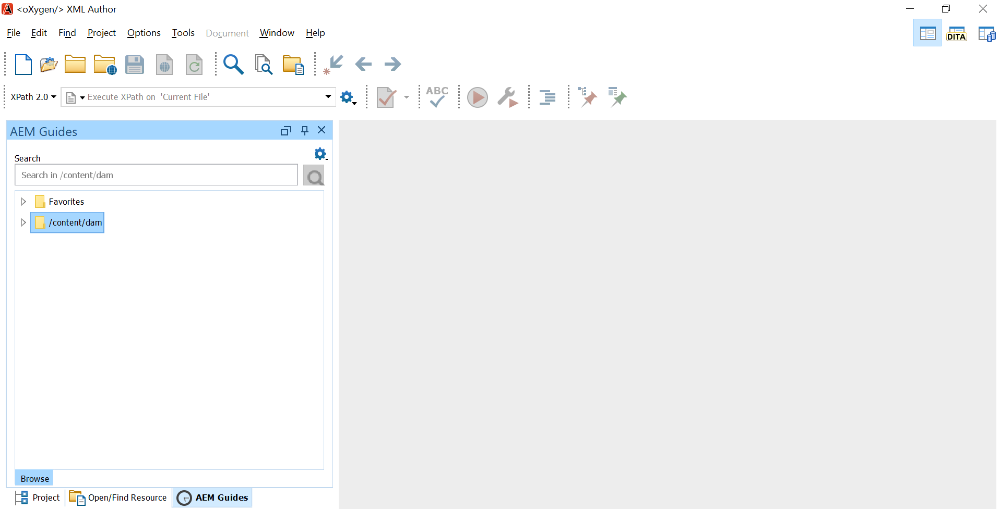
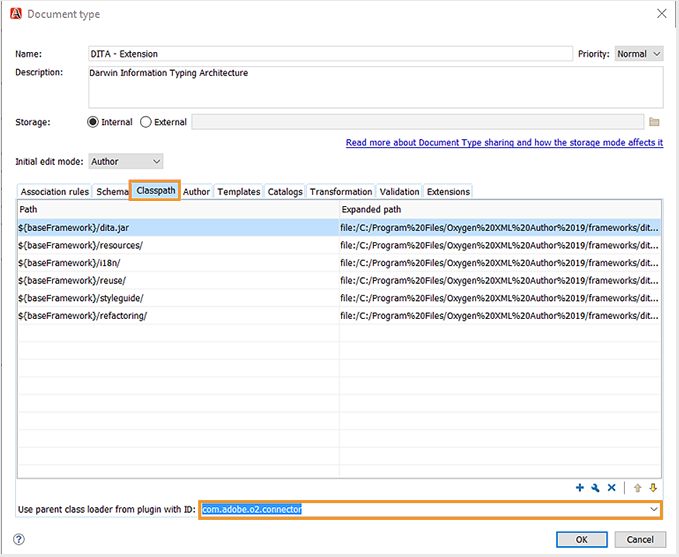
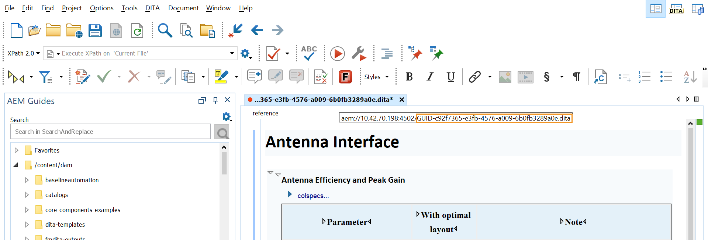
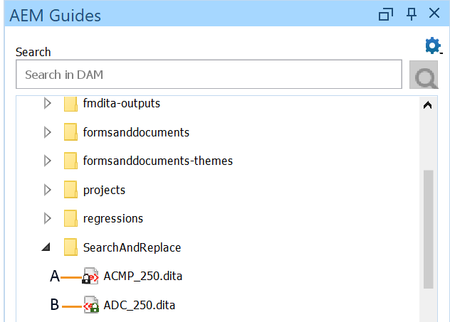
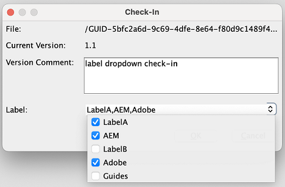
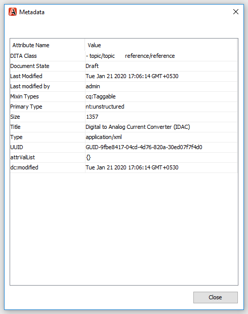
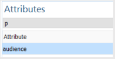

# Plug-in di ossigeno per Adobe Experience Manager Guides {#id1645H6010Q5}

Il plug-in di ossigeno per Adobe Experience Manager Guides \(in seguito denominato plug-in di ossigeno per AEM Guides nella guida\) consente di collegare l’istanza di authoring XML di ossigeno all’archivio Adobe Experience Manager \(AEM\) per la creazione e la gestione dei contenuti. È possibile utilizzare il plug-in per sfogliare, cercare e aprire file, estrarre e archiviare file, caricare cartelle e file nel repository di AEM. Il pannello AEM Guides nell’applicazione desktop consente di contrassegnare le cartelle desiderate \(dall’archivio AEM\) nell’elenco delle cartelle preferite per un accesso rapido. Inoltre, puoi installare un pacchetto nell’interfaccia web di AEM e aprire i file DITA in Oxygen XML Author direttamente dall’interfaccia web di AEM.

## Scarica e installa {#id1826M0L0PUI}

Il plug-in ossigeno per AEM Guides è disponibile tramite il portale di distribuzione software Adobe. Cerca &quot;ossigeno&quot; nella scheda Experience Manager, quindi scarica il programma di installazione del plug-in dal [portale di distribuzione software Adobe](https://experience.adobe.com/#/downloads/content/software-distribution/en/general.html).

>[!NOTE]
>
>Verifica la compatibilità della versione del connettore di ossigeno dalle note sulla versione per l’Adobe Experience Manager Guides specifico.

Una volta installato il programma di installazione, installarlo nel computer locale in cui è installato Oxygen XML Author. Prima di iniziare il processo di installazione, è necessario assicurarsi che il sistema soddisfi i requisiti tecnici per installare il plug-in di ossigeno per AEM Guides.

### Requisiti tecnici

- Autore Oxygen XML versione 26.1

- Adobe Experience Manager Guides versione 4.6 o successiva

- Adobe Experience Manager versione 6.5 con Service Pack 21, 20 e 19

- Sistema operativo supportato da Oxygen XML Author versione 26.1

- Java Development Kit
   - Oracle SE 8 JRE 1.8

### Installare il plug-in su Windows

>[!IMPORTANT]
>
>If you have an older version of the plugin installed on your system, ensure that you uninstall it before starting the installation process. See the **Uninstalling Packages** section in the [How to Work With Packages](https://helpx.adobe.com/experience-manager/6-4/sites/administering/using/package-manager.html) article for uninstallation instructions.

Perform the following steps on the system where Oxygen XML Author is installed:

1. Launch the installer&#39;s `.exe` file.

   The installation wizard&#39;s welcome screen appears.

1. Click **Next** and browse to location where Oxygen XML Author&#39;s .exe file is available.

1. Select the file, and click **Open**.

   The selected file&#39;s location is added in the installation wizard.

1. Fai clic su **Avanti**.

1. Click **Install**.

1. Click **Finish** to close the installation wizard.
1. Launch Oxygen XML Author.

   The AEM Guides panel is displayed in the Oxygen XML Author.

   {width="800" align="left"}

   >[!NOTE]
   >
   >If you do not see the AEM Guides panel, see the workarounds in the troubleshooting section—[Missing AEM Guides panel](#id192BH200ZAX).


### Install the plugin on Mac

>[!IMPORTANT]
>
>If you have an older version of the plugin installed on your system, ensure that you uninstall it before starting the installation process. See the **Uninstalling Packages** section in the [How to Work With Packages](https://helpx.adobe.com/experience-manager/6-4/sites/administering/using/package-manager.html) article uninstallation instructions.

Perform the following steps on the system where Oxygen XML Author is installed:

1. Locate the plugin&#39;s .dmg file on your system.

1. Double-click the .dmg file to open the file content.

   The .dmg file contains an aem-connector-x.x folder and a aem-connector-x.x-setup file.

   >[!NOTE]
   >
   >x.x in the filenames is the version number of the plugin.

1. Copy the aem-connector-x.x folder in the plugins folder of Oxygen XML Author.
1. Double-click the aem-connector-x.x-setup file to launch the installer.

1. Launch Oxygen XML Author.

   The AEM Guides panel is displayed in the Oxygen XML Author.

    {width="800" align="left"}

   >[!NOTE]
   >
   >If you do not see the AEM Guides panel, see the workarounds in the troubleshooting section—[Missing AEM Guides panel](#id192BH200ZAX).


### Install the package for enabling document editing feature from AEM web interface {#id182CE0Q0TY4}

As an author, you can open and edit your DITA maps or topics in Oxygen XML Author directly from the AEM web interface. To enable this feature in AEM web interface, your AEM administrator needs to install a package in your AEM authoring instance.

As an AEM administrator, perform the following steps to install the package:

1. Get the package&#39;s .zip file from your IT team.
1. Log into your AEM instance *\(as an administrator\)* and navigate to the CRX Package Manager. The default URL to access the package manager is

   `http://<server name>:<port>/crx/packmgr/index.jsp`

   The Package Manager manages the packages on your local AEM installation. For more information about working with the Package Manager, see [How to Work With Packages](https://experienceleague.adobe.com/docs/experience-manager-cloud-service/content/implementing/developer-tools/package-manager.html?lang=en) in AEM documentation.

    {width="650" align="left"}

1. To upload the Oxygen package, click **Upload Package**.
1. In the Upload Package dialog, navigate to the Oxygen package file that you downloaded in Step 1 and click OK.

   The package is uploaded on to your AEM instance.

1. To start the installation process, click **Install**.

   {width="650" align="left"}

1. In the Install Package dialog, click **Install**.
1. After installation completes, click the Home button in the upper-left corner of the CRX Package Manager.
1. Select a DITA file in your assets folder.

   **Edit in Oxygen** option is available in the toolbar. For more information about using this option, see [Open DITA topic in Oxygen XML Author from AEM web interface](#id182CE0I905Z).

   >[!NOTE]
   >
   >The **Edit in Oxygen** option is visible when you select one DITA topic. If you select multiple topics, the option will not be visible.


## Configurare il plug-in ossigeno per AEM Guides {#id1826KF00AHS}

Dopo aver scaricato e installato il plug-in, devi configurare i seguenti elementi affinché funzionino con il plug-in:

- **Impostazioni di autenticazione Web**: Impostazioni per l&#39;autenticazione SSO nel plug-in per AEM Guides.
- **Impostazioni generali**: impostazioni di connessione per il plug-in, ad esempio URL del server AEM, dettagli di accesso e così via.
- **Preferenza per la personalizzazione degli attributi di profiling e nomi di file e nei riferimenti incrociati**: questa configurazione è necessaria per gli schemi di attributi di profiling per i set di documentazione.

### Impostazioni di autenticazione Web

JxBrowser viene utilizzato per l’autenticazione SSO dal plug-in del connettore ossigeno. È un browser basato sul cromo. Per Java 9+ è necessario accedere alle API non pubbliche e devi concedere esplicitamente questo accesso a JxBrowser. Per ulteriori dettagli, vedere [Risoluzione dei problemi JxBrowser](https://jxbrowser-support.teamdev.com/docs/guides/troubleshooting/issues.html).

Aggiorna i file forniti per configurare le impostazioni di autenticazione web nel plug-in di ossigeno per AEM Guides:

>[!NOTE]
>
>Crea una copia di backup del file prima di aggiornarlo.

**Per Mac e ossigeno 26.1**

Aggiungi le seguenti righe in env.sh

```java
--illegal-access=permit\
--add-opens=java.desktop/javax.swing.plaf.basic=ALL-UNNAMED\
--add-exports=javafx.controls/com.sun.javafx.scene.control=ALL-UNNAMED\
--add-exports=javafx.graphics/com.sun.javafx.stage=ALL-UNNAMED\
--add-exports=javafx.graphics/com.sun.javafx.scene=ALL-UNNAMED\
--add-exports=javafx.graphics/com.sun.javafx.scene.traversal=ALL-UNNAMED\
--add-exports=javafx.graphics/com.sun.javafx.tk=ALL-UNNAMED\
--add-exports=javafx.graphics/com.sun.glass.ui=ALL-UNNAMED\
--add-opens=javafx.graphics/com.sun.glass.ui=ALL-UNNAMED\
--add-opens=javafx.graphics/javafx.stage=ALL-UNNAMED\
--add-opens=javafx.graphics/com.sun.javafx.tk.quantum=ALL-UNNAMED\
--add-exports=java.desktop/sun.awt=ALL-UNNAMED\
--add-opens javafx.swing/javafx.embed.swing=ALL-UNNAMED
```

Aggiungi le seguenti righe in ossigenoAuthor.sh

```java
-Djdk.module.illegalAccess=permit\-Djava.ipc.external=true\
```

**Per Windows e ossigeno 26.1**

Aggiungi le seguenti righe in env.bat

```java
--illegal-access=permit --add-opens=java.desktop/javax.swing.plaf.basic=ALL-UNNAMED --add-exports=javafx.controls/com.sun.javafx.scene.control=ALL-UNNAMED --add-exports=javafx.graphics/com.sun.javafx.stage=ALL-UNNAMED --add-exports=javafx.graphics/com.sun.javafx.scene=ALL-UNNAMED --add-exports=javafx.graphics/com.sun.javafx.scene.traversal=ALL-UNNAMED --add-exports=javafx.graphics/com.sun.javafx.tk=ALL-UNNAMED --add-exports=javafx.graphics/com.sun.glass.ui=ALL-UNNAMED --add-opens=javafx.graphics/com.sun.glass.ui=ALL-UNNAMED --add-opens=javafx.graphics/javafx.stage=ALL-UNNAMED --add-opens=javafx.graphics/com.sun.javafx.tk.quantum=ALL-UNNAMED --add-exports=java.desktop/sun.awt=ALL-UNNAMED --add-opens javafx.swing/javafx.embed.swing=ALL-UNNAMED
```

Aggiungi le seguenti righe in ossigenoAuthor.bat

```java
-Djdk.module.illegalAccess=permit -Djava.ipc.external=true
```

>[!NOTE]
>
>È necessario eseguire ossigeno da ossigenoAuthor.sh per Mac e ossigenoAuthor.bat per Windows come amministratore.

### Impostazioni generali

Per configurare le impostazioni di connessione nel plug-in ossigeno per Adobe Experience Manager Guides, effettua le seguenti operazioni:

1. Nel pannello AEM Guides, fai clic sull&#39;icona delle impostazioni, quindi seleziona **Impostazioni**.

   {width="800" align="left"}

1. Specifica i dettagli seguenti:
   - **URL server**: URL del server AEM, ad esempio:

     ```http
     http[s]://<host>:<port>
     ```

     Nell’URL precedente, specifica il nome host e la porta del server in cui viene distribuito il server AEM.

     >[!IMPORTANT]
     >
     >Se il server AEM è distribuito sulla porta 80 o 443, non è necessario specificarlo nell’URL.

   - **Autenticazione:** Scegliere tra **Base \(Nome utente/Password\)** o **Autenticazione Web**. Se selezioni l&#39;autenticazione **Basic** devi immettere il **Nome utente** e la **Password** nella finestra di dialogo Preferenze.

     Se selezioni Autenticazione web, viene visualizzata la schermata di accesso di AEM. Immetti le credenziali di accesso e fai clic sul pulsante **Accedi**. Una volta effettuato l’accesso, la schermata di accesso di AEM si chiude e nel pannello AEM Guides viene visualizzato l’elenco dei file dal server AEM.

   - **Timeout connessione**: specifica il tempo in secondi che il client deve attendere una risposta dal server AEM. Se non viene ricevuta alcuna risposta dal server entro il tempo specificato, la richiesta viene terminata. Il valore predefinito è 20 secondi.

   - **Cartella locale**: percorso nel computer locale in cui vengono archiviati i file dall&#39;archivio AEM dopo l&#39;estrazione. Se si specifica un percorso che non esiste nell&#39;unità, il plug-in crea tale percorso.
   - **Apri file all&#39;estrazione**: se selezionata, apre i file all&#39;estrazione.
   - **Chiudi file al momento dell&#39;archiviazione**: se selezionata, chiude i file al momento dell&#39;archiviazione. Prima di chiudere il file, viene visualizzato un pop-up in cui è possibile specificare i commenti sulla versione.
   - **Mostra finestra di dialogo Archiviazione alla chiusura del file**: se selezionata, verrà visualizzato un popup alla chiusura di un file. Nella finestra a comparsa è possibile scegliere di archiviare il file o di chiuderlo senza archiviarlo.
   - **Estrazione automatica file all&#39;apertura**: se selezionata, facendo doppio clic su un file viene automaticamente estratta e aperta per la modifica. Se il file è già stato estratto, viene semplicemente aperto per la modifica. Se questa opzione non è selezionata, l&#39;apertura di un file sul quale non si dispone di un blocco comporta l&#39;apertura in modalità di sola lettura.
1. Fai clic su **OK**.

### Preferenza per la personalizzazione degli attributi di profilatura e i nomi dei file nei riferimenti incrociati {#id1827K0D0OHT}

È necessario configurare le preferenze in Oxygen XML Author per utilizzare l&#39;attributo di profilatura associato agli argomenti DITA nell&#39;archivio AEM. È inoltre necessario configurare la preferenza per la visualizzazione dei nomi di file al posto dei GUID nei riferimenti incrociati.

Per configurare gli attributi di profilatura e i riferimenti incrociati, effettuare le seguenti operazioni:

1. In Autore XML ossigeno, fare clic su **Opzioni** \> **Preferenze**.
1. Nella scheda **Associazione tipo documento**, selezionare **DITA**, quindi fare clic su **Estendi**.

   {width="650" align="left"}

1. Nella scheda **Classpath**, seleziona `com.adobe.o2.connector` nel menu a discesa **Use Parent Class Loader From Plugin con ID**.

   {width="650" align="left"}

1. Nella scheda **Estensioni**, apporta le seguenti modifiche:

   - Fai clic su **Scegli** accanto al bundle **Estensioni** e seleziona   `LinkResolverExtensionBundle - com.adobe.o2.framework.extn` nell&#39;elenco **Classe**. Fai clic su **OK**.
      {width="650" align="left"}
   - Fai clic su **Scegli** accanto a **Listener dello stato dell&#39;estensione dell&#39;autore** in **Estensioni individuali** e seleziona `CustomAuthorExtensionStateListener - com.adobe.o2.framework.extn` nell&#39;elenco **Classe**. Fai clic su **OK**.
   - Fai clic su **Scegli** accanto a **Editor valore attributo personalizzato autore** in **Singole estensioni** e seleziona `CustomValueEditor - com.adobe.o2.framework.extn` nell&#39;elenco **Classe**. Fai clic su **OK**.
   - Fai clic su **Scegli** accanto al gestore di inserimento dell&#39;oggetto esterno **Author** in **Singole estensioni** e seleziona `CustomURLInsertionHandler - com.adobe.o2.ui ` nell&#39;elenco **Classe**. Fai clic su **OK**.


   La schermata seguente mostra la scheda **Estensione** configurata per gli argomenti DITA:
   
1. Fai clic su **OK** in tutte le finestre di dialogo per salvare le modifiche.

### Configura estensione mappa DITA

La configurazione dell&#39;estensione mappa DITA è necessaria per abilitare l&#39;apertura dei file di mappa in Oxygen XML Author direttamente dall&#39;interfaccia Web di AEM. Queste configurazioni sono simili a quelle per gli attributi di profilatura eseguite nella procedura precedente.

Per configurare l&#39;estensione mappa DITA, effettuare le seguenti operazioni:

1. In Autore XML ossigeno, fare clic su **Opzioni** \> **Preferenze**.
1. Nella scheda **Associazione tipo documento**, selezionare **Mappa DITA**, quindi fare clic su **Estendi**.
1. Nella scheda **Classpath**, seleziona com.adobe.o2.connector nel menu a discesa **Use Parent Class Loader From Plugin con ID**.
1. Nella scheda **Estensioni**, apporta le seguenti modifiche:
   - Fai clic su **Scegli** accanto al bundle **Estensioni** e seleziona   `com.adobe.o2.framework.extn.LinkResolverDITAMapExtensionBundle` nell&#39;elenco **Classe**. Fai clic su **OK**.

   - Fai clic su **Scegli** accanto a **Listener dello stato dell&#39;estensione dell&#39;autore** in **Estensioni individuali** e seleziona `CustomDITAMapAuthorExtensionStateListener - com.adobe.o2.framework.extn` nell&#39;elenco **Classe**. Fai clic su **OK**.

   - Fai clic su **Scegli** accanto al gestore di inserimento dell&#39;oggetto esterno **Author** in **Singole estensioni** e seleziona `CustomURLInsertionHandler - com.adobe.o2.ui ` nell&#39;elenco **Classe**. Fai clic su **OK**.

   - Fai clic su **Scegli** accanto a **Editor valore attributo personalizzato autore** in **Singole estensioni** e seleziona `CustomValueEditor - com.adobe.o2.framework.extn` nell&#39;elenco **Classe**. Fai clic su **OK**.

   - Fai clic su **Scegli** accanto al **Risolutore riferimenti** in **Singole estensioni** e seleziona `CustomDITAMapReferenceResolver - com.adobe.o2` nell&#39;elenco **Classe**. Fai clic su **OK**.
   - *\(Facoltativo\)* Se non desideri risolvere i riferimenti durante l&#39;apertura di un file di mappa, devi eseguire la seguente configurazione aggiuntiva:

   La schermata seguente mostra la scheda **Estensione** configurata:
   

1. Fai clic su **OK** in tutte le finestre di dialogo per salvare le modifiche.

## Utilizzare il plug-in di ossigeno per AEM Guides {#id1826JG00WY4}

### Pannello AEM Guides

La schermata seguente mostra il pannello AEM Guides.

{width="550" align="left"}

**A**\) Visualizza la barra di ricerca.

**B**\) Visualizza la cartella Preferiti. Per impostazione predefinita, è vuoto. Puoi aggiungere cartelle dall’archivio AEM come preferite; le cartelle preferite vengono quindi visualizzate qui.

**C**\) La cartella DAM mostra l&#39;archivio AEM. È possibile espandere e comprimere la visualizzazione delle cartelle.

**D**\) Icona Impostazioni \(ingranaggio\) con le seguenti opzioni:

- **Connetti**: selezionare questa opzione per connettersi al server AEM. L’opzione è disabilitata quando Oxygen XML Author è connesso al server AEM.
- **Aggiorna**: selezionare questa opzione per ottenere lo stato più recente dei file e della cartella dall&#39;archivio AEM.

  >[!NOTE]
  >
  >Assicurarsi di salvare i file prima di aggiornarli. Quando si seleziona l&#39;opzione **Aggiorna**, viene visualizzato un avviso per il salvataggio dei file prima di aggiornarli. Se non hai salvato i file, puoi fare clic su **Annulla** e salvarli.

- **Impostazioni**: è possibile utilizzare questa opzione per aprire la finestra di dialogo Preferenze generali del plug-in.
- **Disconnessione**: selezionare questa opzione per chiudere la connessione al server AEM. Questa opzione è disponibile solo se si utilizza la modalità Autenticazione Web.

### Funzioni del menu di scelta rapida

Le funzioni del plug-in ossigeno per AEM Guides sono disponibili facendo clic con il pulsante destro del mouse su una cartella o un file nell’archivio di AEM. The functions available for the folders are different from the files. Here is a complete list of functions in Oxygen Plugin for AEM Guides context menu:

- **Open**: Opens the selected file or expands the selected folder.
- **Open In**: You can choose to open the selected file in AEM Guides&#39; Web Editor or Map Dashboard, or Map Editor. For more information about these options, see [Open file in AEM Guides&#39; editor](#id195GH0V30KX).
- **Check-out**: Checks out a file from AEM repository. For more details, see [Check-out files](#id195HC020TS4).
- **Check-out with dependents**: Checks out a file with its direct references. For more details, see [Check-out files](#id195HC020TS4).
- **Check-out with read-only dependents**: Checks out the selected file along with its dependents. You cannot make any changes in the dependent files. For more details, see [Check-out files](#id195HC020TS4).
- **Cancel check-out**: Cancels the checked-out file, closes the file from the editor, and reverts the changes to the last version of the file saved on the server.
- **Refresh**: In case of a file, fetches the latest copy of the file from the AEM repository. For a folder, it fetches the folder structure and file&#39;s status. This means that is a file is added, then it will be shown in the AEM Guides View. Also, if a file is checked out on AEM server, doing a Refresh in Oxygen Author will show the file as checked out. However, this does not update the files list in the *Files Checked-Out in AEM Guides* View.
- **Refresh Checked-out Files**: Refreshes the list of checked out files in the *Files Checked-Out in AEM Guides* View. If a file is checked out on AEM server, then doing a Refresh will update the list of checked out files in the *Files Checked-Out in AEM Guides* View. However, if a new file has been added or the status of a file has changed, then it does not update it in the AEM Guides tree view. To update the status of files on AEM, you must do a Refresh.
- **Check-in**: Checks in a files that you have checked out. For more details, see [Check in a file](#id182CF0J0FHS).
- **Check-in with dependents**: If you have checked out files with dependents, then this option checks in the main file along with its dependents. For more details, see [Check in a file](#id182CF0J0FHS).
- **Create Folder**: Creates a folder in the AEM repository. This option is available only at a folder-level.
- **Upload File\(s\)**: Uploads single or multiple files. For more details, see [Upload files and folders](#id195HC03F03J).
- **Upload with dependents**: Uploads DITA files \(XML, DITA, Book map, or DITA map\) with its dependents. For more details, see [Upload files and folders](#id195HC03F03J).
- **Upload Folder**: Uploads a folder on the AEM repository. For more details, see [Upload files and folders](#id195HC03F03J).
- **Add to Favorites**: Adds a folder to the *Favorites* folder in the AEM Guides panel. It is recommended to add your working folder here, which makes it easier to sync files and file&#39;s status from AEM.
- **Remove from Favorites**: Removes a folder from *Favorites*. For more details, see [Add or remove Favorites](#id195HC04405P).
- **View Metadata**: Shows the metadata such as DITA Class, document&#39;s Title, Type, UUID, and other information associated with a file. For more details, see [View a file&#39;s metadata](#id195GHN0H05C).
- **View Versions**: Shows the version history of a file. For more details, see [View a file&#39;s version history](#id195GI000D5Q).

### Open a file in Oxygen XML Author {#id195GHJ0A0UB}

Once you have connected to the AEM repository, you can open files for editing in the Oxygen XML Author. Perform the following steps to open a file for editing in the Oxygen XML Author:

1. Right-click on a file in the AEM Guides panel that you want to open for editing.

1. Select **Open** from the context menu. Or you can double click on the file to open it.

   The file is opened in Oxygen XML Author&#39;s editor.

    {width="800" align="left"}

   Quando passi il puntatore del mouse sulla scheda di un file, viene visualizzato il percorso del server e il relativo UUID. Nella schermata precedente, viene evidenziato l’UUID del documento.

>[!NOTE]
>
>Passando il puntatore del mouse sulle immagini o sui video di un argomento nell’editor dell’autore XML di ossigeno viene visualizzato solo l’UUID dell’elemento selezionato. Per individuarlo nel repository, fare clic con il pulsante destro del mouse sull&#39;immagine visualizzata o sul tag oggetto (solo in caso di video, audio e altri file multimediali) e selezionare **Mostra nel repository**.


Se è stata selezionata l&#39;opzione **File di estrazione automatica all&#39;apertura** \(nella finestra di dialogo Preferenze\), all&#39;apertura di un file il file viene estratto automaticamente ed è disponibile per la modifica. Per aprire un file, è possibile fare doppio clic sul nome di un file oppure fare clic con il pulsante destro del mouse sul nome del file e scegliere **Apri** dal menu di scelta rapida. Se questa opzione non è selezionata, il file viene aperto in modalità di sola lettura.


### Apri il file nell’editor di AEM Guides {#id195GH0V30KX}

Se desideri utilizzare gli editor disponibili in AEM Guides, puoi farlo selezionando l’opzione desiderata dal menu di scelta rapida. Per utilizzare l’editor di AEM Guides al posto dell’editor di Oxygen XML Author, effettua le seguenti operazioni:

1. Fate clic con il pulsante destro del mouse su un file nel pannello AEM Guides che desiderate aprire per la modifica.

1. Seleziona **Apri in** dal menu di scelta rapida e scegli tra le seguenti opzioni:

   - **Editor argomenti Web**: se il file che si sta aprendo è un file con estensione xml o dita, è possibile aprirlo per la modifica nell&#39;editor Web. Scegliere l&#39;opzione **Editor argomenti Web** per aprire il file selezionato per la modifica nell&#39;editor Web.

   - **Map Dashboard**: puoi scegliere di modificare un file .ditamap nel dashboard delle mappe, in cui puoi eseguire varie operazioni sul file mappa. Queste operazioni dipendono dal ruolo/gruppo a cui appartieni.

   - **Web DITA Map Editor**: se si desidera aprire il file .ditamap per la modifica nell&#39;Editor mappe, scegliere questa opzione. Utilizzando l&#39;opzione Editor mappe DITA, è possibile aggiungere o rimuovere argomenti, aggiungere tabelle di relazioni ed eseguire altre operazioni sulla mappa.


### File di estrazione {#id195HC020TS4}

Quando si estrae un file, questo viene memorizzato localmente nel sistema e bloccato per la modifica nel repository di AEM. Per estrarre un file, effettuare le seguenti operazioni:

1. È possibile estrarre i file in uno dei modi seguenti:
   - Fate clic con il pulsante destro del mouse su un file nel pannello AEM Guides.
   - Fate clic con il pulsante destro del mouse sulla scheda Mappa (Map) nel pannello Gestione mappe DITA.
   - Fate clic con il pulsante destro del mouse su un file nel pannello Gestione mappe DITA (DITA Maps Manager).
   - Right-click the file tab when you open a map or topic in the Editor.

1. Seleziona una delle opzioni seguenti:
   - **Check-out:** Checks out a file from AEM repository and makes it available for editing.
   - **Check-out with dependents**: Checks out a file with its direct references. You can make changes in parent and child pages using this option. Oxygen Plugin for AEM Guides supports checking out one level of dependents. For example, Map A references Topic A and Topic A references Topic B. Checking out Map A will checkout Topic A regardless of its level in the TOC hierarchy. However, it will not check out Topic B because it is not directly linked from Map A.
   - **Check-out with read-only dependents**: Checks out a file and downloads its dependents to your local machine as read-only copies. You cannot make any changes in the dependent files.

If you have selected the **Open Files on Checkout** option \(in the Preferences dialog\), then on checking out a file, the file is automatically opened for editing.

If you have selected the **Auto-Checkout File when Opened** option \(in the Preferences dialog\), then on opening the file, the file is automatically checked out and is made available for editing. Per aprire un file, è possibile fare doppio clic sul nome di un file oppure fare clic con il pulsante destro del mouse sul nome del file e scegliere **Apri** dal menu di scelta rapida.

When a file is checked-out, the icon of the file changes to show its locked status.

{width="650" align="left"}

In the above screenshot, a file checked out by other user is shown with a black colored lock icon \(A\). File checked out by the current user is shown with a green colored lock \(B\).

>[!NOTE]
>
>If the checked-out file is deleted or moved to any other folder in AEM, you get an error message when you check-in the file. Make sure that the checked-out file is not moved or deleted using the AEM web interface.

### Check in a file {#id182CF0J0FHS}

When you check in a file, the local copy from your system is stored in the AEM repository, and the lock on the file is removed. Perform the following steps to check in a file:

1. Save your file by clicking **File** \> **Save**.

1. Right-click on a checked-out file or map in one of the following locations:
   - Pannello AEM Guides
   - DITA Maps Manager panel
   - The file tab when you open a map or topic in the Editor.
   - The map tab in the DITA Maps Manager panel.

1. Choose from the following two options:

   - **Check-In**: Checks-in the selected file from your local system into AEM repository.
   - **Check-In with Dependents:** If you have checked-out a file along with its dependents, then use this option to check in all dependent files in one single operation. On selecting this option, you are shown the Check-In dialog with all dependent files. Click OK to check-in all files at once.

   If you have not checked out dependent files and then you choose this option, then only those dependent files that you have \(separately\) checked out will be checked in. You will be shown a list of files that could not be checked in:

   {width="800" align="left"}

   It is strongly recommended not to move a file that is checked out. However, if a checked out file is moved to a different location, then you must cancel the checkout on that file. If you want to make updates on that file, then check out the file again, make changes, and then check it back in. If you try to check in a file that has been moved from its original location, then you will get an error.

   If a dependent file is checked out in AEM, then Check-In with Dependents will not show the dependent file in the Check-In dialog. To get a list of dependent files that are checked out in AEM, you must do a folder Refresh.

   Similarly, if you have checked-in a dependent file through AEM, the file list is not refreshed in Oxygen Author until you do a folder Refresh and Refresh Checked-Out Files. If you do a Check-in with Dependents with some files checked in through AEM, then you will get an error listing the files that could not be checked in.

1. \(Optional\) In the **Check-In** or the **Check-in with Dependents** dialog, add a comment in **Version Comments** text box.

   >[!NOTE]
   >
   >This comment is displayed in the AEM version history of the file.

1. Add label(s) in the **Label** text box in the **Check-In** or the **Check-in with Dependents** dialog . Enter a label and press Enter. For example, *2307 Release*.

   If your administrator has predefined a list of labels and uploaded them in the `label.json` file, then those labels are displayed as a dropdown. You can choose one or more labels from the dropdown.

   {width="550" align="left"}

   È possibile aggiungere più etichette (separate da virgole) alla stessa versione di un argomento.  *Adobe*, *AEM*, *Guide*.
Tuttavia, non è possibile aggiungere la stessa etichetta alle diverse versioni di un argomento. Se aggiungi un’etichetta già aggiunta a una versione precedente, questa viene aggiunta all’ultima versione e rimossa dalla versione precedente.

   >[!NOTE]
   > 
   > Queste etichette vengono visualizzate nella cronologia delle versioni AEM del file.


1. Fai clic su **OK**.

>[!NOTE]
>
>Se il file estratto viene eliminato o spostato in un&#39;altra cartella in AEM, viene visualizzato un messaggio di errore quando si archivia il file. Verificare che il file estratto non venga spostato o eliminato tramite l&#39;interfaccia Web di AEM.

### File estratti nella visualizzazione AEM Guides

Se si dispone di più cartelle, non è facile individuare il numero di file estratti in una visualizzazione. AEM Guides fornisce File estratti nella visualizzazione AEM Guides che fornisce un’istantanea completa dei file attualmente estratti. Utilizzando questa vista, puoi facilmente individuare i file che hai selezionato nell’archivio di AEM utilizzando AEM Guides. Per accedere e utilizzare questa visualizzazione, effettuare le seguenti operazioni:

1. Fai clic su **Finestra** \> **Mostra visualizzazione** \> **File estratti in AEM Guides**.

   Viene visualizzata la visualizzazione File estratti in AEM Guides.

   {width="550" align="left"}

1. Fare clic con il pulsante destro del mouse su un file in questa visualizzazione per visualizzare le opzioni seguenti:

   - [Apri](#id195GH0V30KX)
   - [Apri in](#id195GH0V30KX)
   - Annulla estrazione
   - [Check-in](#id182CF0J0FHS)
   - [Check-in con dipendenti](#id182CF0J0FHS)
   - [Visualizza metadati](#id195GHN0H05C)
   - [Visualizza versioni](#id195GI000D5Q)

**Note sui file estratti nella visualizzazione AEM Guides:**

- La visualizzazione *File estratti in AEM Guides* mantiene le sessioni dell&#39;utente. Ciò significa che i file estratti dall’utente corrente vengono memorizzati e mantenuti nella visualizzazione in tutte le sessioni \(o cache\) dello stesso utente.

- Se l’utente modifica le credenziali di accesso o il server AEM, i dati del file estratto \(o cache\) nella vista vengono reimpostati. L&#39;utente deve eseguire manualmente un comando *Aggiorna file estratti* in ogni cartella da cui i file sono stati estratti in precedenza. Per semplificare, si consiglia di aggiungere le cartelle di lavoro a *Preferiti*, da cui è possibile aggiornare rapidamente una cartella.

- È possibile ordinare l&#39;elenco dei file in base ai relativi nomi di file, Titolo o Percorso. Se viene estratto un nuovo file, il file viene visualizzato in ordine nella vista.


### Caricare file e cartelle {#id195HC03F03J}

Per caricare file o cartelle, effettua le seguenti operazioni:

1. Fate clic con il pulsante destro del mouse su una cartella nel pannello AEM Guides.
1. Seleziona una delle opzioni seguenti:
   - **Carica file\(s\)**: seleziona questa opzione per caricare uno o più file nella cartella selezionata nell&#39;archivio AEM. Nella finestra di dialogo Seleziona i file \(s\) da caricare, seleziona i file e fai clic su **Apri**.
   - **Carica con dipendenti**: selezionare questa opzione per caricare un file DITA con i relativi dipendenti. Nella finestra di dialogo Seleziona il file da caricare, seleziona i file e fai clic su **Apri**.
   - **Carica cartella**: selezionare questa opzione per caricare una cartella nell&#39;archivio AEM. Nella finestra di dialogo Scegli, seleziona la cartella e fai clic su **Scegli**.

**Note aggiuntive sull&#39;utilizzo dei file basati su UUID**:

Durante lo spostamento o la copia del contenuto dal sistema locale all’archivio AEM, è necessario tenere in considerazione i seguenti punti:

- Quando si caricano uno o più file, viene generato un nuovo UUID per i file privi di UUID. Questo UUID viene aggiunto in `topic id` di un file DITA.

- Quando si copia una cartella, i riferimenti ai file \(all&#39;interno della cartella\) vengono aggiornati automaticamente in tutte le mappe DITA che fanno riferimento ai file presenti in tale cartella.

- Durante la copia di un file mappa DITA, i riferimenti UUID all&#39;interno del file mappa non vengono modificati.

- Se un file o una cartella presenta un conflitto o un duplicato, viene generato un nome file univoco per il nuovo file da copiare o spostare.

- Non ci sono due file con lo stesso UUID. A tutti i nuovi file viene assegnato un UUID univoco.

- Se un file viene caricato contemporaneamente da due utenti diversi, il file elaborato successivamente sovrascrive quello precedente. However, such a practice should be avoided.

- When you checkout content from AEM repository and make changes on your local system, ensure that file name is not changed at the time of uploading the file.

- When you insert a reference in the DITA Maps Manager or the Editor, it displays the title of the file and not the UUID. If the title isn&#39;t present, then it displays the filename.

### Add or remove Favorites {#id195HC04405P}

Perform the following steps to add or remove a folder to the Favorites folder in the AEM Guides panel:

- Right-click a folder and select **Add to Favorites**. You can add a folder to favorites if it is not in Favorites.
- You can remove a folder from favorites in following ways:
   - Right-click a folder in the **Favorites** folder and select **Remove from Favorites**.
   - Right-click a folder in the AEM repository under **DAM** folder that is already added as favorite and select **Remove from Favorites**.

### View a file&#39;s version history {#id195GI000D5Q}

Perform the following steps to view a file&#39;s version history:

1. Right-click on a file in the AEM Guides panel.

1. Select **View Versions** from the context menu.

   File&#39;s version history is displayed in the Versions dialog.

   {width="550" align="left"}


### View a file&#39;s metadata {#id195GHN0H05C}

Perform the following steps to view a file&#39;s metadata:

1. Right-click on a file in the AEM Guides panel.

1. Select **View Metadata** from the context menu.

   File&#39;s metadata such as the DITA Class, Document State, modification date, size, Title, and UUID are displayed in the Metadata dialog.

   {width="550" align="left"}


## Search a topic in the AEM repository {#id1826J20405Z}

You can search for topics in the AEM repository using the Search bar in the AEM Guides panel. You can search in the entire DAM folder or select a folder and then search for a topic in that folder. The search result shows the topics that have text matching with your search query.

Perform the following steps to search topics:

1. Select a folder in the AEM repository where you want to search a topic.
1. Enter the search query \(for example, `introduction`\) in the Search bar of the Oxygen Plugin for AEM Guides.
1. Click the search button or press Enter.

   The result is displayed in the Search Results tab as a list with the file path. If there is no matching result for your search query, No results found in &lt;path of the selected folder\> message is displayed.

   {width="550" align="left"}

1. \(Optional\) Double-click a file in the search result to open it in Oxygen XML Author.
1. To go back to the AEM Repository view, do one of the following:
   - To view the AEM Repository view without clearing the search results, click **Browse** tab.
   - To clear the search results and view the AEM Repository, Click Delete search icon.

## Open DITA topic in Oxygen XML Author from AEM web interface {#id182CE0I905Z}

You can open and edit your DITA topic in Oxygen XML Author from the AEM web interface. You need to install a package in AEM to enable this option. For more information about package installation, see [Install the package for enabling document editing feature from AEM web interface](#id182CE0Q0TY4).

>[!NOTE]
>
>The **Edit in Oxygen** option is accessible from various places in AEM: when a topic is selected, when a topic is previewed, or from Topics and Reports tab of DITA map console. If you select multiple topics, then the option is not visible in the toolbar.

**Open a DITA topic**

Perform the following steps to open a DITA topic in Oxygen XML Author:

1. Select a topic in your assets and click **Edit in Oxygen** option in the toolbar.

   >[!NOTE]
   >
   >If the topic is not checked out, then it is first checked out and then opened in Oxygen in the edit mode.

1. Select Oxygen XML Author *&lt;version\>* in the **Launch Application** message box. You can select **Remember my choice for AEM links** option to save your preference.

**Edit a DITA topic**

Perform the following steps to edit a DITA topic in Oxygen XML Author:

1. Select and check-out a topic in your assets.
1. Click **Edit in Oxygen** option in the toolbar.

   >[!NOTE]
   >
   >If the topic is not checked out, then it is first checked out and then opened in Oxygen in the edit mode.

1. Select Oxygen XML Author *&lt;version\>* in the **Launch Application** message box. You can select **Remember my choice for AEM links** option to save your preference.
1. Edit the topic in Oxygen XML Author.
1. Check-in the topic from the Oxygen Plugin for AEM Guides.

   For more information about checking-in a topic using Oxygen Plugin for AEM Guides, see [Check in a file](#id182CF0J0FHS).

   >[!NOTE]
   >
   >Make sure that you check-in the topic using Oxygen Plugin for AEM Guides, if you check-in from the AEM web interface, the changes you make in Oxygen XML Author are not saved in the checked-in version of the topic.

**Insert a reference to a topic from the Experience Manager Guides repository**

You can also drag and drop a topic to insert the reference into a topic or a DITA map.
>[!NOTE]
>
> You need to check out a file before adding any reference to it.

The following elements are added based on the type of references:

If you drop to the Editor with an open topic:
- A reference is added with `<image>` element for the images.
- An object element is added for a video or audio.
- The `<xref>`  element is added for all other references like topic, map, DITAVAL, PDF, ZIP, and XML.

If you drop to Editor or DITA Maps Manager with an opened Map:
- The `<mapref>` element is added for map references, which include a DITA map, bookmap, or a Subject Scheme.
- The `<topicref>` element is added for all other references like topic, map, DITAVAL, PDF, ZIP, and XML.


## Work with attribute profiles {#id1827JA002YK}

AEM Guides consente di creare e associare facilmente attributi condizionali utilizzando gli attributi DITA pertinenti. Puoi definire gli attributi condizionali a livello globale o a livello di cartella. Le condizioni definite a livello globale sono visibili in tutti i progetti e le condizioni a livello di cartella sono visibili solo nei progetti creati all’interno della cartella specificata. Gli autori dei contenuti possono utilizzare questi attributi condizionali per condizionare il contenuto nei propri argomenti o mappe DITA che creano o utilizzano. Per ulteriori informazioni su come creare attributi condizionali in AEM utilizzando AEM Guides, consulta la sezione *Configurare attributi condizionali per profili globali o a livello di cartella* in Installare e configurare Adobe Experience Manager Guides.

>[!NOTE]
>
>Assicurati di aver aggiunto gli attributi condizionali in AEM e di aver impostato [Preferenza per la personalizzazione degli attributi di profiling](#id1827K0D0OHT) prima di aggiungere attributi condizionali al contenuto.

Per aggiungere attributi condizionali al contenuto in Oxygen XML Author, effettua le seguenti operazioni:

1. Estrai e apri un argomento dal *plug-in ossigeno per AEM Guides*.
1. Seleziona la parte del contenuto in cui desideri applicare gli attributi condizionali.
1. Fare doppio clic sull&#39;attributo condizionale nel pannello Attributi di Oxygen XML Author.

   {width="300" align="left"}

1. Nella colonna **Available** della finestra di dialogo Modifica attributo, selezionare l&#39;attributo\(s\) e fare clic su **Aggiungi**.

   La schermata seguente mostra gli attributi `audience`.

   {width="550" align="left"}

1. Fai clic su **OK**.

   Gli attributi vengono aggiunti al contenuto.


## Risoluzione dei problemi comuni {#id188ABC00RY4}

In questo argomento vengono descritti alcuni dei problemi più comuni che è possibile riscontrare durante l&#39;utilizzo del plug-in, insieme alle relative soluzioni.

### Pannello AEM Guides mancante {#id192BH200ZAX}

**Problema** - Se non vedi il pannello AEM Guides in Oxygen XML Author, prova le seguenti soluzioni:

Soluzione 1:

1. In Autore XML ossigeno, abilita il plug-in.

   Fai clic su **Opzioni** \> **Preferenze** \> **Plug-in** e seleziona **Plug-in ossigeno per Adobe Experience Manager Guides.**

1. Riavvia authoring XML ossigeno.


Soluzione 2:

1. Se ancora non vedi il pannello AEM Guides, abilita la finestra AEM Guides.

   In Oxygen XML Author, fare clic su **Finestra** \> **Mostra visualizzazione** \> **AEM Guides**.

Soluzione 3:

1. Disinstallare e reinstallare il plug-in ossigeno per Adobe Experience Manager Guides.

   - On Windows, uninstall the plugin from **Add or remove Programs** list. Then, reinstall the plugin.

   - On Mac, access the aem-connector-x.x folder in the plugins folder of Oxygen XML Author, and move it to **Trash**. Then, empty the **Trash** folder.


### Configure port for DITA-OT transformation

**Issue** - When you run any DITA-OT transformation on files that are processed by the Plugin, the transformation fails with the following error:

{width="800" align="left"}

**Solution** - This issue has been fixed by adding a proxy server in-between DITA-OT and the Plugin. This proxy server processes and shares all files requested by DITA-OT for transformations. The default port on which this server has been configured is: `5972`. If you are using this port for some other server, then you can specify a different port for the proxy server.

Perform the following steps to change the default port of the proxy server:

1. Browse to your \(user&#39;s\) home directory.
1. Create a file named aem\_connector\_proxy.
1. Open the file in any text editor and add an available port number in the first line of the file.
1. Salva e chiudi il file.
1. Restart Oxygen XML Author and run the DITA-OT transformation.


### AEM Guides panel does not browse to the opened file location

Issue: When you choose to open a file for editing in Oxygen XML Author from AEM server, the file is opened for editing in Oxygen XML Author. However, AEM Guides panel does not show the location of the file in the navigation tree.

Solution: This issue has been observed in scenarios wherein the file path contains /content/dam twice in it. By default, all assets in AEM are stored under the /content/dam folder. If you upload or create a folder structure that also contains /content/dam in it, then this issue is observed. You can perform all normal operations on such files, however their location within the navigation tree is not shown by default. To access such file in the navigation tree, you have to manually browse to the file&#39;s location. Note that in the navigation tree the duplicate /content/dam path is replaced with /content/assets.

### Configure logging

Issue: By default, the Oxygen Plugin for AEM Guides does not generate any logs, which makes it difficult to debug any error scenario.

Solution: Perform the following steps to  set up the loggers for oXygen and JxBrowser:

1. Close Oxygen XML Author

1. Create a file named `logback.xml` with the following content:

   ```xml
   <configuration>
       <appender name="R2" class="ch.qos.logback.core.rolling.RollingFileAppender">
           <file>${user.home}/Desktop/oxygenLog/oxygen.log</file>
           <rollingPolicy class="ch.qos.logback.core.rolling.FixedWindowRollingPolicy">
               <fileNamePattern>${user.home}/Desktop/oxygenLog/oxygen%i.log.gz</fileNamePattern>
               <minIndex>1</minIndex>
               <maxIndex>20</maxIndex>
           </rollingPolicy>
           <triggeringPolicy class="ch.qos.logback.core.rolling.SizeBasedTriggeringPolicy">
               <maxFileSize>100MB</maxFileSize>
           </triggeringPolicy>
           <encoder>
               <pattern>%r %marker %p [ %t ] %c - %m%n</pattern>
           </encoder>
       </appender> 
   
       <root level="debug">
           <appender-ref ref="R2" />
       </root>
   </configuration>   
   ```

1. Save the file in the `Oxygen Author 26` directory. (For example, the path would be: `C:\Program Files\Oxygen XML Author 26\logback.xml`)

1. Close the file. This will enable oXygen logs, which will be available at path: `${user.home}/Desktop/oxygenLog/oxygen.log`
1. Open the `oxygenAuthor.bat` file in a text editor.
1. Setup JxBrowser-related logs by adding the parameter
   `-Denable.aem.jx.log=true`. This enables JxBrowser-related logs, which you can view at path: `${user.home}\AppData\Local\Temp\Oxygen_Plugin_Javax_Log.log`:


   ```java
   SET OXYGEN_JAVA=java.exe
   if exist "%JAVA_HOME%\bin\java.exe" set OXYGEN_JAVA="%JAVA_HOME%\bin\java.exe"
   if exist "%~dp0\jre\bin\java.exe" SET OXYGEN_JAVA="%~dp0\jre\bin\java.exe"
   rem Set environment variables
   call "%~dp0\env.bat"
   %OXYGEN_JAVA% -XX:-OmitStackTraceInFastThrow -XX:SoftRefLRUPolicyMSPerMB=10 -Djdk.module.illegalAccess=permit -Djava.ipc.external=true 
   -Denable.aem.jx.log=true -Dsun.java2d.noddraw=true -Dsun.awt.nopixfmt=true -Dsun.java2d.dpiaware=true -Dsun.io.useCanonCaches=true -Dsun.io.useCanonPrefixCache=true 
   -Dsun.awt.keepWorkingSetOnMinimize=true -Dcom.oxygenxml.app.descriptor=ro.sync.exml.AuthorFrameDescriptor
    -Dcom.oxygenxml.ApplicationDataFolder="%APPDATA%" -cp %CP% ro.sync.exml.Oxygen %*
   ```


With the previous steps, the logs will be enabled and you can use them to debug the problems.
