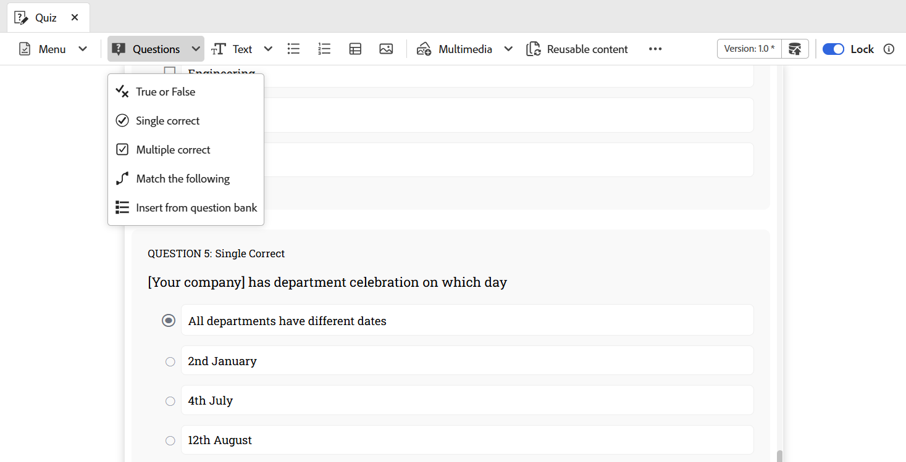

# Versione di dicembre 2025 dei contenuti di formazione e apprendimento del prodotto

Questa nota sulla versione riguarda le funzioni nuove e migliorate introdotte nella versione di dicembre 2025 dei contenuti di formazione e apprendimento del prodotto. Inoltre, tutti i problemi e i bug segnalati sono stati risolti in questa versione, garantendo stabilità e prestazioni migliori.

## Authoring

- **Nuove opzioni del menu Inserisci**: introduzione di nuove opzioni nel menu Inserisci della barra degli strumenti dell&#39;editor per arricchire il contenuto di apprendimento:

   - **Equazione MathML**: inserire le equazioni di MathML in modo semplice per gli argomenti tecnici o scientifici.
   - **Controllo conoscenze**: aggiungi quiz rapidi e non di livello negli argomenti di apprendimento per convalidare la comprensione dell&#39;Allievo.
   - **H5P**: incorpora pacchetti interattivi H5P per un&#39;esperienza di apprendimento avanzata.

  Per ulteriori dettagli, visualizzare [Altre opzioni nel menu Inserisci](../learning-content/lc-other-insert-options.md).

  {width="650"}

- **Nuovi widget interattivi**: è possibile coinvolgere gli studenti con alcuni nuovi widget interattivi che rendono il contenuto più coinvolgente: **Fare clic per visualizzare**, **Inverti scheda** e **Scheda**.

  Per ulteriori dettagli, visualizzare [Utilizzare widget interattivi](../learning-content/lc-widgets.md).

  {width="350"}

- **Corrispondenza con**: è disponibile un nuovo tipo di domanda, **Corrispondenza con**, per i quiz. Gli Allievi possono abbinare oggetti di due elenchi per collegare idee correlate, incoraggiando il pensiero critico.

  Per ulteriori dettagli, visualizzare [Tipi di domande quiz](../learning-content/quiz-insert-questions.md#question-types).

  {width="650"}

## Revisione

- **Crea attività di revisione**: ora puoi creare un&#39;attività di revisione per il tuo corso di apprendimento e assegnarla al revisore per il loro feedback. In questo modo è possibile garantire la qualità dei contenuti, semplificare la collaborazione e semplificare il monitoraggio delle revisioni.

  Per ulteriori dettagli, visualizzare [Crea attività di revisione](../learning-content/manage-course.md#create-review-task).

  {width="650"}

## Gestione dei contenuti

- **Contenuto riutilizzabile**: è possibile riutilizzare il contenuto esistente in più corsi. Questa funzione consente di mantenere la coerenza e di ridurre la duplicazione.

  Per ulteriori dettagli, visualizzare [Aggiungi blocchi predefiniti di base](../learning-content/lc-basic-blocks.md).

  {width="650"}
