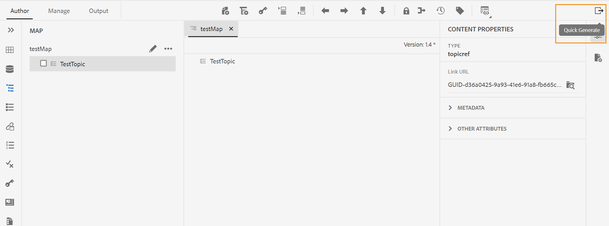

# Versione di ottobre di Adobe Experience Manager Guides as a Cloud Service

## Aggiornamento alla versione di ottobre

Aggiorna la configurazione corrente di Adobe Experience Manager Guides as a Cloud Service (in seguito denominato *AEM Guides as a Cloud Service*) eseguendo i seguenti passaggi:
1. Consulta il codice Git dei servizi cloud e passa al ramo configurato nella pipeline dei servizi cloud corrispondente all’ambiente da aggiornare.
1. Aggiorna la proprietà `<dox.version>` nel file `/dox/dox.installer/pom.xml` del codice Git dei servizi cloud a 2022.10.183.
1. Apporta le modifiche ed esegui la pipeline dei servizi cloud per l’aggiornamento alla versione di ottobre di AEM Guides as a Cloud Service.

## Matrice di compatibilità

In questa sezione è elencata la matrice di compatibilità per le applicazioni software supportate dalla versione di ottobre 2022 di AEM Guides as a Cloud Service.

### FRAMEMAKER e FRAMEMAKER PUBLISHING SERVER

| FMPS | FrameMaker |
| --- | --- |
| Non compatibile | Aggiornamento 2020 4 e versioni successive |
| | |

*Le condizioni di base e create in AEM sono supportate nelle versioni FMPS a partire dal 2020.2.

### Connettore ossigeno

| Versione di AEM Guides as a Cloud | Finestre del connettore dell&#39;ossigeno | Connettore di ossigeno Mac | Modifica in finestre a ossigeno | Modifica in Oxygen Mac |
| --- | --- | --- | --- | --- |
| 2022.10.0 | 2.7.13 | 2.7.13 | 2,3 | 2,3 |
|  |  |  |  |  |

## Nuove funzioni e miglioramenti

AEM Guides as a Cloud Service fornisce miglioramenti e nuove funzioni nella versione di ottobre:

### Pannello Generazione rapida

Ora AEM Guides fornisce il pannello **Generazione rapida** che consente di generare e visualizzare rapidamente l&#39;output dei predefiniti creati per la mappa DITA.

Nel pannello **Generazione rapida** è possibile visualizzare l&#39;elenco di tutti i predefiniti di output creati per la mappa DITA.

Seleziona uno o più predefiniti e genera rapidamente l’output. Potete anche visualizzare rapidamente l&#39;output generato per i predefiniti. Alla generazione dell’output viene visualizzato un messaggio di successo. Se la generazione dell’output non riesce, viene visualizzato un messaggio di errore. Puoi anche visualizzare il registro degli errori per visualizzare i dettagli dell’errore che si è verificato nel processo di generazione.

## Problemi risolti

Di seguito sono elencati i bug risolti in varie aree:

* PDF nativo | Errore durante la rimozione degli argomenti relativi solo alle risorse dall&#39;output di PDF. (10554)
* PDF nativo | Nell&#39;output di PDF vengono visualizzati i tasti vuoti. (10553)
* PDF nativo | `navtitle` per `topichead` non è rispettato. (10509)
* PDF nativo | Supporto necessario per le versioni JDK di amd64. (10465)
* PDF nativo | Impossibile nascondere gli argomenti di frontmatter dal sommario. (10355)
* PDF nativo | Se si riavvia il numero di pagina nel layout del capitolo, la numerazione inizia in modo casuale dalla fine del capitolo precedente. (10154)
* Browser Chrome | Lo schermo si sta spegnendo quando si trascina un elemento dall’interfaccia utente. Ad esempio, quando si trascina una condizione dal pannello Condizioni. (10524)
* Le proprietà del nodo vengono rimosse dopo l’operazione di copia e incolla di una risorsa. (10053)
* Facendo clic su **Chiudi** gli utenti venivano reindirizzati alle risorse. L&#39;esperienza è stata corretta per portare gli utenti alla home page di AEM. (9654)
