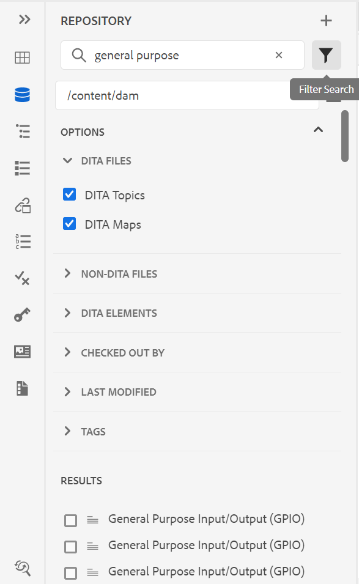

# Versione di agosto di Adobe Experience Manager Guides as a Cloud Service

## Effettua l’aggiornamento alla versione di agosto

Aggiorna le guide Adobe Experience Manager correnti as a Cloud Service (in seguito denominate *Guide AEM as a Cloud Service*) eseguendo i seguenti passaggi:
1. Consulta il codice Git del Cloud Service e passa al ramo configurato nella pipeline dei Cloud Service corrispondente all’ambiente da aggiornare.
1. Aggiorna `<dox.version>` proprietà in `/dox/dox.installer/pom.xml` file del codice Git dei tuoi Cloud Service in 2022.8.167.
1. Apporta le modifiche ed esegui la pipeline dei Cloud Service per l’aggiornamento alla versione di agosto dell’as a Cloud Service AEM Guides.

## Matrice di compatibilità

In questa sezione è elencata la matrice di compatibilità per le applicazioni software supportate dalla versione di agosto 2022 delle guide AEM as a Cloud Service.

### FRAMEMAKER e FRAMEMAKER PUBLISHING SERVER

| FMPS | FrameMaker |
| --- | --- |
| Non compatibile | Aggiornamento 2020 4 e versioni successive |
| | |

*Le condizioni di base e quelle create nell’AEM sono supportate nelle versioni di FMPS a partire dal 2020.2.

### Connettore ossigeno

| Versione di AEM Guides as a Cloud | Finestre del connettore dell&#39;ossigeno | Connettore di ossigeno Mac |
| --- | --- | --- |
| 2022.8.0 | 2.7.5. | 2.7.5. |
|  |  |  |

## Nuove funzioni e miglioramenti

AEM Guides as a Cloud Service fornisce molti miglioramenti e nuove funzioni nella versione di agosto:

### Vista Layout nell’Editor mappa

Ora è possibile visualizzare il layout completo di una mappa DITA nell&#39;Editor mappe. Quando apri una mappa per la modifica, questa apre **Layout** visualizzazione dell&#39;Editor mappa. In questa visualizzazione è possibile visualizzare la gerarchia delle mappe in una visualizzazione struttura, nonché organizzare o strutturare gli argomenti in una mappa.

La vista Layout contiene una barra degli strumenti separata che consente di eseguire molte attività sugli argomenti presenti in una mappa.
È possibile inserire riferimenti ad argomenti, gruppi di argomenti e definizioni chiave in una mappa. È possibile riorganizzare gli argomenti presenti in una mappa spostandoli verso l&#39;alto, verso il basso, a sinistra o a destra. È inoltre possibile trascinare gli argomenti per spostarli in una mappa. L&#39;Editor mappe fornisce anche le icone per bloccare o sbloccare i file, controllare la cronologia delle versioni ed eseguire una gestione delle etichette delle versioni.

La vista Layout fornisce anche **Opzioni di visualizzazione** per mostrare o nascondere il numero di riga, visualizzare o nascondere una casella di controllo o mostrare il nome o il titolo del file per gli argomenti di una mappa.

Puoi anche visualizzare gli argomenti in base ai filtri condizionali applicati.

Oltre ad organizzare gli argomenti nel file mappa, è possibile aggiungere, spostare, copiare, incollare o eliminare riferimenti utilizzando **Opzioni** disponibile per un elemento nella visualizzazione Layout. Puoi anche trascinare un argomento o una mappa dal pannello dell’archivio alla mappa aperta nell’Editor mappe.

Nel pannello di destra vengono visualizzate le Proprietà contenuto e le Proprietà mappa nella vista Layout dell’Editor mappa. Gli attributi in linea definiti per l&#39;argomento selezionato vengono visualizzati rispetto all&#39;argomento nella vista Layout. Ad esempio, puoi trovare rapidamente tutti gli argomenti per i quali l’attributo platform è definito come `IOS`.

Ora è anche possibile impostare le informazioni sui metadati per gli argomenti o la mappa. È possibile definire il Titolo navigazione, il Testo collegamento, la Descrizione breve e le Parole chiave per l&#39;argomento o la mappa selezionata.

Per ulteriori dettagli, consulta *Vista Layout* in Utilizzo delle guide di Adobe Experience Manager as a Cloud Service.

### Attributi in linea nelle impostazioni dell’editor

Le guide AEM consentono ora la configurazione di **Attributi in linea** dall&#39;amministratore di **Impostazioni editor**. Puoi anche aggiungere nuovi attributi in linea o eliminare quelli esistenti dalla sezione **Attributi in linea** nelle Impostazioni dell’editor.
Gli attributi in linea configurati definiti per un argomento vengono visualizzati rispetto all&#39;argomento nella vista Layout.

### Filtri aggiuntivi nella vista Archivio

Ora la ricerca del filtro nella vista archivio è stata resa più potente. Due nuovi criteri di ricerca, **Ultima modifica** e **Tag** Sono stati aggiunti per filtrare i file e restringere la ricerca nell’archivio AEM:
* **Ultima modifica**: puoi cercare i file che sono stati modificati l’ultima volta dopo una data selezionata, ma prima di una data selezionata. Puoi anche utilizzare i criteri predefiniti e cercare i file che sono stati modificati l’ultima volta nelle ultime 2 ore, l’ultima settimana, l’ultimo mese o l’ultimo anno.
* **Tag**: puoi anche cercare i file a cui sono applicati tag specifici. Puoi digitare il tag o selezionarlo dall’elenco a discesa.

## Problemi risolti

Di seguito sono elencati i bug risolti in varie aree:

* L’indice Lucene obsoleto è utilizzato in /core/article-publish/src/main/java/com/adobe/dxml/article/publish/util/DoxUtils.java (9291)
* Il file Node.js aggiornato non viene utilizzato per la pubblicazione. (9835)
* L&#39;argomento DITA non viene aggiornato automaticamente con le modifiche apportate al **Proprietà** pagina. (8745)
* L&#39;elemento Frontmatter aggiunto a una bookmap DITA non funziona correttamente. (9507)
* Native PDF | Viene generato un PDF vuoto quando si utilizza **Generazione rapida** per più file quando viene selezionato un elemento vuoto. (9822)
* Native PDF | L’appendice viene pubblicata come capitolo nell’output PDF. (9829)
* Native PDF | Quando si modifica un’immagine di un SVG, questa non viene visualizzata come aggiornata nel layout della pagina. 9069
* Un carattere trattino regolare viene inserito quando `Nonbreaking Hyphen` viene inserito utilizzando il **Inserisci carattere speciale** . (8919)
* XML Editor non mostra le immagini aggiornate negli argomenti se sono state modificate. (9500)
* Durante la pubblicazione dell’output tramite l’Editor, i predefiniti non possono essere eliminati dal **Output** scheda. (9100)
* Le mappe secondarie di una mappa DITA non vengono estratte utilizzando **Seleziona tutto** dal menu con i puntini di sospensione. (9814)
* Impossibile trascinare i modelli di mappa o argomenti dalla **Modelli** al modello di mappa personalizzato nell’editor web. (9846)
* Impossibile creare un nuovo argomento o modello di mappa nella sottocartella di una mappa o di un modello di argomento. (9888)
* Non è presente alcuna opzione per sfogliare gli argomenti o le mappe presenti nelle sottocartelle di una mappa o di un modello di argomento. (9889)
* Quando un file Schematron viene aggiornato e salvato insieme al file DITA, il pannello di destra non viene visualizzato (se il file DITA interrompe le convalide presenti nel file Schematron). (9986)
* È possibile creare un nuovo predefinito di output duplicato se il suo nome è uguale a quello di un predefinito esistente. (9997)
* Le immagini SVG vengono danneggiate e non vengono pubblicate correttamente al momento della generazione dell’output HTML. (9949)

## Problemi noti

L’Adobe ha identificato i seguenti problemi noti per la versione as a Cloud Service di agosto 2022 delle guide AEM.

### Problemi noti relativi alla soluzione alternativa

Utilizza la soluzione alternativa specificata per i seguenti problemi noti:

* La vista Layout non è visibile nell&#39;Editor mappa.

  **Soluzione alternativa**: aggiorna ui_config.json nel Profilo cartella.

* Symbols.json viene sovrascritto, quindi si verifica il problema 8919.

  **Soluzione alternativa**: i file symbols.json aggiornati devono essere uniti con i file symbol.json sostituiti.

### Altri problemi noti

* Se si selezionano più file dalla sezione dei risultati visualizzata durante l’esecuzione di una ricerca nel repository e quindi si trascina la selezione nella vista di authoring, viene aggiunto un solo file.
