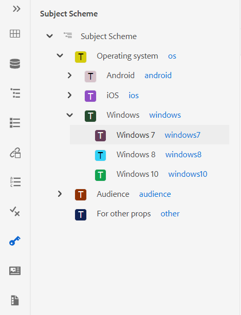
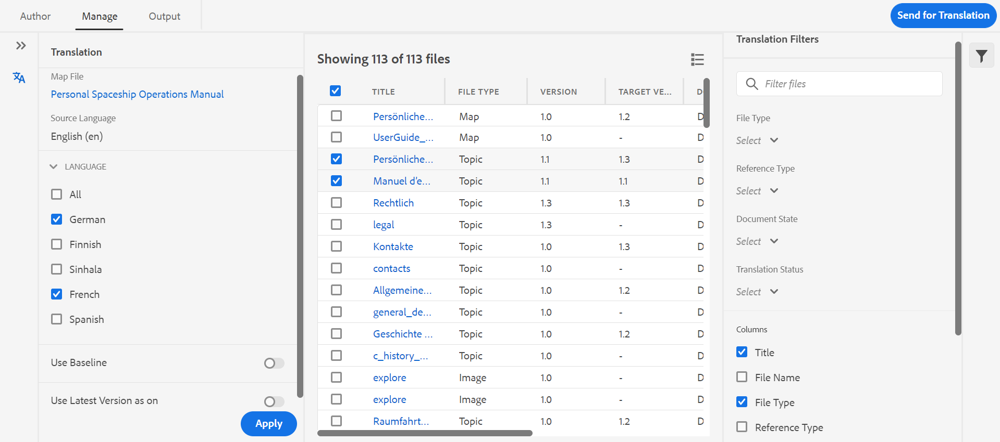
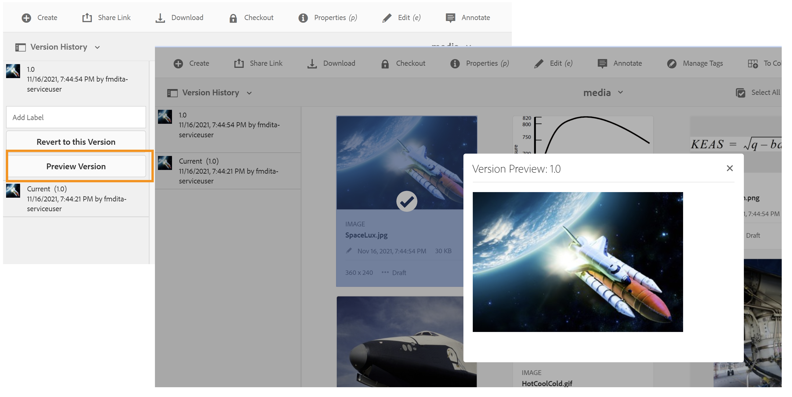

# Note sulla versione | Adobe Experience Manager Guides 4.0.x

**Dichiarazione di non responsabilità**:

*Adobe Experience Manager Guides* era precedentemente contrassegnato come *XML Documentation per Adobe Experience Manager*. Tieni presente che alcuni riferimenti all’interno della documentazione possono ancora fare riferimento al branding precedente, ma sono ancora applicabili all’offerta corrente.

Queste note sulla versione descrivono le istruzioni per l’aggiornamento, le nuove funzioni e i miglioramenti introdotti nella versione 4.0.x di Adobe Experience Manager Guides (di seguito AEM Guides).

## 4.0.3. | Note sulla versione

### Matrice di compatibilità

In questa sezione viene elencata la matrice di compatibilità per le applicazioni software supportate da AEM Guides versione 4.0.3.

#### Adobe Experience Manager

- Versione 6.5 Service Pack 12, 10, 11 o 9

Per ulteriori dettagli, vedere la sezione *Requisiti tecnici* nella Guida all&#39;installazione e alla configurazione.

#### FRAMEMAKER e FRAMEMAKER PUBLISHING SERVER

| Versione | FMPS 2020 | FMPS 2019 | Fm 2020 | Fm 2019 |
|---|---|---|---|---|
| Non UUID | 2020.2 o versione successiva* | 2019 | 2020.3 o versione successiva | 2019.8 (ultimo aggiornamento) |
| UUID | 2020.2 o versione successiva* | Non compatibile | 2020.4 o versione successiva | Non compatibile |

*La linea di base e le condizioni create nella soluzione XML Documentation sono supportate a partire dalla versione 2020.2 di FMPS.*

#### Connettore ossigeno

| Versione | Finestre del connettore dell&#39;ossigeno | Connettore di ossigeno Mac | Modifica in finestre a ossigeno | Modifica in Oxygen Mac |
|---|---|---|---|---|
| Non UUID | 1.6.8 | 1.6.8 | 1.5 | 1.5 |
| UUID | 2.3.8 | 2.3.8 | 2,2 | 2,2 |

### Problemi risolti

Di seguito sono elencati i bug risolti in varie aree:

- L&#39;ossigeno estrae una versione errata di un argomento dopo aver ripristinato una versione del file in AEM. (9661)
- Nell’interfaccia di Assets, al ripristino della versione di un file vengono visualizzate differenze di marca temporale non corrette. (9662)
- I file vengono estratti automaticamente al ripristino di qualsiasi versione. (9663)
- Il contenuto tradotto viene interrotto se il codice della lingua è menzionato come fr-fr o en-us. (9665)
- Nella versione non UUID, la traduzione approvata non si integra nella lingua di destinazione quando il codice della lingua di destinazione contiene cinque caratteri come fr_ca. (9666)
- La versione di destinazione dell&#39;immagine viene visualizzata come jcr:root, dopo la traduzione con la creazione di una nuova versione abilitata. (9668)
- Quando la traduzione viene eseguita utilizzando la linea di base, viene inviata per la traduzione una versione errata dell’immagine. (9669)

## 4.0.2. | Note sulla versione

### Matrice di compatibilità

In questa sezione viene elencata la matrice di compatibilità per le applicazioni software supportate da AEM Guides versione 4.0.2.

#### Adobe Experience Manager

- Versione 6.5 Service Pack 12, 10, 11 o 9

Per ulteriori dettagli, vedere la sezione *Requisiti tecnici* nella Guida all&#39;installazione e alla configurazione.

#### FRAMEMAKER e FRAMEMAKER PUBLISHING SERVER

| Versione | FMPS 2020 | FMPS 2019 | Fm 2020 | Fm 2019 |
|---|---|---|---|---|
| Non UUID | 2020.2 o versione successiva* | 2019 | 2020.3 o versione successiva | 2019.8 (ultimo aggiornamento) |
| UUID | 2020.2 o versione successiva* | Non compatibile | 2020.4 o versione successiva | Non compatibile |

*La linea di base e le condizioni create nella soluzione XML Documentation sono supportate a partire dalla versione 2020.2 di FMPS.*

#### Connettore ossigeno

| Versione | Finestre del connettore dell&#39;ossigeno | Connettore di ossigeno Mac | Modifica in finestre a ossigeno | Modifica in Oxygen Mac |
|---|---|---|---|---|
| Non UUID | 1.6.8 | 1.6.8 | 1.5 | 1.5 |
| UUID | 2.3.8 | 2.3.8 | 2,2 | 2,2 |

### Problemi risolti

Di seguito sono elencati i bug risolti in varie aree:

- La posizione del testo inserito o eliminato non è corretta in un documento di revisione appena creato. (9454)
- La versione 1.0 non è elencata in alcuni casi nel pannello **Cronologia versione** dopo l&#39;aggiornamento 4.0.1. (9441)
- L&#39;etichetta e i commenti non vengono visualizzati per la versione corrente nella versione 1.0 e in alcuni casi non sono elencati nel pannello **Cronologia versione**. (9440)
- L’editor si blocca quando alcuni file di contenuto vengono aperti nell’editor. (9433)
- La ricerca nel pannello del repository e la finestra di dialogo di navigazione *topicref* si blocca quando si esegue la ricerca in file di contenuto di grandi dimensioni. (9432)
- Quando si salva un file una sola volta dall&#39;editor Web, vengono create due versioni di un file. (9428)
- Impossibile inserire risorse non DITA e ditaval in topicref. (9363)
- L’editor si blocca quando si carica l’anteprima di una mappa con un numero elevato di chiavi. (9332)
- I riferimenti si interrompono quando si spostano le risorse nei file di origine durante la creazione con l&#39;aggiornamento FM 4. (9177)

### Problemi noti

- Se l&#39;impostazione **Crea nuova versione per il file caricato** è attivata, viene creata una nuova versione scegliendo **Salva tutto** in modo intermittente in alcuni casi.
- La funzionalità Elimina utenti nel Profilo cartella non funziona in modo intermittente nel browser Chrome. **Soluzione**: aggiorna il browser Chrome.

## 4.0.1. | Note sulla versione

### Matrice di compatibilità

In questa sezione viene elencata la matrice di compatibilità per le applicazioni software supportate dalla soluzione XML Documentation versione 4.0.1.

#### Adobe Experience Manager

- Versione 6.5 Service Pack 12, 11 o 10
- Java: 11

#### FRAMEMAKER e FRAMEMAKER PUBLISHING SERVER

| Versione | FMPS 2020 | FMPS 2019 | Fm 2020 | Fm 2019 |
|---|---|---|---|---|
| Non UUID | 2020.2 o versione successiva* | 2019 | 2020.3 o versione successiva | 2019.8 (ultimo aggiornamento) |
| UUID | 2020.2 o versione successiva* | Non compatibile | 2020.4 o versione successiva | Non compatibile |

*La linea di base e le condizioni create nella soluzione XML Documentation sono supportate a partire dalla versione 2020.2 di FMPS.*

#### Connettore ossigeno

| Versione | Finestre del connettore dell&#39;ossigeno | Connettore di ossigeno Mac | Modifica in finestre a ossigeno | Modifica in Oxygen Mac |
|---|---|---|---|---|
| Non UUID | 1.6.8 | 1.6.8 | 1.5 | 1.5 |
| UUID | 2.3.8 | 2.3.8 | 2,2 | 2,2 |

### Problemi risolti

Di seguito sono elencati i bug risolti in varie aree:

- La struttura dei riferimenti viene interrotta per una mappa quando vengono aggiunti/rimossi riferimenti ad argomenti duplicati. (8922)
- Più problemi presenti nella sezione **Current** versions della **Version History.** (8909)
- I riferimenti si interrompono quando si utilizza **Seleziona tutto** e si spostano i file multimediali o il contenuto DITA in un&#39;altra cartella. (8897)
- Più problemi relativi all&#39;interfaccia utente nella finestra di dialogo **Inserisci riferimento incrociato** > **Riferimento file** > **File di ricerca** > **Filtri** > **Modifica percorso di ricerca** nell&#39;editor Web. (8889)
- Problemi di ricerca con *topicref* e *ditavalref* nell&#39;editor mappe (8983).
- La ricerca durante la digitazione causa richieste di ricerca indesiderate nella vista Archivio. (8982)
- Impossibile eliminare gli utenti amministratore dal profilo della cartella. (8926)
- La nota a piè di pagina di utilizzo per riferimento non scorre fino alla sezione delle note a piè di pagina nell’output del sito AEM. (9061)
- Impossibile pubblicare gli articoli aggiornati in Salesforce. (9008)
- La posizione di evidenziazione non è corretta nella vista affiancata. (9009)
- Impossibile trascinare le condizioni sugli argomenti DITA. (9031)
- css_layout.css non può essere sovrapposto nel profilo della cartella. (9032)
- Si è verificata un’eccezione durante la visualizzazione di una risorsa dopo il caricamento. (9068)
- La personalizzazione dei caratteri speciali consentiti nell&#39;editor XML non funziona correttamente. (9075)
- Nel flusso di lavoro di traduzione viene creata una versione aggiuntiva per la risorsa tradotta. (9107)
- La pubblicazione della linea di base con un argomento che utilizza un&#39;immagine come *conref* da un altro argomento non viene visualizzata nell&#39;output. (9172)
- Quando si utilizzano le directory temporanee dell’API delle mappe di download, non vengono pulite nel caso in cui il download non riesca. (9176)
- L’allineamento orizzontale non è disponibile per una tabella nella versione 4.0 di. (9207)
- L&#39;attributo Keys non è visualizzato per *glossref*, pertanto non è possibile inserire il modulo abbreviato tramite riferimenti di inserimento. (9213)
- La creazione di un *keydef* consente solo la selezione di un collegamento in 4.0. (9214)
- Il comportamento della funzionalità Inserisci definizione chiave/*keyref* è diverso in 4.0 rispetto a 3.8.10. (9215)
- Sono stati risolti i problemi relativi all’editor web presenti nelle versioni da 3.8.6 a 3.8.10. (9219)
- Si verificano dei problemi quando nel titolo della scheda viene utilizzata una parola chiave. (9317)
- Nella vista Source vengono visualizzati più errori per gli attributi non condizionali. (9278)
- Problemi presenti nella finestra di dialogo Sfoglia di **Seleziona percorso**. (9289)

## 4,0 | Note sulla versione

### Matrice di compatibilità

In questa sezione viene elencata la matrice di compatibilità per le applicazioni software supportate dalla soluzione XML Documentation versione 4.0.

#### Adobe Experience Manager

- Versione 6.5 Service Pack 11, 10 o 9

#### FRAMEMAKER e FRAMEMAKER PUBLISHING SERVER

| Versione | FMPS 2020 | FMPS 2019 | Fm 2020 | Fm 2019 |
|---|---|---|---|---|
| Non UUID | 2020.2 o versione successiva* | 2019 | 2020.3 o versione successiva | 2019.8 (ultimo aggiornamento) |
| UUID | 2020.2 o versione successiva* | Non compatibile | 2020.4 o versione successiva | Non compatibile |

*La linea di base e le condizioni create nella soluzione XML Documentation sono supportate a partire dalla versione 2020.2 di FMPS.*

#### Connettore ossigeno

| Versione | Finestre del connettore dell&#39;ossigeno | Connettore di ossigeno Mac | Modifica in finestre a ossigeno | Modifica in Oxygen Mac |
|---|---|---|---|---|
| Non UUID | 1.6.8 | 1.6.8 | 1.5 | 1.5 |
| UUID | 2.3.8 | 2.3.8 | 2,2 | 2,2 |

### Nuove funzioni e miglioramenti

#### Pubblicazione basata su articolo

Con la versione 4.0 è stata introdotta una funzione di pubblicazione basata su articoli integrata nell’editor web. È possibile utilizzare la funzione di pubblicazione basata su articoli per generare in modo incrementale l&#39;output di uno o più argomenti o pubblicare il contenuto in una piattaforma della Knowledge Base.

Questa funzione consente agli utenti di creare la mappa DITA in modo additivo e pubblicare argomenti quando e come sono pronti. Dopo aver pubblicato la mappa, utilizza la funzione di pubblicazione basata su articoli per ottenere una pubblicazione incrementale solo per gli articoli aggiornati.

Oltre ad AEM, questa funzione esclusiva consente di pubblicare gli articoli su tutti i portali della Knowledge Base, ad esempio Salesforce. Questa funzione viene fornita anche con un modello di contenuto OOTB, basato sui componenti core di AEM, che consente di creare un archivio dei contenuti tecnici basato sulle conoscenze. L&#39;aspetto eccezionale di questo modello è che è completamente personalizzabile in base ai requisiti aziendali e può supportare anche casi di utilizzo come portali Intranet aziendali.

Questo articolo on-the-go basato sulle esigenze di pubblicazione non solo offre un controllo completo sulla pubblicazione dei contenuti, ma riduce anche il tempo complessivo di pubblicazione dei contenuti aggiornati.

Per ulteriori dettagli, vedere *Pubblicazione basata su articolo dall&#39;editor Web* nella Guida utente.

#### Editor Web migliorato

Nell’editor web sono stati introdotti numerosi miglioramenti e nuove funzioni:

- Il framework di base è stato modificato da Interfaccia utente basata su Coral a Interfaccia utente basata su Spectrum. Ciò offre un’interfaccia utente molto standardizzata e intuitiva.
- La nuova funzione Proprietà file è stata introdotta nel pannello di destra. È possibile controllare le proprietà di un documento attivo. Le informazioni sono suddivise in due sezioni:
   - *Generale*: contiene i dettagli generali del file quali nome file, UUID, tag metadati, lingua, data di creazione, stato estratto e stato del documento.
   - *Riferimento*: contiene riferimenti in ingresso e in uscita.

     

- Il supporto per lo schema soggetto è stato aggiunto anche nell’editor web. È ora possibile creare e utilizzare lo schema soggetto utilizzando il pannello Schema soggetto. Con l&#39;aggiunta dello schema argomento, è ora possibile utilizzare metadati e tassonomia aziendali propri.

  

- In questa versione è stato introdotto un nuovo strumento per il glossario, che consente di gestire i glossari in blocco. Questo strumento consente di convertire rapidamente il testo in glossario e glossario in termini in blocco per una mappa selezionata o per argomenti aperti.

  

- È stata aggiunta la funzionalità di aggiornamento nel pannello Contenuto riutilizzabile, che consente di aggiornare rapidamente il contenuto riutilizzabile nei file di riferimento.
- L&#39;indicatore Nuovo aggiornamento file indica se la copia corrente (di lavoro) del file è sincronizzata o meno con la versione salvata.

  

- Il filtro di ricerca nel pannello Archivio e la finestra di dialogo di navigazione dei file sono stati migliorati per fornire ulteriori opzioni di filtro, che possono essere ulteriormente personalizzate.

  

- È ora possibile caricare i file con estensione docx dall&#39;editor Web.
- Le preferenze utente ora sono memorizzate nel profilo utente e non nei cookie del browser. In questo modo gli utenti possono mantenere le proprie preferenze in tutti i browser o le sessioni utente.

#### Nuovo dashboard di traduzione

Nell’editor web è stata introdotta una nuova dashboard di traduzione con le seguenti funzioni:

- Ordinamento, ricerca e filtro dell&#39;elenco degli argomenti.
- Filtra il contenuto per tipo di riferimento: riferimenti diretti o indiretti.
- Navigazione semplice per trovare un progetto esistente durante l’avvio di una richiesta di traduzione.
- È stato introdotto un meccanismo di traduzione multilingue per evitare la creazione di più progetti per ogni lingua quando viene avviata una richiesta di traduzione per più lingue.
- È stata introdotta una configurazione per nascondere la scheda di traduzione nel dashboard delle mappe. Per impostazione predefinita, è visibile. Puoi scegliere di tradurre il contenuto utilizzando il dashboard delle mappe o l’editor web.

#### Pubblicazione avanzata

Nel processo di pubblicazione sono ora disponibili i seguenti miglioramenti:

- La generazione di PDF tramite FrameMaker Publishing Server ora supporta le linee di base e i predefiniti di condizione.
- Gli autori possono ora passare metadati a livello di mappa e di argomento alla pubblicazione DITA-OT. Questa funzione è utile quando i modelli PDF personalizzati sono progettati per utilizzare proprietà di metadati di file come tag, autore, stato del documento e altro ancora.

  

- È stata aggiunta una nuova configurazione in configMgr per consentire agli utenti di mantenere o eliminare le versioni degli argomenti da eliminare quando viene utilizzata l&#39;opzione **Elimina e crea** nella generazione dell&#39;output del sito AEM.

#### Gestione file migliorata

Durante l’utilizzo dei file in AEM Assets è ora possibile visualizzare i seguenti miglioramenti:

- Sono state introdotte una nuova esperienza di caricamento dei file e una nuova finestra di dialogo per la scelta di una strategia di risoluzione dei conflitti.

  

- Possibilità di creare una nuova versione del file caricato con la possibilità di impedire la sovrascrittura di un file estratto.
- Ora è possibile visualizzare un&#39;anteprima delle immagini direttamente dalla visualizzazione Cronologia versioni. Inoltre, per i file DITA e non DITA, Cronologia versioni mostra separatamente le informazioni sulla versione corrente.

  

#### Nuova funzione di esportazione dei rapporti

I rapporti sono molto utili per identificare lo stato del contenuto. La soluzione XML Documentation fornisce diversi rapporti per assumere il controllo dei contenuti. Ora non solo puoi visualizzare i rapporti, ma puoi anche esportare i dati del rapporto in un file CSV per visualizzarli e condividerli con il tuo team più ampio. I dati dei rapporti possono fornire un rapido sguardo a eventuali collegamenti interrotti o immagini mancanti.

#### Migliore esperienza di aggiornamento di Oxygen DAM

Quando si aggiornano i file da AEM Server in Oxygen, viene visualizzato un messaggio di avviso se nella sessione corrente di Oxygen sono presenti file non salvati. È possibile scegliere di annullare l&#39;operazione di aggiornamento per salvare eventuali file non salvati. Senza questa funzione, gli utenti perdevano informazioni non salvate nei loro documenti.

#### Altri miglioramenti funzionali

- In conformità alle best practice di AEM, i dati dell’applicazione sono stati ora migrati da /content/fmdita, /etc/fmdita/ e /content/dxml/ a una posizione più recente.
- Il flusso di lavoro DAM Asset Update è stato reintrodotto con una migliore gestione e prestazioni ottimizzate da eseguire insieme al flusso di lavoro di post-elaborazione XML.
- Il pacchetto API di XML Documentation è ora disponibile in un archivio Maven accessibile al pubblico.
- Ora puoi creare un nuovo modello di progetto Dita nel percorso /apps/projects/templates.
- Ora scarica il file ui_config.json predefinito dai profili delle cartelle. Può essere utilizzato per unire le modifiche personalizzate dal file ui_config.json esistente durante l’aggiornamento.

### Problemi risolti

Di seguito sono elencati i bug risolti in varie aree:

#### Editor web

- conrefs appare di colore rosso anche quando non sono rotte. (8239)
- Il valore per l&#39;attributo condizionale non viene compilato automaticamente quando **Aggiungi tutte le proprietà** è selezionato nell&#39;editor DITAVAL. (8234)
- Gli autori non sono in grado di inserire un’immagine in un argomento utilizzando un percorso relativo. (8112)
- I parametri di conversione Ph aggiunti nella cella della tabella vengono visualizzati in rosso. (8083)
- In caso di sistemi basati su UUID, i collegamenti in un’attività di revisione non vengono aggiornati quando i file in revisione vengono spostati. (8080)
- L’editor web non esegue correttamente il rendering delle immagini con proprietà di ridimensionamento impostate su 75% o su un valore superiore. (8073)
- Le immagini GIF vengono sottoposte a rendering come immagini statiche nell’Editor web. (8024)
- Un riferimento conkeyref in un elemento nota non viene visualizzato nell&#39;anteprima o nell&#39;output dell&#39;editor Web. (8006)
- xref a un elemento che è esso stesso un conref non viene risolto nell’editor. (7933)
- Il rendering del titolo con chiave non viene eseguito correttamente nell’anteprima dell’editor e nel pannello Archivio. (7909)
- I frammenti con caratteri speciali non vengono memorizzati correttamente. (7908)
- Anche in presenza di un problema di convalida JS, la richiesta POST viene comunque inviata al server. (7989)
- Il salvataggio di un argomento dopo la formattazione delle equazioni di MathML genera un errore. (7954)
- keydef con (tm) non vengono riprodotti correttamente nell’editor e l’output del sito AEM conteneva simboli TM duplicati. (7859)
- Il trascinamento di uno snippet non funziona come per le DTD. (7758)
- HTML sta ignorando le dimensioni definite personalizzate per gli elementi grafici. (7718)
- l&#39;attributo conrefend non viene aggiornato quando il file di origine viene spostato. (7698)
- L’utilizzo di documenti di riferimento di tipo argomento causa diversi problemi all’interfaccia utente. (7656)
- I file DITAVAL non vengono visualizzati quando l&#39;autore aggiunge ditavalref in una mappa. (7594)
- Spazio imprevisto in ogni elemento `<entry>` vuoto quando l&#39;attributo outputclass viene aggiunto all&#39;elemento `<tgroup>`. (7532)
- Il pulsante Source non funziona per gli argomenti aperti tramite la dashboard delle mappe. (7465)
- La funzione di stampa consente di inserire righe e spazi vuoti che possono essere visualizzati all&#39;apertura del file in FrameMaker o Oxygen. (7408)
- Le mappe con href=&quot;/&quot; in uno qualsiasi degli argomenti non vengono pubblicate sui siti di AEM (7405)
- Sono stati riscontrati problemi di prestazioni nell’editor quando la mappa principale presenta un numero elevato di chiavi. (7400)
- Lo stato del documento per una mappa con modello personalizzato non viene ereditato dal profilo degli stati corrispondente. (7359)
- Rendering errato dell&#39;elemento `<tm>` come elemento di blocco. (7286)
- I modelli duplicati vengono visualizzati nel pannello dei modelli dell’editor quando viene creato un nuovo modello. (5814)
- I modelli definiti in ui_config per le immagini per l’impostazione di un attributo aggiuntivo non sono applicabili nei casi di trascinamento della selezione. (5713)
- L’aspetto predefinito di uicontrol nella menucascata non è corretto. (5483)
- I modelli personalizzati per Argomento/Mappa non mostrano il nuovo nome nell’interfaccia utente. Il nome viene visualizzato come &quot;Topic&quot;/&quot;Map&quot; (Argomento/Mappa) invece che come nome configurato (4958)

#### Connettore ossigeno

- I file la cui cartella principale contiene caratteri speciali restituiscono un errore durante il caricamento in ossigeno. (8054)
- Quando un documento appena creato viene aperto in ossigeno, viene generato l&#39;errore &quot;Impossibile trovare GUID&quot;. (7856)
- L&#39;opzione Check-in è disattivata dopo il check-out del file da AEM mediante Modifica in ossigeno. (7471)

#### Rivedere

- Quando le attività di revisione vengono riassegnate dalla casella in entrata di AEM, i payload associati alle attività non sono visualizzabili dagli assegnatari. (8003)
- Se il nome di un file dispone di spazio, nella pagina Rivedi attività non viene visualizzato il contenuto del file multimediale. (8111)

#### Dashboard mappa

- Impossibile visualizzare il contenuto di riferimento nel titolo di un argomento nella scheda degli argomenti o dei rapporti della dashboard delle mappe. (8263)
- Output AEM Sites | jcr:title della pagina del sito generata non viene aggiornato quando viene aggiornato il titolo dell&#39;argomento DITA. (8131)
- Il download di MAP non scarica i file video utilizzati negli argomenti. (8070)
- Il download di AEM bookmap non riesce per la gerarchia semplice se bookmap contiene 2 argomenti con lo stesso nome in cartelle diverse. Se sono presenti file con lo stesso nome ma con maiuscole e minuscole diverse, vengono trattati come file duplicati. (8058)
- I file multimediali non vengono scaricati quando il tag dell’oggetto viene utilizzato tramite l’API di scaricamento della mappa dei libri. (8057)
- Nella scheda Rapporti viene visualizzato un rapporto errato se un argomento contiene conref to file il cui titolo inizia con conref. (4698)

#### Pubblicazione

- La creazione di PDF non riesce per la prima volta quando si seleziona Abilita controllo delle versioni. (8053, 8294)
- Per contenuti non UUID, le immagini di riferimento non vengono visualizzate nell’output del sito AEM. (7907)
- Il carattere spazio vuoto viene aggiunto automaticamente dopo un tag &quot;tm;&quot; nell’output del sito AEM. (7964)
- Impossibile visualizzare i video di YouTube nell’output del sito AEM. (7401)
- Il filtro per etichetta non riesce per il contenuto di riferimento dopo che l’utente fa clic su Sfoglia tutti gli argomenti nella scheda della linea di base del dashboard delle mappe. (7388)
- L&#39;argomento di pubblicazione con l&#39;elemento `<tm>` con valore di proprietà SM o reg non viene visualizzato correttamente nell&#39;output generato. (7239)
- Per la pubblicazione della linea di base con l’immagine non viene selezionata la versione più recente dell’immagine nell’output pubblicato. (7231)
- Gli argomenti di riferimento relativi vengono visualizzati nella scheda della linea di base. (5424)
- La pubblicazione incrementale per un argomento il cui titolo contiene conkeyref non funziona come previsto. (4474)
- Il titolo della pagina non viene utilizzato per la generazione dell’URL di output anche se questa impostazione è selezionata. (8257)
- Pubblicazione della linea di base con selezione della versione corrente delle immagini anziché del nodo bloccato. Questo viene visualizzato anche se il nome di un file contiene spazio o caratteri speciali. (8274, 8322)
- La pubblicazione incrementale non riesce per la mappa DITA con lo schema del tipo soggetto con mapref. (8218)

#### AEM Assets

- Sono stati riscontrati problemi di prestazioni durante l’esecuzione della selezione/eliminazione su un set di contenuti enorme nell’interfaccia utente di Assets. (8238)
- La funzione di ricerca salvata (raccolta avanzata) si interrompe se si aggiunge il predicato DITA ai filtri di ricerca. (8048)
- Il ripristino dell’immagine alla versione precedente non funziona. (DXML-7903)
- L’opzione Elimina è visibile anche per gli autori che non dispongono dell’autorizzazione per l’eliminazione. (7322)
- La sovrapposizione CCMS per Assets Editor interrompe il rendering dell’opzione Elimina. (8093)

#### Importazione dei contenuti

- Conversione da HTML a DITA | La tabella con &quot;tr&quot; con voci &quot;td&quot; vuote causa l’aggiunta di righe nell’output. (8132)
- Conversione da HTML a DITA | Un HTML con una tabella con più tbody non riesce, ad eccezione di. (7940)
- Conversione da HTML a DITA | errori in caso di commenti nel HTML di origine. (7937)
- L&#39;importazione di file DITA 1.3 causa la trasformazione di alcuni href in collegamenti non corretti. (8019)

#### Altri

- Nella visualizzazione Cronologia versioni la miniatura delle immagini risulta mancante o interrotta. (7948, 8008)
- L’API zipMapWithDependents non fornisce informazioni rilevanti in caso di riferimenti errati nel contenuto. (7521)
- Per i clienti UUID, i valori di configurazione predefiniti sono stati modificati per alcune configurazioni come regex per l’identificazione dei file UUID, l’utilizzo del titolo della pagina per la generazione dell’output e altro ancora. (8301, 8305)

## Istruzioni per l’aggiornamento {#upgrade-instructions}

Puoi aggiornare facilmente la versione corrente di AEM Guides alla versione 4.0.3. Prima di procedere con l’aggiornamento alla versione 4.0.3 di AEM Guides, è necessario considerare i seguenti punti:

- Se utilizzi la versione 4.0.2, puoi eseguire direttamente l’aggiornamento alla versione 4.0.3. Prima di eseguire l’aggiornamento alla versione 4.0.3, devi effettuare l’aggiornamento alla versione 4.0.2.
- Se utilizzi la versione 4.0, puoi eseguire direttamente l’aggiornamento alla versione 4.0.2.
- Se utilizzi la versione 4.0.1, devi disinstallarla.
- Se utilizzi la versione 3.8.5, devi effettuare l’aggiornamento alla versione 4.0 prima di passare alla versione 4.0.2.
- Se utilizzi una versione precedente alla 3.8.5, consulta la sezione sull’aggiornamento nella guida all’installazione specifica per il prodotto.

Per ulteriori dettagli, vedere [Istruzioni per l&#39;aggiornamento](https://helpx.adobe.com/content/dam/help/en/xml-documentation-solution/4-0-3/Adobe-Experience-Manager-Guides_Upgrade-Instructions_EN.pdf).

