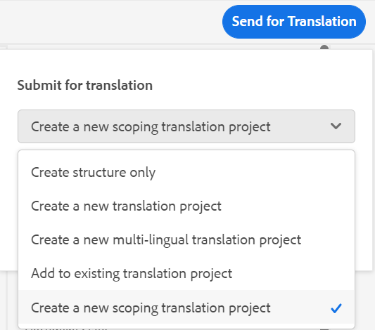

# Versione 4.1.x delle guide di Adobe Experience Manager

Queste note sulla versione descrivono le istruzioni di aggiornamento, le nuove funzioni e i miglioramenti introdotti nella versione 4.1.x delle Guide di Adobe Experience Manager (in seguito denominate *Guide AEM*).

## Effettua l’aggiornamento alla versione più recente

Puoi aggiornare facilmente la versione corrente delle guide AEM alla versione 4.1.3. Prima di procedere con l’aggiornamento alla versione 4.1.3 delle Guide AEM, è necessario considerare i seguenti punti:
* Se utilizzi la versione 4.1 o 4.1.x, puoi eseguire direttamente l’aggiornamento alla versione 4.1.3.
* Se utilizzi la versione 4.0.x, devi effettuare l’aggiornamento alla versione 4.1 o 4.1.x prima di passare alla versione 4.1.3.
* Se utilizzi la versione 3.8.5, devi effettuare l’aggiornamento alla versione 4.0.x prima di passare alla versione 4.1.
* Se utilizzi una versione precedente alla 3.8.5, consulta la sezione sull’aggiornamento nella guida all’installazione specifica per il prodotto.

Per ulteriori informazioni, consulta [Istruzioni per l’aggiornamento](assets/Adobe-Experience-Manager-Guides-Upgrade-Instructions-EN.pdf).

## 4.1.3. | Note sulla versione

## Matrice di compatibilità

In questa sezione viene elencata la matrice di compatibilità per le applicazioni software supportate dalla versione 4.1.3 delle guide AEM.

### ADOBE EXPERIENCE MANAGER

**Non UUID**
Versione 6.5 Service Pack 13, 12, 11 o 10

**UUID**
Versione 6.5 Service Pack 13, 12, 11 o 10

Per ulteriori dettagli, consulta la sezione Requisiti tecnici nella guida Installare e configurare le guide di Adobe Experience Manager.

### FRAMEMAKER e FRAMEMAKER PUBLISHING SERVER

| Versione | FMPS 2020 | FMPS 2019 | Fm 2020 | Fm 2019 |
| --- | --- | --- | --- | --- |
| 4.1.3 (non UUID) | 2020.2 o versione successiva* | 2019 | 2020.3 o versione successiva | 2019.8 (ultimo aggiornamento) |
| 4.1.3 (UUID) | 2020.2 o versione successiva* | Non compatibile | 2020.4 o versione successiva | Non compatibile |
| | | | |

*Le condizioni di base e quelle create nell’AEM sono supportate nelle versioni di FMPS a partire dal 2020.2.

### Connettore ossigeno

| Versione | Finestre del connettore dell&#39;ossigeno | Connettore di ossigeno Mac | Modifica in finestre a ossigeno | Modifica in Oxygen Mac |
| --- | --- | --- |--- |--- |
| 4.1.3 (non UUID) | 2.0 | 2.0 | 1,6 | 1,6 |
| 4.1.3 (UUID) | 2,7 | 2,7 | 2,3 | 2,3 |
|  |  |   |

## Problemi risolti

Il bug corretto è elencato di seguito:

* L’editor web carica una pagina vuota in modo intermittente. (10678)

## 4.1.2. | Note sulla versione

## Matrice di compatibilità

In questa sezione viene elencata la matrice di compatibilità per le applicazioni software supportate dalla versione 4.1.2 delle guide AEM.

### ADOBE EXPERIENCE MANAGER

**Non UUID**
Versione 6.5 Service Pack 13, 12, 11 o 10

**UUID**
Versione 6.5 Service Pack 13, 12, 11 o 10

Per ulteriori dettagli, consulta la sezione Requisiti tecnici nella guida Installare e configurare le guide di Adobe Experience Manager.

### FRAMEMAKER e FRAMEMAKER PUBLISHING SERVER

| Versione | FMPS 2020 | FMPS 2019 | Fm 2020 | Fm 2019 |
| --- | --- | --- | --- | --- |
| 4.1.2 (non UUID) | 2020.2 o versione successiva* | 2019 | 2020.3 o versione successiva | 2019.8 (ultimo aggiornamento) |
| 4.1.2 (UUID) | 2020.2 o versione successiva* | Non compatibile | 2020.4 o versione successiva | Non compatibile |
| | | | |

*Le condizioni di base e quelle create nell’AEM sono supportate nelle versioni di FMPS a partire dal 2020.2.

### Connettore ossigeno

| Versione | Finestre del connettore dell&#39;ossigeno | Connettore di ossigeno Mac | Modifica in finestre a ossigeno | Modifica in Oxygen Mac |
| --- | --- | --- |--- |--- |
| 4.1.2 (non UUID) | 2.0 | 2.0 | 1,6 | 1,6 |
| 4.1.2 (UUID) | 2,7 | 2,7 | 2,3 | 2,3 |
|  |  |   |

## Problemi risolti

Di seguito sono elencati i bug risolti in varie aree:

* Quando si selezionano tutti i profili di cartella, viene visualizzato un profilo di cartella invisibile (non corretto). (10393)
* Quando il fuso orario dell’utente è diverso da quello del server, durante la creazione della linea di base non viene selezionata la versione più recente. (10336)
* La scelta rapida Ctrl+F non apre la finestra modale di ricerca del browser sulla console Assets dopo l’installazione delle guide AEM 4.1. (10339)
* Si verifica un errore di creazione della linea di base per l&#39;argomento che contiene il riferimento a una cartella. (10383)
* La scheda Predefiniti di output mostra una schermata vuota a intermittenza e in alcuni casi vengono visualizzati predefiniti non modificabili. (10390)
* La gestione dello spazio chiave genera eccezioni ed errori. (10449)

### Problemi noti relativi alla soluzione alternativa

* La linea di base esportata durante la traduzione non viene caricata nella scheda linea di base dell’editor.

  **Soluzione alternativa**: utilizza la scheda baseline del dashboard delle mappe DITA.

## 4,1 | Note sulla versione

Queste note sulla versione descrivono le istruzioni di aggiornamento, le nuove funzioni e i miglioramenti introdotti nella versione 4.1.x delle Guide di Adobe Experience Manager (in seguito denominate *Guide AEM*).

## Matrice di compatibilità

In questa sezione viene elencata la matrice di compatibilità per le applicazioni software supportate dalla versione 4.1 delle guide AEM.

### ADOBE EXPERIENCE MANAGER

**Non UUID**
Versione 6.5 Service Pack 13, 12, 10 o 11

**UUID**
Versione 6.5 Service Pack 13, 12, 10 o 11

Per ulteriori dettagli, consulta la sezione Requisiti tecnici nella guida Installare e configurare le guide di Adobe Experience Manager.

### FRAMEMAKER e FRAMEMAKER PUBLISHING SERVER

| Versione | FMPS 2020 | FMPS 2019 | Fm 2020 | Fm 2019 |
| --- | --- | --- | --- | --- |
| 4.1 (non UUID) | 2020.2 o versione successiva* | 2019 | 2020.3 o versione successiva | 2019.8 (ultimo aggiornamento) |
| 4.1 (UUID) | 2020.2 o versione successiva* | Non compatibile | 2020.4 o versione successiva | Non compatibile |
| | | | |

*Le condizioni di base e quelle create nell’AEM sono supportate nelle versioni di FMPS a partire dal 2020.2.

### Connettore ossigeno

| Versione | Finestre del connettore dell&#39;ossigeno | Connettore di ossigeno Mac | Modifica in finestre a ossigeno | Modifica in Oxygen Mac |
| --- | --- | --- |--- |--- |
| 4.1 (non UUID) | 2.0 | 2.0 | 1,6 | 1,6 |
| 4.1 (UUID) | 2,7 | 2,7 | 2,3 | 2,3 |
|  |  |  |

## Nuove funzioni e miglioramenti

Le guide AEM forniscono molti miglioramenti e nuove funzioni nella versione 4.1:

### Pubblicazione nativa di PDF

Il supporto per la creazione di un PDF nativo è stato aggiunto anche nella versione 4.1 delle guide AEM. È stato introdotto un nuovo motore di pubblicazione con le seguenti caratteristiche:
* Creare un modello CSS
* Creare diversi modelli di pagina
* Progettare modelli di PDF comprendenti CSS e modelli di pagina
* Pubblicare contenuti di mappe e argomenti in formato PDF

### Supporto per il percorso del sito della knowledge base nella pubblicazione basata su articoli

Le guide AEM forniscono la funzione di pubblicazione basata su articoli per generare in modo incrementale un output di uno o più argomenti o pubblicare i contenuti su una piattaforma knowledgebase. Con la versione 4.1, è disponibile un’opzione aggiuntiva per scegliere il percorso del sito della Knowledge Base in cui pubblicare l’argomento o la mappa. Dopo aver selezionato il percorso, l’output viene generato nel percorso specificato.

### Editor Web avanzato

* **Risoluzione chiave migliorata**

Un riferimento a una chiave di contenuto DITA inserisce una parte di contenuto da un argomento in un altro. Utilizza una chiave per individuare il contenuto. È necessario risolvere i riferimenti chiave associati a un argomento DITA. La mappa principale selezionata ha la precedenza più alta per risolvere i riferimenti chiave.

Ora i riferimenti chiave vengono risolti in base alla mappa principale impostata nel seguente ordine di priorità:

1. Preferenze utente
1. Pannello Vista mappa
1. Profilo cartella

Per ulteriori dettagli, consulta *Risolvi riferimenti chiave* nella guida Utilizzo delle guide di Adobe Experience Manager.

* **Aggiungi un pannello personalizzato nel pannello a sinistra**

Ora è possibile aggiungere un pannello personalizzato nel pannello sinistro dell’Editor web. Puoi utilizzare un pannello personalizzato per vari scopi, ad esempio per fornire assistenza o eseguire il test di un progetto. Se è stato configurato un pannello personalizzato, viene visualizzato anche nell’elenco dei pannelli all’interno di **Impostazioni editor**. È possibile attivare o disattivare l&#39;opzione per mostrare o nascondere il pannello personalizzato.

* **Possibilità di modificare lo stato del documento degli argomenti in una mappa DITA**

Ora è possibile modificare facilmente lo stato del documento degli argomenti selezionati all&#39;interno di una mappa DITA. È inoltre possibile aprire e modificare le proprietà degli argomenti selezionati in una mappa DITA dal **Altre opzioni** nella parte inferiore del pannello Vista mappa.

* **Informazioni sulla versione visualizzate in modalità Anteprima**

L’editor web consente di gestire le versioni. È inoltre possibile visualizzare la versione dell&#39;argomento attivo o della mappa DITA nell&#39;angolo superiore destro della scheda File dell&#39;argomento nella modalità Anteprima di un argomento.

* **È stato migliorato il comportamento di aggiornamento dell’editor web**

Con l’operazione di aggiornamento del browser nell’editor web sono ora disponibili i seguenti miglioramenti:

* Ora è possibile aggiornare il browser mentre si modifica il contenuto nell’editor web. Se si preme l&#39;icona di aggiornamento del browser mentre uno o più file con modifiche non salvate vengono aperti per la modifica, viene richiesto di salvare i file o di annullare l&#39;operazione di aggiornamento.

* Anche durante l’aggiornamento del browser, vengono mantenute le visualizzazioni del pannello sinistro e di quello destro.

* L&#39;argomento attivo o la mappa DITA viene riaperto nell&#39;area di modifica del contenuto.

* **Creare mappe in base a modelli personalizzati**

Ora è disponibile la potente funzione per creare modelli di mappa personalizzati. È possibile utilizzarli per creare mappe DITA insieme ai modelli di argomento e ai modelli di mappa a cui si fa riferimento nel modello di mappa.

Puoi anche fare riferimento ad altri modelli di mappa e modelli di argomento dal modello di mappa personalizzato. I modelli di mappa indicati possono fare riferimento a vari modelli di mappa, modelli di argomento, argomenti, mappe, immagini, video e altre risorse.

Il modello di mappa personalizzato può aiutarti a replicare molto facilmente i modelli di mappa e l’intera struttura di cartelle a cui si fa riferimento. Questi modelli personalizzati sono particolarmente utili per creare e ricreare più mappe che hanno strutture e riferimenti ricorsivi.

* **Supporto schema**
&quot;Schematron&quot; si riferisce a un linguaggio di convalida basato su regole utilizzato per definire test per un file XML. Utilizzando un file Schematron è possibile definire determinate regole e quindi convalidarle per un argomento o una mappa DITA. L’editor web supporta i file Schematron. Potete importare i file Schematron e modificarli nell&#39;Editor Web. Il supporto Schematron nell&#39;Editor Web consente di convalidare i file in base a un insieme di regole e di mantenere coerenza e correttezza negli argomenti.

* **Finestra di dialogo migliorata alla chiusura del file**

Guide AEM richiede di salvare le modifiche e di sbloccare i file bloccati quando si tenta di chiudere un file aperto nell&#39;editor Web. I prompt vengono visualizzati in base al **Richiedi il check-in alla chiusura** e **Chiedi nuova versione alla chiusura** configurate dall&#39;amministratore.

In base alla configurazione, è possibile salvare le modifiche e creare una nuova versione del documento. In alternativa, è possibile archiviare il file e salvare le modifiche apportate alla versione corrente.

Per ulteriori dettagli, consulta *Scenari di chiusura e salvataggio dei file* nella guida Utilizzo delle guide di Adobe Experience Manager.* La **Inserisci parola chiave** è stata migliorata. È ora possibile trovare più facilmente una parola chiave da inserire poiché le parole chiave sono elencate in ordine alfabetico. È inoltre possibile cercare le parole chiave digitando una stringa di ricerca nella casella Cerca.

* **Supporto per i documenti Markdown**
Markdown è un linguaggio di markup leggero che consente di aggiungere elementi di formattazione ai documenti di testo normale. L&#39;Editor Web consente di utilizzare i documenti Markdown (con estensione md) insieme ai documenti DITA. È possibile creare e visualizzare in anteprima un documento Markdown nell&#39;Editor Web e aggiungerlo nel file di mappa tramite l&#39;editor di mappe DITA.  Per ulteriori dettagli, consulta *Creare documenti Markdown dall’editor web* sezione nella guida Utilizzo delle guide di Adobe Experience Manager.

* **Possibilità di configurare una visualizzazione tag predefinita**
Se un utente abilita la Visualizzazione tag dall’editor web, questa rimane abilitata anche in tutte le sessioni.  Ciò significa che non è necessario abilitare nuovamente la visualizzazione Tag per accedervi in un secondo momento. L&#39;amministratore può configurare lo stato predefinito per la visualizzazione Tag nell&#39;editor Web. Il valore predefinito per Vista tag per la sessione di un nuovo utente è determinato dalla proprietà tagsView nel file ui_config.json.

* Ora nella vista Archivio i file vengono caricati in batch. Tutti i file presenti nel o principale `/content/dam folder` sono elencati. Ma dal livello successivo o dalla cartella secondaria vengono caricati 75 file alla volta. Questo caricamento batch è efficiente e consente di accedere ai file più rapidamente rispetto al caricamento di tutti i file esistenti in una cartella.

### Dashboard nuova linea di base

La versione 4.1 delle guide AEM fornisce la funzione Baseline integrata nell’editor web. È ora possibile creare linee di base dall&#39;Editor Web e utilizzarle per pubblicare o tradurre argomenti di versioni diverse.

**Nota**: per il sistema aggiornato, aggiorna il più recente **ui_config.json** per il profilo della cartella.

Utilizzare questa funzione per creare una baseline con una versione specifica degli argomenti disponibili in una data e un&#39;ora specifiche. Inoltre, è possibile ottenere il supporto API per creare o aggiornare una linea di base con un&#39;etichetta definita per una versione di argomenti.

È possibile eseguire ricerche nei file in base ai nomi o alla posizione dei file. È inoltre possibile filtrare gli argomenti da visualizzare nella finestra di modifica della baseline e ordinarli in base a colonne specifiche.

Sono state ulteriormente migliorate le prestazioni per il processo di creazione della linea di base. Il processo di creazione delle baseline è asincrono, pertanto è possibile continuare a modificare altri file nell&#39;editor Web durante la creazione della baseline. Per ulteriori dettagli, consulta *Creare e gestire le baseline dall&#39;editor Web* nella guida Utilizzo delle guide di Adobe Experience Manager.

Nota: la scheda Linea di base nel quadro comandi mappa è nascosta per impostazione predefinita. L’amministratore può abilitare la scheda Baseline nel dashboard delle mappe.

* Il parametro della linea di base nelle API per il download della mappa ora utilizza il titolo della linea di base per recuperare il contenuto con versione.

### Processo di traduzione migliorato

* **Possibilità di creare un progetto di traduzione con ambito**
Se devi creare solo l’ambito per un progetto da tradurre, puoi selezionare **Crea un nuovo progetto di traduzione ambito**. Questo non invierà le copie per la traduzione e lo stato di traduzione originale dei file viene mantenuto.

* Il **Lingue** visualizza le cartelle della lingua insieme ai relativi codici di lingua. Ad esempio, francese (fr) e tedesco (de).

Per ulteriori dettagli sulla traduzione, vedi *Traduci documenti dall&#39;editor Web* sezione nella guida Utilizzo delle guide di Adobe Experience Manager.

### Pubblicazione avanzata

* È inoltre possibile accedere al **Pubblica dashboard** dalla scheda Output durante la generazione dell&#39;output dal dashboard delle mappe. Nel dashboard di pubblicazione è disponibile un elenco di tutte le attività di pubblicazione attive.

* Dal dashboard delle mappe puoi selezionare più file DITAVAL per generare contenuto condizionale. È possibile mantenere l&#39;ordine dei file aggiungendo o eliminando file. Puoi anche passare il cursore sul nome del file per visualizzare il percorso nell’archivio AEM in cui è memorizzato il file.

* Sono state rispettate le linee di base per i metadati dell’output del sito AEM. È inoltre possibile elaborare le proprietà di una versione di base come metadati. Se non è definita alcuna linea di base, le proprietà della versione più recente vengono elaborate come metadati.

* Il **Nome file** e **Argomenti riga di comando DITA-OT** Sono state aggiunte opzioni per i predefiniti di output HTML5, EPUB e Personalizzato. Ora puoi specificare il nome del file con cui vuoi salvare l’output. È inoltre possibile specificare gli argomenti aggiuntivi che DITA-OT deve elaborare durante la generazione dell&#39;output.

### Dashboard mappa

Quando si sceglie di scaricare la mappa DITA, la richiesta viene inserita in coda e si riceve una notifica quando la mappa è pronta per il download. Puoi scegliere di scaricare il file mappa immediatamente o in un secondo momento dal collegamento fornito nella casella in entrata delle notifiche AEM.

### Altre funzioni migliorate

* Le guide AEM ora supportano Oxygen XML Author versione 24.1.
* Il parametro della linea di base nelle API per il download della mappa ora utilizza il titolo della linea di base per recuperare il contenuto con versione.

### Funzione obsoleta

Le guide AEM non supportano più la generazione del formato di output DITA per i documenti di FrameMaker. Questa opzione DITA è stata rimossa anche dai predefiniti di output del dashboard Mappa.

## Problemi risolti

Di seguito sono elencati i bug risolti in varie aree:

* Il supporto per l’authoring non è disponibile come alternativa per i riferimenti basati su percorsi di file per la pubblicazione. (8076)
* Il pacchetto Add on DITA impedisce il rilevamento delle risorse duplicate DAM. (8417)
* Dopo il check-in di un documento da Oxygen a AEM, il contenuto giapponese nel documento viene sostituito da punti interrogativi (???). (9124)
* L&#39;aggiornamento dei file estratti non funziona con la registrazione con l&#39;autenticazione Web in ossigeno. (9179)
* Il file non viene estratto quando viene aperto in ossigeno. (9192)
* Dopo il check-in di un documento da Oxygen a AEM, il contenuto giapponese nel documento viene sostituito da punti interrogativi (???). (9276)
* Autenticazione Web non funzionante in ossigeno. (9296)
* Il ricaricamento non riesce in ossigeno quando i file esistono già nell’AEM nella stessa posizione. (9328)
* Opzione non disponibile per la sincronizzazione forzata dei contenuti tra AEM e il sistema locale. (9439)
* L’ID non viene generato automaticamente per l’elemento aggiunto utilizzando **Inserisci contenuto riutilizzabile** dalla barra degli strumenti secondaria. (5826)
* Non viene visualizzata alcuna finestra di dialogo di conferma quando si carica un’immagine con lo stesso nome di un file esistente tramite l’editor. (6011)
* Spazio unificatore non disponibile nel pallet dei caratteri. (7523)
* L&#39;elenco degli elementi (ALT+INVIO) appare in grigio nel tema scuro/più scuro. (7913)
* La versione non viene aggiornata quando si salva la revisione di un argomento dalla barra degli strumenti del pannello Mappa. (8228)
* impossibile inserire xref anche in posizioni valide. (8354)
* L’operazione &quot;getversionlabels&quot; presenta limitazioni e non fornisce le prestazioni previste. (8513)
* Si verificano dei problemi con la finestra di dialogo di conferma alla chiusura di un file bloccato o modificato che non è attualmente aperto nell’editor. (8692)
* Si verifica un errore quando si aggiunge un utente come amministratore nel profilo della cartella quando l’ID utente è numerico. (8908)
* Il pannello Traduzione è visibile anche all&#39;apertura della mappa DITA nell&#39;Editor mappa. (9053)
* Il codice della lingua non viene visualizzato con la lingua nel pannello Traduzione. (9108)
* Le schede Traduzione e Linea di base sono visibili per un certo periodo di tempo sul dashboard Mappa. (9146)
* Al termine della traduzione, viene creata una versione aggiuntiva per la risorsa tradotta. (9310)
* La traduzione approvata non viene integrata nella lingua di destinazione quando il codice della lingua di destinazione contiene cinque caratteri come `fr_ca`. 9357
* Il contenuto tradotto viene interrotto quando il codice della lingua di destinazione creato viene menzionato come `fr-fr, `, `en-us`. (9527)
* Quando si carica una mappa DITA all&#39;esterno della cartella della lingua, viene registrata un&#39;eccezione nel backend.(9543)
* Impossibile creare un file DITA utilizzando il modello DITA personalizzato dall&#39;editor. (7262)
* La mappa DITA viene persa quando si pubblica una mappa DITA UUID tramite FMPS. (7278)
* Le guide AEM non copiano le proprietà non univoche di una risorsa quando questa viene copiata e incollata. (8241)
* Il nome del file mappa DITA non viene convertito in minuscolo durante la creazione. (8383)
* La descrizione dell’attività di revisione non viene visualizzata nella notifica e-mail inviata quando viene assegnata una nuova attività di revisione. (8507)
* Scarica API mappa | Le cartelle temporanee non vengono pulite in caso di errori del processo di download. (8523)
* `columnpreview.jsp` dipende da SP.  (8543)
* I processi di output con stato come &quot;In attesa&quot; o &quot;In esecuzione&quot; non vengono eliminati nel dashboard di pubblicazione.  (8569)
* Icona predefinita selezionata al momento della generazione di un rapporto utilizzando il pulsante Genera, anche quando la proprietà dell’icona è definita. (8573)
* Si verificano dei problemi durante il processo di revisione durante l’aggiornamento da 3.8.X a 4.0. (8788)
* Nel pannello Revisione dell&#39;Editor Web, se un nome utente è lungo, le icone da accettare/rifiutare non vengono visualizzate chiaramente. (8793)
* La struttura di riferimento si interrompe dopo la rimozione di un argomento e l&#39;esecuzione di un&#39;operazione di spostamento. (8804)
* La DTD personalizzata definita dall&#39;utente non ha la precedenza sulla DTD DITA standard incorporata in DITA-OT. (9104)
* La posizione di evidenziazione non è corretta nella vista affiancata. (9305)
* La nota a piè di pagina &quot;Use-by-reference&quot; non scorre fino alla sezione della nota a piè di pagina nell&#39;output del sito AEM. (9061)
* L’ordine delle note a piè di pagina non è corretto nell’output del sito AEM. (9327)
* Le nuove risorse DITA create vengono sempre estratte da un altro utente. 9387
* L’errore viene sempre registrato durante la creazione di un nuovo contenuto. (9388)
* Nella terza schermata del processo di creazione dell&#39;attività di revisione non viene visualizzato l&#39;elenco dei glossari. (4558)
* Riferimenti UUID errati assegnati durante il caricamento di più file dal connettore FrameMaker/ossigeno. (8269)
* La notifica e-mail non viene inviata quando un’attività di revisione viene riassegnata nella casella in entrata. (8376)
* Impossibile aggiungere il secondo utente amministratore come primo utente amministratore a una cartella. (8430)
* **Applica etichette** nella scheda Baseline non visualizza le etichette nel menu a discesa. (8455)
* Quando si utilizza la pubblicazione della linea di base con l’immagine come riferimento nell’argomento, l’immagine non viene pubblicata nell’output. (8564)
* La funzione di eliminazione dell&#39;output ha esito negativo se è presente un numero elevato di nodi della cronologia di output rimasti. (8568)
* Nel pannello Cronologia versioni, la sezione della versione corrente mostra una marca temporale errata e informazioni modificate da. (8765)
* Linea di base non aggiornata sulla base dell’etichetta definita. (8799)
* Si verifica un errore quando i file la cui cartella principale contiene caratteri speciali nel nome del file vengono aperti in Ossigeno (utilizzando **Modifica in ossigeno** ). (8918)
* Il caricamento di file da Oxygen a AEM non riesce. 9157
* Il download della mappa con linea di base non funziona se il contenuto viene spostato in un’altra cartella. (9331)
* Oxygen verifica una versione errata di un argomento dopo il ripristino di una versione in AEM. (9411)
* La ricerca nel pannello Archivio e nella finestra di dialogo Sfoglia topicref blocca lo schermo quando il contenuto è di grandi dimensioni. (9432)
* Se l&#39;impostazione **Crea nuova versione per file caricato** è ON, viene creata una nuova versione al momento del ripristino e del salvataggio su qualsiasi nodo bloccato. (9473)
* Nell’interfaccia utente di Assets, al ripristino della versione di un file vengono visualizzate differenze di marca temporale non corrette. (9480)
* I file vengono estratti automaticamente al ripristino di qualsiasi versione. (9482)
* L’icona Blocca viene visualizzata nella vista archivio anche quando il file viene archiviato dall’editor.  (5756)
* Impossibile aggiungere elementi di frontmatter o di backmatter in una mappa segnalibro utilizzando la visualizzazione Autore dell&#39;editor Web. (7652)
* La modalità Anteprima non supporta `deliveryTarget` attributo di elaborazione condizionale in DITA. (7685)
* All’apertura di un argomento del glossario nell’editor XML, AEM forza il salvataggio anche se non è stato modificato. (8105)
* Viene visualizzata la finestra di dialogo Inserisci riferimenti quando si aggiunge un riferimento soggetto a una mappa mediante l&#39;interfaccia utente. (8212)
* Il pannello Riutilizza contenuto si blocca durante la ricerca di caratteri speciali `[` o `*` .(8279)
* Durante l&#39;authoring di Glossentry, l&#39;editor Web mostra il contenuto come una nota. (8384)
* Editor XML rimuove la nuova riga nel blocco di codice. (8522)
* Il passaggio tra la modalità di origine e la modalità di modifica contrassegna l’argomento come sporco e richiede che il contenuto venga salvato nuovamente.(8524)
* Impossibile chiudere un argomento sbloccato. (8545)
* Non esiste alcuna opzione per scegliere il percorso della Knowledge Base nei predefiniti di pubblicazione basati su articoli. (8636)
* Attributi mancanti quando si aggiunge un capitolo a una mappa segnalibro mediante trascinamento dalla vista Preferiti. (8746)
* La finestra di dialogo Inserisci parola chiave non è disponibile e le parole chiave non sono elencate in ordine ordinato. 9094
* L&#39;esecuzione di una ricerca nell&#39;editor XML determina il blocco della pagina. (9452)
* Siti mancanti nei predefiniti AEM nella scheda Output. (9567)
* Immagini SVG che non vengono riprodotte correttamente nelle modalità di creazione di XML Editor. (9426)
* La linea di base non viene rispettata durante la pubblicazione tramite Salesforce. (8953)
* La possibilità di cancellare la rootmap dalle impostazioni delle preferenze utente non è presente. (8534)
