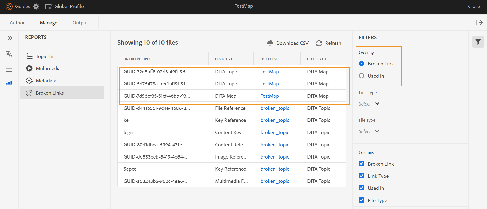
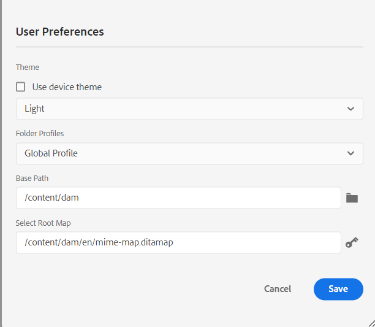

# Novità della versione di giugno 2023 di Adobe Experience Manager Guides as a Cloud Service

Questo articolo descrive le funzioni nuove e migliorate della versione di giugno 2023 di Adobe Experience Manager Guides (in seguito denominato *AEM Guides as a Cloud Service*).

Per ulteriori dettagli sulle istruzioni di aggiornamento, sulla matrice di compatibilità e sui problemi risolti in questa versione, consulta [Note sulla versione](release-notes-2023-6-0.md).

## Rapporto Collegamenti interrotti nell’editor web

AEM Guides consente di verificare la completezza complessiva dei documenti tecnici e generare rapporti dall’editor web. Ora, nella versione di giugno 2023, AEM Guides offre la funzionalità per visualizzare e correggere i collegamenti interrotti. Si tratta di un report utile che consente di gestire i collegamenti interrotti. È possibile visualizzare facilmente i collegamenti interrotti presenti nella mappa DITA e correggerli.
{width="800"}

Una volta corretto un collegamento, questo non viene visualizzato nell’elenco dei collegamenti interrotti.

Per ulteriori dettagli, vedere [Visualizzare e correggere i collegamenti interrotti](../user-guide/reports-web-editor.md#report-broken-links).

## Rinominare e spostare i file nella vista Archivio

Ora è anche possibile rinominare o spostare un file dal pannello dell’archivio. Questa funzione è utile e consente di gestire facilmente i file dal pannello Archivio. Puoi selezionare un file e rinominarlo o spostarlo utilizzando il menu **Opzioni** per il file selezionato. Quando si sposta o si rinomina un file, in AEM Guides viene visualizzato un messaggio di operazione riuscita.

{width="650"}

Per ulteriori dettagli sul menu Opzioni di un file, vedere la descrizione della funzionalità **Vista archivio** nella sezione [Pannello sinistro](../user-guide/web-editor-features.md#id2051EA0M0HS).

## Miglioramenti della versione nativa di PDF

### Aggiungere una filigrana all&#39;output di PDF per i documenti bozza

Ora è possibile aggiungere una filigrana all’output PDF del documento non ancora approvato. Questa filigrana non viene visualizzata se si genera il PDF per il documento nello stato &quot;Approvato&quot;. Ad esempio, puoi aggiungere una bozza di filigrana per l’output di PDF.

Per ulteriori dettagli, vedere [Aggiungere una filigrana all&#39;output di PDF per le bozze di documenti](../native-pdf/use-javascript-content-style.md#watermark-draft-document).

### Supporto per le variabili di lingua

AEM Guides fornisce il supporto per le variabili di lingua. È possibile utilizzare le variabili di lingua per definire una versione localizzata delle etichette predefinite, ad esempio Nota, Avvertenza e Avvertenza o testo statico nell’output di PDF.
Puoi aggiungere le variabili di lingua o la versione localizzata delle etichette alle sezioni appropriate nell’output di PDF e nei modelli di output.

#### Variabili di lingua nell’output di PDF

È possibile utilizzare le variabili di lingua per definire etichette localizzate per elementi quali Nota, Attenzione e Avvertenza. Puoi aggiornare il valore di queste variabili in una o più lingue, quindi il valore localizzato viene scelto automaticamente nell’output di PDF.
Ad esempio, puoi presentare l’etichetta Nota nell’output di PDF nei seguenti modi:

* Inglese: Note
* Francese: Remarque
* Tedesco: Hinweis

#### Variabili di lingua nei modelli di output

Per creare l&#39;output di PDF in varie lingue, è necessario creare diversi modelli di PDF contenenti testo localizzato per ogni lingua. Ora, con la funzione Variabili di lingua, è sufficiente creare il modello una sola volta. Quindi, per qualsiasi testo statico da localizzare, puoi creare variabili di lingua corrispondenti e utilizzarle nel modello.
Puoi creare variabili di lingua per testo più lungo, ad esempio una frase intera o anche un paragrafo. Puoi anche applicare stili e utilizzare il markup HTML per formattare queste variabili di lingua.

Per ulteriori dettagli, visualizzare [Supporto per le variabili di lingua](../native-pdf/native-pdf-language-variables.md).

### Possibilità di utilizzare i metadati di AEM nei layout di PDF

I metadati sono la descrizione o la definizione del contenuto. Questi metadati vengono memorizzati nel contenuto della mappa DITA di origine.

Ora in AEM Guides puoi anche selezionare le proprietà dei metadati delle risorse e aggiungerle al layout di pagina. AEM Guides seleziona quindi queste proprietà di metadati delle risorse e le pubblica nell’output PDF.

{width="550"}

>[!NOTE]
>
> AEM Guides supporta anche le proprietà dei metadati per le mappe DITA.

Per ulteriori dettagli, vedere [Aggiungere campi e metadati](../native-pdf/design-page-layout.md#add-fields-metadata).

## Miglioramenti apportati a Schematron

### Utilizzare le istruzioni di report per verificare la presenza di regole in Schematron

AEM Guides ora supporta anche le istruzioni del rapporto con Schematron. Un’istruzione di report genera un messaggio quando un’istruzione di test restituisce true. Ad esempio, se desideri che la descrizione breve sia inferiore o uguale a 150 caratteri, puoi definire un’istruzione di rapporto per verificare gli argomenti in cui la descrizione breve è superiore a 150 caratteri.

Per ulteriori dettagli, vedere [Utilizzare istruzioni di asserzione e report per verificare la presenza di regole](../user-guide/support-schematron-file.md#schematron-assert-report).

### Usa espressioni Regex

È inoltre possibile utilizzare le espressioni Regex per definire una regola con la funzione matches() e quindi eseguire la convalida utilizzando il file Schematron.

Per ulteriori dettagli, vedere [Utilizzare espressioni Regex](../user-guide/support-schematron-file.md#schematron-assert-report).

### Definire pattern astratti

AEM Guides supporta anche i modelli astratti in Schematron. È possibile definire pattern astratti generici e riutilizzarli. I modelli astratti possono semplificare lo schema Schematron e aiutarti a gestire e aggiornare la logica di convalida.

Per ulteriori dettagli, vedere [Definire modelli astratti](../user-guide/support-schematron-file.md#schematron-abstract-patterns).

## Passare dall&#39;Editor Web alla home page di AEM

Ora è possibile passare facilmente dall’Editor Web alla home page di AEM.

{width="800"}

* Fai clic sull&#39;icona **Guide** ( ) per tornare alla pagina di navigazione di AEM.

Per ulteriori dettagli, vedere [Pagina di navigazione di AEM](../user-guide/web-editor-launch-editor.md#id2056BG00RZJ).

## Gestione delle definizioni gerarchiche delle definizioni e delle enumerazioni dei soggetti

AEM Guides offre la potente funzionalità di creazione di mappe di schemi Soggetto, una forma specializzata di mappe DITA utilizzate per definire soggetti tassonomici e valori controllati. Ora AEM Guides consente anche di definire la definizione del soggetto in una mappa e le definizioni di enumerazione in un’altra mappa. È quindi possibile aggiungere il riferimento di mappa e utilizzare lo schema soggetto.
I riferimenti di enumerazione dei soggetti vengono risolti nella stessa mappa o nella mappa di riferimento.

Per ulteriori dettagli sulla gestione delle definizioni gerarchiche delle enumerazioni e delle definizioni dei soggetti, vedere la descrizione della funzionalità **Schema soggetto** nella sezione [Pannello sinistro](../user-guide/web-editor-features.md#id2051EA0M0HS).

## Supporto per il formato XLIFF nella traduzione

AEM Guides fornisce anche il supporto per il formato XLIFF (XML Localization Interchange File Format) in traduzione. Ora puoi anche scegliere di **Creare un nuovo progetto di traduzione XLIFF** per convertire il contenuto XML in formato XLIFF.
Utilizzando questo formato, puoi esportare il contenuto nel formato XLIFF standard del settore e quindi fornire lo stesso ai fornitori di traduzione. Per ulteriori dettagli, consulta [Creare un progetto di traduzione](../user-guide/translate-documents-web-editor.md#create-translation-project).

{width="350"}

## Pannello Preferiti migliorato

AEM Guides consente di creare una raccolta o un elenco di file e cartelle preferito e di utilizzarli facilmente. Il menu **Opzioni** è ora disponibile anche nel pannello **Preferiti**. È possibile rinominare la raccolta selezionata o eliminarla dal menu **Opzioni**. È possibile selezionare l&#39;opzione **Aggiorna** per ottenere un nuovo elenco di file o cartelle dal repository. Puoi anche visualizzare il contenuto della cartella nell’interfaccia utente di Assets.

{width="650"}

>[!NOTE]
>
> Puoi anche aggiornare l&#39;elenco utilizzando l&#39;icona **Aggiorna** nella parte superiore.

Per ulteriori dettagli sul menu **Opzioni** di una raccolta Preferiti, vedere la descrizione della funzionalità **Preferiti** nella sezione [Pannello sinistro](../user-guide/web-editor-features.md#id2051EA0M0HS).

## Passa al tema di sistema

Ora puoi anche utilizzare il tema del dispositivo. Utilizzando le **Preferenze utente**, puoi configurare AEM Guides per passare automaticamente dai temi chiaro a scuro in base al tema del dispositivo.

{width="550"}

Per ulteriori dettagli, vedere la descrizione della funzionalità **Preferenze utente** nella sezione [Barra degli strumenti principale](../user-guide/web-editor-features.md#id2051EA0G05Z).
