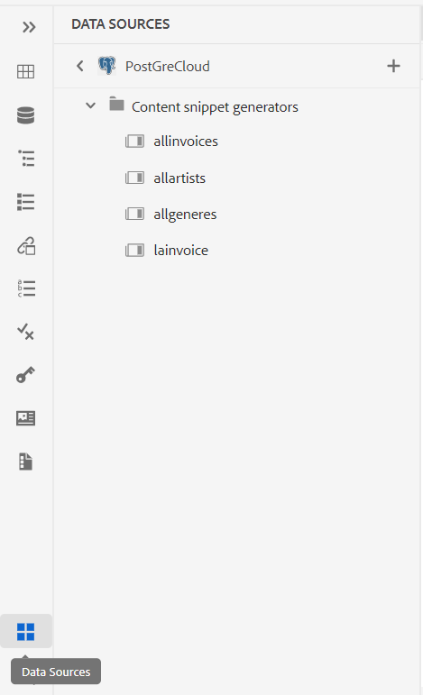
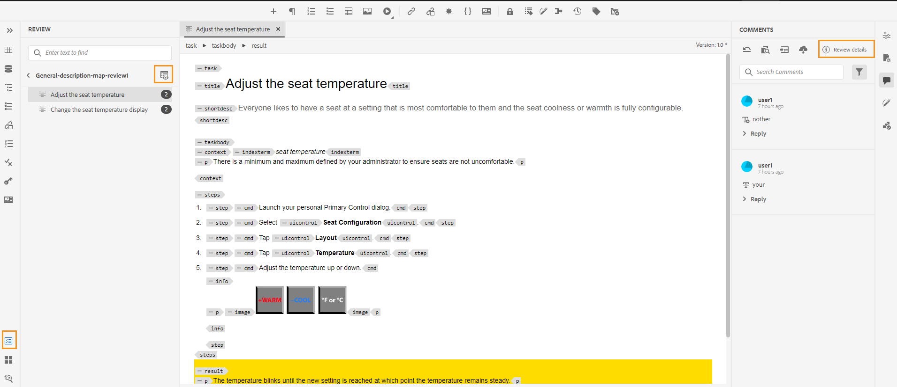
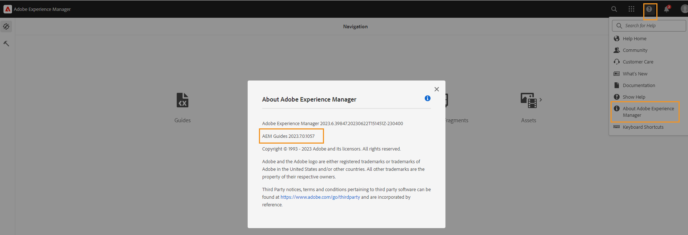

# Novità della versione di luglio 2023 di Adobe Experience Manager Guides as a Cloud Service

Questo articolo descrive le funzioni nuove e migliorate della versione di luglio 2023 di Adobe Experience Manager Guides (in seguito denominate *AEM Guides as a Cloud Service*).

Per ulteriori dettagli sulle istruzioni di aggiornamento, sulla matrice di compatibilità e sui problemi risolti in questa versione, consulta [Note sulla versione](release-notes-2023-7-0.md).

## Connettersi a un&#39;origine dati e inserire dati negli argomenti

Ora puoi connetterti rapidamente alle origini dati utilizzando connettori predefiniti di AEM Guides. La connessione a un’origine dati consente di mantenere le informazioni sincronizzate con l’origine e tutti gli aggiornamenti ai dati vengono rispecchiati automaticamente, rendendo AEM Guides un vero e proprio hub di contenuti. Questa funzione ti consente di risparmiare tempo e fatica nell’aggiungere o copiare manualmente i dati.

Ora AEM Guides consente all’amministratore di configurare i connettori predefiniti per i database JIRA e SQL (MySQL, PostgreSQL, SQL Server, SQLite). Possono inoltre aggiungere altri connettori estendendo le interfacce predefinite.

Una volta aggiunti, puoi visualizzare i connettori configurati elencati nel pannello **Origini dati** nell&#39;Editor Web.

{width="300" align="left"}

È possibile creare un generatore di frammenti di contenuto per recuperare i dati da un&#39;origine dati connessa. È quindi possibile inserire i dati negli argomenti e modificarli.

Dopo aver creato un generatore di frammenti di contenuto, puoi riutilizzarlo per inserire i dati in qualsiasi argomento. Per ulteriori dettagli, visualizzare [Inserire uno snippet di contenuto dall&#39;origine dati](../user-guide/web-editor-content-snippet.md).

## Pannello Revisione per mostrare i progetti di revisione e le attività di revisione attive

Ora AEM Guides rende le tue recensioni più fluide. Fornisce il pannello Revisioni all&#39;interno dell&#39;Editor Web. Il pannello Revisioni visualizza tutti i progetti di revisione e le attività di revisione attive all&#39;interno dei progetti di revisione di cui fai parte.

In qualità di autore, questa funzione consente di aprire facilmente le attività di revisione, visualizzare i commenti e indirizzarli rapidamente in una visualizzazione centralizzata.
{width="800" align="left"}
Per ulteriori dettagli, visualizzare la descrizione della funzionalità **Rivedi** nella sezione [Pannello sinistro](../user-guide/web-editor-features.md#id2051EA0M0HS).

## Miglioramenti alla raccolta mappe

Una raccolta di mappe consente di organizzare più mappe e di pubblicarle in batch. Sono stati apportati molti nuovi miglioramenti alla raccolta Mappa:

- Ora è anche possibile aggiungere predefiniti di output di PDF nativi a una raccolta di mappe e utilizzarli per generare l&#39;output di PDF.
- Puoi visualizzare i predefiniti per i profili globali e delle cartelle creati dall’amministratore e utilizzarli per generare l’output PDF.
- Ora non solo è possibile selezionare un singolo predefinito, ma è anche possibile abilitare tutti i predefiniti del profilo di cartella per una mappa DITA in un&#39;unica operazione.
  {width="800" align="left"}

Per ulteriori dettagli, visualizzare [Utilizza raccolta mappe per la generazione dell&#39;output](../user-guide/generate-output-use-map-collection-output-generation.md).

## Possibilità di accedere ai file temporanei di HTML durante la generazione dell&#39;output nativo di PDF

Ora AEM Guides consente di scaricare i file HTML temporanei creati durante la generazione dell’output PDF nativo. Nelle impostazioni del predefinito di output, seleziona l’opzione per scaricare i file temporanei.  AEM Guides ti consente quindi di scaricare i file temporanei creati durante la generazione dell’output utilizzando tale predefinito.

Questa funzione consente di ottenere informazioni migliori sul processo di generazione con accesso a stili e layout provvisori e consente di correggere o modificare gli stili CSS in base alle esigenze.

{width="800" align="left"}

Per ulteriori dettagli, visualizzare [Creare un predefinito di output PDF](../web-editor/native-pdf-web-editor.md#create-output-preset).

## Pubblicazione basata su microservizi per generare output HTML5 e personalizzato

Il nuovo microservizio di pubblicazione consente di eseguire carichi di lavoro di pubblicazione di grandi dimensioni simultaneamente su AEM Guides as a Cloud Service e di sfruttare la piattaforma senza server Adobe I/O Runtime leader del settore. Ora utilizzando il microservizio, puoi anche generare l’output HTML5 e personalizzato.
Puoi eseguire più richieste di pubblicazione e ottenere prestazioni migliori per generare questi formati di output.
Per ulteriori dettagli, visualizzare [Configurare la pubblicazione basata su microservizi per AEM Guides as a Cloud Service](../knowledge-base/publishing/configure-microservices.md).

## Visualizza i dettagli della versione di AEM Guides nelle Informazioni su

Ora, insieme alle informazioni **Informazioni su** dell&#39;AEM, puoi anche visualizzare i dettagli della versione di AEM Guides. Puoi visualizzare i dettagli della versione corrente nell&#39;opzione **Informazioni su** di **Guida** nella pagina di navigazione AEM.

(width=&quot;800&quot; align=&quot;left&quot;)
