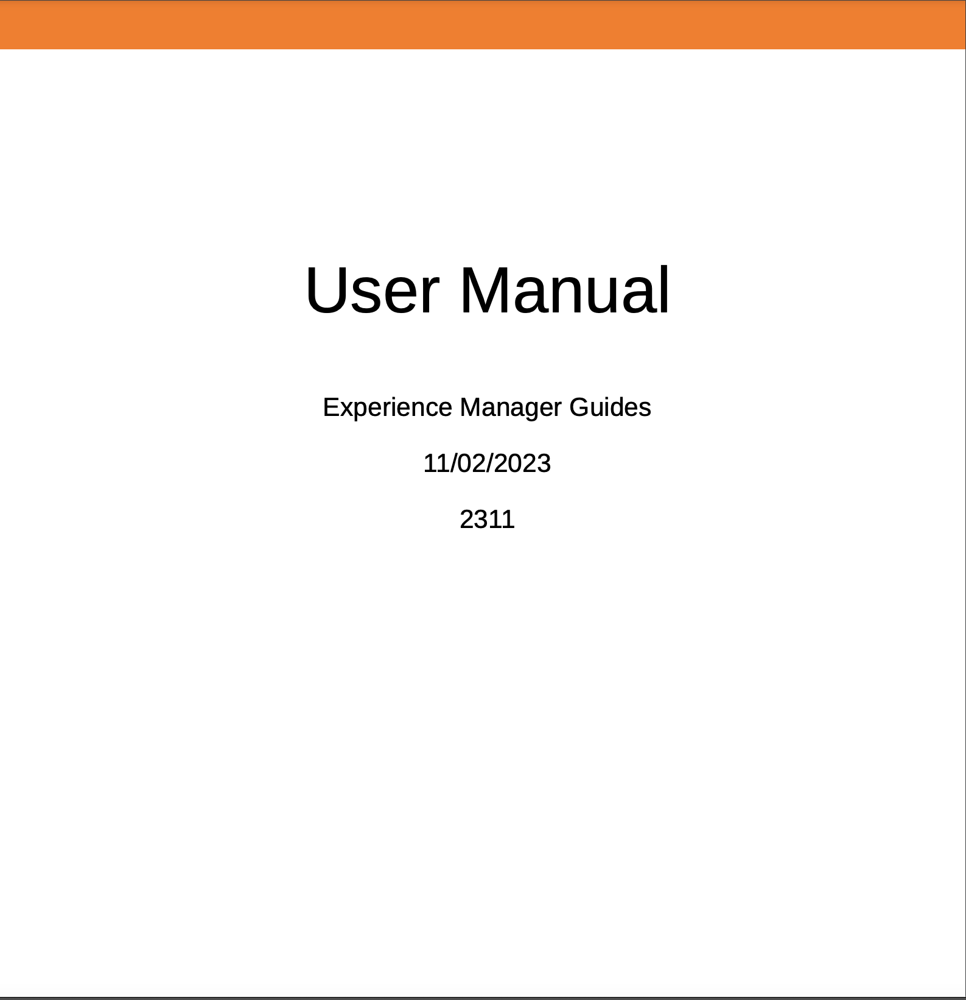

# Novità della versione di dicembre 2023 di Adobe Experience Manager Guides as a Cloud Service

Questo articolo tratta le funzioni nuove e migliorate nella versione di dicembre 2023 delle Guide di Adobe Experience Manager (in seguito denominate *Guide di Experience Manager as a Cloud Service*).

Per ulteriori dettagli sulle istruzioni di aggiornamento, sulla matrice di compatibilità e sui problemi risolti in questa versione, vedi [Note sulla versione](release-notes-2023.12.0.md).

## Utilizzare le variabili nell’output di PDF

È possibile utilizzare le variabili per inserire e gestire in modo dinamico le informazioni riutilizzabili. Experience Manager Guides consente di creare, modificare e visualizzare in anteprima le variabili durante la generazione dell’output PDF. È possibile modificare rapidamente i valori delle variabili e rendere i documenti facilmente trasferibili e aggiornabili.

{width="800" align="left"}

*Crea e gestisci le variabili nell’editor web.*

Puoi anche creare set di variabili che sostituiscono i valori predefiniti e assegnare valori alternativi alle variabili. Inserire queste variabili all&#39;interno del layout di pagina e utilizzare lo stesso layout di PDF. Non è necessario creare layout separati per ogni insieme di valori. Ad esempio, puoi creare un set di variabili per ogni versione del prodotto. Questo set di variabili può essere costituito da variabili per diversi dettagli del prodotto come nome del prodotto, numero di versione e data di rilascio. Quindi puoi aggiungere valori diversi per queste variabili.

**Set di variabili 1: set di Adobi 1**

* ProductName: guide Experience Manager
* Numero di versione: 2311
* Data di rilascio: 11/02/2023

**Set di variabili 2: set di Adobi 2**

* ProductName: guide Experience Manager
* Numero di versione: 2310
* Data di rilascio: 09/27/2023

*Genera l’output PDF utilizzando le variabili nel layout PDF.*

Per formattare le variabili è possibile applicare gli stili e utilizzare il markup HTML.  Puoi anche aggiornare rapidamente i valori per qualsiasi variabile ogni volta che sia necessario e rigenerare l’output. Ad esempio, se è necessario aggiornare i dettagli di una versione, è possibile modificare il valore della versione nella variabile VersionNumber e rigenerare l&#39;output.

Scopri come utilizzare [variabili nell’output di PDF](../native-pdf/native-pdf-variables.md).

## Esperienza rinnovata per modificare gli attributi

Ora puoi ottenere un’esperienza rinnovata per aggiungere o modificare gli attributi di un elemento dalla sezione **Proprietà contenuto** nell&#39;editor Web.

{width="300" align="left"}

*Aggiungete gli attributi dal pannello Proprietà contenuto.*

È inoltre possibile modificare ed eliminare facilmente gli attributi.

Per ulteriori informazioni, consulta **Proprietà contenuto** descrizione della funzione all’interno di [Pannello a destra](../user-guide/web-editor-features.md#id2051EB003YK) sezione.

## Modificare i metadati durante l’authoring

Ora, durante l’authoring, è possibile aggiornare i tag di metadati dei file utilizzando il menu a discesa **Proprietà file** nel pannello a destra. Puoi anche selezionare **Modifica altre proprietà** per aggiornare altri metadati.

{width="300" align="left"}

*Aggiorna i metadati e modifica le proprietà del file dal pannello di destra.*

Per ulteriori informazioni, consulta **Proprietà file** descrizione della funzione all’interno di [Pannello a destra](../user-guide/web-editor-features.md#id2051EB003YK) sezione.

## Possibilità di pubblicare contenuti nella Knowledge Base di ServiceNow

È ora possibile pubblicare i contenuti anche sulla piattaforma della knowledge base ServiceNow.

Con la versione di dicembre 2023, in qualità di amministratore, puoi creare un profilo di pubblicazione per il server della knowledge base ServiceNow. Quindi, in qualità di autore o editore, puoi scegliere il profilo di pubblicazione ServiceNow nel predefinito di output per pubblicare l’output nella knowledge base specificata.

Questa funzione consente di pubblicare contenuti come testo, video e immagini sulla piattaforma della knowledge base ServiceNow e di gestire un archivio completo.

{width="300" align="left"}

*Creare un predefinito di output per la Knowledge Base ServiceNow.*

Ulteriori informazioni su [Knowledge Base](../user-guide/generate-output-knowledge-base.md) predefiniti di output.

## Dashboard di raccolta mappe migliorato

Experience Manager Guides fornisce un dashboard avanzato per la raccolta mappe. In una raccolta di mappe, è possibile configurare rapidamente le proprietà dei metadati in blocco per le mappe DITA. Questa funzione è utile in quanto non è necessario aggiornare le proprietà dei metadati per ogni singola mappa DITA.

È ora possibile visualizzare il nome del file della mappa DITA. È inoltre possibile visualizzare le baseline. Questo consente di trovare rapidamente la linea di base utilizzata per un predefinito.

{width="800" align="left"}

*Visualizza, modifica e genera output dal dashboard di raccolta mappe.*

Scopri come [utilizzare la raccolta di mappe per la generazione dell&#39;output](../user-guide/generate-output-use-map-collection-output-generation.md).

## Visualizzare gli attributi chiave nella vista Mappa

Quando definite gli attributi chiave per i riferimenti argomento o mappa, potete anche visualizzare il titolo, l&#39;icona corrispondente e il tasto nel pannello sinistro. La chiave viene visualizzata come `key=<key-name>`.

Per ulteriori informazioni, consulta **Vista mappa** descrizione della funzione in [Pannello sinistro](../user-guide/web-editor-features.md#id2051EA0M0HS) sezione.

 {width="300" align="left"}

*Visualizzare l&#39;attributo chiave nella vista Mappa.*

## Possibilità di duplicare una linea di base in base all’etichetta

Experience Manager Guides ora offre un’esperienza utente migliorata per la creazione delle linee di base dall’editor web.\
 {width="300" align="left"}
*Creare una baseline dall&#39;editor Web.*

Consente inoltre di duplicare una baseline basata sull&#39;etichetta. La versione di riferimento viene scelta in base all&#39;etichetta specificata (se esiste) durante la duplicazione, oppure seleziona la versione dalla baseline duplicata.

 {width="300" align="left"}

*Duplicare una linea di base basata su un&#39;etichetta o creare una copia esatta.*

Ulteriori informazioni su come [creare e gestire le linee di base dall&#39;editor Web](../user-guide/web-editor-baseline.md).

## È stato migliorato il processo per la creazione della raccolta di mappe di attivazione in blocco

Il processo di creazione di una raccolta di mappe di attivazione in blocco è ora più armonioso. Ora, quando viene visualizzata la pagina Risultati attivazione, è possibile visualizzare i risultati dell&#39;attivazione e i registri.
Per ulteriori informazioni, consulta [Creare una raccolta di mappe di attivazione in blocco](../user-guide/conf-bulk-activation-create-map-collection.md).

## Risoluzione dei collegamenti incrociati nell’output del sito AEM

Il rendering dei collegamenti delle mappe incrociate (XREF con peer ambito) nell&#39;output del sito AEM viene ora risolto in base al titolo del file del contesto di pubblicazione impostato per la mappa generata.

## Configura l’URL dell’output del sito AEM per utilizzare il titolo del documento

Experience Manager Guides consente di configurare l&#39;URL dell&#39;output del sito AEM come amministratore. Se il nome del file non esiste o contiene tutti i caratteri speciali, puoi configurare per sostituirli con un separatore nell’URL dell’output del sito AEM. È inoltre possibile sostituirli con il nome del primo argomento secondario. Scopri come [configura l’URL dell’output del sito AEM per utilizzare il titolo del documento](../cs-install-guide/conf-output-generation.md#configure-the-url-of-the-aem-site-output-to-use-the-document-title).

