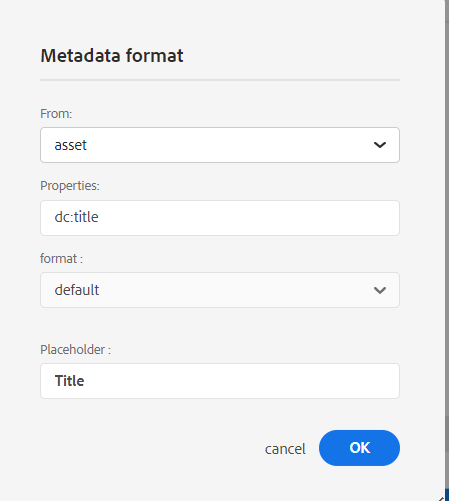

# Novità della versione di giugno 2023 di Adobe Experience Manager Guides as a Cloud Service

Questo articolo descrive le funzioni nuove e migliorate della versione di giugno 2023 delle Guide di Adobe Experience Manager (in seguito denominate *Guide AEM as a Cloud Service*).

Per ulteriori dettagli sulle istruzioni di aggiornamento, sulla matrice di compatibilità e sui problemi risolti in questa versione, consulta [Note sulla versione](release-notes-2023.6.0.md).

## Rapporto Collegamenti interrotti nell’editor web

Le guide AEM consentono di verificare la completezza complessiva dei documenti tecnici e generare report dall’editor web. Ora, a giugno 2023, la versione AEM Guides offre la funzione per visualizzare e correggere i collegamenti interrotti. Si tratta di un report utile che consente di gestire i collegamenti interrotti. È possibile visualizzare facilmente i collegamenti interrotti presenti nella mappa DITA e correggerli.
{width="800" align="left"}

Una volta corretto un collegamento, questo non viene visualizzato nell’elenco dei collegamenti interrotti.

Per ulteriori dettagli, consulta [Visualizzare e correggere i collegamenti interrotti](../user-guide/reports-web-editor.md#report-broken-links).

## Rinominare e spostare i file nella vista Archivio

Ora è anche possibile rinominare o spostare un file dal pannello dell’archivio. Questa funzione è utile e consente di gestire facilmente i file dal pannello Archivio. È possibile selezionare un file e rinominarlo o spostarlo utilizzando **Opzioni** per il file selezionato. Le guide AEM visualizzano un messaggio di operazione riuscita quando si sposta o si rinomina un file.

{width="650" align="left"}

Per ulteriori dettagli sul menu Opzioni di un file, vedere **Vista archivio** descrizione della funzione in [Pannello sinistro](../user-guide/web-editor-features.md#id2051EA0M0HS) sezione.

## Miglioramenti di Native PDF

### Aggiungere una filigrana all&#39;output PDF per i documenti bozza

Ora è possibile aggiungere una filigrana all’output PDF del documento che non è ancora stato approvato. Questa filigrana non viene visualizzata se si genera il PDF per il documento nello stato &quot;Approvato&quot;. Ad esempio, puoi aggiungere una bozza di filigrana per l’output PDF.

Per ulteriori dettagli, consulta [Aggiungere una filigrana all&#39;output PDF per le bozze di documenti](../native-pdf/use-javascript-content-style.md#watermark-draft-document).

### Supporto per le variabili di lingua

Le guide AEM supportano le variabili di linguaggio. È possibile utilizzare le variabili di lingua per definire una versione localizzata delle etichette predefinite, ad esempio Nota, Avvertenza e Avvertenza, o del testo statico nell’output di PDF.
Puoi aggiungere le variabili di lingua o la versione localizzata delle etichette alle sezioni appropriate nell’output di PDF e nei modelli di output.

#### Variabili di lingua nell’output di PDF

È possibile utilizzare le variabili di lingua per definire etichette localizzate per elementi quali Nota, Attenzione e Avvertenza. Puoi aggiornare il valore di queste variabili in una o più lingue, quindi il valore localizzato viene selezionato automaticamente nell’output di PDF.
Ad esempio, puoi presentare l’etichetta Nota nell’output PDF nei seguenti modi:

* Inglese: Note
* Francese: Remarque
* Tedesco: Hinweis

#### Variabili di lingua nei modelli di output

Per creare l&#39;output di PDF in diverse lingue, è necessario creare diversi modelli di PDF contenenti testo localizzato per ogni lingua. Ora, con la funzione Variabili di lingua, è sufficiente creare il modello una sola volta. Quindi, per qualsiasi testo statico da localizzare, puoi creare variabili di lingua corrispondenti e utilizzarle nel modello.
Puoi creare variabili di lingua per testo più lungo, ad esempio una frase intera o anche un paragrafo. Puoi anche applicare stili e utilizzare il markup HTML per formattare queste variabili di lingua.

Per ulteriori dettagli, vedi [Supporto per le variabili di lingua](../native-pdf/native-pdf-language-variables.md).

### Possibilità di utilizzare i metadati dell’AEM nei layout PDF

I metadati sono la descrizione o la definizione del contenuto. Questi metadati vengono memorizzati nel contenuto della mappa DITA di origine.

Ora nelle guide AEM puoi anche selezionare le proprietà dei metadati delle risorse e aggiungerle al layout di pagina. Le guide AEM selezionano quindi queste proprietà di metadati delle risorse e le pubblicano nell’output PDF.

{width="550" align="left"}

>[!NOTE]
>
> Le guide AEM supportano anche le proprietà dei metadati per le mappe DITA.

Per ulteriori dettagli, consulta [Aggiungere campi e metadati](../native-pdf/design-page-layout.md#add-fields-metadata).

## Miglioramenti apportati a Schematron

### Utilizzare le istruzioni di report per verificare la presenza di regole in Schematron

Le guide dell’AEM supportano ora anche le dichiarazioni contenute nelle relazioni presentate con Schematron. Un’istruzione di report genera un messaggio quando un’istruzione di test restituisce true. Ad esempio, se desideri che la descrizione breve sia inferiore o uguale a 150 caratteri, puoi definire un’istruzione di rapporto per verificare gli argomenti in cui la descrizione breve è superiore a 150 caratteri.

Per ulteriori dettagli, consulta [Utilizzare le istruzioni di asserzione e di report per verificare la presenza di regole](../user-guide/support-schematron-file.md#schematron-assert-report).

### Usa espressioni Regex

È inoltre possibile utilizzare le espressioni Regex per definire una regola con la funzione matches() e quindi eseguire la convalida utilizzando il file Schematron.

Per ulteriori dettagli, consulta [Usa espressioni Regex](../user-guide/support-schematron-file.md#schematron-assert-report).

### Definire pattern astratti

Le guide AEM supportano anche i modelli astratti in Schematron. È possibile definire pattern astratti generici e riutilizzarli. I modelli astratti possono semplificare lo schema Schematron e aiutarti a gestire e aggiornare la logica di convalida.

Per ulteriori dettagli, consulta [Definire pattern astratti](../user-guide/support-schematron-file.md#schematron-abstract-patterns).

## Passare dall&#39;Editor Web alla home page AEM

Ora è possibile passare facilmente dall’Editor Web alla home page AEM.

{width="800" align="left"}

* Fai clic su **Guide** icona ( ), per tornare alla pagina di navigazione AEM.

Per ulteriori dettagli, consulta [Pagina di navigazione AEM](../user-guide/web-editor-launch-editor.md#id2056BG00RZJ).

## Gestione delle definizioni gerarchiche delle definizioni e delle enumerazioni dei soggetti

Le guide AEM includono la potente funzione di creare mappe di schemi di soggetti, una forma specializzata di mappe DITA utilizzate per definire soggetti tassonomici e valori controllati. Ora le guide AEM consentono anche di definire il soggetto in una mappa e le definizioni di enumerazione in un&#39;altra mappa. È quindi possibile aggiungere il riferimento di mappa e utilizzare lo schema soggetto.
I riferimenti di enumerazione dei soggetti vengono risolti nella stessa mappa o nella mappa di riferimento.

Per ulteriori dettagli sulla gestione delle definizioni gerarchiche delle definizioni e delle enumerazioni dei soggetti, vedi **Schema soggetto** descrizione della funzione in [Pannello sinistro](../user-guide/web-editor-features.md#id2051EA0M0HS) sezione.

## Supporto per il formato XLIFF nella traduzione

Le guide AEM forniscono inoltre il supporto per il formato XLIFF (XML Localization Interchange File Format) in traduzione. Ora puoi anche scegliere di **Crea un nuovo progetto di traduzione XLIFF** per convertire il contenuto XML nel formato XLIFF.
Utilizzando questo formato, puoi esportare il contenuto nel formato XLIFF standard di settore e quindi fornire lo stesso ai fornitori di traduzione. Per ulteriori dettagli, consulta [Creare un progetto di traduzione](../user-guide/translate-documents-web-editor.md#create-translation-project).

{width="350" align="left"}

## Pannello Preferiti migliorato

Le guide AEM consentono di creare una raccolta o un elenco di file e cartelle preferito e di utilizzarli facilmente. Ora **Opzioni** è disponibile anche nel **Preferiti** pannello. È possibile rinominare la raccolta selezionata o eliminarla dal **Opzioni** menu. È possibile selezionare **Aggiorna** per ottenere un nuovo elenco di file o cartelle dal repository. Puoi anche visualizzare il contenuto della cartella nell’interfaccia utente di Assets.

{width="650" align="left"}

>[!NOTE]
>
> È inoltre possibile aggiornare l&#39;elenco utilizzando **Aggiorna** nella parte superiore.

Per ulteriori dettagli su **Opzioni** di un insieme Preferiti, vedere **Preferiti** descrizione della funzione in [Pannello sinistro](../user-guide/web-editor-features.md#id2051EA0M0HS) sezione.

## Passa al tema di sistema

Ora puoi anche utilizzare il tema del dispositivo. Utilizzo di **Preferenze utente**, è possibile configurare le guide AEM per passare automaticamente dai temi chiari a quelli scuri in base al tema del dispositivo.

{width="550" align="left"}

Per ulteriori dettagli, vedi **Preferenze utente** descrizione della funzione in [Barra degli strumenti principale](../user-guide/web-editor-features.md#id2051EA0G05Z) sezione.
