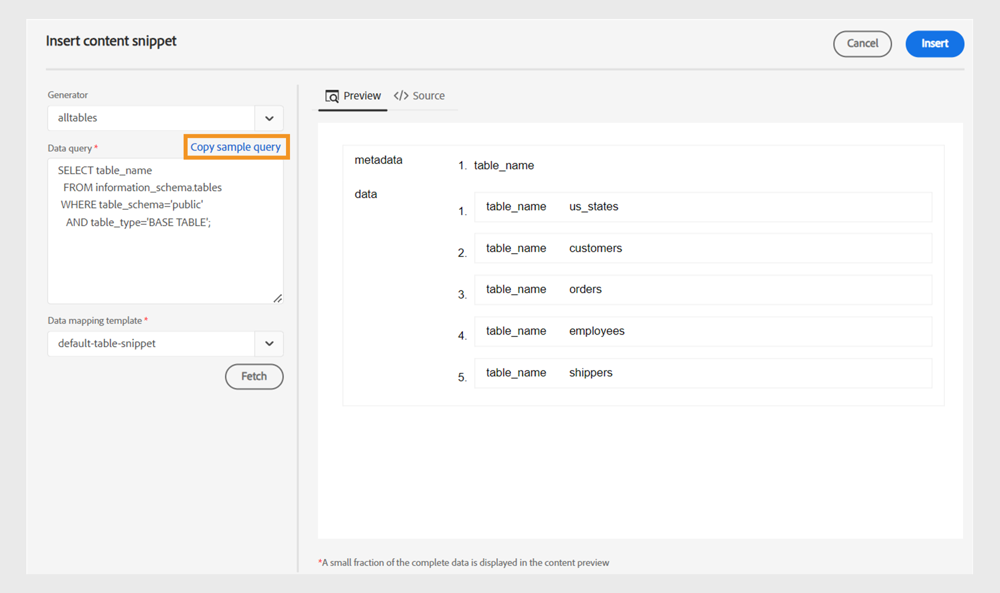

# Novità della versione 2024.4.0

Questo articolo descrive le funzioni nuove e migliorate della versione 2024.4.0 delle guide di Adobe Experience Manager.

Per un elenco dei problemi risolti in questa versione, vedi [Sono stati risolti i problemi nella versione 2024.4.0 di](fixed-issues-2024-04-0.md).

Informazioni su [istruzioni di aggiornamento per la versione 2024.4.0](upgrade-instructions-2024-04-0.md).

## Possibilità di tradurre il contenuto in più lingue utilizzando gruppi di lingue preconfigurati

Experience Manager Guides ora consente di creare gruppi di lingue e tradurre facilmente il contenuto in più lingue. Questa funzione consente di organizzare e gestire le traduzioni in base alle esigenze della tua organizzazione.

Ad esempio, se devi tradurre il contenuto per alcuni paesi in Europa, puoi creare un gruppo di lingue per le lingue europee come inglese (EN), francese (FR), tedesco (DE), spagnolo (ES) e italiano (IT).

{width="300" align="left"}

*Selezionare i gruppi di lingue o le lingue in cui tradurre i documenti.*

>[!NOTE]
>
>Se manca la cartella di destinazione di una lingua o la lingua di destinazione è la stessa della lingua di origine, la cartella di destinazione è disattivata e mostra un segnale di avviso.

In qualità di amministratore, puoi creare gruppi di lingue e configurarli in più profili di cartelle. In qualità di autore, puoi visualizzare i gruppi di lingue configurati nel tuo profilo di cartella.

Nel complesso, la creazione di gruppi linguistici migliora l’efficienza e la produttività dei progetti di traduzione, migliorando in ultima analisi il processo di localizzazione in più lingue.

Scopri come [tradurre documenti dall&#39;editor Web](../user-guide/translate-documents-web-editor.md).

## Elimina o disattiva automaticamente il progetto di traduzione dopo la traduzione

Ora, in qualità di amministratore, puoi configurare i progetti di traduzione in modo che vengano disabilitati o eliminati automaticamente dopo aver completato la traduzione. Questa funzione consente di utilizzare in modo efficiente le risorse e gestire i file dopo aver completato la traduzione.

Se si elimina un progetto, vengono rimossi in modo permanente tutti i file e le cartelle presenti nel progetto. L’eliminazione dei progetti di traduzione consente inoltre di liberare spazio su disco occupato.

Puoi disattivare i progetti di traduzione se desideri utilizzarli in un secondo momento.

{width="550" align="left"}

*Configura i gruppi di lingue e le impostazioni di pulizia per i progetti di traduzione.*

Ulteriori informazioni su come [elimina o disabilita automaticamente il progetto di traduzione](../user-guide/translate-documents-web-editor.md#automatically-delete-or-disable-a-completed-translation-project).

## Attiva l&#39;output per le mappe nella raccolta di attivazione in blocco nell&#39;istanza Anteprima

Ora, oltre ad attivare l’output per la raccolta di attivazione in blocco sull’istanza di pubblicazione, Experience Manager Gudies as Cloud Service fornisce la funzione per attivarlo sull’istanza di pubblicazione. **Anteprima** dell&#39;istanza.

Questa funzione consente di attivare il contenuto in un’istanza di anteprima, consentendoti di controllarne l’aspetto e il funzionamento prima di attivarlo in **Pubblica** dell&#39;istanza.

{width="800" align="left"}

*Visualizzare le informazioni sugli output mappa attivati in **Cronologia dei controlli**scheda.*

Ulteriori informazioni su  [attivazione in blocco](../user-guide/conf-bulk-activation-publish-map-collection.md).

## Miglioramenti nei connettori delle origini dati

I seguenti miglioramenti sono stati apportati ai connettori delle origini dati per la versione 2024.4.0:

### Connettersi alle origini dati delle schede ADO (Microsoft Azure DevOps Board) di Salsify, Akeneo

Oltre ai connettori predefiniti esistenti, Experience Manager Guides fornisce anche connettori per origini dati Salsify, Akeneo e ADO (Microsoft Azure DevOps Boards). In qualità di amministratore, puoi scaricare e installare questi connettori. Quindi, configura i connettori installati.

### Copiare e incollare la query di esempio per creare un frammento di contenuto o un argomento

Puoi copiare e incollare facilmente una query di dati di esempio nel generatore per creare uno snippet di contenuto o un argomento. Con questa funzione, non è necessario ricordare la sintassi o creare una query manualmente. Invece di digitare manualmente la query, puoi copiare e incollare una query di esempio, modificarla e utilizzarla per recuperare i dati in base alle tue esigenze.

{width="800" align="left"}

*Copiare e modificare una query di esempio per creare lo snippet di contenuto.*

### Connettersi a file di dati JSON utilizzando un connettore per file

Ora, in qualità di amministratore, puoi configurare un connettore per file JSON per utilizzare i file di dati JSON come origine di dati. Utilizza il connettore per importare i file JSON dal computer o da Adobe Experience Manager Assets. In qualità di autore, puoi quindi creare snippet di contenuti o argomenti utilizzando i generatori.

Questa funzione consente di utilizzare i dati memorizzati nei file JSON e di riutilizzarli in vari snippet. Il contenuto viene inoltre aggiornato dinamicamente ogni volta che si aggiornano i file JSON.

### Configurare più URL di risorse per un connettore per creare snippet di contenuto o argomenti

In qualità di amministratore, puoi configurare più URL di risorse per alcuni connettori come Generic REST Client, Salsify, Akeneo e Microsoft Azure DevOps Boards (ADO).

Quindi, in qualità di autore, è possibile connettersi alle origini dati per creare frammenti di contenuto o argomenti utilizzando i generatori. Questa funzione è utile in quanto non è necessario creare un’origine dati per ogni URL. Consente di recuperare rapidamente i dati da una qualsiasi delle risorse per una particolare origine dati in un singolo frammento di contenuto o argomento.

Visualizzare ulteriori dettagli sui connettori delle origini dati e su come [configurare un connettore origine dati dall’interfaccia utente](../cs-install-guide/conf-data-source-connector-tools.md).

Scopri come [utilizzare dati dall&#39;origine dati](../user-guide/web-editor-content-snippet.md).

## Personalizza l’esperienza dell’editor web con una nuova interfaccia delle preferenze utente

Il **Preferenze utente** nell&#39;Editor Web ora include un nuovo **Aspetto** scheda. Questa nuova scheda consente di configurare in modo pratico le preferenze di aspetto più comuni nell’interfaccia dell’editor web.

È possibile configurare per visualizzare i file in base al titolo o al nome file e modificare il tema dell&#39;applicazione e la vista origine. Consente inoltre di configurare le impostazioni per individuare un file aperto nella vista archivio e gestire gli spazi unificatori.

{width="550" align="left"}

*Personalizzate l&#39;aspetto in base alle vostre preferenze.*

Ulteriori informazioni su **Preferenze utente** descrizione della funzione in [Pannello sinistro](../user-guide/web-editor-features.md#id2051EA0M0HS) sezione.

## Individuare un file aperto nella visualizzazione repository dell&#39;editor Web

Seleziona la **Individua sempre i file nel repository** opzione in **Preferenze utente** per spostarsi e individuare rapidamente il file nella vista archivio. Non è necessario cercarla manualmente.

Durante la modifica, questa funzione consente inoltre di visualizzare facilmente la posizione del file all’interno della gerarchia dell’archivio.

Per ulteriori dettagli, vedi [individuare un file aperto nella visualizzazione repository](../user-guide/web-editor-edit-topics.md#locate-an-open-file-in-the-repository-view).

## Gestione migliorata degli spazi unificatori nell&#39;editor Web

Guide di Experience Manager consente di visualizzare un indicatore di spazio unificatore durante la modifica di documenti nell&#39;Editor Web. Inoltre, migliora la gestione degli spazi unificatori.
Converte più spazi vuoti consecutivi in un unico spazio per mantenere la visualizzazione WYSIWYG del documento nell&#39;editor Web. Questa funzione consente inoltre di migliorare l&#39;aspetto generale e la professionalità del documento.

Per ulteriori dettagli, vedi [altre funzioni dell&#39;editor Web](../user-guide/web-editor-other-features.md).

## Disattiva la postelaborazione per le cartelle selettive su Adobe Experience Manager Assets

In qualità di amministratore, ora puoi disabilitare la post-elaborazione e la generazione di UUID per le cartelle selettive su Experience Manager Assets. Questa configurazione potrebbe essere utile, soprattutto quando si tratta di più risorse o di strutture di cartelle complesse. Consente inoltre a più utenti di caricare rapidamente e simultaneamente le risorse senza interferire tra loro.  

La disattivazione della postelaborazione per una cartella influisce anche su tutte le relative cartelle secondarie. Tuttavia, Experience Manager Guides ora offre la possibilità di abilitare in modo selettivo la postelaborazione per singole cartelle secondarie all’interno della cartella ignorata.

Scopri come [disattivare la postelaborazione per una cartella](../cs-install-guide/conf-folder-post-processing.md).

## Esperienza rinnovata per cercare e filtrare i file nella vista archivio

Ora disponi di un’esperienza avanzata durante il filtraggio dei file. La nuova funzionalità di filtro dei file consente di cercare e navigare tra i file in modo più semplice.

{width="300" align="left"}

*Cerca i file contenenti il testo`general purpose.`*

Sfrutta vantaggi quali un accesso più rapido ai file rilevanti e un’interfaccia utente più intuitiva, rendendo l’esperienza di ricerca più fluida ed efficiente.

 {width="300" align="left"}

*Utilizzare i filtri rapidi per cercare file DITA e non DITA.*

Ulteriori informazioni su **Ricerca filtro** funzionalità in [Pannello sinistro](../user-guide/web-editor-features.md#id2051EA0M0HS) sezione.

## Elenco separato per visualizzare e inserire elementi validi in base alla loro posizione

Durante la modifica di un documento nell&#39;Editor Web, è ora possibile visualizzare un elenco separato di elementi validi nella posizione corrente e al di fuori di essa. In base alle tue esigenze, scegli un elemento tra le seguenti opzioni:

* **Elementi validi nella posizione corrente** che è possibile inserire direttamente nella posizione corrente del cursore.
* **Elementi validi esterni alla posizione corrente** che puoi inserire dopo uno qualsiasi dei padri dell’elemento corrente all’interno della gerarchia degli elementi.

{width="300" align="left"}

*Visualizza gli elenchi segregati di elementi validi per inserire un elemento nella posizione corrente.*

Questo elenco suddiviso di elementi validi consente di mantenere la struttura del contenuto e di seguire gli standard DITA.

Ulteriori informazioni su **Inserisci elemento** funzionalità in [Barra degli strumenti secondaria](../user-guide/web-editor-features.md#2051ea0j0y4) sezione.

## Il Tipo di Proprietà contenuto viene visualizzato come menu a discesa

Ora le proprietà del contenuto **Tipo** viene visualizzato come menu a discesa. Puoi visualizzare e selezionare i tag della gerarchia completa per il tag corrente dal menu a discesa.

Questo menu a discesa consente di accedere rapidamente ai tag rilevanti all’interno della struttura gerarchica.

{width="300" align="left"}

*Selezionare un tag dalla gerarchia per il tag corrente.*

Ulteriori informazioni su **Proprietà contenuto** funzionalità in [Pannello a destra](../user-guide/web-editor-features.md#id2051eb003yk) sezione.

## Sono state migliorate le prestazioni durante il controllo in blocco di file dall’Editor mappa

Experience Manager Guide consente di migliorare le prestazioni e l&#39;esperienza della funzione di archiviazione di file in blocco dall&#39;Editor mappe. Questo miglioramento consente di archiviare i file in blocco in modo più rapido.
È inoltre possibile visualizzare l&#39;avanzamento dell&#39;operazione di archiviazione dei file dal **Salva come nuova versione e sblocca** . Al termine dell&#39;operazione viene infine visualizzato il messaggio di operazione riuscita e tutti i file estratti selezionati vengono archiviati.

{width="300" align="left"}

*Visualizzare l&#39;elenco e lo stato dei file archiviati in blocco dall&#39;Editor mappe.*

Scopri come [utilizzare l’Editor mappe avanzato](../user-guide/map-editor-advanced-map-editor.md)

## Scarica il file temporaneo durante la generazione dell&#39;output tramite DITA-OT

È inoltre possibile scaricare i file temporanei generati quando si pubblica l&#39;output HTML, personalizzato, JSON o PDF dell&#39;AEM tramite DITA-OT. Questa funzione consente di analizzare eventuali problemi che potrebbero verificarsi durante il processo di generazione dell’output e di risolvere efficacemente i problemi.  
È inoltre possibile scaricare il file metadata.xml se sono state selezionate proprietà di metadati passate all&#39;output generato mediante DITA-OT. 

Per ulteriori dettagli sui predefiniti, visualizzare [Informazioni sui predefiniti di output](../user-guide/generate-output-understand-presets.md).

## Sostituisci le credenziali IMS JWT con le credenziali IMS OAuth per la pubblicazione basata su Microservice

Le credenziali dell’account di servizio (JWT) sono state dichiarate obsolete a favore del **OAuth Server-to-Server** credenziali. Le applicazioni che utilizzano le credenziali dell’account di servizio (JWT) cesseranno di funzionare dopo il 1° gennaio 2025. È necessario eseguire la migrazione alla nuova credenziale entro il 1° gennaio 2025 per garantire che l’applicazione continui a funzionare.

Il servizio di pubblicazione cloud, ad Experience Manager Guide, è ora protetto dall’autenticazione basata su Adobe IMS OAuth. Scopri come [configurare la pubblicazione basata su microservizi con l’autenticazione OAuth](../knowledge-base/publishing/configure-microservices-imt-config.md).
