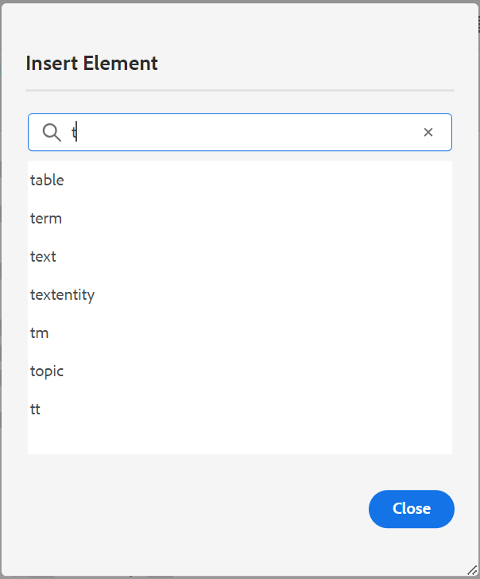

# Novità della versione 2024.2.0

Questo articolo descrive le funzioni nuove e migliorate della versione 2024.2.0 delle guide di Adobe Experience Manager.

Per un elenco dei problemi risolti in questa versione, vedi [Sono stati risolti i problemi nella versione 2024.2.0 di](fixed-issues-2024-2-0.md).

Informazioni su [istruzioni di aggiornamento per la versione 2024.2.0](upgrade-instructions-2024-2-0.md).

## Suggerimenti avanzati basati sull’intelligenza artificiale per aggiungere riferimenti ai contenuti durante la creazione dei contenuti

Ora è possibile migliorare il percorso di authoring con Smart Suggestions, una nuova funzione basata sull’intelligenza artificiale nell’editor web. Mentre si creano i contenuti, questa funzione intelligente offre suggerimenti in tempo reale per i riferimenti ai contenuti, migliorando il flusso di lavoro, aggiungendo precisione e garantendo un&#39;efficienza senza precedenti.

Per mantenere corretti e coerenti i contenuti, la ricerca e i suggerimenti sono limitati al contenuto di proprietà dell’organizzazione e strettamente correlati alle parole chiave cercate.

 {width="800" align="left"}

*Visualizza suggerimenti avanzati per trovare e aggiungere riferimenti ai contenuti corrispondenti dall’archivio dei contenuti.*

Puoi anche confrontare il contenuto corrente con contenuti simili negli altri argomenti. Puoi quindi scegliere facilmente le parti di contenuto da vari argomenti e aggiungerle come riferimenti al contenuto nell’argomento corrente. L’aggiunta dei riferimenti ai contenuti rende gli aggiornamenti più gestibili, soprattutto nei progetti di documentazione più grandi. Ad esempio, stai creando una brochure sulle funzioni più recenti del prodotto. In tal caso, è possibile aggiungere rapidamente le specifiche aggiornate come riferimenti al contenuto dai documenti delle funzioni correlate.

Questa funzione intelligente consente di semplificare la ricerca manuale dei contenuti correlati e di concentrarsi sulla creazione di nuovi contenuti.  Consente inoltre di mantenere la coerenza e di migliorare la collaborazione tra i team.

Ulteriori informazioni su [Suggerimenti avanzati basati sull’intelligenza artificiale per l’authoring dei contenuti](../user-guide/authoring-ai-based-smart-suggestions.md).

## Funzione di cronologia delle versioni rinnovata nell’editor web

Experience Manager Guide fornisce ora una funzione avanzata di cronologia delle versioni che consente di confrontare le modifiche apportate a un documento nel tempo. Nella nuova visualizzazione affiancata è possibile confrontare facilmente il contenuto e i metadati della versione corrente con qualsiasi versione precedente dello stesso documento. Puoi anche visualizzare le etichette e i commenti per le versioni confrontate. In qualità di amministratore, puoi controllare i metadati della versione dell’argomento e i relativi valori da visualizzare nel **Cronologia versioni** .

{width="800" align="left"}
*Visualizzare in anteprima le modifiche apportate alle diverse versioni di un argomento.*

Ulteriori informazioni su **Cronologia versioni** descrizione della funzione in [Pannello sinistro](../user-guide/web-editor-features.md#id2051EA0M0HS) sezione.

## Miglioramento dell’esperienza utente nel pannello Traduzione

Il **Traduzione** è stato migliorato.  È possibile visualizzare **Lingue disponibili** e seleziona rapidamente le impostazioni internazionali in cui desideri tradurre il progetto. Con una singola selezione, puoi anche scegliere **Seleziona tutto** per tradurre il progetto in tutte le lingue disponibili.

{width="300" align="left"}

*Seleziona le lingue in cui desideri tradurre il progetto. Scegliere il valore predefinito, la baseline o la versione più recente dei file da tradurre.*

Ulteriori informazioni su come [tradurre il contenuto](../user-guide/translation.md).

## Miglioramento della logica di ricerca nella finestra di dialogo Inserisci elemento

È ora possibile trovare facilmente gli elementi nella finestra di dialogo Inserisci elemento.  È possibile digitare una stringa nella casella di ricerca e ottenere un elenco di tutti gli elementi validi che iniziano con la stringa immessa.

Ad esempio, quando modifichi un paragrafo in cui desideri inserire un elemento, puoi cercare un carattere &quot;t&quot; per ottenere tutti gli elementi validi che iniziano con &quot;t&quot;.

{width="300" align="left"}

*Digitare un carattere per cercare tutti gli elementi validi che iniziano con il carattere.*

Per ulteriori dettagli, vedi **Inserisci elemento** descrizione della funzione in [Pannello sinistro](../user-guide/web-editor-features.md#id2051EA0M0HS) sezione.

## Possibilità di dividere l&#39;elenco corrente e iniziare con una nuova voce di elenco allo stesso livello

Ora è possibile suddividere facilmente l&#39;elenco nell&#39;Editor Web. Seleziona la **Elenco suddiviso** nel menu di scelta rapida di una voce di elenco per dividere l&#39;elenco corrente. Viene creato un nuovo elenco allo stesso livello, a partire dalla voce di elenco selezionata per la suddivisione.

{width="300" align="left"}

*Selezionare l&#39;opzione per dividere l&#39;elenco corrente.*

Per ulteriori dettagli, vedi **Inserisci elenco** descrizione della funzione in [Pannello sinistro](../user-guide/web-editor-features.md#id2051EA0M0HS) sezione.

## Accedere alle proprietà del file nella modalità di origine dell&#39;authoring

Ora puoi accedere ai pannelli a destra **Proprietà file** in tutte e quattro le modalità o visualizzazioni: Layout, Autore, Origine e Anteprima.  In questo modo è possibile visualizzare le proprietà del file anche quando si passa da una modalità all&#39;altra.

Per ulteriori dettagli, vedi **Proprietà file** descrizione della funzione in [Pannello a destra](../user-guide/web-editor-features.md#id2051EB003YK) sezione.

## Possibilità di pubblicare più predefiniti di output con linee di base dinamiche in parallelo

L&#39;Experience Manager fornisce la funzione per la creazione delle linee di base selezionando automaticamente gli argomenti in base all&#39;etichetta ad esse applicata. Ora è anche possibile pubblicare facilmente più predefiniti di output con linee di base automatiche della stessa mappa DITA. Non è necessario pubblicare un solo predefinito alla volta, ma è possibile pubblicare facilmente più predefiniti di output in parallelo.

## Miglioramenti di Native PDF

I seguenti miglioramenti di Native PDF sono stati apportati nella versione 2024.2.0:

### Trasmettere i metadati delle risorse all’output PDF

Experience Manager ora fornisce la funzionalità di passare le proprietà dei metadati delle risorse dalla mappa DITA all’output PDF.
Dal predefinito di output di PDF nativo, puoi scegliere i metadati che desideri trasmettere al processo di pubblicazione di PDF. Puoi selezionare sia le proprietà personalizzate che quelle predefinite.  Le proprietà dei metadati selezionate vengono passate al file PDF generato utilizzando Native PDF.

Questa funzione è utile in quanto consente di mantenere coerenti le proprietà della risorsa, ad esempio l’autore, la data di creazione o il titolo del documento. Ciò semplifica l&#39;organizzazione, la ricerca e la classificazione dei documenti.

Per ulteriori dettagli, vedi **Avanzate** impostazioni in [Pubblica output PDF](../web-editor/native-pdf-web-editor.md).

### Utilizzare i metadati aggiunti in `topicmeta` elemento per l&#39;output PDF

La funzione metadati nella pubblicazione nativa di PDF facilita la gestione dei contenuti e la ricerca di file su Internet.

*Seleziona un’opzione per aggiungere e personalizzare le opzioni dei metadati.*

Ora Experience Manager Guides offre l’opzione di utilizzare i metadati aggiunti nel `topicmeta` elemento della mappa DITA per compilare i campi di metadati dell&#39;output PDF. Questa opzione è selezionata per impostazione predefinita.

Questa funzione consente una migliore gestione dei documenti, garantisce coerenza e rende i documenti ricercabili.

Per ulteriori informazioni, consulta **Metadati** scheda in [Pubblica output PDF](../web-editor/native-pdf-web-editor.md).
