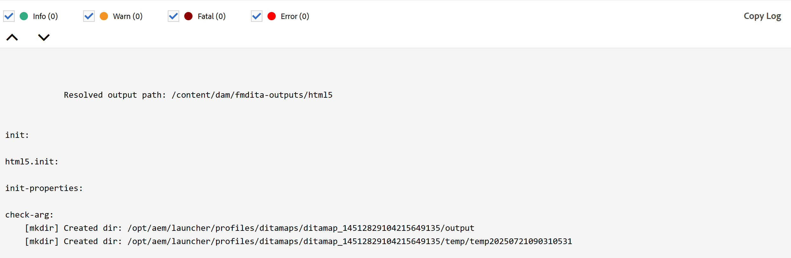

# Novità della versione 2025.08.0 (agosto 2025)

Questo articolo descrive le funzioni nuove e migliorate introdotte con la versione 2025.08.0 di Adobe Experience Manager Guides as a Cloud Service.

Per un elenco dei problemi risolti in questa versione, consulta [Problemi risolti nella versione 2025.08.0](fixed-issues-2025-08-0.md).

Scopri le [istruzioni di aggiornamento per la versione 2025.08.0](../release-info/upgrade-instructions-2025-08-0.md).

## Flusso di lavoro di revisione migliorato

Con questa versione, il flusso di lavoro di revisione è stato notevolmente migliorato per supportare in modo migliore la comunicazione diretta tra autori e revisori. Gli aggiornamenti principali includono:

- Flussi di lavoro di gestione delle attività con notifiche fruibili
- Possibilità di assegnare tag agli utenti per richiedere attenzione immediata
- Accesso semplificato ai dettagli del progetto e dell’attività dal pannello di revisione

Grazie a questi miglioramenti, gli utenti possono ora aspettarsi:

- Cicli di revisione efficienti e tempestivi
- Riduzione dello sforzo manuale durante gli scambi di feedback

Per ulteriori dettagli, visualizzare [Introduzione alla revisione](../user-guide/review.md)

## Azioni configurabili dell’Assistente AI nelle impostazioni dell’editor

L&#39;ultimo aggiornamento introduce una configurazione avanzata per **Creazione di azioni rapide** in AI Assistant, consentendo agli amministratori di personalizzare l&#39;ambiente di authoring in base a flussi di lavoro e preferenze specifici.

Dopo aver attivato l&#39;Assistente di **IA**, gli amministratori possono scegliere in modo selettivo le azioni rapide visibili nella scheda **Authoring**, semplificando le interazioni dell&#39;autore. Queste impostazioni di visibilità sono specifiche per ciascun profilo di cartella.

Ulteriori informazioni su [Assistente AI nelle impostazioni dell&#39;editor](../user-guide/web-editor-settings.md#general) in Experience Manager Guides.

{width="350" align="left"}

## Esperienza migliorata per la creazione e l&#39;utilizzo di file DITAVAL

Questo aggiornamento introduce diversi miglioramenti che semplificano la creazione, la gestione e l’applicazione dei file DITAVAL, consentendo un migliore controllo del contenuto condizionale e dello stile tra gli output.

Gli elementi di rilievo sono i seguenti:

- **Supporto migliorato dei contrassegni nell&#39;authoring dei file DITAVAL:** Experience Manager Guides offre nuove funzionalità per personalizzare la pubblicazione dei contenuti tramite il supporto migliorato dei contrassegni nei file DITAVAL. È ora possibile applicare i flag di inizio e fine a contenuto specifico, incluse le immagini, e arricchire le sezioni contrassegnate con opzioni di formattazione come grassetto, corsivo e altro ancora. Per gestire le sovrapposizioni di condizioni, è possibile configurare il **conflitto di stili**, che include l&#39;impostazione di un colore di sfondo e di testo predefinito, garantendo chiarezza e coerenza nell&#39;output. Questi flag sono completamente supportati nella generazione di PDF nativi e l&#39;output risultante riflette in modo accurato e completo tutti gli elementi di stile applicati.
Per ulteriori dettagli, visualizzare [Utilizzare l&#39;editor DITAVAL](../user-guide/ditaval-editor.md).

  {width="350" align="left"}

- **Supporto di più file DITAVAL per PDF nativo:** Per PDF nativo è ora possibile aggiungere più file DITAVAL, ciascuno visualizzato come voce con tag per facilitarne l&#39;identificazione e la rimozione, offrendo maggiore flessibilità e controllo sui contenuti condizionali negli output di PDF

  Inoltre, questo aggiornamento migliora la creazione dei predefiniti di output consentendo la modifica dei campi DITAVAL tra i formati, consentendo agli utenti di specificare manualmente i percorsi DITAVAL.

  Per ulteriori dettagli, visualizzare [Comprendere i predefiniti di output](../user-guide/generate-output-understand-presets.md) in Experience Manager Guides.

## È stato migliorato il filtro del registro di generazione dell’output

Questa versione apporta miglioramenti all’interfaccia utente e alla funzionalità di filtro dei registri di generazione dell’output. Ora puoi filtrare meglio i registri di generazione dell&#39;output per tutti e quattro i livelli distinti: **Info**, **Warn**, **Error** (inclusi errori ed eccezioni) e **Fatal**; con indicatori di colore migliorati e intuitivi che semplificano l&#39;analisi e migliorano la visibilità nel flusso del registro. Questo miglioramento consente di navigare nei registri in modo più efficiente e individuare con precisione i problemi critici.

Per ulteriori dettagli, visualizzare [Risoluzione dei problemi di base](../user-guide/generate-output-basic-troubleshooting.md).

{align="left"}

## I file temporanei per l’output pubblicato ora includono gli URL Author e Publish in un nuovo file di configurazione

I più recenti miglioramenti apportati alla pubblicazione di Experience Manager Guides ora aggiungono un nuovo file `system_config.xml` ai file temporanei generati durante la pubblicazione degli output HTML, PDF e JSON tramite DITA-OT, nonché dell&#39;output PDF nativo. Questo file viene incluso automaticamente nel processo di pubblicazione e accessibile tramite file temporanei quando si abilita l&#39;opzione **Mantieni file temporanei** per i predefiniti e si genera l&#39;output.

Il file `system_config.xml` contiene i dettagli dell&#39;istanza di AEM, inclusi l&#39;URL di authoring, l&#39;URL locale e l&#39;URL di pubblicazione, che forniscono un contesto più chiaro e migliorano la tracciabilità degli URL scaricati.

Per ulteriori dettagli, visualizzare [Comprendere i predefiniti di output](../user-guide/generate-output-understand-presets.md).

## Supporto della nuova variabile del percorso di output per la generazione dell&#39;output

Questo aggiornamento introduce la configurazione dinamica `output path` per i predefiniti di output come PDF nativo, PDF DITA-OT, JSON, HTML5 e Personalizzato. Anziché utilizzare un percorso fisso, gli utenti possono ora definire il percorso di output utilizzando la variabile `${base_output_path}` durante l&#39;installazione, offrendo maggiore flessibilità. Il percorso predefinito precedente `/content/dam/fmdita-outputs` non è più obbligatorio.

Tutti i percorsi di output associati ai predefiniti del profilo di cartella globale verranno migrati automaticamente per utilizzare la nuova variabile del percorso di output di base. Per i profili di cartelle personalizzati, tuttavia, la migrazione non è automatica; ti consigliamo di contattare il team Customer Success per assistenza.

Per ulteriori dettagli, visualizzare [Comprendere i predefiniti di output](../user-guide/generate-output-understand-presets.md).

## Miglioramenti dell’interfaccia utente nella barra degli strumenti dell’editor e nelle Preferenze utente

Con questa versione le impostazioni all&#39;interno delle **Preferenze utente** nella home page per le schede Generale e Aspetto sono state ristrutturate. È incluso rinominare l&#39;etichetta **Aprire le preferenze per le mappe** e spostare l&#39;opzione Spazi unificatori nella barra degli strumenti dell&#39;editor.

Inoltre, nella barra degli strumenti dell&#39;editor alcuni interruttori di accesso rapido per abilitare o disabilitare Revisioni, Tag e Spazi non interrotti sono ora raggruppati nell&#39;opzione **Mostra** nel menu a discesa per una migliore fruibilità.

Per ulteriori dettagli, visualizzare [Barra degli strumenti nell&#39;editor](../user-guide/web-editor-toolbar.md#menu-dropdown).

