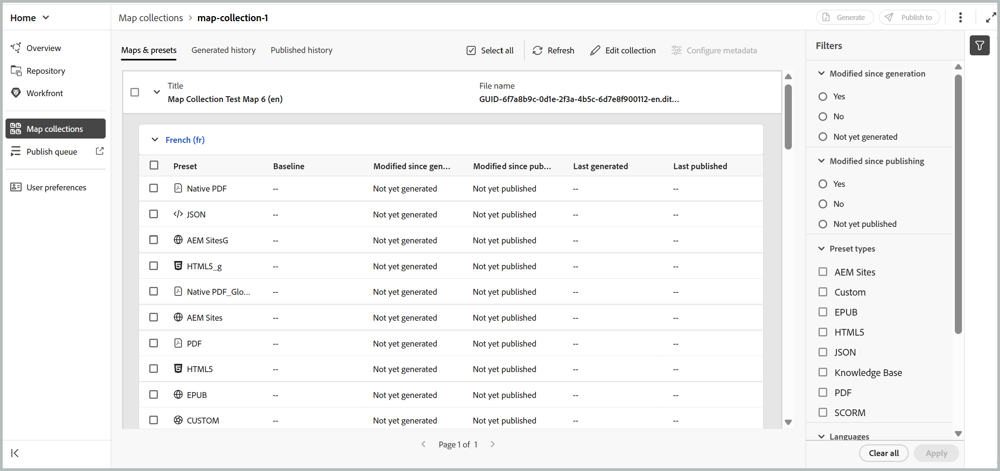
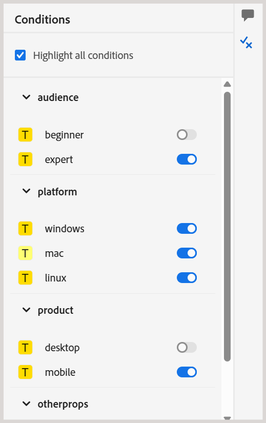

# Novità della versione 2026.08.0 (agosto 2026)

Questo articolo descrive le funzioni nuove e migliorate introdotte con la versione 2026.08.0 di Adobe Experience Manager Guides as a Cloud Service.

Per l&#39;elenco dei problemi risolti in questa versione, visualizzare [Problemi risolti nella versione 2026.08.0](fixed-issues-2026-08-0.md).

Scopri le [istruzioni di aggiornamento per la versione 2026.08.0](../release-info/upgrade-instructions-2026-08-0.md).

## Nuova raccolta di mappe per la gestione delle mappe e la pubblicazione degli output

La nuova raccolta mappe riunisce le attività di gestione della raccolta mappe e di generazione dell’output in un’unica interfaccia. Da un&#39;unica posizione è possibile gestire mappe e predefiniti, generare e pubblicare output, visualizzare la cronologia di generazione e pubblicazione e altro ancora. Riunendo le attività di pubblicazione correlate, è più semplice utilizzare le raccolte di mappe e tenere traccia delle attività di output su più mappe e sulle lingue associate. Questo aggiornamento affronta anche i problemi di prestazioni rilevati con raccolte di mappe di grandi dimensioni.

Per ulteriori dettagli, visualizzare [Utilizza nuova raccolta mappe per la generazione dell&#39;output](../user-guide/generate-output-use-new-map-collection-output-generation.md).

## Recupera il contenuto dagli archivi Git utilizzando il connettore Git

Experience Manager Guides ora introduce il connettore Git, che consente di importare contenuti dagli archivi Git in Experience Manager Guides. Dopo l’importazione dei contenuti, i team possono continuare a utilizzare Experience Manager Guides per i flussi di lavoro di authoring, revisione, traduzione e pubblicazione.

Per mantenere aggiornato il contenuto importato, il connettore Git supporta anche il recupero del contenuto dall’archivio di origine per l’inserimento di aggiornamenti. Include il rilevamento intelligente delle modifiche per identificare gli aggiornamenti del contenuto, mantiene i GUID degli argomenti e delle mappe durante le operazioni di importazione e recupero e fornisce funzionalità di risoluzione dei conflitti per aiutare a gestire le differenze tra il contenuto dell’archivio e il contenuto già disponibile in Experience Manager Guides. Per ulteriori dettagli, visualizza [Importa contenuto utilizzando il connettore Git](../user-guide/web-editor-git-connector.md).

## Experience Manager Guides aggiunge il supporto MCP per l’integrazione con l’Assistente AI

Experience Manager Guides ora supporta l’integrazione con MCP (Model Context Protocol), consentendo agli assistenti AI come Anthropic Claude di connettersi direttamente all’ambiente AEM Guides.

Tramite un singolo endpoint MCP, gli utenti autenticati possono gestire argomenti e mappe, creare ed esportare linee di base e generare rapporti utilizzando il linguaggio naturale, il tutto mentre operano con le autorizzazioni AEM esistenti. In questo modo si eliminano le attività ripetitive e laboriose di navigazione e si consente ai team di documentazione di lavorare in modo più efficiente tra le applicazioni di chat e gli strumenti per sviluppatori compatibili con MCP, come Cursore e Visual Studio Code. Per ulteriori dettagli, visualizzare [Utilizzo di Adobe Experience Manager Guides MCP Server](../install-conf-guide/conf-aem-guides-mcp.md).

## Miglioramenti della revisione

### Delegare un&#39;attività di revisione a un altro revisore

I revisori possono ora consigliare a un altro utente di partecipare a una revisione prima di tornare all&#39;autore, utilizzando la nuova opzione **Delega** disponibile per un&#39;attività di revisione. Questa funzione è utile quando parte del contenuto non rientra tra le competenze del revisore o quando è necessario un secondo parere prima di completare la revisione, senza dover indirizzare la richiesta tramite un amministratore di progetto.

Selezionando l’opzione Delega, il consiglio viene inviato all’autore, che decide se aggiungere o meno il revisore consigliato all’attività. Ulteriori informazioni su [Delegare un&#39;attività di revisione a un altro revisore](../user-guide/review-complete-review-tasks.md#delegate-a-review-task-to-another-reviewer).

{width="350"}

### La descrizione dell’attività è ora visibile nell’interfaccia utente di revisione

I revisori possono ora visualizzare la descrizione dell’attività direttamente all’interno dell’esperienza di revisione, anziché affidarsi solo all’e-mail di notifica. La descrizione immessa durante la creazione di un&#39;attività di revisione viene ora visualizzata nella finestra di dialogo Dettagli revisione, accessibile tramite l&#39;icona **Info** sia nell&#39;interfaccia utente di revisione che nell&#39;interfaccia dell&#39;editor.

Ciò consente ai revisori di accedere a istruzioni, ambito e aree di interesse durante l’intera revisione. Per ulteriori dettagli, visualizzare [Invia argomenti per la revisione](../user-guide/review-send-topics-for-review.md).

{width="350"}

### Identificazione dell&#39;utente nell&#39;elenco di assegnazione tag durante la revisione

Quando si assegnano tag agli utenti in commenti di revisione o risposte, il menu a discesa tag ora visualizza l’indirizzo e-mail di ciascun utente insieme al relativo ID utente. In questo modo è più facile identificare e selezionare il revisore corretto, soprattutto nelle organizzazioni di grandi dimensioni in cui i nomi visualizzati possono essere ambigui.

Se un indirizzo e-mail non è disponibile, viene visualizzato l’ID utente. Per ulteriori dettagli sull&#39;utilizzo dell&#39;interfaccia utente Revisione, visualizzare [Assegnare tag agli utenti delle attività in un commento](../user-guide/review-topics.md#tag-task-users-in-a-comment).

### Visualizza tutte le attività di revisione per un argomento

Gli autori possono ora visualizzare tutte le attività di revisione, aperte o chiuse, associate all’argomento attualmente aperto direttamente dal pannello Commenti. Un elenco a discesa elenca ogni attività di revisione di cui fa parte l&#39;argomento, insieme allo stato e al progetto di ogni attività, e consente di passare da un&#39;attività all&#39;altra per visualizzare i commenti senza uscire dall&#39;argomento o cambiare i progetti di revisione. Ulteriori informazioni su [Visualizza tutte le attività di revisione per un argomento](../user-guide/review-address-review-comments.md#view-all-review-tasks-for-a-topic).

{width="350"}

### Esperienza di revisione migliorata con condizioni DITAVAL

Quando un&#39;attività di revisione include uno o più file DITAVAL allegati, il pannello Condizioni presenta ora ciascuna condizione come un&#39;attivazione/disattivazione, preimpostata in modo da corrispondere ai file DITAVAL allegati, in modo che i revisori vedano il contenuto nel modo desiderato dall&#39;iniziatore della revisione. Se si disattiva un&#39;opzione, tale contenuto viene nascosto dalla revisione; se si attiva l&#39;opzione, il contenuto viene ripristinato.

Per ulteriori dettagli, visualizzare il [pannello Condizioni con condizioni basate su DITAVAL](../user-guide/review-topics.md#conditions-panel-with-ditaval-based-conditions).

{width="350"}

## Miglioramenti alla pubblicazione

### Utilizzare i predefiniti di output come modelli

Gli amministratori possono ora designare i predefiniti di output come modelli, applicando configurazioni standardizzate su tutte le mappe in un profilo di cartella con una singola azione tramite la console Mappa. Quando viene applicato un modello, il sistema visualizza il numero di mappe interessate, dando agli amministratori piena visibilità prima del rollout. Per mantenere la coerenza, i predefiniti modello possono essere modificati solo dagli amministratori e la generazione di output è disabilitata per i predefiniti modello (a meno che l’output non sia già stato generato prima di impostare i predefiniti come modello).

Per ulteriori dettagli, visualizzare [Configurare i predefiniti modello per la generazione di output](../install-conf-guide/template-presets-output-generation.md).

### Convalidare la qualità del contenuto con il controllo dello stato del contenuto

La verifica stato dei contenuti consente di convalidare la qualità dei contenuti nelle mappe DITA prima della pubblicazione. Gli amministratori possono creare predefiniti di verifica stato riutilizzabili combinando controlli per collegamenti interrotti, ID duplicati e convalida Schematron.

Gli autori possono eseguire una verifica dello stato su una mappa DITA o una baseline selezionata per generare un rapporto consolidato dei problemi per gli argomenti e le mappe associati. Per ulteriori dettagli, visualizzare [Esegui verifica stato su una mappa](../user-guide/map-editor-other-features.md#run-health-check-on-a-map).

## Miglioramenti alla traduzione

### Specifica un percorso cartella personalizzato per i progetti di traduzione

Quando si invia contenuto per la traduzione, è ora possibile selezionare la cartella in cui viene creato un nuovo progetto di traduzione, invece di tutti i progetti che per impostazione predefinita si trovano in un&#39;unica posizione in `/content/projects`. Questo consente di evitare una struttura di progetto incompleta e migliora le prestazioni di caricamento delle pagine con l’aumento del numero di progetti di traduzione.

Per ulteriori dettagli, visualizzare [Crea progetto di traduzione](../user-guide/translate-documents-web-editor.md#create-a-translation-project).

## Miglioramenti dei contenuti di apprendimento

In questa versione sono disponibili i seguenti miglioramenti per la funzione dei contenuti di formazione e apprendimento del prodotto:

- Nella configurazione dell&#39;output SCORM è ora disponibile una nuova scheda **Esperienza Allievo** che consente di configurare il modo in cui gli Allievi interagiscono con l&#39;output SCORM e navigano attraverso di esso. Le impostazioni sono organizzate in Generale, Navigazione e Quiz e consentono di controllare l’accessibilità dei contenuti, il flusso di navigazione e il comportamento dei quiz per un’esperienza di apprendimento personalizzata.

  In **Navigazione**, ora puoi controllare se il pulsante **Successivo** è abilitato o disabilitato in una pagina, consentendo agli Allievi di avanzare solo dopo che sono state soddisfatte determinate condizioni sulla pagina, ad esempio l&#39;apertura di tutti gli elementi interattivi, la visualizzazione di tutti i contenuti multimediali e altro ancora. Per ulteriori dettagli, visualizzare [Configurare il predefinito SCORM](../learning-content/config-scorm-preset.md).

  {width="650"}

- Ora puoi abilitare i download PDF per gli Allievi nell’output SCORM. Quando questa opzione è abilitata, all’output SCORM pubblicato viene aggiunta un’icona di download di PDF, che consente agli Allievi di scaricare una versione PDF del contenuto del corso a scopo di riferimento offline. Questo offre maggiore flessibilità nel modo in cui gli Allievi accedono al materiale del corso, offrendo agli autori un maggiore controllo sull’esperienza pubblicata. Per informazioni dettagliate sulla configurazione e prerequisiti, visualizzare [Consenti agli Allievi di scaricare il corso PDF](../learning-content/config-scorm-preset.md).

  {width="650"}

- Nell&#39;output pubblicato di un corso, gli Allievi possono ora utilizzare l&#39;opzione **Rivedi risposte** dopo aver completato un tentativo di quiz per rivedere le risposte inviate e vedere quali risposte erano corrette o errate. Ulteriori informazioni sulle [proprietà delle domande in un quiz](../learning-content/quiz-insert-questions.md#question-properties).

  {width="650"}

- In Domande di verifica della conoscenza all&#39;interno di un corso, il pulsante **Riprova** ora viene visualizzato quando un Allievo seleziona una risposta errata, consentendo loro di riprovare la domanda. Questo comportamento è coerente nei controlli delle conoscenze a selezione singola e multipla. Per ulteriori dettagli, visualizzare [Altre opzioni nel menu Inserisci](../learning-content/lc-other-insert-options.md).

- Quando un argomento di HTML viene aggiunto a una mappa del gruppo di apprendimento, l&#39;attributo `format="html"` viene ora aggiunto automaticamente al `topicref` corrispondente, garantendo la corretta elaborazione e pubblicazione in DITA-OT 4.x. Per ulteriori dettagli, visualizza [Aggiungi contenuto esistente nel tuo corso](../learning-content/manage-course.md#add-existing-content).

## Miglioramento API

Questa versione introduce nuove API Swagger per la gestione, la traduzione e la pubblicazione delle risorse, semplificando il collegamento di questi flussi di lavoro con gli strumenti e i sistemi esistenti. Per informazioni dettagliate, visualizzare [Aggiornamenti API nelle versioni di Experience Manager Guides](../api-reference/api-update-swagger.md).

